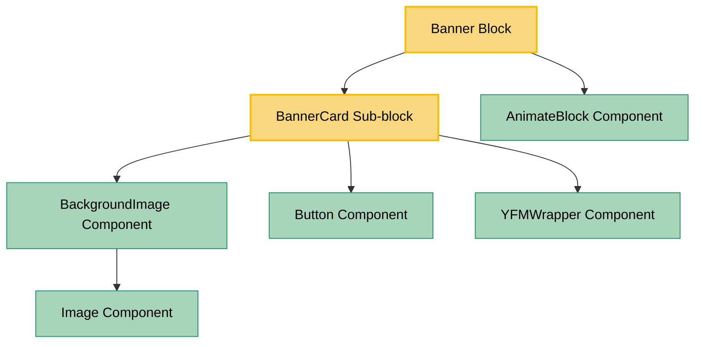

# Banner Block Dependencies

This document outlines the dependency graph for the Banner block, showing its relationships with other blocks, sub-blocks, components, and contexts.

## Dependency Graph

## Component Details

### Banner Block

- **File**: `src/blocks/Banner/Banner.tsx`
- **Description**: A block component that wraps the BannerCard sub-block with animation capabilities.
- **Props**: `BannerBlockProps` which extends `BannerCardProps` and adds `animated` property.

### BannerCard Sub-block

- **File**: `src/sub-blocks/BannerCard/BannerCard.tsx`
- **Description**: Renders a banner with title, subtitle, background image, and a call-to-action button.
- **Props**: `BannerCardProps` including title, subtitle, image, color, theme, button properties.

## Key Dependencies (Available in Storybook)

### Components

- **AnimateBlock**: Provides animation capabilities when elements enter the viewport.
- **BackgroundImage**: Renders background images with optional compression.
- **Button**: Renders styled buttons with various themes and sizes.
- **YFMWrapper**: Renders Yandex Flavored Markdown content.
- **Image**: Renders images with various options (used by BackgroundImage).
