# Hero Block Dependencies

This document outlines the dependency graph for the Hero block, showing its relationships with other blocks, sub-blocks, components, and contexts.

## Dependency Graph

```mermaid
graph TD
    %% Main Block
    Hero[Hero Block]

    %% Sub-blocks
    Content[Content Sub-block]

    %% Components (Only those available in Storybook)
    Media[Media Component]
    HeaderBreadcrumbs[HeaderBreadcrumbs Component]
    YFMWrapper[YFMWrapper Component]
    Buttons[Buttons Component]
    Links[Links Component]
    Title[Title Component]
    ContentList[ContentList Component]

    %% Hooks
    useContainerAspectRatio[useContainerAspectRatio Hook]

    %% Context
    ThemeContext[Theme Context]
    WindowWidthContext[WindowWidth Context]

    %% Grid
    Grid[Grid Component]

    %% Dependencies for Hero Block
    Hero --> Content
    Hero --> Media
    Hero --> HeaderBreadcrumbs
    Hero --> YFMWrapper
    Hero --> Grid
    Hero --> useContainerAspectRatio
    Hero --> ThemeContext
    Hero --> WindowWidthContext

    %% Content sub-block internal dependencies
    Content --> Title
    Content --> YFMWrapper
    Content --> Buttons
    Content --> Links
    Content --> ContentList

    %% Style classes
    style Hero fill:#f9d77e,stroke:#f9bc02,stroke-width:2px,color:#000
    style Content fill:#f9d77e,stroke:#f9bc02,stroke-width:2px,color:#000

    %% Component styles
    style Media fill:#a8d5ba,stroke:#1a936f,stroke-width:1px,color:#000
    style HeaderBreadcrumbs fill:#a8d5ba,stroke:#1a936f,stroke-width:1px,color:#000
    style YFMWrapper fill:#a8d5ba,stroke:#1a936f,stroke-width:1px,color:#000
    style Buttons fill:#a8d5ba,stroke:#1a936f,stroke-width:1px,color:#000
    style Links fill:#a8d5ba,stroke:#1a936f,stroke-width:1px,color:#000
    style Title fill:#a8d5ba,stroke:#1a936f,stroke-width:1px,color:#000
    style ContentList fill:#a8d5ba,stroke:#1a936f,stroke-width:1px,color:#000
    style Grid fill:#a8d5ba,stroke:#1a936f,stroke-width:1px,color:#000

    %% Hook/Context styles
    style useContainerAspectRatio fill:#c3aed6,stroke:#7b2d8e,stroke-width:1px,color:#000
    style ThemeContext fill:#c3aed6,stroke:#7b2d8e,stroke-width:1px,color:#000
    style WindowWidthContext fill:#c3aed6,stroke:#7b2d8e,stroke-width:1px,color:#000
```



## Component Details

### Hero Block

- **File**: `src/blocks/Hero/Hero.tsx`
- **Description**: A hero section block for page headers featuring a content area (title, text, buttons) alongside optional media and background. Supports theme-aware properties, responsive layout, and breadcrumb navigation.
- **Props**: `HeroBlockProps` — extends a `Pick` from `ContentBlockProps` and adds hero-specific fields.

### Content Sub-block

- **File**: `src/sub-blocks/Content/Content.tsx`
- **Description**: Renders structured content: title, text (YFM), list, additionalInfo, links, and buttons within a responsive column layout.
- **Props**: `ContentProps` extends `ContentBlockProps & ClassNameProps & QAProps`.

## Key Dependencies (Available in Storybook)

### Components

- **Media**: Renders images, videos, iframes, and other media types. Used for both the hero background and the right-side media area.
- **HeaderBreadcrumbs**: Renders a breadcrumb navigation trail with theme support.
- **YFMWrapper**: Renders Yandex Flavored Markdown content. Used for the `overtitle` string rendering.
- **Grid**: Responsive grid wrapper providing consistent page layout.
- **Title**: Renders block titles with various text sizes.
- **Buttons**: Renders a group of styled buttons.
- **Links**: Renders a group of styled links.
- **ContentList**: Renders a list of content items with icons.

### Hooks

- **useContainerAspectRatio** (`src/blocks/Hero/hooks.ts`): Tracks the aspect ratio of the media container via `ResizeObserver` to determine whether media should render vertically. Uses throttled resize updates (100ms).

### Contexts

- **useTheme()**: Provides the current global theme (light/dark).
- **useWindowWidth()**: Provides current window width for responsive behavior (`BREAKPOINTS.md` threshold).

### Utilities

- **getThemedValue()**: Resolves `ThemeSupporting<T>` values to the correct variant for the active theme.
- **block()**: BEM className generator.

## Props Schema

```ts
interface HeroBlockProps
  extends Pick<
    ContentBlockProps,
    'title' | 'text' | 'list' | 'additionalInfo' | 'links' | 'theme'
  > {
  breadcrumbs?: HeaderBreadCrumbsProps;
  overtitle?: string | JSX.Element;
  buttons?: ThemeSupporting<
    Pick<ButtonProps, 'url' | 'text' | 'theme' | 'primary' | 'extraProps'> | React.ReactNode
  >[];
  media?: ThemeSupporting<HeroBlockMedia>;
  fullWidth?: boolean;
  verticalOffset?: 's' | 'm' | 'l' | 'xl';
  background?: ThemeSupporting<HeroBlockBackground>;
}

interface HeroBlockBackground
  extends Partial<MediaComponentImageProps>,
    Partial<MediaComponentVideoProps> {
  color?: string;
}

interface HeroBlockMedia extends Partial<MediaProps> {
  roundCorners?: boolean;
}
```
