# AnimateBlock Component Usage

This document outlines how the AnimateBlock component is used across blocks, sub-blocks, and components in the page-constructor project.

## Overview

The AnimateBlock component is a utility component that enables animation effects when elements enter the viewport. It wraps child components and applies animation classes based on scroll position, creating a more dynamic and engaging user experience. The component uses the Waypoint library to detect when the element enters the viewport.

## Usage Graph

```mermaid
graph TD
    %% Main Component
    AnimateBlock[AnimateBlock Component]

    %% Context
    AnimateContext[AnimateContext]

    %% Base Components
    MediaBase[MediaBase Component]
    BackgroundMedia[BackgroundMedia Component]

    %% Blocks
    Banner[Banner Block]
    CardLayout[CardLayout Block]
    Companies[Companies Block]
    ExtendedFeatures[ExtendedFeatures Block]
    FilterBlock[FilterBlock Block]
    PromoFeaturesBlock[PromoFeaturesBlock Block]
    Slider[Slider Block]
    SliderNew[SliderNew Block]
    Tabs[Tabs Block]

    %% Usage relationships
    AnimateContext --> AnimateBlock

    %% Component usage
    MediaBase --> AnimateBlock
    BackgroundMedia --> AnimateBlock

    %% Block usage
    Banner --> AnimateBlock
    CardLayout --> AnimateBlock
    Companies --> AnimateBlock
    ExtendedFeatures --> AnimateBlock
    FilterBlock --> AnimateBlock
    PromoFeaturesBlock --> AnimateBlock
    Slider --> AnimateBlock
    SliderNew --> AnimateBlock
    Tabs --> AnimateBlock

    %% Style classes
    style AnimateBlock fill:#f9d77e,stroke:#f9bc02,stroke-width:2px,color:#000
    style AnimateContext fill:#f9a7a1,stroke:#d64541,stroke-width:1px,color:#000

    %% Component styles
    style MediaBase fill:#a8d5ba,stroke:#1a936f,stroke-width:1px,color:#000
    style BackgroundMedia fill:#a8d5ba,stroke:#1a936f,stroke-width:1px,color:#000

    %% Block styles
    style Banner fill:#c6def1,stroke:#2274a5,stroke-width:1px,color:#000
    style CardLayout fill:#c6def1,stroke:#2274a5,stroke-width:1px,color:#000
    style Companies fill:#c6def1,stroke:#2274a5,stroke-width:1px,color:#000
    style ExtendedFeatures fill:#c6def1,stroke:#2274a5,stroke-width:1px,color:#000
    style FilterBlock fill:#c6def1,stroke:#2274a5,stroke-width:1px,color:#000
    style PromoFeaturesBlock fill:#c6def1,stroke:#2274a5,stroke-width:1px,color:#000
    style Slider fill:#c6def1,stroke:#2274a5,stroke-width:1px,color:#000
    style SliderNew fill:#c6def1,stroke:#2274a5,stroke-width:1px,color:#000
    style Tabs fill:#c6def1,stroke:#2274a5,stroke-width:1px,color:#000
```



## Component Details

### AnimateBlock Component

- **File**: `src/components/AnimateBlock/AnimateBlock.tsx`
- **Description**: Wraps child components and applies animation classes when the element enters the viewport.
- **Props**:
  - `animate`: Boolean to enable/disable animations (defaults to value from AnimateContext)
  - `offset`: Number of pixels before the element enters the viewport to trigger the animation (defaults to 100)
  - `className`: Optional CSS class name
  - `style`: Optional inline styles
  - `onScroll`: Optional callback function triggered when the element enters the viewport
  - `qa`: Optional QA attribute for testing

### AnimateContext

- **File**: `src/context/animateContext/AnimateContext.tsx`
- **Description**: React context that provides global animation settings.
- **Props**:
  - `animated`: Boolean to globally enable/disable animations (defaults to true)

## Usage Patterns

> **Note**: In the code examples below, `b()` is a utility function used throughout the page-constructor project for BEM (Block Element Modifier) class naming. It generates CSS class names following the BEM methodology, making the code more maintainable and consistent.

### In Base Components

#### MediaBase Component

- **File**: `src/components/MediaBase/MediaBase.tsx`
- **Usage**: Wraps media content with animation effects.
- **Implementation**:
  ```tsx
  <AnimateBlock className={b()} onScroll={onScroll} animate={animated}>
      {mediaOnly && (
          // Media content
      )}
  </AnimateBlock>
  ```

#### BackgroundMedia Component

- **File**: `src/components/BackgroundMedia/BackgroundMedia.tsx`
- **Usage**: Applies animation effects to background media elements.
- **Implementation**:
  ```tsx
  <AnimateBlock
    className={b(null, className)}
    // Other props
  >
    // Background media content
  </AnimateBlock>
  ```

### In Blocks

#### Banner Block

- **File**: `src/blocks/Banner/Banner.tsx`
- **Usage**: Animates the entire banner when it enters the viewport.
- **Implementation**:
  ```tsx
  <AnimateBlock className={b(null, className)} animate={animated}>
    <BannerCard {...bannerProps} />
  </AnimateBlock>
  ```

#### CardLayout Block

- **File**: `src/blocks/CardLayout/CardLayout.tsx`
- **Usage**: Applies animation to the card layout container.
- **Implementation**:
  ```tsx
  <AnimateBlock className={b(null, className)} animate={animated}>
      {(title || description) && (
          // Title and description content
      )}
  </AnimateBlock>
  ```

#### Companies Block

- **File**: `src/blocks/Companies/Companies.tsx`
- **Usage**: Animates the companies list with a larger offset for earlier animation triggering.
- **Implementation**:
  ```tsx
  <AnimateBlock className={b()} offset={150} animate={animated}>
    <div className={b('content')}>// Companies content</div>
  </AnimateBlock>
  ```

#### ExtendedFeatures Block

- **File**: `src/blocks/ExtendedFeatures/ExtendedFeatures.tsx`
- **Usage**: Applies animation to the features block.
- **Implementation**:
  ```tsx
  <AnimateBlock className={b()} animate={animated}>
    <Title title={title} subtitle={description} className={b('header')} />
    // Other content
  </AnimateBlock>
  ```

#### FilterBlock Block

- **File**: `src/blocks/FilterBlock/FilterBlock.tsx`
- **Usage**: Animates the filter block container.
- **Implementation**:
  ```tsx
  <AnimateBlock className={b()} animate={animated}>
      {title && (
          // Title content
      )}
      // Filter content
  </AnimateBlock>
  ```

#### PromoFeaturesBlock Block

- **File**: `src/blocks/PromoFeaturesBlock/PromoFeaturesBlock.tsx`
- **Usage**: Applies animation to the promo features block with background theme support.
- **Implementation**:
  ```tsx
  <AnimateBlock className={b({[backgroundTheme]: true})} animate={animated}>
    <FullWidthBackground className={b('background', {[backgroundTheme]: true})} />
    // Other content
  </AnimateBlock>
  ```

#### Slider and SliderNew Blocks

- **Files**:
  - `src/blocks/Slider/Slider.tsx`
  - `src/blocks/SliderNew/Slider.tsx`
- **Usage**: Animates the slides container.
- **Implementation**:
  ```tsx
  <AnimateBlock className={b('animate-slides')} animate={animated}>
    {renderSlider()} // or <Swiper /> in SliderNew
  </AnimateBlock>
  ```

#### Tabs Block

- **File**: `src/blocks/Tabs/Tabs.tsx`
- **Usage**: Animates the tabs container and triggers a state update when scrolled into view.
- **Implementation**:
  ```tsx
  <AnimateBlock className={b()} onScroll={() => setPlay(true)} animate={animated}>
    <Title
    // Title props
    />
    // Tabs content
  </AnimateBlock>
  ```

## Integration with Animation System

The AnimateBlock component is a key part of the page-constructor animation system:

1. **Global Animation Control**: The component integrates with the AnimateContext to allow global enabling/disabling of animations.

2. **Scroll-Based Triggering**: Uses the Waypoint library to detect when elements enter the viewport, triggering animations at the appropriate time.

3. **CSS Animation Classes**: Adds the 'animate' class to elements when they should animate, which can be targeted with CSS transitions or animations.

4. **Callback Support**: Provides an onScroll callback that can be used to trigger additional actions when an element enters the viewport.

## Best Practices

1. **Performance Considerations**: Use AnimateBlock judiciously, as having too many animated elements can impact performance.

2. **Appropriate Offsets**: Adjust the `offset` prop based on the element's position and desired animation timing. Larger offsets trigger animations earlier.

3. **Animation Disabling**: Always respect the `animated` context value to ensure animations can be globally disabled if needed.

4. **CSS Implementation**: Pair AnimateBlock with appropriate CSS transitions or animations that target the `.animate` class.

5. **Accessibility**: Ensure animations don't interfere with accessibility by keeping them subtle and considering users who prefer reduced motion.

## Example CSS Implementation

To work with AnimateBlock, CSS should be structured to define both the initial state and the animated state:

```scss
.MyComponent {
  opacity: 0;
  transform: translateY(20px);
  transition:
    opacity 0.5s ease,
    transform 0.5s ease;

  &.animate {
    opacity: 1;
    transform: translateY(0);
  }
}
```

This pattern allows elements to smoothly transition from their initial hidden or offset state to their final visible state when the 'animate' class is applied.
