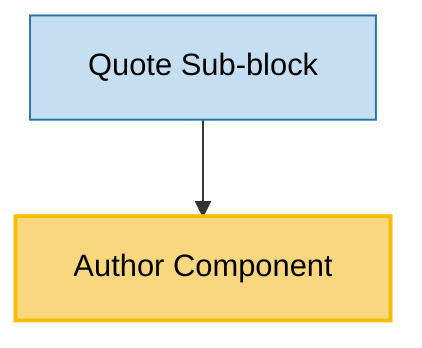

# Author Component Usage

This document outlines how the Author component is used across blocks, sub-blocks, and components in the page-constructor project.

## Overview

The Author component is a utility component that displays author information including name, description, and avatar. It supports two layout types (column and line) and theming options. The component is designed to show author attribution in various contexts throughout the page constructor system.

## Usage Graph



## Component Details

### Author Component

- **File**: `src/components/Author/Author.tsx`
- **Description**: Displays author information with configurable layout and theming.
- **Props**:
  - `author`: AuthorItem object containing author details (required)
  - `className`: Optional CSS class name for the container
  - `authorContainerClassName`: Optional CSS class name for the avatar container
  - `type`: Layout type - `AuthorType.Column` (default) or `AuthorType.Line`
  - `theme`: Content theme - `'default'`, `'dark'`, or `'light'`
  - `qa`: Optional QA attribute for testing

### AuthorItem Interface

- **Description**: Defines the structure of author data.
- **Properties**:
  - `firstName`: Author's first name (required)
  - `secondName`: Author's second name (required)
  - `description`: Optional description or title
  - `avatar`: Optional avatar image (can be ImageProps or JSX.Element with theme support)

### AuthorType Enum

- **Description**: Defines available layout types for the Author component.
- **Values**:
  - `Column`: Vertical layout with avatar above name and description
  - `Line`: Horizontal layout with avatar beside name and description

## Usage Patterns

> **Note**: In the code examples below, `b()` is a utility function used throughout the page-constructor project for BEM (Block Element Modifier) class naming. It generates CSS class names following the BEM methodology, making the code more maintainable and consistent.

### In Sub-blocks

#### Quote Sub-block

- **File**: `src/sub-blocks/Quote/Quote.tsx`
- **Usage**: Displays author attribution in quote blocks with line layout and theme support.
- **Implementation**:

  ```tsx
  const themedAuthor = author
    ? ({
        ...author,
        avatar: getThemedValue(author.avatar, theme),
      } as AuthorItem)
    : author;

  const renderFooter = Boolean(author || url) && (
    <div className={b('author-wrapper')}>
      {themedAuthor && (
        <Author
          className={b('author', {theme: textTheme})}
          author={themedAuthor}
          type={AuthorType.Line}
          theme={textTheme}
        />
      )}
      {/* Other footer content like buttons */}
    </div>
  );
  ```

## Layout Types

### Column Layout (Default)

The column layout displays the author information vertically:

- Avatar at the top
- Name below the avatar
- Description below the name

**CSS Classes Applied**:

- `.author_type_column`
- Vertical flex direction
- Avatar has margin bottom

### Line Layout

The line layout displays the author information horizontally:

- Avatar on the left
- Name and description on the right
- Compact horizontal arrangement

**CSS Classes Applied**:

- `.author_type_line`
- Horizontal flex direction
- Avatar has margin right
- Aligned to center

## Theming Support

The Author component supports theming through the `theme` prop:

### Default Theme

- Uses standard text colors
- Description uses secondary color (`$secondary`)

### Dark Theme

- Description uses light secondary color (`$lightSecondary`)
- Applied via `.author_theme_dark` class

## Avatar Handling

The component supports flexible avatar input:

### Image Props

```tsx
// String URL
avatar: "/path/to/image.jpg"

// Image object with properties
avatar: {
    src: "/path/to/image.jpg",
    alt: "Author avatar"
}

// Device-specific images
avatar: {
    desktop: "/path/to/desktop-image.jpg",
    mobile: "/path/to/mobile-image.jpg"
}
```

### JSX Element

```tsx
// Custom JSX element
avatar: <CustomAvatarComponent />;
```

### Themed Avatar

```tsx
// Theme-supporting avatar
avatar: {
    light: "/path/to/light-avatar.jpg",
    dark: "/path/to/dark-avatar.jpg"
}
```

## Integration with Theme System

The Author component integrates with the page-constructor theme system:

1. **Theme Processing**: Uses `getThemedValue()` utility to resolve themed avatars
2. **Image Processing**: Uses `getMediaImage()` utility to process avatar image props
3. **Image Component**: Renders avatars using the standard Image component
4. **Theme Context**: Respects the global theme context for consistent styling

## Best Practices

1. **Name Handling**: The component automatically combines `firstName` and `secondName`, or uses only `firstName` if `secondName` is empty.

2. **Avatar Sizing**: Avatar images are automatically sized to 80x80 pixels with object-fit cover for consistent appearance.

3. **Theme Consistency**: Always pass the appropriate theme prop to ensure consistent styling with the parent component.

4. **Layout Selection**:

   - Use `Column` layout for standalone author displays
   - Use `Line` layout for compact author attribution (e.g., in quotes, cards)

5. **Accessibility**: The component automatically handles alt text for avatar images and provides semantic structure.

## Example Usage

### Basic Author Display

```tsx
<Author
  author={{
    firstName: 'John',
    secondName: 'Doe',
    description: 'Software Engineer',
    avatar: '/path/to/avatar.jpg',
  }}
/>
```

### Line Layout with Theme (Quote Attribution)

```tsx
<Author
  author={themedAuthor}
  type={AuthorType.Line}
  theme={textTheme}
  className={b('author', {theme: textTheme})}
/>
```

### With Themed Avatar

```tsx
const themedAuthor = {
  firstName: 'Jane',
  secondName: 'Smith',
  description: 'Product Designer',
  avatar: getThemedValue(author.avatar, theme),
};

<Author author={themedAuthor} type={AuthorType.Column} theme="dark" />;
```

## Storybook Documentation

The Author component includes Storybook stories demonstrating:

- Default column layout
- Line layout variation
- Different author data configurations
- Theme variations

Stories are located in `src/components/Author/__stories__/Author.stories.tsx` with example data in `data.json`.

## Testing

The Author component includes comprehensive tests covering:

- Default rendering with full author data
- Name display with and without second name
- Avatar rendering
- Description display
- Layout type variations
- Theme application

Test files are located in `src/components/Author/__tests__/Author.test.tsx`.
