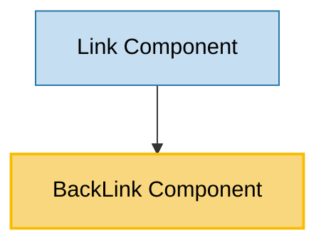

# BackLink Component Usage

This document outlines how the BackLink component is used across blocks, sub-blocks, and components in the page-constructor project.

## Overview

The BackLink component is a navigation utility component that provides a styled back button with an arrow icon. It supports both programmatic navigation (using browser history) and direct URL navigation. The component integrates with the page constructor's analytics system and theming framework.

## Usage Graph



## Component Details

### BackLink Component

- **File**: `src/components/BackLink/BackLink.tsx`
- **Description**: A navigation button that provides back functionality with customizable appearance and behavior.
- **Props**:
  - `url`: Target URL for navigation (required)
  - `title`: Button text content, can be ReactNode (required)
  - `theme`: Visual theme - `'default'` or `'special'` (default: `'default'`)
  - `size`: Button size - `'s'`, `'m'`, `'l'`, or `'xl'` (default: `'l'`)
  - `className`: Optional CSS class name for styling
  - `shouldHandleBackAction`: Whether to use programmatic navigation instead of direct URL (default: `false`)
  - `onClick`: Optional click handler function
  - `tabIndex`: Tab index for accessibility
  - `extraProps`: Additional HTML props to pass to the underlying element

### Theme Types

- **Description**: Defines available visual themes for the BackLink component.
- **Values**:
  - `default`: Standard flat-secondary button appearance
  - `special`: Flat-contrast button appearance for special contexts

## Usage Patterns

> **Note**: In the code examples below, `b()` is a utility function used throughout the page-constructor project for BEM (Block Element Modifier) class naming. It generates CSS class names following the BEM methodology, making the code more maintainable and consistent.

### In Components

#### Link Component

- **File**: `src/components/Link/Link.tsx`
- **Usage**: Used when the Link component has `theme="back"` to render a back navigation button.
- **Implementation**:
  ```tsx
  case 'back':
      return (
          <BackLink
              title={children || text}
              url={href}
              onClick={onClick}
              tabIndex={tabIndex}
              extraProps={extraProps}
          />
      );
  ```

## Navigation Behavior

The BackLink component supports two navigation modes:

### Direct URL Navigation (Default)

When `shouldHandleBackAction` is `false` (default):

- Renders as a standard link (`<a>` tag) with `href` attribute
- Browser handles navigation directly
- Suitable for simple back links

### Programmatic Navigation

When `shouldHandleBackAction` is `true`:

- Renders as a button that handles click events
- Uses browser history API for navigation
- Checks history length to determine behavior:
  - If history has previous entries: calls `history.goBack()`
  - If no history: navigates to the specified URL using `history.push()`
- Suitable for single-page applications with complex routing

## Theme Integration

The BackLink component integrates with Gravity UI's button system:

### Default Theme

- Uses `view="flat-secondary"` button style
- Standard appearance for most contexts

### Special Theme

- Uses `view="flat-contrast"` button style
- Higher contrast appearance for special contexts
- Typically used on colored backgrounds

## Analytics Integration

The component automatically tracks user interactions:

1. **Event Tracking**: Uses `useAnalytics` hook with `DefaultEventNames.ShareButton`
2. **URL Tracking**: Passes the target URL to analytics
3. **Automatic Firing**: Analytics event fires on button click

## Icon and Layout

The BackLink component features a consistent layout:

1. **Arrow Icon**: Uses `ArrowLeft` icon from Gravity UI icons
2. **Icon Size**: Fixed at 20px for all button sizes
3. **Layout**: Icon positioned before the text content
4. **Spacing**: Automatic spacing between icon and text

## Size Variations

The component supports four size options:

### Size 's' (Small)

- Compact button for tight spaces
- Maintains 20px icon size

### Size 'm' (Medium)

- Standard medium button
- Good for most interface contexts

### Size 'l' (Large) - Default

- Default size for most use cases
- Provides good click target size

### Size 'xl' (Extra Large)

- Largest button size
- Suitable for prominent back actions

## Context Dependencies

The BackLink component depends on several contexts:

### LocationContext

- **Purpose**: Provides browser history object for programmatic navigation
- **Usage**: Required when `shouldHandleBackAction` is `true`
- **Fallback**: Component gracefully handles missing history

## Accessibility Features

The component includes several accessibility considerations:

1. **Tab Navigation**: Supports `tabIndex` prop for keyboard navigation
2. **Semantic HTML**: Uses appropriate button or link elements
3. **Screen Readers**: Icon and text provide clear navigation context
4. **Focus Management**: Inherits focus styles from Gravity UI button system

## Best Practices

1. **Navigation Mode Selection**:

   - Use default mode (`shouldHandleBackAction={false}`) for simple back links
   - Use programmatic mode (`shouldHandleBackAction={true}`) in SPAs with complex routing

2. **Theme Selection**:

   - Use `default` theme for standard contexts
   - Use `special` theme on colored backgrounds or for emphasis

3. **Size Selection**:

   - Use `l` (default) for most contexts
   - Use `s` or `m` in compact interfaces
   - Use `xl` for prominent back actions

4. **URL Handling**:

   - Always provide a meaningful fallback URL
   - Consider user experience when history is empty

5. **Analytics**:
   - The component automatically handles analytics
   - No additional tracking setup required

## Example Usage

### Basic Back Link

```tsx
<BackLink url="/previous-page" title="Back to Previous Page" />
```

### Programmatic Navigation with Custom Handler

```tsx
<BackLink
  url="/fallback-url"
  title="Go Back"
  shouldHandleBackAction={true}
  onClick={() => console.log('Back button clicked')}
/>
```

### Special Theme with Custom Size

```tsx
<BackLink url="/home" title="Back to Home" theme="special" size="xl" className="custom-back-link" />
```

### In Link Component Context

```tsx
// Used automatically when Link has theme="back"
<Link theme="back" url="/previous-page" text="Back" />
```

## Integration with Link Component

The BackLink component is primarily used through the Link component:

1. **Automatic Usage**: When Link component receives `theme="back"`
2. **Props Forwarding**: Link forwards relevant props to BackLink
3. **Consistent API**: Maintains consistent interface across link types

## Storybook Documentation

The BackLink component includes Storybook stories demonstrating:

- Default appearance and behavior
- All size variations (`s`, `m`, `l`, `xl`)
- Both theme options (`default`, `special`)
- Interactive examples with different configurations

Stories are located in `src/components/BackLink/__stories__/BackLink.stories.tsx` with example data in `data.json`.

## Testing

The BackLink component includes comprehensive tests covering:

- Default rendering with required props
- Custom class name application
- Link vs button rendering based on `shouldHandleBackAction`
- Title text display
- Click handler execution
- Size variations
- Theme variations
- Navigation behavior with and without history

Test files are located in `src/components/BackLink/__tests__/BackLink.test.tsx`.

## Technical Implementation Details

### Button Props Handling

```tsx
const buttonProps = {
  href: shouldHandleBackAction ? undefined : url,
  extraProps,
} as UIKitButtonProps;
```

### Navigation Logic

```tsx
const backActionHandler = React.useCallback(async () => {
  handleAnalytics();

  if (!history) {
    return;
  }

  if (onClick) {
    onClick();
  }

  if (history.length > 1) {
    history.goBack();
  } else {
    history.push({pathname: url});
  }
}, [handleAnalytics, history, onClick, url]);
```

### Theme to View Mapping

```tsx
view={theme === 'special' ? 'flat-contrast' : 'flat-secondary'}
```

This implementation ensures consistent behavior across different usage contexts while maintaining flexibility for various navigation patterns.
