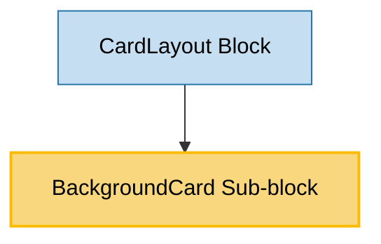

# BackgroundCard Sub-block Usage

This document outlines how the BackgroundCard sub-block is used across blocks, sub-blocks, and components in the page-constructor project.

## Overview

The BackgroundCard sub-block is a versatile component that displays content with a background image or color. It provides a visually appealing way to present information with title, text, additional information, links, buttons, and content lists. The component supports theming options, border styles, and various padding configurations, making it adaptable for different design requirements.

## Usage Graph



## Component Details

### BackgroundCard Sub-block

- **File**: `src/sub-blocks/BackgroundCard/BackgroundCard.tsx`
- **Description**: Displays content with a background image or color, supporting various content elements and theming options.
- **Props**:
  - `title`: Card title (required)
  - `text`: Card description with YFM support (required)
  - `url`: URL that opens when clicking the card
  - `urlTitle`: Accessible title for the URL
  - `border`: Border style - 'line', 'shadow', or 'none'
  - `background`: Background image with theme support
  - `backgroundColor`: Background color
  - `paddingBottom`: Space between the text and the bottom of the card - 's', 'm', 'l', or 'xl'
  - `additionalInfo`: Additional information text with YFM support
  - `theme`: Content theme - 'default', 'dark', or 'light'
  - `links`: Array of link objects
  - `buttons`: Array of button objects
  - `analyticsEvents`: Analytics events to track
  - `controlPosition`: Position of controls (links and buttons) - 'content' or 'footer'
  - `list`: Array of content list items
  - `colSizes`: Grid column sizes configuration (default: `{all: 12, sm: 12}`)

## Usage Patterns

> **Note**: In the code examples below, `b()` is a utility function used throughout the page-constructor project for BEM (Block Element Modifier) class naming. It generates CSS class names following the BEM methodology, making the code more maintainable and consistent.

### In Blocks

#### CardLayout Block

- **File**: `src/blocks/CardLayout/CardLayout.tsx`
- **Usage**: Used as a child component within the CardLayout block to display cards with background images or colors.
- **Implementation**:
  ```tsx
  <CardLayout title={title} description={description} colSizes={colSizes}>
    <BackgroundCard
      title="Tell a story and build a narrative"
      text="We are all storytellers. Stories are a powerful way to communicate ideas and share information."
      background={{
        light: {
          src: '/path/to/light-image.png',
          alt: 'Background image',
          disableCompress: true,
        },
        dark: {
          src: '/path/to/dark-image.png',
          alt: 'Background image',
        },
      }}
    />
    {/* Other cards */}
  </CardLayout>
  ```

## Component Structure

The BackgroundCard component is composed of several key parts:

1. **CardBase**: Provides the base card functionality including border styles and URL handling
2. **BackgroundImage**: Renders the background image with theme support
3. **Content**: Displays the card content including title, text, additional info, links, buttons, and content list

### Internal Structure

```tsx
<CardBase
  className={b({padding: paddingBottom, theme: cardTheme})}
  contentClassName={b('content')}
  url={url}
  border={borderType}
  analyticsEvents={analyticsEvents}
  urlTitle={urlTitle}
>
  <CardBase.Content>
    <BackgroundImage
      className={b('image')}
      {...getThemedValue(background, theme)}
      style={{backgroundColor}}
    />
    <Content
      titleId={titleId}
      title={title}
      text={text}
      additionalInfo={additionalInfo}
      size="s"
      theme={cardTheme}
      links={links}
      buttons={buttons}
      list={list}
      colSizes={colSizes}
      controlPosition={areControlsInFooter ? 'bottom' : 'default'}
    />
  </CardBase.Content>
</CardBase>
```

## Theming Support

The BackgroundCard component supports theming through the `theme` prop:

### Default Theme

- Uses standard text colors
- Default background and border styles

### Dark Theme

- Uses light text colors on dark backgrounds
- Suitable for dark backgrounds or images
- Applied via `.background-card_theme_dark` class

### Light Theme

- Uses dark text colors on light backgrounds
- Suitable for light backgrounds or images
- Applied via `.background-card_theme_light` class

## Background Handling

The component supports flexible background input:

### Background Image

```tsx
// Themed background image
background: {
  light: {
    src: "/path/to/light-image.png",
    alt: "Background image",
    disableCompress: true
  },
  dark: {
    src: "/path/to/dark-image.png",
    alt: "Background image"
  }
}
```

### Background Color

```tsx
// Background color
backgroundColor: '#7ccea0';
```

## Padding Options

The component supports different padding bottom values:

- `s`: Small padding
- `m`: Medium padding
- `l`: Large padding
- `xl`: Extra large padding

## Control Position

The component supports two positions for controls (links and buttons):

- `content`: Controls are placed within the content area
- `footer`: Controls are placed at the bottom of the card (only works when paddingBottom is not set)

## Integration with Theme System

The BackgroundCard component integrates with the page-constructor theme system:

1. **Theme Processing**: Uses `getThemedValue()` utility to resolve themed backgrounds
2. **Image Processing**: Uses `BackgroundImage` component to handle background images
3. **Content Theming**: Passes theme to the Content component for consistent styling
4. **Theme Context**: Respects the global theme context for consistent styling

## Best Practices

1. **Background Selection**: Choose appropriate background images or colors that provide good contrast with the text.

2. **Content Structure**: Provide meaningful titles and descriptions for accessibility.

3. **Theme Selection**:

   - Use `default` theme for standard cards
   - Use `dark` theme for cards with dark backgrounds
   - Use `light` theme for cards with light backgrounds

4. **Border Usage**:

   - Use `line` border for subtle separation
   - Use `shadow` border for elevated appearance
   - Use `none` border for seamless integration

5. **Padding Selection**:

   - Use appropriate padding based on content length and design requirements
   - Consider using larger padding for cards with more content

6. **Control Position**:
   - Use `content` position for standard layout
   - Use `footer` position for cards where controls should be aligned at the bottom

## Column Sizing

The BackgroundCard component supports responsive column sizing through the `colSizes` prop:

```tsx
// Default column sizing
colSizes = {all: 12, md: 12};
```

This prop allows you to control how much of the available grid space the card's content should occupy at different breakpoints:

- `all`: Base size for all viewport widths
- `sm`: Size for small viewports
- `md`: Size for medium viewports
- `lg`: Size for large viewports
- `xl`: Size for extra large viewports

Each value is a number between 1-12, representing the number of columns in a 12-column grid system.

## Example Usage

### Basic BackgroundCard

```tsx
<BackgroundCard
  title="Lorem ipsum"
  text="**Ut enim ad minim veniam** [quis nostrud](https://example.com) exercitation ullamco laboris nisi ut aliquip ex ea commodo consequat."
  additionalInfo="Duis aute irure dolor in reprehenderit in voluptate velit esse cillum dolore eu fugiat nulla pariatur."
/>
```

### With Background Image

```tsx
<BackgroundCard
  title="Lorem ipsum"
  text="**Ut enim ad minim veniam** [quis nostrud](https://example.com) exercitation ullamco laboris nisi ut aliquip ex ea commodo consequat."
  background={{
    light: {
      src: '/path/to/light-image.png',
      alt: 'Background image',
      disableCompress: true,
    },
    dark: {
      src: '/path/to/dark-image.png',
      alt: 'Background image',
    },
  }}
/>
```

### With Links and Buttons

```tsx
<BackgroundCard
  title="Lorem ipsum"
  text="**Ut enim ad minim veniam** [quis nostrud](https://example.com) exercitation ullamco laboris nisi ut aliquip ex ea commodo consequat."
  links={[
    {
      url: 'https://example.com',
      text: 'Link',
      theme: 'normal',
      arrow: true,
    },
  ]}
  buttons={[
    {
      text: 'Button',
      theme: 'action',
      url: 'https://example.com',
    },
    {
      text: 'Button',
      theme: 'outlined',
      url: 'https://example.com',
    },
  ]}
/>
```

### With Content List

```tsx
<BackgroundCard
  title="Lorem ipsum"
  text="**Ut enim ad minim veniam** [quis nostrud](https://example.com) exercitation ullamco laboris nisi ut aliquip ex ea commodo consequat."
  list={[
    {
      icon: {
        light: '/path/to/icon-light.svg',
        dark: '/path/to/icon-dark.svg',
      },
      title: 'Lorem ipsum',
      text: '**Ut enim ad minim veniam** [quis nostrud](https://example.com) exercitation.',
    },
    {
      icon: {
        light: '/path/to/icon-light.svg',
        dark: '/path/to/icon-dark.svg',
      },
      text: '**Ut enim ad minim veniam** [quis nostrud](https://example.com) exercitation.',
    },
  ]}
/>
```

### With Dark Theme and Background Color

```tsx
<BackgroundCard
  title="Lorem ipsum"
  text="**Ut enim ad minim veniam** [quis nostrud](https://example.com) exercitation ullamco laboris nisi ut aliquip ex ea commodo consequat."
  backgroundColor="#7ccea0"
  theme="dark"
  buttons={[
    {
      text: 'Button',
      theme: 'normal-contrast',
      url: 'https://example.com',
    },
    {
      text: 'Button',
      theme: 'outlined-contrast',
      url: 'https://example.com',
    },
  ]}
/>
```

## Storybook Documentation

The BackgroundCard component includes Storybook stories demonstrating:

- Default card display
- Various content configurations (with/without links, buttons, content list)
- Different background options (image, color)
- Padding variations
- Theme variations
- Border styles
- URL handling
- Control positioning

Stories are located in `src/sub-blocks/BackgroundCard/__stories__/BackgroundCard.stories.tsx` with example data in `data.json`.

## Testing

The BackgroundCard component includes comprehensive visual tests covering:

- Default rendering with various content configurations
- Background image and color rendering
- Theme application
- Border styles
- Padding variations
- Control positioning

Test files are located in `src/sub-blocks/BackgroundCard/__tests__/BackgroundCard.visual.test.tsx`.
