# BackgroundImage Component Usage

This document outlines how the BackgroundImage component is used across blocks, sub-blocks, and components in the page-constructor project.

## Overview

The BackgroundImage component is a utility component that renders background images with optional content overlay. It supports device-specific images, compression settings, and provides a container for child content. The component is designed to display images as backgrounds while allowing content to be layered on top.

## Usage Graph

```mermaid
graph TD
    %% Main Component
    BackgroundImage[BackgroundImage Component]

    %% Base Components
    MediaImage[Media/Image Component]
    CardBase[CardBase Component]

    %% Blocks
    ContentLayout[ContentLayout Block]
    CardLayout[CardLayout Block]
    Form[Form Block]

    %% Sub-blocks
    BannerCard[BannerCard Sub-block]
    BackgroundCard[BackgroundCard Sub-block]
    PriceCard[PriceCard Sub-block]

    %% Usage relationships
    MediaImage --> BackgroundImage
    CardBase --> BackgroundImage
    ContentLayout --> BackgroundImage
    CardLayout --> BackgroundImage
    Form --> BackgroundImage
    BannerCard --> BackgroundImage
    BackgroundCard --> BackgroundImage
    PriceCard --> BackgroundImage

    %% Style classes
    style BackgroundImage fill:#f9d77e,stroke:#f9bc02,stroke-width:2px,color:#000

    %% Component styles
    style MediaImage fill:#a8d5ba,stroke:#1a936f,stroke-width:1px,color:#000
    style CardBase fill:#a8d5ba,stroke:#1a936f,stroke-width:1px,color:#000

    %% Block styles
    style ContentLayout fill:#c6def1,stroke:#2274a5,stroke-width:1px,color:#000
    style CardLayout fill:#c6def1,stroke:#2274a5,stroke-width:1px,color:#000
    style Form fill:#c6def1,stroke:#2274a5,stroke-width:1px,color:#000

    %% Sub-block styles
    style BannerCard fill:#e8c5e5,stroke:#8e44ad,stroke-width:1px,color:#000
    style BackgroundCard fill:#e8c5e5,stroke:#8e44ad,stroke-width:1px,color:#000
    style PriceCard fill:#e8c5e5,stroke:#8e44ad,stroke-width:1px,color:#000
```



## Component Details

### BackgroundImage Component

- **File**: `src/components/BackgroundImage/BackgroundImage.tsx`
- **Description**: Renders background images with optional content overlay, supporting device-specific images and compression settings.
- **Props**:
  - `src`: Image source URL (string)
  - `desktop`: Desktop-specific image URL (string)
  - `className`: Optional CSS class name for the container
  - `imageClassName`: Optional CSS class name for the image element
  - `style`: Optional inline styles for the container
  - `qa`: Optional QA attribute for testing (defaults to 'background-image')
  - `children`: Optional child content to overlay on the background
  - Additional props from `ImageDeviceProps` and `ImageObjectProps` interfaces

### BackgroundImageProps Interface

- **Description**: Defines the structure of BackgroundImage component props.
- **Extends**:
  - `React.HTMLProps<HTMLDivElement>`
  - `Partial<ImageDeviceProps>`
  - `Partial<ImageObjectProps>`
  - `QAProps`
  - `ImageDevicesVisibleProps`
- **Key Properties**:
  - `style`: React CSS properties for styling
  - `imageClassName`: CSS class for the image element
  - Device-specific image properties (desktop, mobile, tablet)
  - Image object properties (src, alt, loading, etc.)
  - Visibility controls for different devices

## Usage Patterns

> **Note**: In the code examples below, `b()` is a utility function used throughout the page-constructor project for BEM (Block Element Modifier) class naming. It generates CSS class names following the BEM methodology, making the code more maintainable and consistent.

### In Base Components

#### Media/Image Component

- **File**: `src/components/Media/Image/Image.tsx`
- **Usage**: Renders background images with parallax animation support in media components.
- **Implementation**:
  ```tsx
  const imageBackground = (oneImage: ImageProps) => {
    const imageData = getMediaImage(oneImage);
    return (
      <animated.div style={{transform: parallaxInterpolate}} data-qa={qaAttributes.animate}>
        <BackgroundImage
          {...imageData}
          className={imageClass}
          style={{height}}
          qa={qaAttributes.backgroundImage}
        />
      </animated.div>
    );
  };
  ```

#### CardBase Component

- **File**: `src/components/CardBase/CardBase.tsx`
- **Usage**: Provides background images for card headers with content overlay support.
- **Implementation**:
  ```tsx
  {
    (header || image) && (
      <BackgroundImage
        className={b('header', headerClass)}
        {...(typeof image === 'string' ? {src: image} : image)}
        qa={qaAttributes.header}
      >
        <div className={b('header-content')}>{header}</div>
      </BackgroundImage>
    );
  }
  ```

### In Blocks

#### ContentLayout Block

- **File**: `src/blocks/ContentLayout/ContentLayout.tsx`
- **Usage**: Displays background images for content layouts with mobile visibility control and theme support.
- **Implementation**:
  ```tsx
  {
    background && (
      <div className={b('background')}>
        <BackgroundImage className={b('background-item')} {...themedBackground} hide={isMobile} />
      </div>
    );
  }
  ```

#### CardLayout Block

- **File**: `src/blocks/CardLayout/CardLayout.tsx`
- **Usage**: Provides background images for card layouts with border support and theme integration.
- **Implementation**:

  ```tsx
  const {border, ...backgroundImageProps} = getThemedValue(background || {}, theme);

  <BackgroundImage className={b('image', {border})} {...backgroundImageProps} />;
  ```

#### Form Block

- **File**: `src/blocks/Form/Form.tsx`
- **Usage**: Displays background images for form blocks with theme support and conditional rendering.
- **Implementation**:
  ```tsx
  {
    themedBackground && (
      <BackgroundImage {...themedBackground} className={b('media')} imageClassName={b('image')} />
    );
  }
  ```

### In Sub-blocks

#### BannerCard Sub-block

- **File**: `src/sub-blocks/BannerCard/BannerCard.tsx`
- **Usage**: Renders background images for banner cards with theme support and compression control.
- **Implementation**:
  ```tsx
  <BackgroundImage
    className={b('image')}
    src={getThemedValue(image, theme)}
    disableCompress={disableCompress}
  />
  ```

#### BackgroundCard Sub-block

- **File**: `src/sub-blocks/BackgroundCard/BackgroundCard.tsx`
- **Usage**: Provides background images for background cards with theme support and background color fallback.
- **Implementation**:
  ```tsx
  <BackgroundImage
    className={b('image')}
    {...getThemedValue(background, theme)}
    style={{backgroundColor}}
  />
  ```

#### PriceCard Sub-block

- **File**: `src/sub-blocks/PriceCard/PriceCard.tsx`
- **Usage**: Displays background images for price cards with background color styling.
- **Implementation**:
  ```tsx
  <BackgroundImage className={b('background')} style={{backgroundColor}} />
  ```

## Integration with Theme System

The BackgroundImage component integrates with the page-constructor theme system:

1. **Theme Processing**: Often used with `getThemedValue()` utility to resolve themed images
2. **Image Processing**: Uses the standard Image component internally for consistent image handling
3. **Device Responsiveness**: Supports device-specific images (desktop, mobile, tablet)
4. **Visibility Control**: Can hide images on specific devices using the `hide` prop

## Device and Visibility Support

The component supports comprehensive device and visibility controls:

### Device-Specific Images

```tsx
// Device-specific image sources
<BackgroundImage
  desktop="/path/to/desktop-image.jpg"
  mobile="/path/to/mobile-image.jpg"
  tablet="/path/to/tablet-image.jpg"
/>
```

### Visibility Controls

```tsx
// Hide on mobile devices
<BackgroundImage src={imageSrc} hide={isMobile} />

// Hide on specific devices
<BackgroundImage
    src={imageSrc}
    hide={{[Device.Tablet]: true}}
/>
```

## Content Overlay Support

The BackgroundImage component supports content overlay through its children prop:

```tsx
<BackgroundImage src={imageSrc} className={b('header')}>
  <div className={b('header-content')}>{/* Overlay content */}</div>
</BackgroundImage>
```

This pattern is commonly used in:

- Card headers with text overlay
- Banner content with call-to-action buttons
- Form backgrounds with content sections

## Best Practices

1. **Theme Integration**: Always use `getThemedValue()` when working with themed backgrounds to ensure proper theme support.

2. **Mobile Considerations**: Consider hiding background images on mobile devices when they don't add value or impact performance.

3. **Content Accessibility**: When overlaying content on background images, ensure sufficient contrast and readability.

4. **Performance**: Use the `disableCompress` prop judiciously - only disable compression when image quality is critical.

5. **Responsive Design**: Utilize device-specific image props to provide optimized images for different screen sizes.

6. **Fallback Styling**: Provide background colors as fallbacks when background images fail to load.

## CSS Structure

The component uses BEM methodology with the base class `storage-background-image`:

- `.storage-background-image`: Main container
- `.storage-background-image__img`: Image element
- `.storage-background-image__container`: Content container for children

## Example Usage

### Basic Background Image

```tsx
<BackgroundImage src="/path/to/image.jpg" className={b('background')} />
```

### With Content Overlay

```tsx
<BackgroundImage src="/path/to/image.jpg" className={b('header')}>
  <div className={b('content')}>
    <h2>Overlay Content</h2>
  </div>
</BackgroundImage>
```

### Themed Background with Device Support

```tsx
const themedBackground = getThemedValue(background, theme);

<BackgroundImage {...themedBackground} className={b('background-item')} hide={isMobile} />;
```

### With Background Color Fallback

```tsx
<BackgroundImage src={imageSrc} style={{backgroundColor: fallbackColor}} className={b('image')} />
```

## Storybook Documentation

The BackgroundImage component includes Storybook stories demonstrating:

- Basic background image rendering
- Device-specific image variations
- Content overlay examples
- Theme integration
- Visibility controls

Stories are located in `src/components/BackgroundImage/__stories__/BackgroundImage.stories.tsx` with example data.

## Testing

The BackgroundImage component includes comprehensive tests covering:

- Default rendering behavior
- Image source handling (src and desktop props)
- Device visibility controls
- Content overlay rendering
- CSS class application
- Style attribute handling

Test files are located in `src/components/BackgroundImage/__tests__/BackgroundImage.test.tsx`.

## Common Patterns

### Background with Theme Support

```tsx
const theme = useTheme();
const themedBackground = getThemedValue(background, theme);

<BackgroundImage {...themedBackground} className={b('background')} />;
```

### Conditional Background Rendering

```tsx
{
  background && (
    <div className={b('background-wrapper')}>
      <BackgroundImage {...backgroundProps} className={b('background-image')} />
    </div>
  );
}
```

### Mobile-Responsive Background

```tsx
const isMobile = React.useContext(MobileContext);

<BackgroundImage {...imageProps} hide={isMobile} className={b('background')} />;
```
