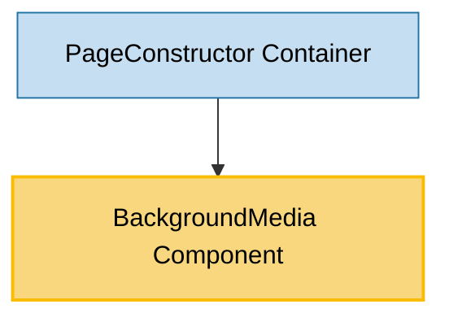

# BackgroundMedia Component Usage

This document outlines how the BackgroundMedia component is used across blocks, sub-blocks, and components in the page-constructor project.

## Overview

The BackgroundMedia component is a utility component that renders background media elements (images, videos, DataLens, iframes) with animation support. It wraps the Media component with AnimateBlock functionality and provides background-specific styling and behavior. The component is designed to display media content as full-width backgrounds with optional parallax effects and mobile responsiveness.

## Usage Graph



## Component Details

### BackgroundMedia Component

- **File**: `src/components/BackgroundMedia/BackgroundMedia.tsx`
- **Description**: Renders background media elements with animation support, mobile responsiveness, and parallax effects.
- **Props**:
  - `className`: Optional CSS class name for the container
  - `color`: Background color for the media container
  - `animated`: Boolean to enable/disable animations
  - `parallax`: Boolean to enable/disable parallax effects (defaults to true)
  - `video`: Video configuration object
  - `mediaClassName`: Optional CSS class name for the media element
  - `fullWidthMedia`: Boolean to enable full-width media display
  - `qa`: Optional QA attribute for testing
  - Additional props from `MediaProps` interface (image, iframe, dataLens, etc.)

### BackgroundMediaProps Interface

- **Description**: Defines the structure of BackgroundMedia component props.
- **Extends**:
  - `MediaProps`: All media-related properties (image, video, iframe, dataLens, etc.)
  - `Animatable`: Animation control properties
  - `QAProps`: Testing and QA attributes
- **Key Properties**:
  - `fullWidthMedia`: Boolean to control full-width media display
  - `className`: CSS class for the container
  - `mediaClassName`: CSS class for the media element

### MediaProps Interface

The BackgroundMedia component inherits all properties from MediaProps, which includes:

- **Image Properties**: `image`, `parallax`, `height`, `disableImageSliderForArrayInput`
- **Video Properties**: `video`, `previewImg`, `fullscreen`
- **DataLens Properties**: `dataLens`
- **Iframe Properties**: `iframe`, `margins`
- **YouTube Properties**: `youtube`, `previewImg`, `fullscreen`
- **Video Iframe Properties**: `videoIframe`
- **General Properties**: `color`, `animated`, `videoMicrodata`

## Usage Patterns

> **Note**: In the code examples below, `b()` is a utility function used throughout the page-constructor project for BEM (Block Element Modifier) class naming. It generates CSS class names following the BEM methodology, making the code more maintainable and consistent.

### In Containers

#### PageConstructor Container

- **File**: `src/containers/PageConstructor/PageConstructor.tsx`
- **Usage**: Provides full-page background media for the entire page constructor with theme support.
- **Implementation**:

  ```tsx
  const theme = useTheme();
  const themedBackground = getThemedValue(background, theme);

  return (
    <InnerContext.Provider value={context}>
      <RootCn className={b()}>
        <div className={b('wrapper')}>
          {themedBackground && (
            <BackgroundMedia {...themedBackground} className={b('background')} />
          )}
          <Layout navigation={navigation}>{/* Page content */}</Layout>
        </div>
      </RootCn>
    </InnerContext.Provider>
  );
  ```

## Component Architecture

The BackgroundMedia component follows a layered architecture:

### Layer 1: AnimateBlock Wrapper

- Provides animation capabilities when the element enters the viewport
- Handles background color styling
- Manages animation state and QA attributes

### Layer 2: Media Component

- Renders the actual media content (image, video, iframe, etc.)
- Applies background-specific styling and behavior
- Handles device-specific media rendering

### Layer 3: Mobile Context Integration

- Uses MobileContext to detect mobile devices
- Disables video on mobile devices for performance
- Maintains responsive behavior across different screen sizes

## Mobile Responsiveness

The BackgroundMedia component includes built-in mobile optimizations:

### Video Handling

```tsx
const isMobile = React.useContext(MobileContext);

// Video is disabled on mobile devices
video: isMobile ? undefined : video;
```

### Default Configuration

- **Height**: Fixed at 720px for consistent layout
- **Parallax**: Enabled by default for desktop experience
- **Background Mode**: Always renders in background mode (`isBackground={true}`)

## Integration with Animation System

The BackgroundMedia component integrates with the page-constructor animation system:

1. **AnimateBlock Wrapper**: Uses AnimateBlock to provide scroll-based animation triggers
2. **Animation Control**: Respects the `animated` prop for enabling/disabling animations
3. **Parallax Support**: Provides parallax effects through the Media component
4. **Performance Optimization**: Disables resource-intensive features on mobile

## Theme System Integration

The component integrates with the page-constructor theme system:

1. **Theme Processing**: Often used with `getThemedValue()` utility to resolve themed media
2. **Background Color**: Supports themed background colors
3. **Media Theming**: Passes theme information to the underlying Media component

## CSS Structure

The component uses BEM methodology with the base class `BackgroundMedia`:

- `.pc-BackgroundMedia`: Main container
- `.pc-BackgroundMedia__media`: Media element container
- `.pc-BackgroundMedia__media_full-width-media`: Full-width media modifier
- `.pc-BackgroundMedia__image`: Image-specific styling
- `.pc-BackgroundMedia__video`: Video-specific styling

## Best Practices

1. **Performance Considerations**: The component automatically disables video on mobile devices to improve performance and reduce data usage.

2. **Theme Integration**: Always use `getThemedValue()` when working with themed backgrounds to ensure proper theme support.

3. **Full-Width Usage**: Use the `fullWidthMedia` prop when you need the media to extend beyond container boundaries.

4. **Animation Control**: Respect the global animation settings by passing the appropriate `animated` prop.

5. **Background Color Fallback**: Provide a background color to ensure content remains visible while media loads.

6. **Parallax Considerations**: Parallax is enabled by default but can be disabled for better performance on lower-end devices.

## Media Type Support

The BackgroundMedia component supports all media types through the Media component:

### Images

```tsx
<BackgroundMedia image="/path/to/image.jpg" parallax={true} height={720} />
```

### Videos

```tsx
<BackgroundMedia
  video={{
    src: ['/path/to/video.mp4'],
    autoplay: true,
    muted: true,
    loop: true,
  }}
/>
```

### DataLens

```tsx
<BackgroundMedia
  dataLens={{
    id: 'dataLensId',
    theme: 'dark',
  }}
/>
```

### Iframes

```tsx
<BackgroundMedia
  iframe={{
    src: 'https://example.com',
    width: 1200,
    height: 720,
  }}
/>
```

## Example Usage

### Basic Background Media

```tsx
<BackgroundMedia image="/path/to/background.jpg" className={b('page-background')} animated={true} />
```

### Full-Width Video Background

```tsx
<BackgroundMedia
  video={{
    src: ['/path/to/video.mp4'],
    autoplay: true,
    muted: true,
    loop: true,
  }}
  fullWidthMedia={true}
  parallax={false}
/>
```

### Themed Background with Color Fallback

```tsx
const themedBackground = getThemedValue(background, theme);

<BackgroundMedia {...themedBackground} color="#f0f0f0" className={b('background')} />;
```

### DataLens Background

```tsx
<BackgroundMedia dataLens="dataLensId" className={b('analytics-background')} animated={true} />
```

## Storybook Documentation

The BackgroundMedia component includes Storybook stories demonstrating:

- Basic background media rendering
- Different media types (image, video, iframe, DataLens)
- Full-width media examples
- Animation and parallax effects
- Mobile responsiveness

Stories are located in `src/components/BackgroundMedia/__stories__/BackgroundMedia.stories.tsx` with example data.

## Testing

The BackgroundMedia component includes comprehensive tests covering:

- Default rendering behavior
- Media type handling (image, video, iframe)
- Animation integration
- Mobile context behavior
- CSS class application
- Full-width media functionality
- Parallax effects
- Background color styling

Test files are located in `src/components/BackgroundMedia/__tests__/BackgroundMedia.test.tsx`.

## Common Patterns

### Page-Level Background

```tsx
const theme = useTheme();
const themedBackground = getThemedValue(background, theme);

{
  themedBackground && <BackgroundMedia {...themedBackground} className={b('background')} />;
}
```

### Conditional Background Rendering

```tsx
{
  background && (
    <div className={b('background-wrapper')}>
      <BackgroundMedia {...backgroundProps} fullWidthMedia={true} animated={isAnimated} />
    </div>
  );
}
```

### Performance-Optimized Background

```tsx
const isMobile = React.useContext(MobileContext);

<BackgroundMedia
  image={backgroundImage}
  video={isMobile ? undefined : backgroundVideo}
  parallax={!isMobile}
  animated={!isMobile}
/>;
```

## Integration with PageConstructor

The BackgroundMedia component is primarily used in the PageConstructor container to provide full-page backgrounds:

1. **Theme Resolution**: Uses `getThemedValue()` to resolve themed backgrounds
2. **Conditional Rendering**: Only renders when background data is provided
3. **Layout Integration**: Positioned behind all page content
4. **Context Provision**: Works within the InnerContext and AnimateContext providers

This integration allows for dynamic, themed, and animated page backgrounds that enhance the overall user experience while maintaining performance and accessibility standards.
