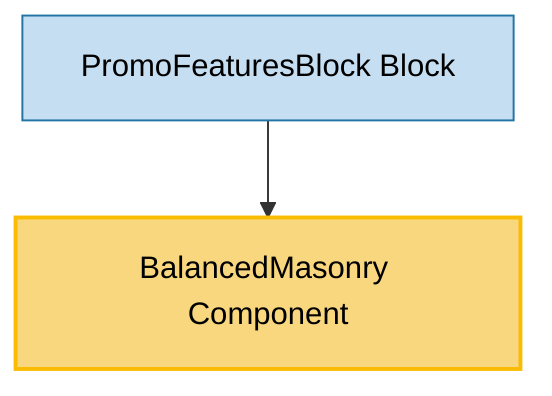

# BalancedMasonry Component Usage

This document outlines how the BalancedMasonry component is used across blocks, sub-blocks, and components in the page-constructor project.

## Overview

The BalancedMasonry component creates a balanced masonry layout that distributes child elements across multiple columns based on their height. It automatically balances the columns to ensure even distribution and supports responsive breakpoints for different screen sizes. The component uses ResizeObserver and window resize events to maintain optimal layout balance.

## Usage Graph



## Component Details

### BalancedMasonry Component

- **File**: `src/components/BalancedMasonry/BalancedMasonry.tsx`
- **Description**: Creates a balanced masonry layout that distributes child elements across columns based on their height, ensuring even distribution.
- **Props**:
  - `className`: CSS class name for the main container (required)
  - `columnClassName`: CSS class name for individual columns (required)
  - `children`: Array of React nodes to be distributed across columns (required)
  - `breakpointCols`: Object mapping breakpoint widths to column counts (required)
  - `qa`: Optional QA attribute for testing

### Breakpoint Configuration

The `breakpointCols` prop defines how many columns should be displayed at different screen widths:

```typescript
breakpointCols: {
    [key: number]: number;
}
```

- **Key**: Maximum screen width in pixels
- **Value**: Number of columns to display at that breakpoint

## Usage Patterns

> **Note**: In the code examples below, `b()` is a utility function used throughout the page-constructor project for BEM (Block Element Modifier) class naming. It generates CSS class names following the BEM methodology, making the code more maintainable and consistent.

### In Blocks

#### PromoFeaturesBlock Block

- **File**: `src/blocks/PromoFeaturesBlock/PromoFeaturesBlock.tsx`
- **Usage**: Creates a balanced masonry layout for promotional feature cards with responsive column distribution.
- **Implementation**:

  ```tsx
  const breakpointColumns = {
    [BREAKPOINTS.lg]: 3,
    [BREAKPOINTS.md]: 2,
    [BREAKPOINTS.sm]: 1,
  };

  <BalancedMasonry
    breakpointCols={breakpointColumns}
    className={b('card-container')}
    columnClassName={b('card-container-column')}
  >
    {items.map(({title: cardTitle, text, media, theme: cardTheme}, index) => (
      <div
        key={index}
        className={b('card', {
          'no-media': !media,
          [themeMod]: Boolean(themeMod),
        })}
      >
        <div className={b('card-info')}>
          <h3 className={b('card-title')}>{cardTitle}</h3>
          <div className={b('card-text')}>
            <YFMWrapper content={text} modifiers={{constructor: true}} />
          </div>
        </div>
        {media && <Media className={b('card-media')} {...allProps} />}
      </div>
    ))}
  </BalancedMasonry>;
  ```

## Algorithm and Behavior

### Column Balancing Algorithm

The BalancedMasonry component uses a sophisticated algorithm to balance content across columns:

1. **Initial Setup**: Creates empty columns based on the current breakpoint
2. **Height Tracking**: Maintains metadata for each column including its current height
3. **Element Distribution**: For each child element:
   - Finds the column with the minimum height
   - Adds the element to that column
   - Updates the column's height with the element's offsetHeight
4. **Dynamic Rebalancing**: Recalculates layout when:
   - Window is resized
   - Element content changes (via ResizeObserver)
   - Breakpoint changes

### Responsive Behavior

The component automatically adjusts the number of columns based on screen width:

- **Server-Side Rendering**: Uses the largest breakpoint value for initial render
- **Client-Side**: Dynamically calculates columns based on `document.body.clientWidth`
- **Resize Handling**: Listens to window resize events and updates column count accordingly

### Performance Optimizations

1. **Debounced Rebalancing**: Uses lodash debounce (300ms) to prevent excessive recalculations
2. **ResizeObserver**: Monitors individual element size changes for precise layout updates
3. **Hidden Container**: Uses a hidden container to measure element heights without affecting layout
4. **Conditional Rendering**: Only applies ResizeObserver when supported by the browser

## Integration with SSR Context

The component uses SSRContext to handle server-side rendering properly:

```typescript
const {isServer} = React.useContext(SSRContext);

const getCurrentColumnsCount = React.useCallback(() => {
  // ... breakpoint sorting logic

  if (isServer) {
    return result; // Use default breakpoint on server
  }

  // Client-side calculation based on actual screen width
  for (const [rawWidth, columnCount] of breakpoints) {
    const width = Number(rawWidth);
    if (document?.body.clientWidth <= width) {
      result = columnCount;
    }
  }

  return result;
}, [breakpointCols, isServer]);
```

## CSS Structure

The component generates the following CSS structure:

```scss
.BalancedMasonry {
  // Main container styles

  &__hidden-container {
    // Hidden container for measuring element heights
    width: calc(100% / column-count);
  }

  &__hidden-list {
    // Hidden list containing original elements for measurement
  }
}
```

Individual columns receive:

- Dynamic width based on column count: `width: ${100 / columnCount}%`
- Custom className from `columnClassName` prop

## Best Practices

1. **Breakpoint Configuration**: Define breakpoints in descending order for proper responsive behavior:

   ```typescript
   breakpointCols: {
       [BREAKPOINTS.lg]: 3,    // Large screens: 3 columns
       [BREAKPOINTS.md]: 2,    // Medium screens: 2 columns
       [BREAKPOINTS.sm]: 1,    // Small screens: 1 column
   }
   ```

2. **Content Consistency**: Ensure child elements have consistent styling and structure for optimal balance.

3. **Performance Considerations**:

   - Avoid frequent content changes that trigger rebalancing
   - Use stable keys for child elements to prevent unnecessary re-renders

4. **Accessibility**: Ensure the masonry layout doesn't break logical reading order for screen readers.

5. **CSS Styling**: Apply appropriate styles to both container and column class names:

   ```scss
   .my-masonry-container {
     display: flex;
     gap: 16px;
   }

   .my-masonry-column {
     display: flex;
     flex-direction: column;
     gap: 16px;
   }
   ```

## Example Usage

### Basic Masonry Layout

```tsx
<BalancedMasonry
  className="my-masonry"
  columnClassName="my-masonry-column"
  breakpointCols={{
    1200: 3,
    768: 2,
    480: 1,
  }}
>
  {items.map((item, index) => (
    <div key={index} className="masonry-item">
      {item.content}
    </div>
  ))}
</BalancedMasonry>
```

### With CardBase Components (Storybook Example)

```tsx
<BalancedMasonry
  className="balanced-masonry-stories__class-name"
  columnClassName="balanced-masonry-stories__column-class-name"
  breakpointCols={{
    [BREAKPOINTS.lg]: 3,
    [BREAKPOINTS.md]: 2,
    [BREAKPOINTS.sm]: 1,
  }}
>
  {textContent.map((text, index) => (
    <CardBase key={index} className="balanced-masonry-stories__card-base">
      <CardBase.Content>{text}</CardBase.Content>
    </CardBase>
  ))}
</BalancedMasonry>
```

## Storybook Documentation

The BalancedMasonry component includes Storybook stories demonstrating:

- Default masonry layout with varying content heights
- Responsive behavior across different breakpoints
- Integration with CardBase components

Stories are located in `src/components/BalancedMasonry/__stories__/BalancedMasonry.stories.tsx` with example data in `data.json`.

## Testing

The BalancedMasonry component includes comprehensive tests covering:

- Default rendering with children
- Custom className application
- Column distribution logic
- Responsive breakpoint behavior
- QA attribute handling

Test files are located in `src/components/BalancedMasonry/__tests__/BalancedMasonry.test.tsx`.

## Browser Compatibility

- **ResizeObserver**: Used when available for optimal performance
- **Fallback**: Gracefully degrades to window resize events only
- **SSR Support**: Properly handles server-side rendering scenarios
- **Modern Browsers**: Fully supported in all modern browsers
- **Legacy Support**: Basic functionality works in older browsers without ResizeObserver
