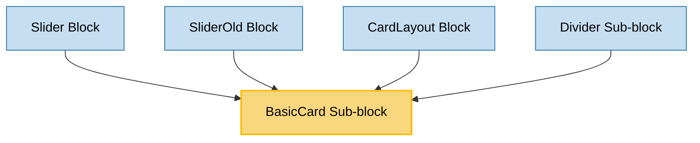

# BasicCard Sub-block Usage

This document outlines how the BasicCard sub-block is used across blocks, sub-blocks, and components in the page-constructor project.

## Overview

The BasicCard sub-block is a versatile component that displays content with a title, text, icon, and optional controls like links and buttons. It provides a simple yet flexible way to present information in a card format. The component supports various customization options including icon positioning, border styles, and control positioning, making it adaptable for different design requirements.

## Usage Graph



## Component Details

### BasicCard Sub-block

- **File**: `src/sub-blocks/BasicCard/BasicCard.tsx`
- **Description**: Displays content with a title, text, icon, and optional controls like links and buttons.
- **Props**:
  - `title`: Card title (required)
  - `text`: Card description with YFM support (required)
  - `url`: URL that opens when clicking the card
  - `urlTitle`: Accessible title for the URL
  - `border`: Border style - 'line', 'shadow', or 'none'
  - `icon`: Icon with theme support
  - `iconPosition`: Position of the icon - 'top' or 'left'
  - `additionalInfo`: Additional information text with YFM support
  - `links`: Array of link objects
  - `buttons`: Array of button objects
  - `analyticsEvents`: Analytics events to track
  - `controlPosition`: Position of controls (links and buttons) - 'content' or 'footer'
  - `list`: Array of content list items
  - `target`: Target for the URL - '\_blank', '\_parent', '\_top', or '\_self'

## Usage Patterns

> **Note**: In the code examples below, `b()` is a utility function used throughout the page-constructor project for BEM (Block Element Modifier) class naming. It generates CSS class names following the BEM methodology, making the code more maintainable and consistent.

### In Blocks

#### Slider Block

- **File**: `src/blocks/Slider/Slider.tsx`
- **Usage**: Used as a child component within the Slider block to display cards in a carousel.
- **Implementation**:
  ```tsx
  <Slider
    title={{
      text: 'Slider',
      url: 'https://example.com',
    }}
    arrows={true}
    dots={true}
  >
    <BasicCard
      title="Lorem ipsum dolor sit amet"
      text="Ut enim ad minim veniam, quis nostrud exercitation ullamco laboris nisi ut aliquip ex ea commodo consequat."
      url="https://example.com"
      icon="/story-assets/icon_1_light.svg"
    />
    {/* Other cards */}
  </Slider>
  ```

#### SliderOld Block (Deprecated)

- **File**: `src/blocks/SliderOld/SliderOld.tsx`
- **Usage**: Used as a child component within the SliderOld block to display cards in a carousel.
- **Implementation**:
  ```tsx
  <SliderOld
    title={{
      text: 'Slider',
      url: 'https://example.com',
    }}
    arrows={true}
    dots={true}
  >
    <BasicCard
      title="Lorem ipsum dolor sit amet"
      text="Ut enim ad minim veniam, quis nostrud exercitation ullamco laboris nisi ut aliquip ex ea commodo consequat."
      url="https://example.com"
      icon="/story-assets/icon_1_light.svg"
    />
    {/* Other cards */}
  </SliderOld>
  ```

#### CardLayout Block

- **File**: `src/blocks/CardLayout/CardLayout.tsx`
- **Usage**: Used as a child component within the CardLayout block to display cards in a grid.
- **Implementation**:
  ```tsx
  <CardLayout
    title="Card layout with basic cards"
    description="Three cards in a row on the desktop, two cards in a row on a tablet, one card in a row on a mobile phone."
  >
    <BasicCard
      title="Tell a story and build a narrative"
      text="We are all storytellers. Stories are a powerful way to communicate ideas and share information."
      icon="/story-assets/icon_1_light.svg"
    />
    {/* Other cards */}
  </CardLayout>
  ```

### In Sub-blocks

#### Divider Sub-block

- **File**: `src/sub-blocks/Divider/__stories__/Divider.stories.tsx`
- **Usage**: Used in the Divider stories to demonstrate dividers between cards.
- **Implementation**:
  ```tsx
  <div style={{maxWidth: '400px', marginTop: '10px'}}>
    <BasicCard
      title="Lorem ipsum"
      text="**Ut enim ad minim veniam** [quis nostrud](https://example.com) exercitation ullamco laboris nisi ut aliquip ex ea commodo consequat."
      url="https://example.com"
    />
    <Divider />
    <BasicCard
      title="Lorem ipsum"
      text="**Ut enim ad minim veniam** [quis nostrud](https://example.com) exercitation ullamco laboris nisi ut aliquip ex ea commodo consequat."
      url="https://example.com"
    />
  </div>
  ```

## Component Structure

The BasicCard component is composed of several key parts:

1. **CardBase**: Provides the base card functionality including border styles and URL handling
2. **IconWrapper**: Renders the icon with theme support and positioning
3. **Content**: Displays the card content including title, text, additional info, links, buttons, and content list

### Internal Structure

```tsx
<CardBase
  className={b()}
  contentClassName={b('content')}
  {...cardParams}
  extraProps={{'aria-describedby': descriptionId, 'aria-labelledby': titleId}}
>
  <CardBase.Content>
    <IconWrapper
      icon={themedIcon ? {value: themedIcon, position: iconPosition} : undefined}
      className={b('wrapper')}
    >
      <Content
        title={title}
        titleId={titleId}
        text={text}
        textId={descriptionId}
        additionalInfo={additionalInfo}
        links={links}
        list={list}
        buttons={buttons}
        size="s"
        colSizes={{all: 12, md: 12}}
        controlPosition={areControlsInFooter ? 'bottom' : 'default'}
      />
    </IconWrapper>
  </CardBase.Content>
</CardBase>
```

## Icon Handling

The component supports flexible icon input:

### Icon Image

```tsx
// String URL
icon: "/path/to/icon.svg"

// Themed icon
icon: {
  light: "/path/to/light-icon.svg",
  dark: "/path/to/dark-icon.svg"
}
```

## Icon Position

The component supports two positions for the icon:

- `top`: Icon is placed above the content (default)
- `left`: Icon is placed to the left of the content

## Border Styles

The component supports different border styles:

- `shadow`: Card has a shadow effect (default)
- `line`: Card has a line border
- `none`: Card has no border

## Control Position

The component supports two positions for controls (links and buttons):

- `content`: Controls are placed within the content area (default)
- `footer`: Controls are placed at the bottom of the card

## Integration with Theme System

The BasicCard component integrates with the page-constructor theme system:

1. **Theme Processing**: Uses `getThemedValue()` utility to resolve themed icons
2. **Icon Processing**: Uses `IconWrapper` component to handle icon display and positioning
3. **Content Theming**: Passes theme to the Content component for consistent styling
4. **Theme Context**: Respects the global theme context for consistent styling

## Best Practices

1. **Content Structure**: Provide meaningful titles and descriptions for accessibility.

2. **Icon Selection**:

   - Choose appropriate icons that represent the card's content
   - Use SVG icons for better scaling and theme support

3. **Border Usage**:

   - Use `shadow` border for elevated appearance (default)
   - Use `line` border for subtle separation
   - Use `none` border for seamless integration

4. **Icon Position**:

   - Use `top` position for standard layout (default)
   - Use `left` position for more compact cards or when emphasizing the icon

5. **Control Position**:
   - Use `content` position for standard layout (default)
   - Use `footer` position for cards where controls should be aligned at the bottom

## Example Usage

### Basic BasicCard

```tsx
<BasicCard
  title="Lorem ipsum"
  text="**Ut enim ad minim veniam** [quis nostrud](https://example.com) exercitation ullamco laboris nisi ut aliquip ex ea commodo consequat."
  additionalInfo="Duis aute irure dolor in reprehenderit in voluptate velit esse cillum dolore eu fugiat nulla pariatur."
/>
```

### With Icon

```tsx
<BasicCard
  title="Lorem ipsum"
  text="**Ut enim ad minim veniam** [quis nostrud](https://example.com) exercitation ullamco laboris nisi ut aliquip ex ea commodo consequat."
  icon="/path/to/icon.svg"
/>
```

### With Left Icon

```tsx
<BasicCard
  title="Lorem ipsum"
  text="**Ut enim ad minim veniam** [quis nostrud](https://example.com) exercitation ullamco laboris nisi ut aliquip ex ea commodo consequat."
  icon="/path/to/icon.svg"
  iconPosition="left"
/>
```

### With Links and Buttons

```tsx
<BasicCard
  title="Lorem ipsum"
  text="**Ut enim ad minim veniam** [quis nostrud](https://example.com) exercitation ullamco laboris nisi ut aliquip ex ea commodo consequat."
  links={[
    {
      url: 'https://example.com',
      text: 'Link',
      theme: 'normal',
      arrow: true,
    },
  ]}
  buttons={[
    {
      text: 'Button',
      theme: 'action',
      url: 'https://example.com',
    },
    {
      text: 'Button',
      theme: 'outlined',
      url: 'https://example.com',
    },
  ]}
/>
```

### With Content List

```tsx
<BasicCard
  title="Lorem ipsum"
  text="**Ut enim ad minim veniam** [quis nostrud](https://example.com) exercitation ullamco laboris nisi ut aliquip ex ea commodo consequat."
  list={[
    {
      icon: {
        light: '/path/to/icon-light.svg',
        dark: '/path/to/icon-dark.svg',
      },
      title: 'Lorem ipsum',
      text: '**Ut enim ad minim veniam** [quis nostrud](https://example.com) exercitation.',
    },
    {
      icon: {
        light: '/path/to/icon-light.svg',
        dark: '/path/to/icon-dark.svg',
      },
      text: '**Ut enim ad minim veniam** [quis nostrud](https://example.com) exercitation.',
    },
  ]}
/>
```

### With URL

```tsx
<BasicCard
  title="Lorem ipsum"
  text="**Ut enim ad minim veniam** [quis nostrud](https://example.com) exercitation ullamco laboris nisi ut aliquip ex ea commodo consequat."
  url="https://example.com"
  urlTitle="Opens in a new tab"
  target="_blank"
/>
```

### With Footer Controls

```tsx
<BasicCard
  title="Lorem ipsum"
  text="**Ut enim ad minim veniam** [quis nostrud](https://example.com) exercitation ullamco laboris nisi ut aliquip ex ea commodo consequat."
  buttons={[
    {
      text: 'Button',
      theme: 'action',
      url: 'https://example.com',
    },
    {
      text: 'Button',
      theme: 'outlined',
      url: 'https://example.com',
    },
  ]}
  controlPosition="footer"
/>
```

## Storybook Documentation

The BasicCard component includes Storybook stories demonstrating:

- Default card display
- Various content configurations (with/without links, buttons, content list)
- Icon positioning (top, left)
- Border styles (shadow, line, none)
- URL handling
- Control positioning (content, footer)

Stories are located in `src/sub-blocks/BasicCard/__stories__/BasicCard.stories.tsx` with example data in `data.json`.
