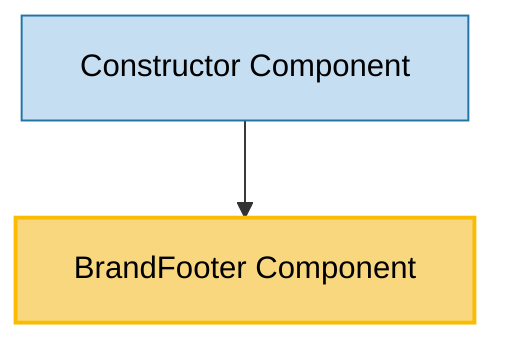

# BrandFooter Component Usage

This document outlines how the BrandFooter component is used across blocks, sub-blocks, and components in the page-constructor project.

## Overview

The BrandFooter component is a branding component that displays a "Created on" message with the Gravity UI brand logo and name. It serves as a footer attribution for pages built with the page-constructor library. The component automatically adapts to the current theme (light/dark) and provides a link to the Gravity UI website.

## Usage Graph



## Component Details

### BrandFooter Component

- **File**: `src/components/BrandFooter/BrandFooter.tsx`
- **Description**: Displays Gravity UI branding with theme-aware icons and internationalized text.
- **Props**:
  - `className`: Optional CSS class name for styling customization

### Dependencies

#### Theme Context

- **File**: `src/context/theme`
- **Usage**: Provides current theme (light/dark) to determine which brand icon to display

#### Brand Icons

- **BrandIconLight**: Light theme version of the Gravity UI brand icon
- **BrandIconDark**: Dark theme version of the Gravity UI brand icon
- **BrandName**: Gravity UI brand name logo

#### Internationalization

- **File**: `src/components/BrandFooter/i18n/`
- **Supported Languages**:
  - English: "Created on"
  - Russian: "Создано на"

## Usage Patterns

> **Note**: In the code examples below, `b()` is a utility function used throughout the page-constructor project for BEM (Block Element Modifier) class naming. It generates CSS class names following the BEM methodology, making the code more maintainable and consistent.

### In Containers

#### Constructor Component (PageConstructor)

- **File**: `src/containers/PageConstructor/PageConstructor.tsx`
- **Usage**: Conditionally renders BrandFooter at the bottom of the page when branding is enabled.
- **Implementation**:

  ```tsx
  export interface PageConstructorProps {
    // ... other props
    isBranded?: boolean;
  }

  export const Constructor = (props: PageConstructorProps) => {
    const {isBranded} = props;

    return (
      <InnerContext.Provider value={context}>
        <RootCn className={b()}>
          <div className={b('wrapper')}>
            {/* Background and Layout content */}
            <Layout navigation={navigation}>{/* Header and main content */}</Layout>
            {isBranded && <BrandFooter />}
          </div>
        </RootCn>
      </InnerContext.Provider>
    );
  };
  ```

## Component Structure

The BrandFooter component has a simple structure:

```tsx
<Link className={b({theme}, className)} href="https://gravity-ui.com">
  <div className={b('content')}>
    <span>{i18n('created-on')}</span>
    <div className={b('brand-icon')}>
      {theme === Theme.Light ? <BrandIconLight /> : <BrandIconDark />}
    </div>
    <div className={b('brand-name')}>
      <BrandName />
    </div>
  </div>
</Link>
```

## Theme Integration

The BrandFooter component integrates seamlessly with the page-constructor theme system:

### Theme Detection

- Uses `useTheme()` hook to get the current theme
- Automatically switches between light and dark brand icons

### Theme-Aware Styling

- Applies theme-specific CSS classes via BEM methodology
- CSS class structure: `.brand-footer_theme_light` or `.brand-footer_theme_dark`

### Supported Themes

- **Light Theme**: Uses `BrandIconLight` component
- **Dark Theme**: Uses `BrandIconDark` component

## Internationalization Support

The component supports multiple languages through the i18n system:

### Language Files

- **English** (`en.json`): "Created on"
- **Russian** (`ru.json`): "Создано на"

### Implementation

```tsx
import {i18n} from './i18n';

// Usage in component
<span>{i18n('created-on')}</span>;
```

## Styling and Layout

### CSS Classes Applied

- `.brand-footer`: Base component class
- `.brand-footer_theme_{theme}`: Theme-specific styling
- `.brand-footer__content`: Content wrapper
- `.brand-footer__brand-icon`: Brand icon container
- `.brand-footer__brand-name`: Brand name container

### Layout Structure

The component uses a horizontal layout with:

1. "Created on" text
2. Brand icon (theme-aware)
3. Brand name logo

## Integration Guidelines

### When to Use BrandFooter

1. **Branded Pages**: When `isBranded` prop is set to `true` in PageConstructor
2. **Attribution Requirements**: When you need to show Gravity UI attribution
3. **Footer Branding**: As a consistent footer element across pages

### Best Practices

1. **Conditional Rendering**: Always use the `isBranded` prop to control visibility
2. **Theme Consistency**: The component automatically handles theme switching
3. **Link Behavior**: The entire component is clickable and links to gravity-ui.com
4. **Accessibility**: The component uses semantic HTML with proper link structure

## Example Usage

### Basic Integration in PageConstructor

```tsx
<PageConstructor
  content={pageContent}
  isBranded={true}
  // ... other props
/>
```

### Standalone Usage (if needed)

```tsx
import BrandFooter from './components/BrandFooter/BrandFooter';

// Basic usage
<BrandFooter />

// With custom styling
<BrandFooter className="custom-footer-class" />
```

## Storybook Documentation

The BrandFooter component includes Storybook stories demonstrating:

- Default appearance
- Theme variations (handled automatically by Storybook theme switcher)
- Custom className application

Stories are located in `src/components/BrandFooter/__stories__/BrandFooter.stories.tsx`.

## Testing Considerations

When testing components that use BrandFooter:

1. **Theme Context**: Ensure theme context is provided in test environment
2. **Internationalization**: Mock or provide i18n context for proper text rendering
3. **Link Behavior**: Test that the component renders as a clickable link
4. **Conditional Rendering**: Test both branded and non-branded scenarios

## Performance Notes

The BrandFooter component is lightweight and has minimal performance impact:

- Uses SVG icons for crisp rendering at any size
- Minimal DOM structure
- No complex state management
- Efficient theme switching without re-renders

## Accessibility Features

- **Semantic HTML**: Uses proper `<Link>` element for navigation
- **Keyboard Navigation**: Fully keyboard accessible
- **Screen Readers**: Proper text content for screen reader users
- **Focus Management**: Standard focus behavior for interactive elements
