# Button Component Usage

This document outlines how the Button component is used across blocks, sub-blocks, and components in the page-constructor project.

## Overview

The Button component is a versatile UI element that renders styled buttons with various themes, sizes, and configurations. It supports different button types including regular buttons, app store badges, GitHub buttons, and custom themed buttons. The component integrates with analytics tracking and supports both internal and external links.

## Usage Graph

```mermaid
graph TD
    %% Main Component
    Button[Button Component]

    %% Components that use Button
    Buttons[Buttons Component]
    ButtonTabs[ButtonTabs Component]

    %% Sub-blocks that use Button
    Quote[Quote Sub-block]
    BannerCard[BannerCard Sub-block]

    %% Blocks that use Button
    Header[Header Block]

    %% Navigation components
    NavigationButton[NavigationButton Component]
    GithubButton[GithubButton Component]

    %% Usage relationships
    Buttons --> Button
    ButtonTabs --> Button
    Quote --> Button
    BannerCard --> Button
    Header --> Button
    NavigationButton --> Button
    GithubButton --> Button

    %% Style classes
    style Button fill:#f9d77e,stroke:#f9bc02,stroke-width:2px,color:#000

    %% Component styles
    style Buttons fill:#a8d5ba,stroke:#1a936f,stroke-width:1px,color:#000
    style ButtonTabs fill:#a8d5ba,stroke:#1a936f,stroke-width:1px,color:#000

    %% Sub-block styles
    style Quote fill:#e8c5a0,stroke:#d4a574,stroke-width:1px,color:#000
    style BannerCard fill:#e8c5a0,stroke:#d4a574,stroke-width:1px,color:#000

    %% Block styles
    style Header fill:#c6def1,stroke:#2274a5,stroke-width:1px,color:#000

    %% Navigation styles
    style NavigationButton fill:#d4b5f0,stroke:#a569bd,stroke-width:1px,color:#000
    style GithubButton fill:#d4b5f0,stroke:#a569bd,stroke-width:1px,color:#000
```



## Component Details

### Button Component

- **File**: `src/components/Button/Button.tsx`
- **Description**: Renders styled buttons with various themes, sizes, and configurations. Supports analytics tracking and different button types.
- **Props**:
  - `text`: Button text content (required)
  - `url`: Button URL for navigation (optional)
  - `urlTitle`: Title attribute for the button link
  - `theme`: Button theme/appearance (defaults to 'normal')
  - `size`: Button size (defaults to 'l')
  - `width`: Button width ('auto' or 'max')
  - `img`: Button image/icon (string URL or ButtonImageProps object)
  - `target`: Link target attribute
  - `primary`: Boolean flag for primary button styling
  - `onClick`: Click event handler
  - `analyticsEvents`: Analytics tracking configuration
  - `className`: Optional CSS class name
  - `id`: Optional HTML id attribute
  - `qa`: Optional QA attribute for testing

### ButtonProps Interface

- **Description**: Defines the structure of button properties.
- **Properties**:
  - `text`: Button text content (required)
  - `url`: Button URL for navigation (required)
  - `urlTitle`: Optional title attribute
  - `primary`: Optional boolean for primary styling
  - `theme`: Optional button theme
  - `img`: Optional image/icon (string or ButtonImageProps)
  - `target`: Optional link target
  - `size`: Optional button size
  - `width`: Optional button width
  - `extraProps`: Optional additional HTML props
  - Analytics and event properties

### ButtonImageProps Interface

- **Description**: Defines the structure for button images.
- **Properties**:
  - `url`: Image URL (required)
  - `position`: Image position ('left' or 'right', defaults to 'left')
  - `alt`: Alternative text for the image

### Button Themes

The Button component supports various themes:

#### Standard Themes

- `normal`: Default button appearance
- `action`: Primary action button
- `outlined`: Outlined button style
- `outlined-info`: Info outlined button
- `outlined-danger`: Danger outlined button
- `raised`: Raised button with shadow
- `flat`: Flat button without background
- `flat-info`: Info flat button
- `flat-danger`: Danger flat button
- `flat-secondary`: Secondary flat button
- `normal-contrast`: High contrast normal button
- `outlined-contrast`: High contrast outlined button
- `flat-contrast`: High contrast flat button

#### Special Themes

- `github`: GitHub-themed button with GitHub icon
- `app-store`: App Store badge
- `google-play`: Google Play badge
- `scale`: Accent-themed button
- `monochrome`: Monochrome button style

## Usage Patterns

> **Note**: In the code examples below, `b()` is a utility function used throughout the page-constructor project for BEM (Block Element Modifier) class naming. It generates CSS class names following the BEM methodology, making the code more maintainable and consistent.

### In Components

#### Buttons Component

- **File**: `src/components/Buttons/Buttons.tsx`
- **Usage**: Renders a collection of buttons with consistent spacing and layout.
- **Implementation**:
  ```tsx
  {
    buttons?.map((button, index) => <Button key={index} {...button} />);
  }
  ```

#### ButtonTabs Component

- **File**: `src/components/ButtonTabs/ButtonTabs.tsx`
- **Usage**: Creates tab-like navigation using buttons.
- **Implementation**:

  ```tsx
  import {Button} from '../index';

  // Renders buttons as tabs with active state management
  ```

### In Sub-blocks

#### Quote Sub-block

- **File**: `src/sub-blocks/Quote/Quote.tsx`
- **Usage**: Displays a button as part of quote attribution or call-to-action.
- **Implementation**:

  ```tsx
  import {Author, Button, HTML, Image, YFMWrapper} from '../../components';

  {
    button && <Button size="xl" {...button} />;
  }
  ```

#### BannerCard Sub-block

- **File**: `src/sub-blocks/BannerCard/BannerCard.tsx`
- **Usage**: Renders buttons as call-to-action elements in banner cards.
- **Implementation**:

  ```tsx
  import {BackgroundImage, Button, HTML, RouterLink, YFMWrapper} from '../../components';

  // Button used for banner call-to-action
  ```

### In Blocks

#### Header Block

- **File**: `src/blocks/Header/Header.tsx`
- **Usage**: Displays buttons in the header for primary actions.
- **Implementation**:

  ```tsx
  import {Button, HTML, Media, RouterLink} from '../../components';

  // Buttons used for header actions
  ```

### In Navigation

#### NavigationButton Component

- **File**: `src/navigation/components/NavigationItem/components/NavigationButton/NavigationButton.tsx`
- **Usage**: Renders navigation items as buttons.
- **Implementation**:

  ```tsx
  import {Button, RouterLink} from '../../../../../components';

  {
    target ? (
      <Button className={classes} {...props} url={url} />
    ) : (
      <RouterLink href={url}>
        <Button {...props} className={classes} url={url} />
      </RouterLink>
    );
  }
  ```

#### GithubButton Component

- **File**: `src/navigation/components/NavigationItem/components/GithubButton/GithubButton.tsx`
- **Usage**: Creates GitHub-themed navigation buttons.
- **Implementation**:
  ```tsx
  // Uses Button component with GitHub theme
  ```

## Button Sizes

The Button component supports various sizes:

- `s`: Small button
- `m`: Medium button
- `l`: Large button (default)
- `xl`: Extra large button

Legacy sizes are automatically mapped to modern equivalents:

- `xs`, `ns` → `s`
- `s` → `m`
- `m`, `l`, `n`, `head` → `l`
- `promo` → `xl`

## Button Width Options

- `auto`: Button width adjusts to content
- `max`: Button takes maximum available width

## Image/Icon Support

The Button component supports images and icons:

### Image URL

```tsx
<Button text="Download" img="/path/to/icon.png" />
```

### Image Object

```tsx
<Button
  text="Download"
  img={{
    url: '/path/to/icon.png',
    position: 'left',
    alt: 'Download icon',
  }}
/>
```

### GitHub Theme (Special Icon)

```tsx
<Button text="View on GitHub" theme="github" />
```

## Analytics Integration

The Button component integrates with the analytics system:

```tsx
<Button
  text="Track Me"
  url="/tracked-page"
  analyticsEvents={{
    name: 'button_click',
    data: {section: 'header'},
  }}
/>
```

## App Store Badges

Special themes for app store badges:

```tsx
// App Store badge
<Button theme="app-store" url="https://apps.apple.com/..." />

// Google Play badge
<Button theme="google-play" url="https://play.google.com/..." />
```

## Best Practices

1. **Theme Selection**: Choose appropriate themes based on the button's purpose and context.

2. **Size Consistency**: Use consistent button sizes within the same interface section.

3. **Analytics Tracking**: Always include analytics events for important user actions.

4. **Accessibility**: Ensure button text is descriptive and meaningful.

5. **URL Handling**: The component automatically handles URL TLD localization.

6. **Image Positioning**: Consider the visual balance when positioning images in buttons.

## Example Usage

### Basic Button

```tsx
<Button text="Click Me" url="/destination" />
```

### Primary Action Button

```tsx
<Button text="Get Started" url="/signup" theme="action" size="xl" primary={true} />
```

### Button with Image

```tsx
<Button
  text="Download App"
  url="/download"
  img={{
    url: '/download-icon.svg',
    position: 'left',
    alt: 'Download',
  }}
  theme="raised"
/>
```

### GitHub Button

```tsx
<Button text="View Source" url="https://github.com/user/repo" theme="github" target="_blank" />
```

## Storybook Documentation

The Button component includes comprehensive Storybook stories demonstrating:

- Default button appearance
- All available themes and sizes
- Width variations
- Image positioning
- Special themes (GitHub, app stores)

Stories are located in `src/components/Button/__stories__/Button.stories.tsx` with example data in `data.json`.

## Testing

The Button component includes comprehensive tests covering:

- Default rendering
- Theme variations
- Size options
- Image handling
- Click events
- Analytics integration
- Accessibility features

Test files are located in `src/components/Button/__tests__/Button.test.tsx`.
