# Content Sub-block Usage

This document outlines how the Content sub-block is used across blocks, sub-blocks, and components in the page-constructor project.

## Overview

The Content sub-block is a fundamental component that displays structured content with a title, text, additional information, links, buttons, and content lists. It serves as a core building block for many other components in the page-constructor project, providing consistent content rendering with support for theming, sizing, and layout options.

## Usage Graph

```mermaid
graph TD
    %% Main Component
    Content[Content Sub-block]

    %% Blocks that use Content
    InfoBlock[Info Block]
    QuestionsBlock[Questions Block]
    ContentLayoutBlock[ContentLayout Block]
    FoldableListBlock[FoldableList Block]
    FormBlock[Form Block]
    TabsBlock[Tabs Block]

    %% Components that use Content
    MediaBaseContent[MediaBaseContent Component]

    %% Sub-blocks that use Content
    BasicCard[BasicCard Sub-block]
    BackgroundCard[BackgroundCard Sub-block]
    ImageCard[ImageCard Sub-block]
    LayoutItem[LayoutItem Sub-block]
    PriceCard[PriceCard Sub-block]

    %% Usage relationships - Blocks
    InfoBlock --> Content
    QuestionsBlock --> Content
    ContentLayoutBlock --> Content
    FoldableListBlock --> Content
    FormBlock --> Content
    TabsBlock --> TabsTextContent
    TabsTextContent[TabsTextContent Component] --> Content

    %% Usage relationships - Components
    MediaBaseContent --> Content

    %% Usage relationships - Sub-blocks
    BasicCard --> Content
    BackgroundCard --> Content
    ImageCard --> Content
    LayoutItem --> Content
    PriceCard --> Content

    %% Style classes
    style Content fill:#f9d77e,stroke:#f9bc02,stroke-width:2px,color:#000

    %% Blocks
    style InfoBlock fill:#c6def1,stroke:#2274a5,stroke-width:1px,color:#000
    style QuestionsBlock fill:#c6def1,stroke:#2274a5,stroke-width:1px,color:#000
    style ContentLayoutBlock fill:#c6def1,stroke:#2274a5,stroke-width:1px,color:#000
    style FoldableListBlock fill:#c6def1,stroke:#2274a5,stroke-width:1px,color:#000
    style FormBlock fill:#c6def1,stroke:#2274a5,stroke-width:1px,color:#000
    style TabsBlock fill:#c6def1,stroke:#2274a5,stroke-width:1px,color:#000
    style TabsTextContent fill:#d8e8f9,stroke:#2274a5,stroke-width:1px,color:#000

    %% Components
    style MediaBaseContent fill:#d8e8f9,stroke:#2274a5,stroke-width:1px,color:#000

    %% Sub-blocks
    style BasicCard fill:#c6def1,stroke:#2274a5,stroke-width:1px,color:#000
    style BackgroundCard fill:#c6def1,stroke:#2274a5,stroke-width:1px,color:#000
    style ImageCard fill:#c6def1,stroke:#2274a5,stroke-width:1px,color:#000
    style LayoutItem fill:#c6def1,stroke:#2274a5,stroke-width:1px,color:#000
    style PriceCard fill:#c6def1,stroke:#2274a5,stroke-width:1px,color:#000
```



## Component Details

### Content Sub-block

- **File**: `src/sub-blocks/Content/Content.tsx`
- **Description**: Displays structured content with a title, text, additional information, links, buttons, and content lists.
- **Props**:
  - `title`: Content title, can be a string or a TitleItemProps object
  - `text`: Content text with YFM support
  - `additionalInfo`: Additional information text with YFM support
  - `size`: Content size - 's', 'm', or 'l'
  - `links`: Array of link objects
  - `buttons`: Array of button objects
  - `colSizes`: Width of the content in columns (1-12)
  - `centered`: Whether the content should be centered
  - `theme`: Content theme - 'default', 'dark', or 'light'
  - `list`: Array of content list items
  - `qa`: QA attributes for testing
  - `controlPosition`: Position of controls (links and buttons) - 'default' or 'bottom'

## Usage Patterns

> **Note**: In the code examples below, `b()` is a utility function used throughout the page-constructor project for BEM (Block Element Modifier) class naming. It generates CSS class names following the BEM methodology, making the code more maintainable and consistent.

### In Blocks

#### Info Block

- **File**: `src/blocks/Info/Info.tsx`
- **Usage**: Used to display content in a two-column layout with left and right content sections.
- **Implementation**:
  ```tsx
  <div className={b()}>
    <div
      className={b('container')}
      style={{backgroundColor: getThemedValue(backgroundColor, theme)}}
    >
      <Grid>
        <Row>
          <Col sizes={sizes} className={b('left')}>
            <Content
              title={title || leftContent?.title}
              text={leftContent?.text}
              links={leftContent?.links}
              list={leftContent?.list}
              buttons={leftButtons}
              additionalInfo={leftContent?.additionalInfo}
              {...commonProps}
            />
          </Col>
          <Col sizes={sizes} className={b('right')}>
            <Content
              title={sectionsTitle || rightContent?.title}
              text={rightContent?.text}
              links={rightLinks}
              list={rightContent?.list}
              buttons={rightContent?.buttons}
              additionalInfo={rightContent?.additionalInfo}
              {...commonProps}
            />
          </Col>
        </Row>
      </Grid>
    </div>
  </div>
  ```

#### Questions Block

- **File**: `src/blocks/Questions/Questions.tsx`
- **Usage**: Used to display content alongside a list of expandable questions.
- **Implementation**:
  ```tsx
  <div
    className={b()}
    itemScope
    itemType={FaqMicrodataValues.PageType}
    itemID={FaqMicrodataValues.PageId}
  >
    <Row>
      <Col sizes={{all: 12, md: 4}}>
        <div className={b('title')}>
          <Content
            title={title}
            text={text}
            additionalInfo={additionalInfo}
            links={links}
            list={list}
            buttons={buttons}
            colSizes={{all: 12, md: 12}}
          />
        </div>
      </Col>
      <Col sizes={{all: 12, md: 8}} role={'list'}>
        {/* Questions items */}
      </Col>
    </Row>
  </div>
  ```

#### ContentLayout Block

- **File**: `src/blocks/ContentLayout/ContentLayout.tsx`
- **Usage**: Used to display content with optional file links and background.
- **Implementation**:
  ```tsx
  <div className={b({size, theme, background: Boolean(background)})}>
    <Content
      className={b('content')}
      {...textContent}
      size={size}
      centered={centered}
      colSizes={colSizes}
      theme={theme}
    />
    {fileContent && (
      <Col className={b('files', {size, centered})} reset sizes={colSizes}>
        {/* File links */}
      </Col>
    )}
    {background && (
      <div className={b('background')}>
        <BackgroundImage className={b('background-item')} {...themedBackground} hide={isMobile} />
      </div>
    )}
  </div>
  ```

#### FoldableList Block

- **File**: `src/blocks/FoldableList/FoldableList.tsx`
- **Usage**: Used to display content alongside a list of expandable items.
- **Implementation**:
  ```tsx
  <div className={b()} itemScope>
    <Row>
      <Col sizes={{all: 12, md: 4}}>
        <div className={b('title')}>
          <Content
            title={title}
            text={text}
            additionalInfo={additionalInfo}
            links={links}
            list={list}
            buttons={buttons}
            colSizes={{all: 12, md: 12}}
          />
        </div>
      </Col>
      <Col sizes={{all: 12, md: 8}} role={'list'}>
        {/* Foldable list items */}
      </Col>
    </Row>
  </div>
  ```

#### Form Block

- **File**: `src/blocks/Form/Form.tsx`
- **Usage**: Used to display content alongside a form.
- **Implementation**:
  ```tsx
  <div
    className={b({
      'with-background': withBackground,
      'form-type': formType,
    })}
  >
    {/* Background image */}
    <Grid>
      <Row
        alignItems={
          direction === FormBlockDirection.Center ? GridAlignItems.Center : GridAlignItems.Start
        }
        className={b('row', {
          direction,
        })}
      >
        <Col sizes={colSizes} className={b('content-col')}>
          {textContent && (
            <div className={b('content-wrapper')}>
              <Content
                theme="default"
                {...textContent}
                centered={direction === FormBlockDirection.Center}
                colSizes={{all: 12}}
                className={b('content')}
              />
            </div>
          )}
        </Col>
        <Col sizes={colSizes} className={b('form-col')}>
          {/* Form content */}
        </Col>
      </Row>
    </Grid>
  </div>
  ```

#### Tabs Block

- **File**: `src/blocks/Tabs/TabsTextContent/TabsTextContent.tsx`
- **Usage**: Used to display content within tabs.
- **Implementation**:
  ```tsx
  <Col sizes={{all: 12, md: showMedia ? 4 : 8}} className={b({centered: centered})}>
    <div
      className={b('wrapper', {
        reverse: isReverse,
        'no-image': !(media || imageProps),
      })}
    >
      <Content
        title={title}
        text={text}
        additionalInfo={additionalInfo}
        size={contentSize}
        list={list}
        links={[...(link ? [link] : []), ...(links || [])]}
        buttons={buttons}
        colSizes={{all: 12}}
      />
    </div>
  </Col>
  ```

### In Components

#### MediaBaseContent Component

- **File**: `src/components/MediaBase/MediaBaseContent.tsx`
- **Usage**: Used to display content within the MediaBase component.
- **Implementation**:
  ```tsx
  <div className={b()}>
    <Content
      title={title}
      text={description}
      links={links}
      theme="default"
      buttons={allButtons}
      list={list}
      additionalInfo={additionalInfo}
      size={size}
      colSizes={{all: 12, md: 12}}
    />
  </div>
  ```

### In Sub-blocks

#### BasicCard Sub-block

- **File**: `src/sub-blocks/BasicCard/BasicCard.tsx`
- **Usage**: Used to display the content of a basic card with title, text, links, buttons, and content list.
- **Implementation**:
  ```tsx
  <CardBase
    className={b()}
    contentClassName={b('content')}
    {...cardParams}
    extraProps={{'aria-describedby': descriptionId, 'aria-labelledby': titleId}}
  >
    <CardBase.Content>
      <IconWrapper
        icon={themedIcon ? {value: themedIcon, position: iconPosition} : undefined}
        className={b('wrapper')}
      >
        <Content
          title={title}
          titleId={titleId}
          text={text}
          textId={descriptionId}
          additionalInfo={additionalInfo}
          links={links}
          list={list}
          buttons={buttons}
          size="s"
          colSizes={{all: 12, md: 12}}
          controlPosition={areControlsInFooter ? 'bottom' : 'default'}
        />
      </IconWrapper>
    </CardBase.Content>
  </CardBase>
  ```

#### BackgroundCard Sub-block

- **File**: `src/sub-blocks/BackgroundCard/BackgroundCard.tsx`
- **Usage**: Used to display the content of a card with a background image or color.
- **Implementation**:
  ```tsx
  <CardBase
    className={b({padding: paddingBottom, theme: cardTheme})}
    contentClassName={b('content')}
    url={url}
    border={borderType}
    analyticsEvents={analyticsEvents}
    urlTitle={urlTitle}
  >
    <CardBase.Content>
      <BackgroundImage
        className={b('image')}
        {...getThemedValue(background, theme)}
        style={{backgroundColor}}
      />
      <Content
        titleId={titleId}
        title={title}
        text={text}
        additionalInfo={additionalInfo}
        size="s"
        theme={cardTheme}
        links={links}
        buttons={buttons}
        list={list}
        colSizes={{all: 12, md: 12}}
        controlPosition={areControlsInFooter ? 'bottom' : 'default'}
      />
    </CardBase.Content>
  </CardBase>
  ```

#### ImageCard Sub-block

- **File**: `src/sub-blocks/ImageCard/ImageCard.tsx`
- **Usage**: Used to display the content of a card with an image.
- **Implementation**:
  ```tsx
  <div className={b('content')}>
    <Content
      titleId={titleId}
      title={title}
      text={text}
      links={links}
      buttons={buttons}
      list={list}
      theme={cardTheme}
      additionalInfo={additionalInfo}
      size={size}
      colSizes={CONTENT_COL_SIZES}
      controlPosition={areControlsInFooter ? 'bottom' : 'default'}
    />
  </div>
  ```

#### LayoutItem Sub-block

- **File**: `src/sub-blocks/LayoutItem/LayoutItem.tsx`
- **Usage**: Used to display content with optional media, meta information, and icon.
- **Implementation**:
  ```tsx
  <div className={b('content', {'no-media': !media, margin: contentMargin})}>
    <IconWrapper icon={themedIcon} className={b('wrapper')}>
      <Content {...contentProps} titleId={titleId} />
    </IconWrapper>
  </div>
  ```

#### PriceCard Sub-block

- **File**: `src/sub-blocks/PriceCard/schema.ts`
- **Usage**: Uses the ContentBase schema for its content properties.
- **Implementation**: Uses the ContentBase schema to define its content properties.

## Component Structure

The Content component is composed of several key parts:

1. **Title**: Displays the content title using the Title component
2. **Text**: Displays the main text content using the YFMWrapper component
3. **Content List**: Displays a list of content items using the ContentList component
4. **Additional Info**: Displays additional information using the YFMWrapper component
5. **Links**: Displays links using the Links component
6. **Buttons**: Displays buttons using the Buttons component

### Internal Structure

```tsx
<Col
  className={b({size, centered, theme, 'control-position': controlPosition}, className)}
  reset
  sizes={colSizes}
  qa={qaAttributes.container}
>
  {title && <Title className={b('title')} title={titleProps} colSizes={{all: 12}} id={titleId} />}
  {text && (
    <div className={b('text', {['without-title']: !hasTitle})}>
      <YFMWrapper
        content={text}
        modifiers={{constructor: true, [`constructor-size-${size}`]: true}}
        id={textId}
        qa={qaAttributes.list}
      />
    </div>
  )}
  {list?.length ? (
    <div className={b('list')}>
      <ContentList list={list} size={size} qa={qaAttributes.list} theme={theme} />
    </div>
  ) : null}
  {additionalInfo && (
    <div className={b('notice')}>
      <YFMWrapper
        content={additionalInfo}
        modifiers={{
          constructor: true,
          'constructor-notice': true,
          [`constructor-size-${size}`]: true,
        }}
      />
    </div>
  )}
  {links && (
    <Links
      className={b('links', {size})}
      size={size}
      links={links}
      titleId={titleId}
      qa={qaAttributes.links}
      linkQa={qaAttributes.link}
    />
  )}
  {buttons && (
    <Buttons
      className={b('buttons', {size})}
      size={size}
      buttons={buttons}
      titleId={titleId}
      qa={qaAttributes.buttons}
      buttonQa={qaAttributes.button}
    />
  )}
</Col>
```

## Size Options

The component supports different size values that affect the text size:

- `s`: Small size
- `m`: Medium size
- `l`: Large size (default)

## Theme Support

The Content component supports theming through the `theme` prop:

### Default Theme

- Uses standard text colors
- Default background and border styles

### Dark Theme

- Uses light text colors on dark backgrounds
- Suitable for dark backgrounds or images

### Light Theme

- Uses dark text colors on light backgrounds
- Suitable for light backgrounds or images

## Control Position

The component supports two positions for controls (links and buttons):

- `default`: Controls are placed within the content area (default)
- `bottom`: Controls are placed at the bottom of the content

## Integration with Theme System

The Content component integrates with the page-constructor theme system:

1. **Theme Processing**: Applies theme-specific styles based on the theme prop
2. **Size Processing**: Applies size-specific styles based on the size prop
3. **Content Theming**: Passes theme to child components for consistent styling

## Best Practices

1. **Content Structure**: Provide meaningful titles and descriptions for accessibility.

2. **Theme Selection**:

   - Use `default` theme for standard content
   - Use `dark` theme for content on dark backgrounds
   - Use `light` theme for content on light backgrounds

3. **Size Selection**:

   - Use `l` size for primary content
   - Use `m` size for secondary content
   - Use `s` size for compact content

4. **Control Position**:

   - Use `default` position for standard layout
   - Use `bottom` position for content where controls should be aligned at the bottom

5. **Column Sizes**:
   - Adjust `colSizes` based on the layout requirements
   - Use responsive column sizes for different screen sizes

## Example Usage

### Basic Content

```tsx
<Content
  title="Lorem ipsum"
  text="**Ut enim ad minim veniam** [quis nostrud](https://example.com) exercitation ullamco laboris nisi ut aliquip ex ea commodo consequat."
  additionalInfo="Duis aute irure dolor in reprehenderit in voluptate velit esse cillum dolore eu fugiat nulla pariatur."
/>
```

### With Links and Buttons

```tsx
<Content
  title="Lorem ipsum"
  text="**Ut enim ad minim veniam** [quis nostrud](https://example.com) exercitation ullamco laboris nisi ut aliquip ex ea commodo consequat."
  links={[
    {
      url: 'https://example.com',
      text: 'Link',
      theme: 'normal',
      arrow: true,
    },
  ]}
  buttons={[
    {
      text: 'Button',
      theme: 'action',
      url: 'https://example.com',
    },
    {
      text: 'Button',
      theme: 'outlined',
      url: 'https://example.com',
    },
  ]}
/>
```

### With Content List

```tsx
<Content
  title="Lorem ipsum"
  text="**Ut enim ad minim veniam** [quis nostrud](https://example.com) exercitation ullamco laboris nisi ut aliquip ex ea commodo consequat."
  list={[
    {
      icon: {
        light: '/path/to/icon-light.svg',
        dark: '/path/to/icon-dark.svg',
      },
      title: 'Lorem ipsum',
      text: '**Ut enim ad minim veniam** [quis nostrud](https://example.com) exercitation.',
    },
    {
      icon: {
        light: '/path/to/icon-light.svg',
        dark: '/path/to/icon-dark.svg',
      },
      text: '**Ut enim ad minim veniam** [quis nostrud](https://example.com) exercitation.',
    },
  ]}
/>
```

### With Dark Theme

```tsx
<Content
  title="Lorem ipsum"
  text="**Ut enim ad minim veniam** [quis nostrud](https://example.com) exercitation ullamco laboris nisi ut aliquip ex ea commodo consequat."
  theme="dark"
  buttons={[
    {
      text: 'Button',
      theme: 'normal-contrast',
      url: 'https://example.com',
    },
    {
      text: 'Button',
      theme: 'outlined-contrast',
      url: 'https://example.com',
    },
  ]}
/>
```

### Centered Content

```tsx
<Content
  title="Lorem ipsum"
  text="**Ut enim ad minim veniam** [quis nostrud](https://example.com) exercitation ullamco laboris nisi ut aliquip ex ea commodo consequat."
  centered={true}
/>
```

## Storybook Documentation

The Content component includes Storybook stories demonstrating:

- Default content display
- Various content configurations (with/without links, buttons, content list)
- Size variations
- Theme variations
- Centered content

Stories are located in `src/sub-blocks/Content/__stories__/Content.stories.tsx` with example data in `data.json`.
