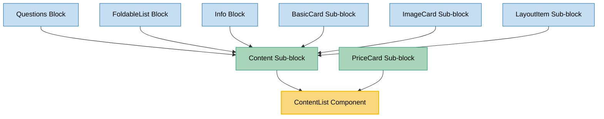

# ContentList Component Usage

This document outlines how the ContentList component is used across blocks, sub-blocks, and components in the page-constructor project.

## Overview

The ContentList component is a utility component that displays a list of content items with icons, titles, and text. Each item can have an icon (either an image or SVG), a title, and descriptive text. The component supports different sizes and theming options, making it versatile for various use cases throughout the page constructor system.

## Usage Graph



## Component Details

### ContentList Component

- **File**: `src/components/ContentList/ContentList.tsx`
- **Description**: Displays a list of content items with icons, titles, and text content.
- **Props**:
  - `list`: Array of ContentItemProps objects containing the list items (required)
  - `size`: ContentSize - `'s'` or `'l'` (defaults to `'l'`)
  - `theme`: ContentTheme - optional theme for styling
  - `qa`: Optional QA attribute for testing

### ContentItemProps Interface

- **Description**: Defines the structure of individual content list items.
- **Properties**:
  - `title`: Optional title text (supports YFM formatting)
  - `text`: Optional descriptive text (supports YFM formatting)
  - `icon`: Icon for the item - can be ThemeSupporting<ImageProps | SVGIcon> (required)

### ContentListItemIcon Component

- **File**: `src/components/ContentList/ContentListItemIcon.tsx`
- **Description**: Handles rendering of icons for content list items, supporting both images and SVG components.
- **Props**:
  - `icon`: ThemeSupporting<ImageProps | SVGIcon> - the icon to render
  - `className`: Optional CSS class name
  - `qa`: Optional QA attribute for testing

### ContentSize Type

- **Description**: Defines available sizes for the ContentList component.
- **Values**:
  - `'s'`: Small size - uses h4 headings for titles
  - `'l'`: Large size - uses h3 headings for titles (default)

## Usage Patterns

> **Note**: In the code examples below, `b()` is a utility function used throughout the page-constructor project for BEM (Block Element Modifier) class naming. It generates CSS class names following the BEM methodology, making the code more maintainable and consistent.

### In Sub-blocks

#### Content Sub-block

- **File**: `src/sub-blocks/Content/Content.tsx`
- **Usage**: Displays content lists as part of structured content blocks with theme and size support.
- **Implementation**:

  ```tsx
  {
    list?.length ? (
      <div className={b('list')}>
        <ContentList list={list} size={size} qa={qaAttributes.list} theme={theme} />
      </div>
    ) : null;
  }
  ```

#### PriceCard Sub-block

- **File**: `src/sub-blocks/PriceCard/PriceCard.tsx`
- **Usage**: Displays feature lists in pricing cards with check icons and small size.
- **Implementation**:

  ```tsx
  {
    list?.length ? (
      <div className={b('list')}>
        <ContentList
          list={list.map((item) => ({
            icon: Check,
            text: item,
          }))}
          size="s"
        />
      </div>
    ) : null;
  }
  ```

### Indirect Usage Through Content Sub-block

The ContentList component is used indirectly in many blocks and sub-blocks through the Content sub-block:

#### Questions Block

- **File**: `src/blocks/Questions/Questions.tsx`
- **Usage**: Uses Content sub-block which can include ContentList for structured question content.

#### FoldableList Block

- **File**: `src/blocks/FoldableList/FoldableList.tsx`
- **Usage**: Uses Content sub-block which can include ContentList for expandable content lists.

#### Info Block

- **File**: `src/blocks/Info/Info.tsx`
- **Usage**: Uses Content sub-block in both left and right content areas, supporting ContentList.

#### BasicCard Sub-block

- **File**: `src/sub-blocks/BasicCard/BasicCard.tsx`
- **Usage**: Uses Content sub-block which can include ContentList for card content.

#### ImageCard Sub-block

- **File**: `src/sub-blocks/ImageCard/ImageCard.tsx`
- **Usage**: Uses Content sub-block which can include ContentList alongside images.

#### LayoutItem Sub-block

- **File**: `src/sub-blocks/LayoutItem/LayoutItem.tsx`
- **Usage**: Uses Content sub-block which can include ContentList in layout structures.

## Icon Handling

The ContentList component supports flexible icon input through the ContentListItemIcon component:

### SVG Icons

```tsx
// Functional SVG component
icon: MyIconComponent;

// From @gravity-ui/icons
icon: Check;
```

### Image Icons

```tsx
// String URL
icon: "/path/to/icon.svg"

// Image object with properties
icon: {
    src: "/path/to/icon.svg",
    alt: "Icon description"
}

// Device-specific images
icon: {
    desktop: "/path/to/desktop-icon.svg",
    mobile: "/path/to/mobile-icon.svg"
}
```

### Themed Icons

```tsx
// Theme-supporting icon
icon: {
    light: "/path/to/light-icon.svg",
    dark: "/path/to/dark-icon.svg"
}

// Theme-supporting SVG
icon: {
    light: LightIconComponent,
    dark: DarkIconComponent
}
```

## Size Variations

### Large Size (Default)

- Uses `h3` headings for titles
- Larger spacing and typography
- Suitable for main content areas

### Small Size

- Uses `h4` headings for titles
- Compact spacing and typography
- Suitable for cards, sidebars, and secondary content

## Integration with Theme System

The ContentList component integrates with the page-constructor theme system:

1. **Theme Processing**: Uses `getThemedValue()` utility to resolve themed icons
2. **Image Processing**: Uses `getMediaImage()` utility to process icon image props
3. **YFM Support**: Titles and text support Yandex Flavored Markdown formatting
4. **Theme Context**: Respects the global theme context for consistent styling

## Best Practices

1. **Icon Consistency**: Use consistent icon styles throughout the list (all SVG or all images).

2. **Content Structure**: Provide meaningful titles and descriptions for accessibility.

3. **Size Selection**:

   - Use `'l'` size for main content areas and primary lists
   - Use `'s'` size for compact displays like cards and sidebars

4. **Theme Support**: Always pass the appropriate theme prop when using themed content.

5. **Accessibility**: The component automatically handles semantic structure with proper heading levels.

6. **YFM Formatting**: Leverage YFM formatting in titles and text for rich content display.

## Example Usage

### Basic Content List

```tsx
<ContentList
  list={[
    {
      icon: '/path/to/icon1.svg',
      title: 'Feature One',
      text: 'Description of the first feature',
    },
    {
      icon: '/path/to/icon2.svg',
      title: 'Feature Two',
      text: 'Description of the second feature',
    },
  ]}
  size="l"
/>
```

### Price Card Feature List

```tsx
<ContentList
  list={features.map((feature) => ({
    icon: Check,
    text: feature,
  }))}
  size="s"
/>
```

### Themed Content List

```tsx
<ContentList list={items} size="l" theme="dark" />
```

### With YFM Formatted Content

```tsx
<ContentList
  list={[
    {
      icon: MyIcon,
      title: '**Bold Title** with *emphasis*',
      text: 'Text with [link](https://example.com) and `code`',
    },
  ]}
/>
```

## Storybook Documentation

The ContentList component includes Storybook stories demonstrating:

- Default list display
- Different sizes (large and small)
- Various content configurations (with/without titles, with/without text)
- Different icon types

Stories are located in `src/components/ContentList/__stories__/ContentList.stories.tsx` with example data in `data.json`.

## Testing

The ContentList component includes comprehensive visual tests covering:

- Default rendering with various content configurations
- Size variations
- Icon rendering (both SVG and image types)
- Theme application
- YFM content formatting

Test files are located in the respective `__tests__` directories of blocks and sub-blocks that use ContentList.

## CSS Classes

The component uses BEM methodology for CSS classes:

- `.content-list` - Main container
- `.content-list_size_s` - Small size modifier
- `.content-list_size_l` - Large size modifier
- `.content-list_theme_{theme}` - Theme modifier
- `.content-list__item` - Individual list item
- `.content-list__item_without-title` - Item without title modifier
- `.content-list__icon` - Icon container
- `.content-list__title` - Title element
- `.content-list__text` - Text content element
