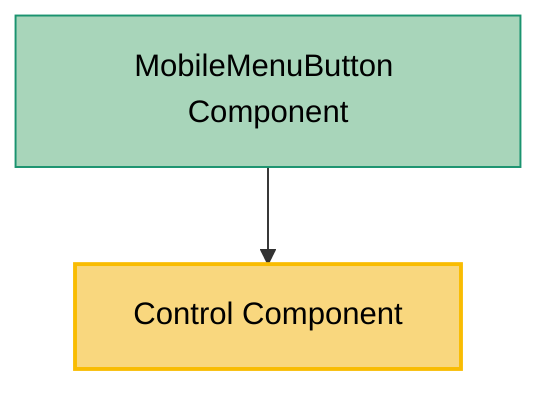

# Control Component Usage

This document outlines how the Control component is used across blocks, sub-blocks, and components in the page-constructor project.

## Overview

The Control component is a utility component that renders an icon button with various themes, sizes, and states. It's designed to provide consistent interactive controls throughout the page constructor system. The component is built on top of the Gravity UI Icon component and provides standardized styling and behavior for icon-based buttons.

## Usage Graph



## Component Details

### Control Component

- **File**: `src/components/Control/Control.tsx`
- **Description**: Renders an icon button with configurable theme, size, and interaction states.
- **Props**:
  - `icon`: IconData from Gravity UI (required) - The icon to display in the button
  - `theme`: Button theme - `'primary'` (default), `'secondary'`, `'link'`, or `'accent'`
  - `size`: Button size - `'xs'`, `'s'` (default), `'m'`, or `'l'`
  - `iconSize`: Icon size in pixels (defaults to 16)
  - `disabled`: Boolean to disable the button (defaults to false)
  - `className`: Optional CSS class name for the button
  - `onClick`: Optional click handler function
  - `qa`: Optional QA attribute for testing

### Theme Variants

The Control component supports four theme variants:

#### Primary Theme (default)

- **Color**: Complementary text color with hover to primary text color
- **Use case**: Main action buttons, primary controls

#### Secondary Theme

- **Color**: Secondary text color with hover to complementary text color
- **Use case**: Secondary actions, less prominent controls

#### Link Theme

- **Color**: Complementary text color with hover to link hover color
- **Use case**: Link-style actions, navigation controls

#### Accent Theme

- **Color**: Danger color with opacity transition on hover
- **Use case**: Destructive actions, warning controls

### Size Variants

The Control component supports four size variants:

- **xs**: 24x24 pixels
- **s**: 28x28 pixels (default)
- **m**: 32x32 pixels
- **l**: 36x36 pixels

## Usage Patterns

> **Note**: In the code examples below, `b()` is a utility function used throughout the page-constructor project for BEM (Block Element Modifier) class naming. It generates CSS class names following the BEM methodology, making the code more maintainable and consistent.

### In Navigation Components

#### MobileMenuButton Component

- **File**: `src/navigation/components/MobileMenuButton/MobileMenuButton.tsx`
- **Usage**: Provides a toggle button for mobile navigation menu with hamburger/close icons.
- **Implementation**:

  ```tsx
  import {Bars, Xmark} from '@gravity-ui/icons';
  import {Control} from '../../../components';

  const ICON_SIZE = 24;

  export const MobileMenuButton: React.FC<MobileMenuButtonProps> = ({
    isSidebarOpened,
    onSidebarOpenedChange,
  }) => (
    <Control
      className={b()}
      onClick={(e: React.MouseEvent) => {
        e.stopPropagation();
        e.nativeEvent.stopImmediatePropagation();
        onSidebarOpenedChange(!isSidebarOpened);
      }}
      size="l"
      icon={isSidebarOpened ? Xmark : Bars}
      iconSize={ICON_SIZE}
    />
  );
  ```

## Integration with Design System

The Control component integrates with the page-constructor design system:

1. **Gravity UI Integration**: Uses Gravity UI's Icon component and design tokens for consistent styling.

2. **Theme System**: Supports CSS custom properties for theming and follows the project's color system.

3. **Focus Management**: Includes proper focus styles and keyboard accessibility.

4. **Responsive Design**: Hover effects are disabled on mobile devices for better touch experience.

## Accessibility Features

The Control component includes several accessibility features:

1. **ARIA Label**: Automatically includes an internationalized aria-label for screen readers.

2. **Keyboard Support**: Full keyboard navigation support with proper focus management.

3. **Disabled State**: Proper disabled state handling with cursor and interaction changes.

4. **Focus Indicators**: Clear focus indicators for keyboard navigation.

## Internationalization

The component supports internationalization through the i18n system:

- **English**: "Button label"
- **Russian**: "Лейбл кнопки"

The aria-label is automatically localized based on the current locale.

## Best Practices

1. **Icon Selection**: Use appropriate icons from the Gravity UI icon set that clearly communicate the button's purpose.

2. **Theme Selection**:

   - Use `primary` for main actions
   - Use `secondary` for supporting actions
   - Use `link` for navigation-style actions
   - Use `accent` for destructive or warning actions

3. **Size Selection**:

   - Use `xs` for compact interfaces
   - Use `s` for standard interfaces (default)
   - Use `m` for slightly larger touch targets
   - Use `l` for prominent actions or mobile interfaces

4. **Event Handling**: Always handle click events appropriately, including stopping propagation when necessary (as shown in MobileMenuButton).

5. **Accessibility**: Ensure the default aria-label is appropriate, or consider adding custom accessibility attributes if needed.

## Example Usage

### Basic Control Button

```tsx
import {Control} from '@gravity-ui/page-constructor';
import {Plus} from '@gravity-ui/icons';

<Control icon={Plus} onClick={() => console.log('Button clicked')} />;
```

### Themed Control with Custom Size

```tsx
<Control
  icon={TrashBin}
  theme="accent"
  size="m"
  onClick={handleDelete}
  className="custom-delete-button"
/>
```

### Disabled Control

```tsx
<Control icon={Save} theme="primary" disabled={!canSave} onClick={handleSave} />
```

### Mobile Menu Toggle (Real Usage Example)

```tsx
<Control
  className={b('menu-toggle')}
  onClick={(e) => {
    e.stopPropagation();
    e.nativeEvent.stopImmediatePropagation();
    onToggleMenu();
  }}
  size="l"
  icon={isMenuOpen ? Xmark : Bars}
  iconSize={24}
/>
```

## Storybook Documentation

The Control component includes Storybook stories demonstrating:

- Default configuration
- All theme variants across all sizes
- Different icon configurations
- Interactive examples

Stories are located in `src/components/Control/__stories__/Control.stories.tsx` with example data in `data.json`.

## Testing

The Control component includes comprehensive tests covering:

- Default rendering with required props
- Theme variant application
- Size variant application
- Disabled state behavior
- Click event handling
- Icon size customization
- Custom className application

Test files are located in `src/components/Control/__tests__/Control.test.tsx`.

## CSS Implementation

The Control component uses SCSS with BEM methodology:

### Key CSS Features

1. **Flexbox Layout**: Centers the icon within the button
2. **Transition Effects**: Smooth color and opacity transitions
3. **Focus Management**: Proper focus indicators and keyboard navigation
4. **Responsive Behavior**: Hover effects disabled on mobile devices
5. **Theme Support**: CSS custom properties for consistent theming

### CSS Structure

```scss
.control {
  // Base button styles with flexbox centering
  display: flex;
  justify-content: center;
  align-items: center;

  // Size variants
  &_size_xs {
    width: 24px;
    height: 24px;
  }
  &_size_s {
    width: 28px;
    height: 28px;
  }
  &_size_m {
    width: 32px;
    height: 32px;
  }
  &_size_l {
    width: 36px;
    height: 36px;
  }

  // Theme variants with hover states
  &_theme_primary {
    /* primary theme styles */
  }
  &_theme_secondary {
    /* secondary theme styles */
  }
  &_theme_link {
    /* link theme styles */
  }
  &_theme_accent {
    /* accent theme styles */
  }

  // Disabled state
  &_disabled {
    /* disabled styles */
  }
}
```

## Integration Notes

1. **Export**: The Control component is exported from the main components index file and available as a named export.

2. **Dependencies**: Requires Gravity UI's Icon component and icon data.

3. **Styling**: Uses the project's SCSS variables and mixins for consistent styling.

4. **Testing**: Includes a test ID constant (`defaultIconId`) for consistent testing across the component.
