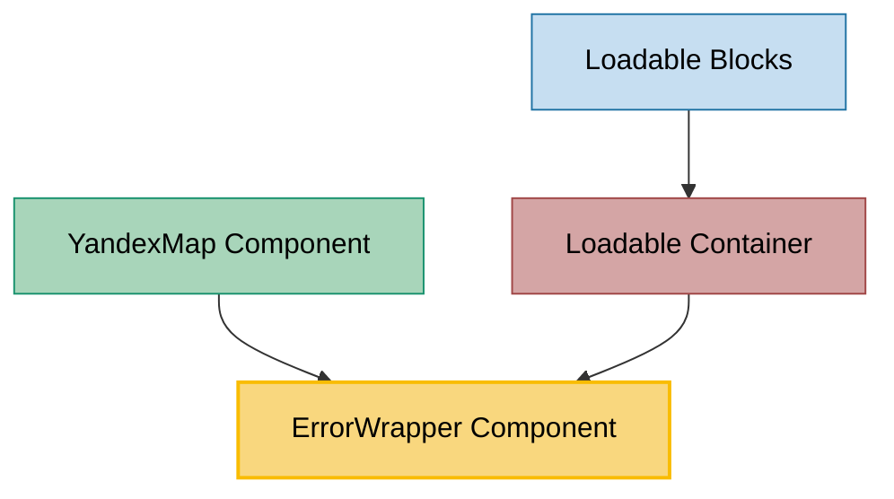

# ErrorWrapper Component Usage

This document outlines how the ErrorWrapper component is used across blocks, sub-blocks, and components in the page-constructor project.

## Overview

The ErrorWrapper component is a utility component that provides error handling and fallback UI for other components. It conditionally renders either an error state with a message and retry button, or the wrapped children components when no error occurs. This component is essential for graceful error handling throughout the page constructor system, particularly for components that involve external API calls or data loading.

## Usage Graph



## Component Details

### ErrorWrapper Component

- **File**: `src/components/ErrorWrapper/ErrorWrapper.tsx`
- **Description**: Provides error handling with fallback UI, conditionally rendering error state or children.
- **Props**:
  - `text`: Error message text to display (required)
  - `buttonText`: Text for the retry button (required)
  - `handler`: Callback function for the retry button click (required)
  - `isError`: Boolean flag indicating whether to show error state (required)
  - `children`: React nodes to render when no error occurs (required)
  - `className`: Optional CSS class name for the error container

### Error State UI

When `isError` is `true`, the component renders:

- Error message text
- Retry button (if handler is provided)
- Uses `@gravity-ui/uikit` Button component with size "s"

When `isError` is `false`, the component renders:

- Children components wrapped in React.Fragment

## Usage Patterns

> **Note**: In the code examples below, `b()` is a utility function used throughout the page-constructor project for BEM (Block Element Modifier) class naming. It generates CSS class names following the BEM methodology, making the code more maintainable and consistent.

### In Map Components

#### YandexMap Component

- **File**: `src/components/Map/YMap/YandexMap.tsx`
- **Usage**: Wraps the Yandex Map component to handle API loading errors with retry functionality.
- **Implementation**:

  ```tsx
  const [attemptsIndex, setAttemptsIndex] = React.useState<number>(0);
  const onTryAgain = React.useCallback(() => {
    setAttemptsIndex(attemptsIndex + 1);
  }, [attemptsIndex]);

  return (
    <ErrorWrapper
      isError={YMapsApiLoader.status === MapApiStatus.Error}
      text={i18n('map-load-error')}
      buttonText={i18n('map-try-again')}
      handler={onTryAgain}
      className={b('wrapper')}
    >
      <div className={b('wrapper')}>
        <div
          id={containerId}
          className={b({hidden: !ready}, className)}
          ref={ref}
          style={{height}}
        />
        {loading ? <Spin size="xl" className={b('spinner')} /> : null}
      </div>
    </ErrorWrapper>
  );
  ```

### In Container Components

#### Loadable Container

- **File**: `src/containers/Loadable/Loadable.tsx`
- **Usage**: Wraps dynamically loaded components to handle data fetching errors with retry functionality.
- **Implementation**:

  ```tsx
  const [refetchIndex, setRefetchIndex] = React.useState<number>(0);
  const onTryAgain = React.useCallback(() => {
    setRefetchIndex(refetchIndex + 1);
  }, [refetchIndex]);

  return (
    <ErrorWrapper
      isError={error}
      text={i18n('loadable-load-error')}
      buttonText={i18n('loadable-try-again')}
      handler={onTryAgain}
    >
      <Component {...block}>
        {data &&
          (Array.isArray(data) ? (
            data.map((componentData: LoadableData, index: number) => (
              <ChildComponent key={componentData.id || index} {...componentData} />
            ))
          ) : (
            <ChildComponent {...data} />
          ))}
      </Component>
    </ErrorWrapper>
  );
  ```

## Error Handling Patterns

### Retry Mechanism

Both usage examples implement a retry mechanism using state:

1. **Attempt Counter**: Track retry attempts with state (e.g., `attemptsIndex`, `refetchIndex`)
2. **Retry Handler**: Callback function that increments the counter to trigger re-execution
3. **Effect Dependencies**: Include the counter in useEffect dependencies to re-run operations

### Internationalization

Error messages are internationalized using the `i18n` function:

- **YandexMap**: Uses `i18n('map-load-error')` and `i18n('map-try-again')`
- **Loadable**: Uses `i18n('loadable-load-error')` and `i18n('loadable-try-again')`

### Error State Detection

Different components use different methods to detect errors:

- **API Status**: YandexMap checks `YMapsApiLoader.status === MapApiStatus.Error`
- **Try-Catch**: Loadable uses try-catch blocks and sets error state

## Integration with Loading States

The ErrorWrapper component works alongside loading indicators:

### YandexMap Loading Pattern

```tsx
// Loading state with spinner
{loading ? <Spin size="xl" className={b('spinner')} /> : null}

// Error wrapper around content
<ErrorWrapper isError={apiError} ...>
    {/* Map content */}
</ErrorWrapper>
```

### Loadable Loading Pattern

```tsx
// Early return for loading state
if (loading) {
    return (
        <div className={b('loader')}>
            <Spin size="xl" />
        </div>
    );
}

// Error wrapper for loaded content
<ErrorWrapper isError={error} ...>
    {/* Loaded content */}
</ErrorWrapper>
```

## Best Practices

1. **Clear Error Messages**: Provide descriptive error messages that help users understand what went wrong.

2. **Retry Functionality**: Always provide a retry mechanism for recoverable errors.

3. **State Management**: Use proper state management to track error states and retry attempts.

4. **Internationalization**: Use i18n for all user-facing text to support multiple languages.

5. **Loading States**: Combine with loading indicators for better user experience.

6. **Error Boundaries**: Use ErrorWrapper for specific component errors, not as a replacement for React Error Boundaries.

7. **Accessibility**: The component automatically provides semantic structure with proper button elements.

## Example Usage

### Basic Error Wrapper

```tsx
const [error, setError] = React.useState(false);
const [retryCount, setRetryCount] = React.useState(0);

const handleRetry = () => {
  setRetryCount(retryCount + 1);
  setError(false);
  // Trigger data refetch
};

<ErrorWrapper
  isError={error}
  text="Failed to load data"
  buttonText="Try Again"
  handler={handleRetry}
>
  <MyComponent />
</ErrorWrapper>;
```

### With Custom Styling

```tsx
<ErrorWrapper
  isError={hasError}
  text={errorMessage}
  buttonText="Retry"
  handler={onRetry}
  className="custom-error-wrapper"
>
  {children}
</ErrorWrapper>
```

### API Integration Pattern

```tsx
const [apiError, setApiError] = React.useState(false);
const [attemptIndex, setAttemptIndex] = React.useState(0);

React.useEffect(() => {
  async function loadData() {
    try {
      await apiCall();
      setApiError(false);
    } catch (error) {
      setApiError(true);
    }
  }
  loadData();
}, [attemptIndex]);

const handleRetry = () => setAttemptIndex((prev) => prev + 1);

<ErrorWrapper
  isError={apiError}
  text="Failed to load data from server"
  buttonText="Try Again"
  handler={handleRetry}
>
  <DataComponent />
</ErrorWrapper>;
```

## Testing

The ErrorWrapper component should be tested for:

- Conditional rendering based on `isError` prop
- Error message display
- Retry button functionality
- Children rendering when no error
- CSS class application

## CSS Classes

The component uses BEM methodology for CSS classes:

- `.ErrorWrapper` - Main error container
- `.ErrorWrapper__text` - Error message text
- Button styling is handled by `@gravity-ui/uikit` Button component

## Dependencies

The ErrorWrapper component depends on:

- `@gravity-ui/uikit` - For the Button component
- React - For component structure and props
- Project utilities - For BEM class naming (`block` function)
