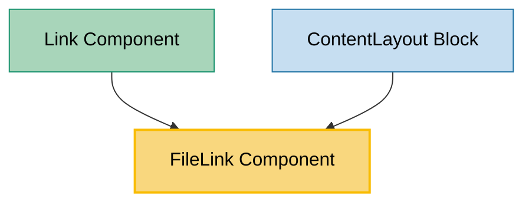

# FileLink Component Usage

This document outlines how the FileLink component is used across blocks, sub-blocks, and components in the page-constructor project.

## Overview

The FileLink component is a utility component that displays file download links with visual file type indicators. It automatically detects file extensions and applies appropriate styling and icons based on the file type. The component supports different layouts (horizontal and vertical) and theming options, making it suitable for various contexts where file downloads need to be presented.

## Usage Graph



## Component Details

### FileLink Component

- **File**: `src/components/FileLink/FileLink.tsx`
- **Description**: Displays file download links with visual file type indicators and automatic extension detection.
- **Props**:
  - `href`: File URL or path (required)
  - `text`: Link text content (required)
  - `type`: Layout type - `'vertical'` (default) or `'horizontal'`
  - `textSize`: Text size - `'xs'`, `'s'`, `'sm'`, `'m'` (default), or `'l'`
  - `theme`: Content theme - `'default'`, `'dark'`, or `'light'`
  - `className`: Optional CSS class name
  - `urlTitle`: Optional title attribute for the link
  - `onClick`: Optional click handler function
  - `tabIndex`: Optional tab index for accessibility
  - `extraProps`: Optional additional HTML anchor props

### FileExtension Enum

- **Description**: Defines supported file extensions with automatic detection.
- **Values**:
  - `PDF`: PDF documents
  - `DOC`: Word documents
  - `XLS`: Excel spreadsheets
  - `PPT`: PowerPoint presentations
  - `FIG`: Figma files (detected by URL containing figma.com)
  - `ZIP`: Archive files

### File Extension Themes

Each file extension has an associated theme color:

- **PDF**: `'danger'` (red theme)
- **DOC**: `'info'` (blue theme)
- **XLS**: `'success'` (green theme)
- **PPT**: `'warning'` (yellow theme)
- **FIG**: `'normal'` (default theme)
- **ZIP**: `'unknown'` (gray theme)

## Usage Patterns

> **Note**: In the code examples below, `b()` is a utility function used throughout the page-constructor project for BEM (Block Element Modifier) class naming. It generates CSS class names following the BEM methodology, making the code more maintainable and consistent.

### In Components

#### Link Component

- **File**: `src/components/Link/Link.tsx`
- **Usage**: Uses FileLink for `'file-link'` and `'underline'` theme types with horizontal layout.
- **Implementation**:

  ```tsx
  case 'file-link':
  case 'underline':
      return (
          <FileLink
              text={children || text}
              href={href}
              type="horizontal"
              textSize={textSize}
              onClick={onClick}
              tabIndex={tabIndex}
              extraProps={extraProps}
          />
      );
  ```

### In Blocks

#### ContentLayout Block

- **File**: `src/blocks/ContentLayout/ContentLayout.tsx`
- **Usage**: Displays file content lists with horizontal layout and size-based text sizing.
- **Implementation**:

  ```tsx
  function getFileTextSize(size: ContentSize) {
    switch (size) {
      case 's':
        return 's';
      case 'l':
      default:
        return 'l';
    }
  }

  {
    fileContent && (
      <Col className={b('files', {size, centered})} reset sizes={colSizes}>
        {fileContent.map((file) => (
          <FileLink
            className={b('file')}
            {...file}
            key={file.href}
            type="horizontal"
            textSize={getFileTextSize(size)}
            theme={theme}
          />
        ))}
      </Col>
    );
  }
  ```

## Layout Types

### Vertical Layout (Default)

The vertical layout displays the file information in a column:

- File extension label at the top
- Link text below the label
- Suitable for standalone file links

### Horizontal Layout

The horizontal layout displays the file information in a row:

- File extension label on the left
- Link text on the right
- Compact horizontal arrangement
- Suitable for file lists and inline usage

## File Extension Detection

The component automatically detects file extensions using the `getFileExt()` function:

### Standard Extensions

```tsx
// Extracts extension from filename
getFileExt('document.pdf'); // returns 'pdf'
getFileExt('spreadsheet.xls'); // returns 'xls'
```

### Special Cases

```tsx
// Figma URLs are detected specially
getFileExt('https://www.figma.com/file/abc123'); // returns 'fig'
```

### Extension Processing

- Extensions are converted to lowercase
- Unknown extensions default to 'unknown' theme
- Each extension gets a corresponding label theme color

## Text Size Mapping

The component maps text sizes to appropriate label sizes:

```tsx
const LabelSizeMap: Record<TextSize, LabelProps['size']> = {
  l: 's',
  m: 's',
  sm: 's',
  s: 'xs',
  xs: 'xs',
};
```

Special handling for 'sm' size:

- Text size 'sm' is converted to 'm' for display
- Other sizes are used as-is

## Integration with Theme System

The FileLink component integrates with the page-constructor theme system:

1. **Theme Support**: Accepts theme prop for consistent styling with parent components
2. **Location Context**: Uses LocationContext for proper link handling
3. **Link Utilities**: Uses `getLinkProps()` utility for external/internal link detection
4. **Label Component**: Uses Gravity UI Label component for file extension display

## Best Practices

1. **File Type Indication**: The component automatically provides visual file type indication, making it clear what type of file users will download.

2. **Layout Selection**:

   - Use `'vertical'` layout for standalone file links or when space allows
   - Use `'horizontal'` layout for file lists, inline usage, or compact displays

3. **Text Sizing**: Choose appropriate text size based on context:

   - Use `'l'` for prominent file links
   - Use `'s'` or `'xs'` for compact file lists

4. **Theme Consistency**: Always pass the appropriate theme prop to ensure consistent styling with the parent component.

5. **Accessibility**: The component automatically handles:

   - Proper link semantics
   - Tab navigation support
   - Title attributes for additional context

6. **File Extension Support**: The component works best with common file types (PDF, DOC, XLS, PPT, ZIP) and Figma links.

## Example Usage

### Basic File Link

```tsx
<FileLink href="/path/to/document.pdf" text="Download PDF Document" />
```

### Horizontal Layout in File List

```tsx
{
  files.map((file) => (
    <FileLink
      key={file.href}
      href={file.href}
      text={file.text}
      type="horizontal"
      textSize="s"
      theme="default"
    />
  ));
}
```

### With Custom Styling and Click Handler

```tsx
<FileLink
  href="/path/to/presentation.ppt"
  text="View Presentation"
  type="vertical"
  textSize="l"
  className="custom-file-link"
  onClick={() => trackDownload('presentation.ppt')}
  urlTitle="Download PowerPoint presentation"
/>
```

### Figma File Link

```tsx
<FileLink
  href="https://www.figma.com/file/abc123/design"
  text="View Design File"
  type="horizontal"
  textSize="m"
/>
```

## Storybook Documentation

The FileLink component includes Storybook stories demonstrating:

- Default file link display
- Different layout types (vertical and horizontal)
- Various file extensions with their themed labels
- Different text sizes and themes
- Theme variations (default, light, dark)

Stories are located in `src/components/FileLink/__stories__/FileLink.stories.tsx` with example data in `data.json`.

## Testing

The FileLink component includes comprehensive tests covering:

- File extension detection and labeling
- Layout type rendering
- Theme application
- Text size handling
- Click event handling
- Accessibility features

## File Extension Label Themes

The file extension labels use Gravity UI Label component themes:

- **PDF files**: Red danger theme
- **DOC files**: Blue info theme
- **XLS files**: Green success theme
- **PPT files**: Yellow warning theme
- **FIG files**: Default normal theme
- **ZIP files**: Gray unknown theme
- **Other extensions**: Gray unknown theme

This color coding helps users quickly identify file types before clicking.
