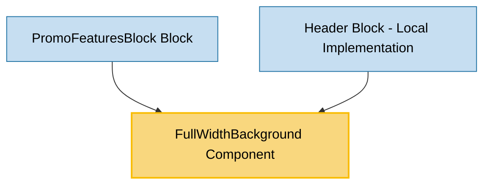

# FullWidthBackground Component Usage

This document outlines how the FullWidthBackground component is used across blocks, sub-blocks, and components in the page-constructor project.

## Overview

The FullWidthBackground component is a utility component that creates a full-width background that extends beyond its parent container boundaries. It dynamically calculates and adjusts its width and position to span the entire viewport width, making it ideal for creating full-width background sections within constrained layouts. The component supports two themes: default and rounded.

## Usage Graph



## Component Details

### FullWidthBackground Component

- **File**: `src/components/FullWidthBackground/FullWidthBackground.tsx`
- **Description**: Creates a full-width background that extends beyond parent container boundaries with dynamic width calculation.
- **Props**:
  - `className`: Optional CSS class name for additional styling
  - `style`: Optional inline styles (React.CSSProperties)
  - `theme`: Theme variant - `'default'` or `'rounded'` (defaults to `'default'`)
  - `children`: Optional child elements to render inside the background

### Theme Variants

#### Default Theme

- **Value**: `'default'`
- **Behavior**: Creates a full-width background without border radius
- **CSS Class**: `.FullWidthBackground_default`

#### Rounded Theme

- **Value**: `'rounded'`
- **Behavior**: Creates a full-width background with rounded corners and responsive padding
- **CSS Class**: `.FullWidthBackground_rounded`
- **Padding Logic**:
  - Desktop (width > 576px): 16px padding
  - Mobile (width ≤ 576px): 8px padding

## Technical Implementation

### Dynamic Width Calculation

The component uses a sophisticated approach to achieve full-width backgrounds:

1. **Parent Positioning**: Sets parent element's position to `relative`
2. **Width Calculation**: Calculates viewport width using `document.documentElement.clientWidth`
3. **Position Adjustment**: Uses `getBoundingClientRect()` to determine offset from viewport edge
4. **Responsive Padding**: Applies theme-specific padding for rounded variant
5. **Debounced Resize**: Handles window resize events with 100ms debounce for performance

### CSS Positioning

- **Position**: `absolute` with `top: 0`, `left: 0`
- **Z-Index**: `0` (behind content)
- **Pointer Events**: `none` (doesn't interfere with interactions)
- **Background**: Uses CSS custom property `--g-color-base-background`

## Usage Patterns

> **Note**: In the code examples below, `b()` is a utility function used throughout the page-constructor project for BEM (Block Element Modifier) class naming. It generates CSS class names following the BEM methodology, making the code more maintainable and consistent.

### In Blocks

#### PromoFeaturesBlock Block

- **File**: `src/blocks/PromoFeaturesBlock/PromoFeaturesBlock.tsx`
- **Usage**: Creates a themed full-width background for the entire promo features section.
- **Implementation**:

  ```tsx
  import FullWidthBackground from '../../components/FullWidthBackground/FullWidthBackground';

  const PromoFeaturesBlock = (props: PromoFeaturesProps) => {
    const {theme, animated = true} = props;
    const backgroundTheme = theme || 'default';

    return (
      <AnimateBlock className={b({[backgroundTheme]: true})} animate={animated}>
        <FullWidthBackground className={b('background', {[backgroundTheme]: true})} />
        {/* Other content */}
      </AnimateBlock>
    );
  };
  ```

#### Header Block (Local Implementation)

- **File**: `src/blocks/Header/Header.tsx`
- **Usage**: Creates a full-width background for header sections with color support.
- **Implementation**:

  ```tsx
  // Local FullWidthBackground component implementation
  interface FullWidthBackgroundProps {
    background: HeaderBlockBackground;
  }

  const FullWidthBackground = ({background}: FullWidthBackgroundProps) => (
    <div
      className={b('background', {['full-width']: true})}
      style={{backgroundColor: background?.color}}
    />
  );

  // Usage in HeaderBlock
  export const HeaderBlock = (props: HeaderBlockFullProps) => {
    const {background, theme} = props;
    const backgroundThemed = background && getThemedValue(background, theme);
    const fullWidth = backgroundThemed?.fullWidth || backgroundThemed?.fullWidthMedia;

    return (
      <header className={b({'full-width': fullWidth})}>
        {backgroundThemed && fullWidth && <FullWidthBackground background={backgroundThemed} />}
        {/* Other header content */}
      </header>
    );
  };
  ```

## Integration with Theme System

The FullWidthBackground component integrates with the page-constructor theme system:

1. **Theme Variants**: Supports `default` and `rounded` themes with different visual treatments
2. **Responsive Design**: Automatically adjusts padding based on viewport width for rounded theme
3. **CSS Custom Properties**: Uses theme-aware CSS custom properties for background colors
4. **BEM Methodology**: Follows BEM naming convention for consistent styling

## Best Practices

1. **Parent Container**: Ensure the parent container has appropriate positioning context for the absolute positioning to work correctly.

2. **Theme Selection**:

   - Use `'default'` theme for edge-to-edge backgrounds
   - Use `'rounded'` theme for backgrounds that need visual separation with rounded corners

3. **Performance**: The component automatically handles resize events with debouncing, but avoid using too many instances on a single page.

4. **Z-Index Management**: The component uses `z-index: 0` and `pointer-events: none`, ensuring it stays behind content without interfering with interactions.

5. **Styling**: Use the `style` prop for background colors and other visual properties, or apply styles through the `className` prop.

## Responsive Behavior

### Rounded Theme Padding

The rounded theme applies responsive padding:

```typescript
function getPadding(width: number) {
  return width > BREAKPOINTS.sm ? 16 : 8;
}
```

- **Desktop** (> 576px): 16px horizontal padding
- **Mobile** (≤ 576px): 8px horizontal padding

### Dynamic Width Calculation

The component recalculates its dimensions on:

- **Component Mount**: Initial positioning
- **Window Resize**: Responsive adjustment with debounced handler
- **Component Unmount**: Cleanup of event listeners

## Example Usage

### Basic Full-Width Background

```tsx
<FullWidthBackground style={{backgroundColor: '#f0f0f0'}} theme="default">
  <div>Content goes here</div>
</FullWidthBackground>
```

### Rounded Theme with Custom Styling

```tsx
<FullWidthBackground
  className="custom-background"
  style={{backgroundColor: '#ffbe5c'}}
  theme="rounded"
/>
```

### In Block Context (PromoFeaturesBlock Pattern)

```tsx
<AnimateBlock className={b({[backgroundTheme]: true})}>
  <FullWidthBackground className={b('background', {[backgroundTheme]: true})} />
  <Title title={title} subtitle={description} />
  {/* Other block content */}
</AnimateBlock>
```

## Storybook Documentation

The FullWidthBackground component includes Storybook stories demonstrating:

- Default theme with background color
- Rounded theme with background color
- Different styling approaches

Stories are located in `src/components/FullWidthBackground/__stories__/FullWidthBackground.stories.tsx` with example data in `data.json`.

## CSS Classes

The component uses BEM methodology for CSS classes:

- `.FullWidthBackground` - Base component class
- `.FullWidthBackground_default` - Default theme modifier
- `.FullWidthBackground_rounded` - Rounded theme modifier

## Browser Compatibility

The component uses modern browser APIs:

- `getBoundingClientRect()` for position calculation
- `document.documentElement.clientWidth` for viewport width
- CSS custom properties for theming
- `addEventListener` with passive option for performance

## Performance Considerations

1. **Debounced Resize**: Uses lodash debounce with 100ms delay to optimize resize handling
2. **Passive Event Listeners**: Uses passive resize listeners for better scroll performance
3. **Cleanup**: Properly removes event listeners on component unmount
4. **Minimal DOM Manipulation**: Only updates styles when necessary during resize events

## Common Use Cases

1. **Section Backgrounds**: Creating full-width colored backgrounds for content sections
2. **Hero Sections**: Full-width backgrounds for header/hero areas
3. **Feature Blocks**: Highlighted sections that need to break out of container constraints
4. **Themed Sections**: Sections that need visual separation with consistent theming

## Troubleshooting

### Background Not Full Width

- Ensure parent container has `position: relative` (automatically set by component)
- Check if container has `overflow: hidden` that might clip the background
- Verify viewport width calculation is working correctly

### Rounded Theme Not Showing Padding

- Check if viewport width detection is working
- Verify BREAKPOINTS.sm constant value (should be 576px)
- Ensure CSS border-radius is applied correctly

### Performance Issues

- Limit the number of FullWidthBackground instances per page
- Check if resize events are being handled efficiently
- Consider using CSS-only solutions for simpler cases
