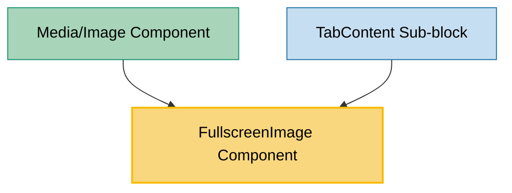

# FullscreenImage Component Usage

This document outlines how the FullscreenImage component is used across blocks, sub-blocks, and components in the page-constructor project.

## Overview

The FullscreenImage component is a utility component that displays an image with the ability to open it in fullscreen mode. It provides a clickable image with an expand icon that opens a modal dialog containing the full-size image. The component extends the standard Image component with fullscreen functionality, making it ideal for showcasing detailed images that users might want to examine more closely.

## Usage Graph



## Component Details

### FullscreenImage Component

- **File**: `src/components/FullscreenImage/FullscreenImage.tsx`
- **Description**: Displays an image with fullscreen viewing capability through a modal dialog.
- **Props** (extends ImageProps):
  - `imageClassName`: Optional CSS class name for the main image
  - `modalImageClass`: Optional CSS class name for the modal image
  - `imageStyle`: Optional inline styles for the main image
  - `extraProps`: Optional additional HTML div props for the container
  - All standard ImageProps (src, alt, etc.)

### Key Features

1. **Expand Icon**: Shows a chevron expand icon overlay on hover
2. **Modal Dialog**: Opens image in a fullscreen modal when clicked
3. **Close Button**: Provides a close button with X icon in the modal
4. **Internationalization**: Supports multiple languages for alt text and close button
5. **Accessibility**: Includes proper ARIA labels and keyboard navigation

## Usage Patterns

> **Note**: In the code examples below, `b()` is a utility function used throughout the page-constructor project for BEM (Block Element Modifier) class naming. It generates CSS class names following the BEM methodology, making the code more maintainable and consistent.

### In Components

#### Media/Image Component

- **File**: `src/components/Media/Image/Image.tsx`
- **Usage**: Renders fullscreen-capable images in media blocks when fullscreen option is enabled.
- **Implementation**:

  ```tsx
  const renderFullscreenImage = (item: ImageProps) => {
    const itemData = getMediaImage(item);
    return (
      <FullscreenImage key={itemData.alt} {...itemData} imageClassName={b('image', {border})} />
    );
  };

  // Usage in render
  {
    fullscreenItem ? renderFullscreenImage(item) : imageOnly(item);
  }

  // For single image with fullscreen
  if (fullscreen) {
    return renderFullscreenImage(image);
  }
  ```

### In Sub-blocks

#### TabContent Sub-block

- **File**: `src/blocks/Tabs/TabContent/TabContent.tsx`
- **Usage**: Displays fullscreen-capable images within tab content areas.
- **Implementation**:

  ```tsx
  <FullscreenImage {...imageProps} imageClassName={b('image', {border})} />
  ```

## Component Architecture

### State Management

The component uses React's `useState` to manage the modal open/close state:

```tsx
const [isOpened, setIsOpened] = React.useState(false);

const openModal = () => setIsOpened(true);
const closeModal = () => setIsOpened(false);
```

### Icon Integration

Uses icons from `@gravity-ui/icons`:

- **Expand Icon**: `ChevronsExpandUpRight` (18px) - shown on image hover
- **Close Icon**: `Xmark` (24px) - shown in modal header

### Modal Implementation

Utilizes `@gravity-ui/uikit` Modal component with:

- Custom CSS classes for styling
- Proper close handling
- Accessibility features

## Internationalization Support

The component supports multiple languages through the i18n system:

### English (en.json)

```json
{
  "img-alt": "Full screen image",
  "close": "Close"
}
```

### Russian (ru.json)

```json
{
  "img-alt": "Полноэкранное изображение",
  "close": "Закрыть"
}
```

## Integration with Image System

The FullscreenImage component integrates seamlessly with the page-constructor image system:

1. **Image Props**: Extends all standard ImageProps for consistency
2. **Theme Support**: Inherits theme support from the base Image component
3. **Media Processing**: Works with `getMediaImage()` utility for image processing
4. **Responsive Images**: Supports device-specific and responsive image configurations

## Best Practices

1. **Alt Text**: Always provide meaningful alt text for accessibility. The component provides a default localized alt text if none is specified.

2. **Image Sizing**: Use appropriate image sizes for both the thumbnail and fullscreen versions to optimize loading performance.

3. **Modal Styling**: Use `modalImageClass` to apply specific styling to the fullscreen version of the image.

4. **Container Styling**: Use `imageClassName` and `imageStyle` to control the appearance of the thumbnail image.

5. **Accessibility**: The component automatically handles:
   - ARIA labels for the close button
   - Keyboard navigation in the modal
   - Focus management

## Example Usage

### Basic Fullscreen Image

```tsx
<FullscreenImage src="/path/to/image.jpg" alt="Detailed diagram" />
```

### With Custom Styling

```tsx
<FullscreenImage
  src="/path/to/image.jpg"
  alt="Product screenshot"
  imageClassName="custom-thumbnail"
  modalImageClass="custom-fullscreen"
  imageStyle={{maxWidth: '300px'}}
/>
```

### In Media Block Context

```tsx
const imageProps = getMediaImage(item);
<FullscreenImage {...imageProps} imageClassName={b('image', {border: true})} />;
```

### With Additional Container Props

```tsx
<FullscreenImage
  src="/path/to/image.jpg"
  alt="Architecture diagram"
  extraProps={{
    'data-testid': 'fullscreen-image',
    onMouseEnter: handleMouseEnter,
  }}
/>
```

## Accessibility Features

1. **ARIA Labels**: Close button includes proper aria-label
2. **Keyboard Navigation**: Modal supports standard keyboard navigation
3. **Focus Management**: Focus is properly managed when modal opens/closes
4. **Alt Text**: Provides meaningful alt text for screen readers
5. **Button Semantics**: Uses proper button elements for interactive elements
