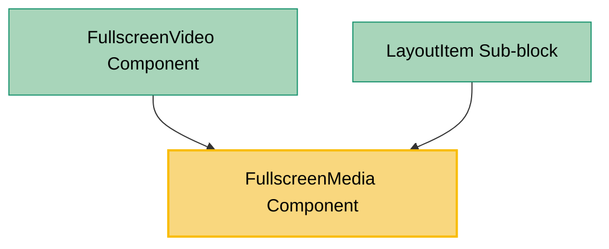

# FullscreenMedia Component Usage

This document outlines how the FullscreenMedia component is used across blocks, sub-blocks, and components in the page-constructor project.

## Overview

The FullscreenMedia component is a utility component that provides fullscreen modal functionality for media content. It wraps child media components and displays them in a modal overlay when clicked, with a fullscreen expand icon for user interaction. The component automatically disables fullscreen functionality on mobile devices and provides smooth modal transitions with proper accessibility controls.

## Usage Graph



## Component Details

### FullscreenMedia Component

- **File**: `src/components/FullscreenMedia/FullscreenMedia.tsx`
- **Description**: Wraps child media components and provides fullscreen modal functionality with expand/close controls.
- **Props**:
  - `showFullscreenIcon`: Boolean to show/hide the fullscreen expand icon (defaults to true)
  - `children`: Function that receives ChildMediaRenderProps and returns JSX.Element (required)

### ChildMediaRenderProps Interface

- **Description**: Props passed to the children render function for media customization.
- **Properties**:
  - `fullscreen`: Boolean indicating if the media is in fullscreen mode
  - `imageClassName`: Optional CSS class name for images in fullscreen
  - `videoClassName`: Optional CSS class name for videos in fullscreen
  - `youtubeClassName`: Optional CSS class name for YouTube videos in fullscreen
  - `className`: Optional CSS class name for the media container
  - `previewImg`: Preview image (undefined in fullscreen mode)
  - `autoplay`: Boolean to enable autoplay in fullscreen mode

## Usage Patterns

> **Note**: In the code examples below, `b()` is a utility function used throughout the page-constructor project for BEM (Block Element Modifier) class naming. It generates CSS class names following the BEM methodology, making the code more maintainable and consistent.

### Direct Usage

#### FullscreenVideo Component

- **File**: `src/components/Media/FullscreenVideo/FullscreenVideo.tsx`
- **Usage**: Wraps Video component to provide fullscreen functionality for video content.
- **Implementation**:

  ```tsx
  const FullscreenVideo: React.FC<VideoAllProps> = (props) => {
    return (
      <FullscreenMedia>{(classNames) => <Video {...props} {...classNames} />}</FullscreenMedia>
    );
  };
  ```

#### LayoutItem Sub-block

- **File**: `src/sub-blocks/LayoutItem/LayoutItem.tsx`
- **Usage**: Conditionally wraps Media component with fullscreen functionality based on media type and fullscreen prop.
- **Implementation**:

  ```tsx
  const renderMedia = () => {
    if (!media) {
      return null;
    }
    const themedMedia = getThemedValue(media, theme);
    const {title} = content;
    const mediaWithMicrodata = mergeVideoMicrodata(themedMedia, {
      name: typeof title === 'string' ? title : title?.text,
      description: content.text,
    });

    return fullscreen && hasFullscreen(themedMedia) ? (
      <FullscreenMedia showFullscreenIcon={showFullscreenIcon(themedMedia)}>
        {({className: mediaClassName, fullscreen: _fullscreen, ...fullscreenMediaProps} = {}) => (
          <Media
            {...mediaWithMicrodata}
            {...fullscreenMediaProps}
            className={b('media', {border}, mediaClassName)}
            analyticsEvents={analyticsEvents}
          />
        )}
      </FullscreenMedia>
    ) : (
      <Media {...themedMedia} className={b('media', {border})} analyticsEvents={analyticsEvents} />
    );
  };
  ```

## Integration with Mobile Context

The FullscreenMedia component integrates with the MobileContext to provide responsive behavior:

1. **Mobile Detection**: Uses `React.useContext(MobileContext)` to detect mobile devices
2. **Mobile Behavior**: On mobile devices, the component renders children directly without fullscreen functionality
3. **Desktop Behavior**: On desktop, provides full modal functionality with expand/close controls

## Modal Functionality

### Modal Features

1. **Expand Icon**: Shows a `ChevronsExpandUpRight` icon for opening fullscreen mode
2. **Close Icon**: Shows an `Xmark` icon for closing fullscreen mode
3. **Click to Open**: Clicking on the media wrapper opens the modal
4. **Backdrop Close**: Clicking outside the modal content closes it
5. **Escape Key**: Standard modal behavior for keyboard navigation

### Modal Styling

The component applies specific CSS classes for modal content:

- **Image**: `.full-screen-media__modal-media_type_image`
- **Video**: `.full-screen-media__modal-media_type_video`
- **YouTube**: `.full-screen-media__modal-media_type_youtube`

## Utility Functions

### hasFullscreen Function

- **File**: `src/sub-blocks/LayoutItem/utils.ts`
- **Purpose**: Determines if media content supports fullscreen functionality
- **Usage**: Checks media type and properties to enable/disable fullscreen

### showFullscreenIcon Function

- **File**: `src/sub-blocks/LayoutItem/utils.ts`
- **Purpose**: Determines if the fullscreen expand icon should be displayed
- **Usage**: Controls icon visibility based on media configuration

## Best Practices

1. **Mobile Considerations**: The component automatically handles mobile behavior by disabling fullscreen functionality on mobile devices.

2. **Media Type Support**: Primarily designed for video content, but can work with any media that benefits from fullscreen viewing.

3. **Icon Visibility**: Use `showFullscreenIcon` prop to control when the expand icon appears based on content type and user preferences.

4. **Accessibility**: The component provides proper modal behavior with focus management and keyboard navigation.

5. **Performance**: Modal content is only rendered when opened, improving initial page load performance.

6. **Event Handling**: Uses `onClickCapture` to prevent event bubbling and ensure proper modal triggering.

## Example Usage

### Basic Fullscreen Video

```tsx
<FullscreenMedia>{(classNames) => <Video {...videoProps} {...classNames} />}</FullscreenMedia>
```

### Conditional Fullscreen in LayoutItem

```tsx
{
  fullscreen && hasFullscreen(media) ? (
    <FullscreenMedia showFullscreenIcon={showFullscreenIcon(media)}>
      {(fullscreenProps) => <Media {...media} {...fullscreenProps} />}
    </FullscreenMedia>
  ) : (
    <Media {...media} />
  );
}
```

### Custom Media with Fullscreen

```tsx
<FullscreenMedia showFullscreenIcon={true}>
  {({fullscreen, autoplay, className} = {}) => (
    <CustomMediaComponent
      fullscreen={fullscreen}
      autoplay={autoplay}
      className={className}
      {...otherProps}
    />
  )}
</FullscreenMedia>
```

## Storybook Documentation

The FullscreenMedia component includes Storybook stories demonstrating:

- Default fullscreen behavior with media content
- Modal interaction and controls
- Mobile responsive behavior

Stories are located in `src/components/FullscreenMedia/__stories__/FullscreenMedia.stories.tsx` with example data in `data.json`.

## Testing

The FullscreenMedia component should be tested for:

- Modal opening and closing functionality
- Mobile device behavior (no fullscreen)
- Icon visibility and interaction
- Keyboard navigation and accessibility
- Integration with different media types

## CSS Classes

The component uses BEM methodology for CSS classes:

- `.full-screen-media` - Main container
- `.full-screen-media__media-wrapper` - Media wrapper with click handler
- `.full-screen-media__inline-media` - Inline media display
- `.full-screen-media__icon-wrapper` - Icon button container
- `.full-screen-media__icon` - Icon styling
- `.full-screen-media__icon_hover` - Icon hover state
- `.full-screen-media__modal` - Modal container
- `.full-screen-media__modal-content` - Modal content area
- `.full-screen-media__modal-media_type_{type}` - Media type-specific styling
