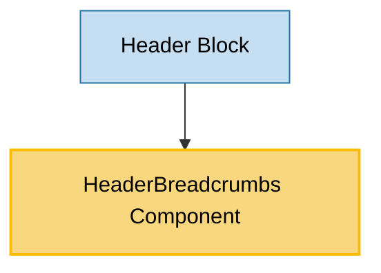

# HeaderBreadcrumbs Component Usage

This document outlines how the HeaderBreadcrumbs component is used across blocks, sub-blocks, and components in the page-constructor project.

## Overview

The HeaderBreadcrumbs component is a navigation utility component that displays breadcrumb navigation links. It renders a hierarchical list of links showing the user's current location within the site structure. The component supports theming and analytics tracking, making it suitable for use in header sections and other navigation contexts.

## Usage Graph



## Component Details

### HeaderBreadcrumbs Component

- **File**: `src/components/HeaderBreadcrumbs/HeaderBreadcrumbs.tsx`
- **Description**: Displays a breadcrumb navigation list with clickable links and separators.
- **Props**:
  - `items`: Array of breadcrumb items with `url` and `text` properties (required)
  - `theme`: Text theme - `'light'` (default) or `'dark'`
  - `className`: Optional CSS class name for the container
  - `analyticsEvents`: Optional analytics events configuration for tracking clicks

### HeaderBreadCrumbsProps Interface

- **Description**: Defines the structure of HeaderBreadcrumbs component props.
- **Properties**:
  - `items`: Array of objects with `url` (string) and `text` (React.ReactNode) properties (required)
  - `theme`: Optional TextTheme - `'light'` or `'dark'`
  - `className`: Optional CSS class name
  - `analyticsEvents`: Optional AnalyticsEventsProp for tracking user interactions

### Breadcrumb Item Structure

- **Description**: Each breadcrumb item contains navigation information.
- **Properties**:
  - `url`: String URL for the breadcrumb link (required)
  - `text`: React.ReactNode content for the breadcrumb text (required)

## Usage Patterns

> **Note**: In the code examples below, `b()` is a utility function used throughout the page-constructor project for BEM (Block Element Modifier) class naming. It generates CSS class names following the BEM methodology, making the code more maintainable and consistent.

### In Blocks

#### Header Block

- **File**: `src/blocks/Header/Header.tsx`
- **Usage**: Displays breadcrumb navigation at the top of header sections with theme support.
- **Implementation**:

  ```tsx
  {
    breadcrumbs && (
      <Row className={b('breadcrumbs')}>
        <Col>
          <HeaderBreadcrumbs {...breadcrumbs} theme={textTheme} />
        </Col>
      </Row>
    );
  }
  ```

- **Context**: The breadcrumbs are rendered conditionally when the `breadcrumbs` prop is provided to the Header block. The component inherits the text theme from the header's theme configuration.

## Integration with Analytics System

The HeaderBreadcrumbs component integrates with the page-constructor analytics system:

1. **Click Tracking**: Uses the `useAnalytics` hook with `DefaultEventNames.Breadcrumb` to track breadcrumb clicks.

2. **Event Handling**: All breadcrumb links trigger the same analytics event when clicked, allowing for consistent tracking of navigation behavior.

3. **Custom Events**: Supports custom analytics events through the `analyticsEvents` prop for specific tracking requirements.

## Accessibility Features

The HeaderBreadcrumbs component includes several accessibility features:

1. **Semantic HTML**: Uses `<nav>` element with `aria-label` for screen readers.

2. **Structured List**: Implements breadcrumbs as an ordered list (`<ol>`) with list items (`<li>`).

3. **Separator Handling**: Uses `aria-hidden` on separators to prevent screen readers from announcing them.

4. **Internationalization**: Supports localized aria-label through the i18n system.

## Theming Support

The HeaderBreadcrumbs component supports theming through the `theme` prop:

### Light Theme (Default)

- Uses standard text colors for links
- Applied via `.header-breadcrumbs_theme_light` class

### Dark Theme

- Uses light text colors for better contrast on dark backgrounds
- Applied via `.header-breadcrumbs_theme_dark` class

## Best Practices

1. **Hierarchical Structure**: Ensure breadcrumb items represent a logical hierarchy from general to specific.

2. **Link Validity**: All breadcrumb URLs should be valid and accessible navigation targets.

3. **Text Content**: Use clear, descriptive text for breadcrumb items that accurately represent the page or section.

4. **Theme Consistency**: Always pass the appropriate theme prop to ensure consistent styling with the parent component.

5. **Analytics Configuration**: Configure analytics events appropriately to track user navigation patterns.

6. **Accessibility**: The component handles most accessibility concerns automatically, but ensure meaningful link text.

## Example Usage

### Basic Breadcrumbs

```tsx
<HeaderBreadcrumbs
  items={[
    {url: '/', text: 'Home'},
    {url: '/products', text: 'Products'},
    {url: '/products/laptops', text: 'Laptops'},
  ]}
  theme="light"
/>
```

### In Header Block

```tsx
<HeaderBlock
  title="Product Details"
  breadcrumbs={{
    items: [
      {url: '/', text: 'Home'},
      {url: '/catalog', text: 'Catalog'},
      {url: '/catalog/electronics', text: 'Electronics'},
    ],
    theme: 'dark',
  }}
  theme="dark"
/>
```

### With Analytics Tracking

```tsx
<HeaderBreadcrumbs
  items={breadcrumbItems}
  theme="light"
  analyticsEvents={{
    name: 'breadcrumb_click',
    params: {section: 'header'},
  }}
/>
```

### With React Node Text

```tsx
<HeaderBreadcrumbs
  items={[
    {url: '/', text: 'Home'},
    {
      url: '/products',
      text: (
        <span>
          Products <Badge>New</Badge>
        </span>
      ),
    },
  ]}
/>
```

## Storybook Documentation

The HeaderBreadcrumbs component includes Storybook stories demonstrating:

- Default breadcrumb display
- Different theme variations
- Various breadcrumb configurations

Stories are located in `src/components/HeaderBreadcrumbs/__stories__/HeaderBreadcrumbs.stories.tsx` with example data in `data.json`.

## Internationalization

The component supports internationalization through the i18n system:

- **Aria Label**: The navigation aria-label is localized using the `i18n('label')` function
- **Language Files**: Supports English and Russian translations in `i18n/en.json` and `i18n/ru.json`
- **Namespace**: Uses the `HeaderBreadcrumbs` namespace for translation keys

## CSS Classes

The component uses BEM methodology for CSS classes:

- `.header-breadcrumbs` - Main container (nav element)
- `.header-breadcrumbs_theme_light` - Light theme modifier
- `.header-breadcrumbs_theme_dark` - Dark theme modifier
- `.header-breadcrumbs__list` - Ordered list container
- `.header-breadcrumbs__item` - Individual breadcrumb item (li element)
- `.header-breadcrumbs__text` - Breadcrumb link text (a element)
- `.header-breadcrumbs__separator` - Separator between breadcrumbs (span element)

## Integration Context

The HeaderBreadcrumbs component is primarily used within the Header block to provide navigation context:

1. **Header Integration**: Seamlessly integrates with the Header block's layout and theming system
2. **Grid System**: Works within the page-constructor grid system for proper layout
3. **Theme Inheritance**: Automatically inherits theme settings from parent components
4. **Responsive Design**: Adapts to different screen sizes through CSS styling

## Testing

The HeaderBreadcrumbs component can be tested for:

- Proper rendering of breadcrumb items
- Theme application
- Analytics event firing
- Accessibility attributes
- Link functionality
- Internationalization support

The component follows the standard testing patterns used throughout the page-constructor project.
