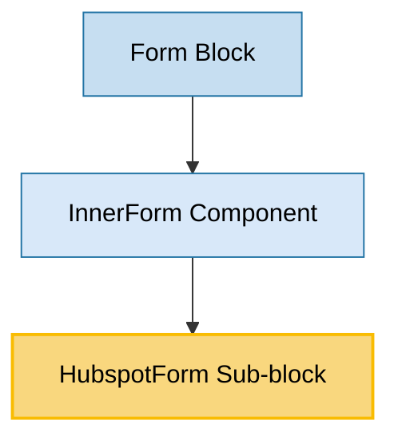

# HubspotForm Sub-block Usage

This document outlines the HubspotForm sub-block in the page-constructor project.

## Overview

The HubspotForm sub-block is a component that integrates Hubspot forms into the page-constructor. It allows embedding Hubspot forms with customizable styling, event handling, and analytics tracking. The component handles loading the Hubspot script, rendering the form, and providing hooks for form events.

## Usage Graph



## Component Details

### HubspotForm Sub-block

- **File**: `src/sub-blocks/HubspotForm/index.tsx`
- **Description**: Integrates Hubspot forms into the page-constructor.
- **Props**:
  - `className?: string` - Form wrapper class
  - `theme?: ContentTheme` - Theme for the form ('default', 'dark', or 'light')
  - `isMobile?: boolean` - Whether the form is displayed on a mobile device
  - `region?: string` - Hubspot region (e.g., 'eu1', 'na1')
  - `portalId: string` - Hubspot portal ID (required)
  - `formId: string` - Hubspot form ID (required)
  - `formInstanceId?: string` - Unique ID for the form instance (used when multiple instances of the same form are on a page)
  - `formClassName?: string` - Class name for the form element
  - `analyticsEvents?: AnalyticsEventsBase` - Analytics events to track
  - `onBeforeLoad?: (arg: HubspotEventData) => void` - Callback for the 'onBeforeFormInit' event
  - `onBeforeSubmit?: (arg: HubspotEventData) => void` - Callback for the 'onFormSubmit' event
  - `onSubmit?: (arg: HubspotEventData) => void` - Callback for the 'onFormSubmitted' event
  - `onLoad?: (arg: HubspotEventData) => void` - Callback for the 'onFormReady' event
  - `onSubmitError?: (arg: HubspotEventData) => void` - Callback for the 'onFormError' event
  - `hubspotEvents?: string[]` - An array of Hubspot events to listen for
  - `createDOMElement?: boolean` - If true, a container will be created using `document.createElement` to insert the Hubspot form (default is false)
  - `defaultValues?: HubspotFormDefaultValues` - Default values for form fields

## Implementation Details

The HubspotForm component is implemented as a React component that loads the Hubspot Forms script and renders a form container:

```tsx
const HubspotForm = React.forwardRef<HTMLDivElement, HubspotFormProps>((props, ref) => {
  const {
    className,
    theme: themeProp,
    isMobile: isMobileProp,
    formId,
    formInstanceId,
    portalId,
    region,
    formClassName,
    analyticsEvents,
    onBeforeSubmit,
    onSubmit,
    onBeforeLoad,
    onLoad,
    createDOMElement,
    onSubmitError,
    defaultValues,
  } = props;

  const themeValue = useTheme();
  const handleAnalytics = useAnalytics(DefaultEventNames.HubspotFormSubmit);
  const isMobileValue = React.useContext(MobileContext);

  const theme = themeProp ?? themeValue;
  const mobile = isMobileProp ?? isMobileValue;

  const handlers = React.useMemo<HubspotEventHandlers>(
    () => ({
      onBeforeLoad,
      onBeforeSubmit,
      onLoad,
      onSubmitError,
      onSubmit: (event) => {
        handleAnalytics(analyticsEvents);
        onSubmit?.(event);
      },
    }),
    [
      onBeforeLoad,
      onBeforeSubmit,
      onLoad,
      handleAnalytics,
      analyticsEvents,
      onSubmit,
      onSubmitError,
    ],
  );

  useHandleHubspotEvents(handlers, formId);
  return (
    <HubspotFormContainer
      createDOMElement={createDOMElement}
      key={[formClassName, formId, formInstanceId, portalId, region].join()}
      className={b({theme, mobile}, className)}
      formClassName={formClassName}
      formId={formId}
      portalId={portalId}
      formInstanceId={formInstanceId}
      region={region}
      defaultValues={defaultValues}
      ref={ref}
    />
  );
});
```

### HubspotFormContainer

The HubspotFormContainer component handles the actual rendering of the Hubspot form:

```tsx
const HubspotFormContainer = React.forwardRef<HTMLDivElement, HubspotFormContainerProps>(
  (props, ref) => {
    const {
      className,
      formId,
      formInstanceId,
      portalId,
      region,
      formClassName,
      createDOMElement,
      defaultValues,
    } = props;

    const containerRef = React.useRef<HTMLDivElement>(null);
    const hsContainerRef = React.useRef<HTMLDivElement>();

    React.useImperativeHandle(ref, () => containerRef.current!);

    const containerId = formInstanceId
      ? `hubspot-form-${formId}-${formInstanceId}`
      : `hubspot-form-${formId}`;

    const createForm = () => {
      if (containerRef.current && !hsContainerRef.current && createDOMElement) {
        hsContainerRef.current = document.createElement('div');
        containerRef.current.id = '';
        hsContainerRef.current.id = containerId;
        containerRef.current.appendChild(hsContainerRef.current);
      }

      if (!createDOMElement || hsContainerRef.current) {
        if (window.hbspt) {
          window.hbspt.forms.create({
            region,
            portalId,
            formId,
            target: `#${containerId}`,
            cssClass: formClassName,
            formInstanceId,
            onFormReady: defaultValues
              ? (form) => setHubspotDefaultValues(form, defaultValues)
              : undefined,
          });
        }
      }
    };

    useMount(() => {
      (async () => {
        if (!window.hbspt) {
          await loadHubspotScript();
        }

        createForm();
      })();

      return () => {
        if (createDOMElement && containerRef.current && containerRef.current.lastChild) {
          containerRef.current.removeChild(containerRef.current.lastChild);
        }
      };
    });

    return <div className={className} id={containerId} ref={containerRef} />;
  },
);
```

### Script Loading

The component uses a utility function to load the Hubspot Forms script:

```typescript
const loadHubspotScript = async () => {
  if (scriptPromise) {
    return scriptPromise;
  } else {
    scriptPromise = new Promise((resolve, reject) => {
      const script = document.createElement('script');
      script.src = '//js-eu1.hsforms.net/forms/v2.js';
      script.onload = (event) => {
        resolve(event);
      };
      script.onerror = (event) => {
        script?.parentNode?.removeChild(script);
        reject(event);
      };

      document.head.appendChild(script);
    });
    return scriptPromise;
  }
};
```

### Default Values

The component supports setting default values for form fields using the `defaultValues` prop:

```typescript
export const setHubspotDefaultValues = (
  form: HTMLFormElement,
  defaultValues: HubspotFormDefaultValues,
) => {
  Object.entries(defaultValues).forEach(([name, value]) => {
    const inputs = Array.from(form.querySelectorAll(`[name="${name}"]`));
    setValue(inputs, value);
  });
};
```

## Integration with Other Components

### InnerForm Component

The HubspotForm sub-block is used by the InnerForm component to render Hubspot forms:

```tsx
if (isHubspotDataForm(formData)) {
  const themedFormData = getThemedValue(formData.hubspot, theme);

  return (
    <HubspotForm
      createDOMElement={true}
      {...(formsConfig.hubspot as HubspotFormsContextProps | undefined)}
      {...themedFormData}
    />
  );
}
```

### Form Block

The Form block uses the InnerForm component to render forms, including Hubspot forms:

```tsx
<InnerForm className={b('form')} formData={formData} onContentLoad={onContentLoad} />
```

## Event Handling

The HubspotForm component supports handling various form events:

- **onBeforeLoad**: Called before the form is initialized
- **onLoad**: Called when the form is ready
- **onBeforeSubmit**: Called before the form is submitted
- **onSubmit**: Called after the form is submitted
- **onSubmitError**: Called when there's an error submitting the form

These events are mapped to the corresponding Hubspot form events:

```typescript
export function handleHubspotEvents(handlers: HubspotEventHandlers, formId: string) {
  return ({data}: MessageEvent): void => {
    if (!isHubspotEventData(data)) {
      return;
    }

    if (data.id !== formId) {
      return;
    }

    switch (data.eventName) {
      case 'onBeforeFormInit': {
        handlers.onBeforeLoad?.(data);
        break;
      }
      case 'onFormReady': {
        handlers.onLoad?.(data);
        break;
      }
      case 'onFormSubmit': {
        handlers.onBeforeSubmit?.(data);
        break;
      }
      case 'onFormSubmitted': {
        handlers.onSubmit?.(data);
        break;
      }
      case 'onFormError': {
        handlers.onSubmitError?.(data);
        break;
      }
      default:
        break;
    }
  };
}
```

## Analytics Integration

The HubspotForm component integrates with the page-constructor analytics system:

```tsx
const handleAnalytics = useAnalytics(DefaultEventNames.HubspotFormSubmit);

// ...

onSubmit: (event) => {
    handleAnalytics(analyticsEvents);
    onSubmit?.(event);
},
```

## Theme Support

The HubspotForm component supports theming through the `theme` prop:

```tsx
const theme = themeProp ?? themeValue;
// ...
className={b({theme, mobile}, className)}
```

## Best Practices

1. **Required Props**: Always provide the required `portalId` and `formId` props.

2. **Region**: Specify the correct Hubspot region for your account (e.g., 'eu1', 'na1').

3. **Form Instance ID**: Use a unique `formInstanceId` when you have multiple instances of the same form on a page.

4. **Event Handling**: Implement event handlers for form events to provide a better user experience and track form interactions.

5. **Default Values**: Use the `defaultValues` prop to pre-fill form fields with default values.

6. **Analytics**: Use the `analyticsEvents` prop to track form submissions and other interactions.

7. **Styling**: Use the `formClassName` prop to apply custom styles to the form.

## Example Usage

### Basic Hubspot Form

```tsx
<HubspotForm portalId="25764979" formId="a3eb06a6-e8ce-45d4-81bd-7fadb7dab313" region="eu1" />
```

### Hubspot Form with Event Handlers

```tsx
<HubspotForm
  portalId="25764979"
  formId="a3eb06a6-e8ce-45d4-81bd-7fadb7dab313"
  region="eu1"
  onBeforeLoad={() => console.log('Form is initializing')}
  onLoad={() => console.log('Form is ready')}
  onBeforeSubmit={() => console.log('Form is being submitted')}
  onSubmit={() => console.log('Form was submitted')}
  onSubmitError={() => console.log('Error submitting form')}
/>
```

### Hubspot Form with Default Values

```tsx
<HubspotForm
  portalId="25764979"
  formId="a3eb06a6-e8ce-45d4-81bd-7fadb7dab313"
  region="eu1"
  defaultValues={{
    email: 'example@example.com',
    firstname: 'John',
    lastname: 'Doe',
    company: 'Example Company',
  }}
/>
```

### Hubspot Form with Custom Styling

```tsx
<HubspotForm
  portalId="25764979"
  formId="a3eb06a6-e8ce-45d4-81bd-7fadb7dab313"
  region="eu1"
  formClassName="custom-form-class"
  className="custom-wrapper-class"
/>
```

## Storybook Documentation

The HubspotForm component includes Storybook stories demonstrating:

- Default form display
- Form with event handlers
- Form with custom styling

Stories are located in `src/sub-blocks/HubspotForm/__stories__/HubspotForm.stories.tsx`.
