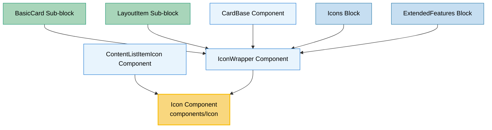

# Icon Component Usage

This document outlines how the Icon component is used across blocks, sub-blocks, and components in the page-constructor project.

## Overview

The Icon component is a universal icon rendering component that supports both Gravity UI icons (from `@gravity-ui/icons`) and custom image-based icons. It provides a unified interface for displaying icons with theme support, color customization, and responsive image handling. The component automatically handles the rendering logic based on the provided props, choosing between Gravity UI icons and image-based icons.

## Usage Graph



## Component Details

### Icon Component

- **File**: `src/components/Icon/Icon.tsx`
- **Description**: Universal icon component that renders either Gravity UI icons or image-based icons with theme support.
- **Props**:
  - `gravityIcon`: GravityIconProps - Gravity UI icon configuration (string or object with name and color)
  - `icon`: ImageProps - Image-based icon (string URL, ImageObjectProps, or ImageDeviceProps)
  - `className`: string - CSS class for the icon element
  - `containerClassName`: string - CSS class for the icon container (used with image icons)
  - `qa`: string - QA attribute for testing

### GravityIconProps Type

- **Description**: Configuration for Gravity UI icons from `@gravity-ui/icons` library.
- **Type Definition**:
  ```typescript
  type GravityIconProps =
    | string
    | {
        name: keyof typeof icons;
        color: 'brand' | 'text-color';
      };
  ```
- **Usage**:
  - **String format**: Direct icon name (uses 'brand' color by default)
  - **Object format**: Allows specifying both icon name and color theme

### ImageProps Type

- **Description**: Configuration for image-based icons with responsive support.
- **Type Definition**:
  ```typescript
  type ImageProps = string | ImageObjectProps | ImageDeviceProps;
  ```
- **Supports**: Device-specific images, WebP compression, accessibility features

### Key Features

1. **Dual Icon Support**: Handles both Gravity UI icons and custom image icons
2. **Theme Integration**: Supports 'brand' and 'text-color' themes for Gravity icons
3. **Responsive Images**: Image icons support device-specific variants (desktop, tablet, mobile)
4. **Automatic Selection**: Chooses appropriate rendering method based on provided props
5. **Accessibility**: Proper QA attributes and semantic HTML structure
6. **Performance**: Leverages Gravity UI's optimized icon system and image compression

## Usage Patterns

> **Note**: In the code examples below, `b()` is a utility function used throughout the page-constructor project for BEM (Block Element Modifier) class naming. It generates CSS class names following the BEM methodology, making the code more maintainable and consistent.

### In Components

#### ContentListItemIcon Component

- **File**: `src/components/ContentList/ContentListItemIcon.tsx`
- **Usage**: Renders icons in content lists with theme support and SVG icon fallback.
- **Implementation**:

  ```tsx
  import Icon from '../Icon/Icon';

  const ContentListItemIcon = ({icon, className, qa, gravityIcon}: ListItemProps) => {
    const theme = useTheme();
    const iconThemed = getThemedValue(icon, theme);
    const gravityIconThemed = getThemedValue(gravityIcon, theme);

    // Handle SVG icons separately
    if (iconThemed && isIconSvg(iconThemed)) {
      const IconComponent = iconThemed;
      return (
        <div>
          <IconComponent className={className} />
        </div>
      );
    }

    // Use Icon component for both gravity and image icons
    return <Icon icon={iconThemed} gravityIcon={gravityIconThemed} className={className} qa={qa} />;
  };
  ```

#### IconWrapper Component

- **File**: `src/components/IconWrapper/IconWrapper.tsx`
- **Usage**: Wraps content with positioned icons, supporting both gravity and image icons.
- **Implementation**:

  ```tsx
  import Icon from '../Icon/Icon';

  const IconWrapper = (props: React.PropsWithChildren<IconWrapperProps> & ClassNameProps) => {
    const {icon, children, className, size, gravityIcon} = props;

    if (!icon && !gravityIcon) {
      return <React.Fragment>{children}</React.Fragment>;
    }

    const position = gravityIcon?.position || icon?.position;

    return (
      <div className={b({['icon-position']: position}, className)}>
        <Icon
          icon={icon?.value}
          gravityIcon={gravityIcon?.value}
          containerClassName={b('icon-container')}
          className={b('icon', {['icon-position']: position, size})}
        />
        <div className={b('content', {['icon-position']: position})}>{children}</div>
      </div>
    );
  };
  ```

### In Sub-blocks

#### BasicCard Sub-block

- **File**: `src/sub-blocks/BasicCard/BasicCard.tsx`
- **Usage**: Uses IconWrapper (which uses Icon) to display icons in card layouts with theme support.
- **Implementation**:

  ```tsx
  import {CardBase, IconWrapper} from '../../components';

  const BasicCard = (props: BasicCardProps) => {
    const {icon, gravityIcon, iconPosition = IconPosition.Top, size = 's', ...cardParams} = props;

    const theme = useTheme();
    const themedIcon = getThemedValue(icon, theme);
    const themedGravityIcon = getThemedValue(gravityIcon, theme);

    return (
      <CardBase className={b()} contentClassName={b('content')} {...cardParams}>
        <CardBase.Content>
          <IconWrapper
            icon={themedIcon ? {value: themedIcon, position: iconPosition} : undefined}
            gravityIcon={
              themedGravityIcon ? {value: themedGravityIcon, position: iconPosition} : undefined
            }
            className={b('wrapper')}
            size={size}
          >
            <Content {...contentProps} />
          </IconWrapper>
        </CardBase.Content>
      </CardBase>
    );
  };
  ```

#### LayoutItem Sub-block

- **File**: `src/sub-blocks/LayoutItem/LayoutItem.tsx`
- **Usage**: Uses IconWrapper for displaying icons in layout items with positioning support.
- **Implementation**:

  ```tsx
  import {IconWrapper} from '../../components';

  // IconWrapper is used to position icons relative to content
  // The Icon component handles the actual icon rendering
  ```

### In Blocks

#### Icons Block

- **File**: `src/blocks/Icons/Icons.tsx`
- **Usage**: Displays grids of icons using the IconWrapper component system.
- **Implementation**:

  ```tsx
  // Uses IconWrapper which internally uses the Icon component
  // Supports both gravity icons and image-based icons
  ```

#### ExtendedFeatures Block

- **File**: `src/blocks/ExtendedFeatures/ExtendedFeatures.tsx`
- **Usage**: Displays feature icons with theme support through the IconWrapper system.
- **Implementation**:

  ```tsx
  // Uses IconWrapper for consistent icon positioning and theming
  // Icon component handles the actual rendering logic
  ```

## Icon Types and Usage

### Gravity UI Icons

Gravity UI icons are vector icons from the `@gravity-ui/icons` library, providing consistent, scalable icons with theme support.

#### String Format (Simple)

```tsx
<Icon gravityIcon="Plus" />
```

#### Object Format (With Color)

```tsx
<Icon gravityIcon={{name: "Plus", color: "brand"}} />
<Icon gravityIcon={{name: "Check", color: "text-color"}} />
```

#### Available Colors

- **`brand`**: Uses the brand color theme (default)
- **`text-color`**: Uses the current text color theme

### Image-Based Icons

Image-based icons support responsive images with device-specific variants and WebP compression.

#### Simple URL

```tsx
<Icon icon="/path/to/icon.svg" />
```

#### Image Object with Properties

```tsx
<Icon
  icon={{
    src: '/path/to/icon.svg',
    alt: 'Icon description',
    disableCompress: false,
  }}
/>
```

#### Responsive Image Icons

```tsx
<Icon
  icon={{
    desktop: '/desktop-icon.svg',
    tablet: '/tablet-icon.svg',
    mobile: '/mobile-icon.svg',
    alt: 'Responsive icon',
  }}
/>
```

## Component Rendering Logic

The Icon component uses conditional rendering to choose the appropriate icon type:

### Rendering Priority

1. **Gravity Icon**: If `gravityIcon` prop is provided, renders Gravity UI icon
2. **Image Icon**: If `icon` prop is provided, renders image-based icon
3. **No Icon**: Returns `null` if neither prop is provided

### Implementation Logic

```tsx
const Icon = ({icon, className, gravityIcon, containerClassName, qa}: Props) => {
  // Priority 1: Gravity UI icons
  if (gravityIcon) {
    const data = (
      typeof gravityIcon === 'string' ? gravityIcon : gravityIcon.name
    ) as keyof typeof icons;
    const color = typeof gravityIcon === 'string' ? 'brand' : gravityIcon.color;

    return (
      <div className={b({color})}>
        <UiKitIcon data={icons[data]} className={className} qa={qa} />
      </div>
    );
  }

  // Priority 2: Image-based icons
  if (icon) {
    const image = getMediaImage(icon);
    return (
      <Image {...image} containerClassName={containerClassName} className={className} qa={qa} />
    );
  }

  // Priority 3: No icon
  return null;
};
```

## Theme Integration

The Icon component integrates with the project's theme system:

### Gravity Icon Theming

```tsx
// Uses CSS classes for color theming
<div className={b({color: 'brand'})}>
  <UiKitIcon data={icons[iconName]} />
</div>
```

### Image Icon Theming

```tsx
// Uses getThemedValue utility for theme-aware image selection
const theme = useTheme();
const themedIcon = getThemedValue(icon, theme);
```

## Positioning System

Icons can be positioned relative to content using the IconWrapper component:

### Icon Positions

- **`top`**: Icon above content (default)
- **`left`**: Icon to the left of content
- **`right`**: Icon to the right of content

### Position Configuration

```tsx
<IconWrapper
  icon={{value: iconData, position: 'left'}}
  gravityIcon={{value: 'Plus', position: 'top'}}
>
  <Content />
</IconWrapper>
```

## Best Practices

1. **Icon Type Selection**: Use Gravity UI icons for consistent UI elements, image icons for custom branding or complex graphics.

2. **Theme Consistency**: Always use `getThemedValue()` when working with themed icons.

3. **Color Selection**: Use 'brand' color for primary actions, 'text-color' for secondary elements.

4. **Accessibility**: Provide meaningful alt text for image icons and proper QA attributes.

5. **Performance**: Leverage Gravity UI icons for better performance and consistency.

6. **Responsive Design**: Use device-specific image variants when icon clarity is important across devices.

7. **Positioning**: Use IconWrapper for consistent icon positioning and spacing.

## Example Usage

### Basic Gravity Icon

```tsx
<Icon gravityIcon="Plus" className="my-icon" />
```

### Themed Gravity Icon

```tsx
<Icon gravityIcon={{name: 'Check', color: 'text-color'}} />
```

### Simple Image Icon

```tsx
<Icon icon="/custom-icon.svg" className="custom-icon" />
```

### Responsive Image Icon

```tsx
<Icon
  icon={{
    desktop: '/desktop-icon.svg',
    mobile: '/mobile-icon.svg',
    alt: 'Custom icon',
  }}
  containerClassName="icon-container"
/>
```

### With IconWrapper (Positioned)

```tsx
<IconWrapper gravityIcon={{value: 'Star', position: 'left'}} size="m">
  <div>Content with positioned icon</div>
</IconWrapper>
```

### Themed Usage in Components

```tsx
const MyComponent = ({icon, gravityIcon}) => {
  const theme = useTheme();
  const themedIcon = getThemedValue(icon, theme);
  const themedGravityIcon = getThemedValue(gravityIcon, theme);

  return <Icon icon={themedIcon} gravityIcon={themedGravityIcon} className="component-icon" />;
};
```

## Integration with Gravity UI

The Icon component leverages Gravity UI's icon system:

### Available Icons

All icons from `@gravity-ui/icons` are available:

- `Plus`, `Minus`, `Check`, `Xmark`
- `ChevronUp`, `ChevronDown`, `ChevronLeft`, `ChevronRight`
- `Star`, `Heart`, `Home`, `Settings`
- And many more...

### Icon Data Structure

```tsx
import * as icons from '@gravity-ui/icons';
import {Icon as UiKitIcon} from '@gravity-ui/uikit';

// Icons are accessed as:
const iconData = icons['Plus']; // IconData type
<UiKitIcon data={iconData} />;
```

## CSS Classes

The Icon component uses BEM methodology for CSS classes:

### Gravity Icons

- `.icon` - Base icon wrapper class
- `.icon_color_brand` - Brand color theme
- `.icon_color_text-color` - Text color theme

### Image Icons

- Uses Image component classes
- Custom classes via `className` prop
- Container classes via `containerClassName` prop

## Testing

The Icon component supports comprehensive testing:

### QA Attributes

```tsx
<Icon gravityIcon="Plus" qa="test-icon" />
<Icon icon="/icon.svg" qa="custom-icon" />
```

### Test Utilities

- QA attributes are passed through to rendered elements
- Both gravity and image icons support testing attributes
- IconWrapper provides additional QA support for positioned icons

## Storybook Documentation

While the Icon component doesn't have dedicated stories, it's demonstrated in:

- BasicCard stories (showing gravity icon integration)
- IconWrapper stories (showing positioning and theming)
- ContentList stories (showing icon usage in lists)

## Performance Considerations

1. **Gravity Icons**: Vector-based, scalable, and optimized for performance
2. **Image Icons**: Support WebP compression and responsive loading
3. **Conditional Rendering**: Only renders necessary icon type
4. **Theme Caching**: Leverages theme context for efficient re-renders

## Migration Notes

When migrating from image icons to Gravity UI icons:

1. **Replace image URLs** with Gravity icon names
2. **Update color theming** to use 'brand' or 'text-color'
3. **Remove custom image styling** in favor of Gravity UI theming
4. **Test responsive behavior** as Gravity icons are vector-based

The Icon component provides a seamless transition path between icon types while maintaining consistent theming and positioning across the application.
