# Image Component Usage

This document outlines how the Image component (from components/Image) is used across blocks, sub-blocks, and components in the page-constructor project.

## Overview

The Image component is a responsive image component that handles device-specific image rendering with WebP compression support. It provides a picture element with multiple source tags for different breakpoints and formats, ensuring optimal image delivery across devices. The component supports desktop, tablet, and mobile variants with automatic WebP compression when available.

## Usage Graph

```mermaid
graph TD
    %% Main Component
    Image[Image Component<br/>components/Image]

    %% Direct usage in components
    BackgroundImage[BackgroundImage Component]
    FullscreenImage[FullscreenImage Component]
    VideoBlock[VideoBlock Component]
    ContentListItemIcon[ContentListItemIcon Component]
    IconWrapper[IconWrapper Component]

    %% Navigation components
    Logo[Logo Component]
    SocialIcon[SocialIcon Component]
    ContentWrapper[ContentWrapper Component]

    %% Blocks that use Image
    Companies[Companies Block]
    Icons[Icons Block]
    ExtendedFeatures[ExtendedFeatures Block]

    %% Sub-blocks that use Image
    Quote[Quote Sub-block]
    ImageCard[ImageCard Sub-block]

    %% Usage relationships
    BackgroundImage --> Image
    FullscreenImage --> Image
    VideoBlock --> Image
    ContentListItemIcon --> Image
    IconWrapper --> Image
    Logo --> Image
    SocialIcon --> Image
    ContentWrapper --> Image
    Companies --> Image
    Icons --> Image
    ExtendedFeatures --> Image
    Quote --> Image
    ImageCard --> Image

    %% Style classes
    style Image fill:#f9d77e,stroke:#f9bc02,stroke-width:2px,color:#000

    %% Component styles
    style BackgroundImage fill:#e8f4fd,stroke:#1976d2,stroke-width:1px,color:#000
    style FullscreenImage fill:#e8f4fd,stroke:#1976d2,stroke-width:1px,color:#000
    style VideoBlock fill:#e8f4fd,stroke:#1976d2,stroke-width:1px,color:#000
    style ContentListItemIcon fill:#e8f4fd,stroke:#1976d2,stroke-width:1px,color:#000
    style IconWrapper fill:#e8f4fd,stroke:#1976d2,stroke-width:1px,color:#000

    %% Navigation styles
    style Logo fill:#fff3e0,stroke:#f57c00,stroke-width:1px,color:#000
    style SocialIcon fill:#fff3e0,stroke:#f57c00,stroke-width:1px,color:#000
    style ContentWrapper fill:#fff3e0,stroke:#f57c00,stroke-width:1px,color:#000

    %% Block styles
    style Companies fill:#c6def1,stroke:#2274a5,stroke-width:1px,color:#000
    style Icons fill:#c6def1,stroke:#2274a5,stroke-width:1px,color:#000
    style ExtendedFeatures fill:#c6def1,stroke:#2274a5,stroke-width:1px,color:#000

    %% Sub-block styles
    style Quote fill:#a8d5ba,stroke:#1a936f,stroke-width:1px,color:#000
    style ImageCard fill:#a8d5ba,stroke:#1a936f,stroke-width:1px,color:#000
```



## Component Details

### Image Component (components/Image)

- **File**: `src/components/Image/Image.tsx`
- **Description**: Responsive image component with device-specific rendering and WebP compression support.
- **Props**:
  - `src`: string - main image source (desktop fallback)
  - `desktop`: string - desktop-specific image source
  - `tablet`: string - tablet-specific image source
  - `mobile`: string - mobile-specific image source
  - `alt`: string - alternative text for accessibility
  - `disableCompress`: boolean - disables WebP compression
  - `hide`: boolean | Record<Device, boolean> - hides image on specific devices
  - `className`: string - CSS class for the img element
  - `containerClassName`: string - CSS class for the picture container
  - `style`: React.CSSProperties - inline styles for the img element
  - `onClick`: React.MouseEventHandler - click handler
  - `onLoad`: React.ReactEventHandler - load event handler
  - `fetchPriority`: 'high' | 'low' | 'auto' - fetch priority hint
  - `loading`: 'lazy' | 'eager' - loading behavior
  - `qa`: string - QA attribute for testing

### DeviceSpecificFragment Component

- **Description**: Internal component that generates source elements for specific device breakpoints.
- **Features**:
  - Generates WebP and standard format sources
  - Handles media queries for breakpoints
  - Supports QA attributes for testing

### Key Features

1. **Responsive Design**: Automatically serves different images for desktop, tablet, and mobile devices
2. **WebP Compression**: Automatically generates WebP sources for supported browsers
3. **Breakpoint Management**: Uses predefined breakpoints (sm, md) for device targeting
4. **Error Handling**: Falls back to standard formats when WebP fails to load
5. **Performance Optimization**: Supports lazy loading and fetch priority hints
6. **Accessibility**: Proper alt text handling and semantic HTML structure

## Usage Patterns

> **Note**: In the code examples below, `b()` is a utility function used throughout the page-constructor project for BEM (Block Element Modifier) class naming. It generates CSS class names following the BEM methodology, making the code more maintainable and consistent.

### In Components

#### BackgroundImage Component

- **File**: `src/components/BackgroundImage/BackgroundImage.tsx`
- **Usage**: Uses Image as the background image source with container overlay support.
- **Implementation**:

  ```tsx
  return (
    <div className={b(null, className)} style={style} data-qa={qa || qaIdByDefault}>
      {(src || desktop) && (
        <Image {...props} className={b('img', imageClassName)} qa={qaAttributes.image} />
      )}
      {children && <div className={b('container')}>{children}</div>}
    </div>
  );
  ```

#### FullscreenImage Component

- **File**: `src/components/FullscreenImage/FullscreenImage.tsx`
- **Usage**: Uses Image for both thumbnail and modal display with fullscreen functionality.
- **Implementation**:

  ```tsx
  return (
    <div className={b()}>
      <div className={b('image-wrapper')}>
        <Image
          {...props}
          alt={alt}
          className={b('image', imageClassName)}
          onClick={openModal}
          style={imageStyle}
        />
        <button className={b('icon-wrapper')} onClick={openModal}>
          <Icon data={ChevronsExpandUpRight} />
        </button>
      </div>
      {isOpened && (
        <Modal open={isOpened} onClose={closeModal}>
          <Image {...props} className={b('modal-image', modalImageClass)} />
        </Modal>
      )}
    </div>
  );
  ```

#### VideoBlock Component

- **File**: `src/components/VideoBlock/VideoBlock.tsx`
- **Usage**: Uses Image for video preview thumbnails.
- **Implementation**:

  ```tsx
  {
    previewImg && (
      <div className={b('preview')}>
        <Image
          src={previewImg}
          alt="Video preview"
          className={b('preview-image')}
          qa={qaAttributes.previewImage}
        />
      </div>
    );
  }
  ```

#### ContentListItemIcon Component

- **File**: `src/components/ContentList/ContentListItemIcon.tsx`
- **Usage**: Renders image-based icons in content lists.
- **Implementation**:

  ```tsx
  const iconData = getMediaImage(iconThemed);
  return <Image {...iconData} className={className} qa={qa} />;
  ```

#### IconWrapper Component

- **File**: `src/components/IconWrapper/IconWrapper.tsx`
- **Usage**: Wraps icons with positioning, using Image for image-based icons.
- **Implementation**:

  ```tsx
  const iconProps = getMediaImage(icon.value);
  return (
    <div className={b('icon', {position: iconPosition})}>
      <Image {...iconProps} className={b('icon-image')} />
    </div>
  );
  ```

### In Navigation Components

#### Logo Component

- **File**: `src/navigation/components/Logo/Logo.tsx`
- **Usage**: Displays navigation logos with theme and device support.
- **Implementation**:

  ```tsx
  const themedLogoProps = getThemedValue(props, theme) || props;
  const imageData = getMediaImage(themedLogoProps.icon || props.icon);
  imageData.alt = alt;

  return (
    <RouterLink href={url} className={b()}>
      <Image {...imageData} className={b('image')} />
    </RouterLink>
  );
  ```

#### SocialIcon Component

- **File**: `src/navigation/components/SocialIcon/SocialIcon.tsx`
- **Usage**: Renders social media icons in navigation.
- **Implementation**:

  ```tsx
  const iconData = getMediaImage(icon);
  return (
    <a href={url} className={b()} title={urlTitle}>
      <Image {...iconData} alt={alt} className={b('icon')} />
    </a>
  );
  ```

#### ContentWrapper Component

- **File**: `src/navigation/components/NavigationItem/components/ContentWrapper/ContentWrapper.tsx`
- **Usage**: Displays images in navigation content areas.
- **Implementation**:

  ```tsx
  {
    image && (
      <div className={b('image')}>
        <Image {...image} className={b('image-inner')} />
      </div>
    );
  }
  ```

### In Blocks

#### Companies Block

- **File**: `src/blocks/Companies/Companies.tsx`
- **Usage**: Displays company logos in a grid layout.
- **Implementation**:

  ```tsx
  {
    items.map((item, index) => (
      <div key={index} className={b('item')}>
        <Image
          {...item.image}
          className={b('item-image')}
          alt={item.alt || `Company ${index + 1}`}
        />
      </div>
    ));
  }
  ```

#### Icons Block

- **File**: `src/blocks/Icons/Icons.tsx`
- **Usage**: Displays icon grids with images and titles.
- **Implementation**:

  ```tsx
  {
    items.map((item, index) => (
      <div key={index} className={b('item')}>
        <div className={b('icon')}>
          <Image {...item.icon} className={b('icon-image')} />
        </div>
        <Title {...item.title} className={b('title')} />
      </div>
    ));
  }
  ```

#### ExtendedFeatures Block

- **File**: `src/blocks/ExtendedFeatures/ExtendedFeatures.tsx`
- **Usage**: Displays feature icons with theme support.
- **Implementation**:

  ```tsx
  const iconThemed = icon && getThemedValue(icon, theme);
  const iconData = iconThemed && getMediaImage(iconThemed);

  return (
    <div className={b('feature')}>
      {iconData && (
        <div className={b('icon')}>
          <Image {...iconData} className={b('icon-image')} />
        </div>
      )}
    </div>
  );
  ```

### In Sub-blocks

#### Quote Sub-block

- **File**: `src/sub-blocks/Quote/Quote.tsx`
- **Usage**: Displays images and logos in quote blocks with theme support.
- **Implementation**:

  ```tsx
  const imageThemed = getThemedValue(image, theme);
  const imageData = getMediaImage(imageThemed);
  const themedLogoProps = getThemedValue(logo, theme);
  const logoProps = getMediaImage(themedLogoProps);

  return (
    <div className={b()}>
      {imageData && (
        <div className={b('image')}>
          <Image {...imageData} className={b('image-inner')} />
        </div>
      )}
      {logoProps && (
        <div className={b('logo')}>
          <Image {...logoProps} className={b('logo-image')} />
        </div>
      )}
    </div>
  );
  ```

#### ImageCard Sub-block

- **File**: `src/sub-blocks/ImageCard/ImageCard.tsx`
- **Usage**: Primary image display in card layouts with theme support.
- **Implementation**:

  ```tsx
  const themedImage = getThemedValue(image, globalTheme);
  const imageProps = getMediaImage(themedImage);

  return (
    <div className={b('image', {margins})}>
      <Image className={b('image_inner', {radius: enableImageBorderRadius})} {...imageProps} />
    </div>
  );
  ```

## Responsive Behavior

The Image component automatically handles responsive behavior through device-specific sources:

### Breakpoint System

- **Mobile**: Up to 576px (BREAKPOINTS.sm)
- **Tablet**: 576px to 768px (BREAKPOINTS.sm to BREAKPOINTS.md)
- **Desktop**: 768px and above (BREAKPOINTS.md+)

### Source Generation

```tsx
// Mobile source (max-width: 576px)
<source srcSet={mobile} media="(max-width: 576px)" />

// Tablet source (576px to 768px)
<source srcSet={tablet} media="(min-width: 576px) and (max-width: 768px)" />

// Desktop source (768px+)
<source srcSet={desktop} media="(min-width: 768px)" />
```

## WebP Compression

The component automatically generates WebP sources for better performance:

### Compression Logic

1. **Automatic Detection**: Checks if the source is compressible
2. **WebP Generation**: Appends `.webp` extension to source URLs
3. **Fallback Support**: Provides standard format fallback
4. **Error Handling**: Disables WebP on loading errors

### Implementation

```tsx
// WebP source (when supported)
<source srcSet={checkWebP(src)} type="image/webp" />

// Standard fallback
<source srcSet={src} />

// Final img element
<ImageBase src={src} alt={alt} />
```

## Device Hiding

The component supports hiding images on specific devices:

### Hide Configuration

```tsx
// Hide on all devices
hide: true

// Hide on specific devices
hide: {
  mobile: true,
  tablet: false,
  desktop: false
}
```

### Implementation

When hidden, the component renders an empty 1x1 SVG:

```tsx
const EMPTY_IMG =
  'data:image/svg+xml;base64,PHN2ZyB4bWxucz0iaHR0cDovL3d3dy53My5vcmcvMjAwMC9zdmciIHdpZHRoPSIxIiBoZWlnaHQ9IjEiPjwvc3ZnPg==';
```

## Integration with Project Settings

The component respects global project settings:

### Compression Settings

```tsx
const disableWebp =
  !src ||
  projectSettings.disableCompress ||
  disableCompress ||
  !isCompressible(src) ||
  imgLoadingError;
```

## Performance Features

### Loading Optimization

- **Lazy Loading**: `loading="lazy"` for below-the-fold images
- **Fetch Priority**: `fetchPriority="high"` for critical images
- **Error Handling**: Automatic fallback on WebP loading errors

### Example Usage

```tsx
<Image src="/image.jpg" alt="Description" loading="lazy" fetchPriority="low" />
```

## Best Practices

1. **Alt Text**: Always provide meaningful alt text for accessibility.

2. **Device Variants**: Provide optimized images for different devices when possible.

3. **Compression**: Let the component handle WebP compression automatically.

4. **Loading Strategy**: Use `loading="lazy"` for images below the fold.

5. **Fetch Priority**: Use `fetchPriority="high"` for critical images like hero images.

6. **Error Handling**: The component handles WebP fallbacks automatically.

7. **Responsive Design**: Leverage device-specific sources for optimal performance.

8. **Theme Integration**: Use `getMediaImage()` utility when working with themed images.

## Example Usage

### Basic Responsive Image

```tsx
<Image
  desktop="/desktop-image.jpg"
  tablet="/tablet-image.jpg"
  mobile="/mobile-image.jpg"
  alt="Responsive image"
/>
```

### Single Source with Compression

```tsx
<Image src="/image.jpg" alt="Compressed image" className="my-image" />
```

### Performance Optimized

```tsx
<Image src="/hero-image.jpg" alt="Hero image" fetchPriority="high" loading="eager" />
```

### With Device Hiding

```tsx
<Image
  src="/image.jpg"
  alt="Desktop only image"
  hide={{
    mobile: true,
    tablet: true,
    desktop: false,
  }}
/>
```

### With Click Handler

```tsx
<Image
  src="/clickable-image.jpg"
  alt="Clickable image"
  onClick={handleImageClick}
  style={{cursor: 'pointer'}}
/>
```

## Storybook Documentation

The Image component includes Storybook stories demonstrating:

- Basic image rendering
- Responsive behavior with device variants
- WebP compression functionality
- Device hiding capabilities
- Performance optimization features

Stories are located in `src/components/Image/__stories__/Image.stories.tsx` with example data and test utilities.

## Testing

The Image component includes comprehensive tests covering:

- Responsive source generation
- WebP compression logic
- Device hiding functionality
- Error handling and fallbacks
- Accessibility features

Test files are located in `src/components/Image/__tests__/Image.test.tsx`.

## CSS Classes

The component uses BEM methodology for CSS classes:

- `.storage-background-image` - Used in BackgroundImage wrapper
- `.fullscreen-image` - Used in FullscreenImage wrapper
- Custom classes can be applied via `className` and `containerClassName` props
- QA attributes are automatically generated for testing purposes
