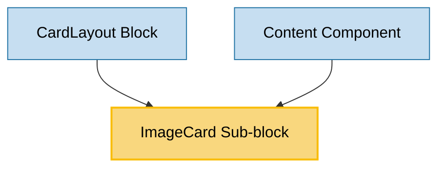

# ImageCard Sub-block Usage

This document outlines how the ImageCard sub-block is used across blocks, sub-blocks, and components in the page-constructor project.

## Overview

The ImageCard sub-block is a versatile component that displays an image alongside content such as title, text, and optional controls like links and buttons. It provides a flexible way to present visual information with accompanying text in a card format. The component supports various customization options including image positioning, border styles, and control positioning, making it adaptable for different design requirements.

## Usage Graph



## Component Details

### ImageCard Sub-block

- **File**: `src/sub-blocks/ImageCard/ImageCard.tsx`
- **Description**: Displays an image alongside content with a title, text, and optional controls like links and buttons.
- **Props**:
  - `image`: Image to display (required) - supports themed images
  - `title`: Card title
  - `text`: Card description with YFM support
  - `border`: Border style - 'shadow' (default), 'line', or 'none'
  - `enableImageBorderRadius`: Set border-radius for the image (affects only when margins='none')
  - `direction`: Image and content direction - 'direct' (default) or 'reverse'
  - `margins`: Space between the image and the card borders - 's' or 'm'
  - `backgroundColor`: Card background color
  - `url`: URL that opens when clicking the card
  - `urlTitle`: Accessible title for the URL
  - `target`: Target for the URL - '\_blank', '\_parent', '\_top', or '\_self'
  - `additionalInfo`: Additional information text with YFM support
  - `links`: Array of link objects
  - `buttons`: Array of button objects
  - `list`: Array of content list items
  - `theme`: Content theme - 'default', 'dark', or 'light'
  - `size`: Content size - 's' (default), 'm', or 'l'
  - `controlPosition`: Position of controls (links and buttons) - 'content' (default) or 'footer'

## Usage Patterns

### In Blocks

#### CardLayout Block

- **File**: `src/blocks/CardLayout/CardLayout.tsx`
- **Usage**: Used as a child component within the CardLayout block to display cards in a grid.
- **Implementation**:
  ```tsx
  <CardLayout
    title="Card layout with image cards"
    description="Three cards in a row on the desktop, two cards in a row on a tablet, one card in a row on a mobile phone."
  >
    <ImageCard
      title="Tell a story and build a narrative"
      text="We are all storytellers. Stories are a powerful way to communicate ideas and share information."
      image="/story-assets/img_8-12_light.png"
    />
    {/* Other cards */}
  </CardLayout>
  ```

## Component Structure

The ImageCard component is composed of several key parts:

1. **Link or Div Container**: Provides the base card functionality including border styles and URL handling
2. **Image**: Renders the image with optional border radius
3. **Content**: Displays the card content including title, text, additional info, links, buttons, and content list

### Internal Structure

```tsx
{
  url ? (
    <Link
      href={url}
      target={target}
      rel={target === '_blank' ? 'noopener noreferrer' : undefined}
      className={b({border, 'with-content': hasContent, direction})}
      title={urlTitle}
      style={{backgroundColor}}
      extraProps={{
        draggable: false,
        onDragStart: (e: React.DragEvent<HTMLAnchorElement>) => e.preventDefault(),
      }}
    >
      {cardContent}
    </Link>
  ) : (
    <div className={b({border, 'with-content': hasContent, direction})} style={{backgroundColor}}>
      {cardContent}
    </div>
  );
}
```

## Image Handling

The component supports flexible image input:

### Image Types

```tsx
// String URL
image: "/path/to/image.jpg"

// Image object
image: {
  src: "/path/to/image.jpg",
  alt: "Image description"
}

// Themed image
image: {
  light: "/path/to/light-image.jpg",
  dark: "/path/to/dark-image.jpg"
}
```

## Direction Options

The component supports two directions for the image and content:

- `direct`: Image is placed before the content (default)
- `reverse`: Image is placed after the content

## Border Styles

The component supports different border styles:

- `shadow`: Card has a shadow effect (default)
- `line`: Card has a line border
- `none`: Card has no border

## Margin Options

The component supports different margin options between the image and card borders:

- No margin (default)
- `s`: Small margin
- `m`: Medium margin

## Control Position

The component supports two positions for controls (links and buttons):

- `content`: Controls are placed within the content area (default)
- `footer`: Controls are placed at the bottom of the card

## Integration with Theme System

The ImageCard component integrates with the page-constructor theme system:

1. **Theme Processing**: Uses `getThemedValue()` utility to resolve themed images
2. **Content Theming**: Passes theme to the Content component for consistent styling
3. **Theme Context**: Respects the global theme context for consistent styling

## Best Practices

1. **Content Structure**: Provide meaningful titles and descriptions for accessibility.

2. **Image Selection**:

   - Choose appropriate images that represent the card's content
   - Use high-quality images that work well with the card's dimensions
   - Consider using themed images for dark/light mode support

3. **Border Usage**:

   - Use `shadow` border for elevated appearance (default)
   - Use `line` border for subtle separation
   - Use `none` border for seamless integration

4. **Direction Usage**:

   - Use `direct` direction for standard layout (default)
   - Use `reverse` direction when the image should appear after the content

5. **Control Position**:
   - Use `content` position for standard layout (default)
   - Use `footer` position for cards where controls should be aligned at the bottom

## Example Usage

### Basic ImageCard

```tsx
<ImageCard
  title="Tell a story and build a narrative"
  text="We are all storytellers. Stories are a powerful way to communicate ideas and share information."
  image="/path/to/image.jpg"
/>
```

### With Themed Image

```tsx
<ImageCard
  title="Tell a story and build a narrative"
  text="We are all storytellers. Stories are a powerful way to communicate ideas and share information."
  image={{
    light: '/path/to/light-image.jpg',
    dark: '/path/to/dark-image.jpg',
  }}
/>
```

### With Reverse Direction

```tsx
<ImageCard
  title="Tell a story and build a narrative"
  text="We are all storytellers. Stories are a powerful way to communicate ideas and share information."
  image="/path/to/image.jpg"
  direction="reverse"
/>
```

### With Margins

```tsx
<ImageCard
  title="Tell a story and build a narrative"
  text="We are all storytellers. Stories are a powerful way to communicate ideas and share information."
  image="/path/to/image.jpg"
  margins="m"
/>
```

### With Links and Buttons

```tsx
<ImageCard
  title="Tell a story and build a narrative"
  text="We are all storytellers. Stories are a powerful way to communicate ideas and share information."
  image="/path/to/image.jpg"
  links={[
    {
      url: 'https://example.com',
      text: 'Link',
      theme: 'normal',
      arrow: true,
    },
  ]}
  buttons={[
    {
      text: 'Button',
      theme: 'action',
      url: 'https://example.com',
    },
    {
      text: 'Button',
      theme: 'outlined',
      url: 'https://example.com',
    },
  ]}
/>
```

### With Content List

```tsx
<ImageCard
  title="Tell a story and build a narrative"
  text="We are all storytellers. Stories are a powerful way to communicate ideas and share information."
  image="/path/to/image.jpg"
  list={[
    {
      icon: {
        light: '/path/to/icon-light.svg',
        dark: '/path/to/icon-dark.svg',
      },
      title: 'Lorem ipsum',
      text: '**Ut enim ad minim veniam** [quis nostrud](https://example.com) exercitation.',
    },
    {
      icon: {
        light: '/path/to/icon-light.svg',
        dark: '/path/to/icon-dark.svg',
      },
      text: '**Ut enim ad minim veniam** [quis nostrud](https://example.com) exercitation.',
    },
  ]}
/>
```

### With URL

```tsx
<ImageCard
  title="Tell a story and build a narrative"
  text="We are all storytellers. Stories are a powerful way to communicate ideas and share information."
  image="/path/to/image.jpg"
  url="https://example.com"
  urlTitle="Opens in a new tab"
  target="_blank"
/>
```

### With Background Color

```tsx
<ImageCard
  title="Tell a story and build a narrative"
  text="We are all storytellers. Stories are a powerful way to communicate ideas and share information."
  image="/path/to/image.jpg"
  backgroundColor="#ccf0d2"
/>
```

### With Footer Controls

```tsx
<ImageCard
  title="Tell a story and build a narrative"
  text="We are all storytellers. Stories are a powerful way to communicate ideas and share information."
  image="/path/to/image.jpg"
  buttons={[
    {
      text: 'Button',
      theme: 'action',
      url: 'https://example.com',
    },
    {
      text: 'Button',
      theme: 'outlined',
      url: 'https://example.com',
    },
  ]}
  controlPosition="footer"
/>
```

## Storybook Documentation

The ImageCard component includes Storybook stories demonstrating:

- Default card display
- Various content configurations (with/without links, buttons, content list)
- Direction options (direct, reverse)
- Border styles (shadow, line, none)
- Margin options (none, small, medium)
- URL handling
- Background color options
- Control positioning (content, footer)

Stories are located in `src/sub-blocks/ImageCard/__stories__/ImageCard.stories.tsx` with example data in `data.json`.
