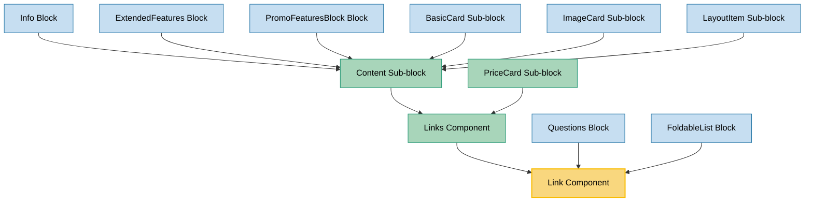

# Link Component Usage

This document outlines how the Link component is used across blocks, sub-blocks, and components in the page-constructor project.

## Overview

The Link component is a versatile utility component that renders different types of links based on the specified theme. It supports multiple link themes including normal links with optional arrows, file links, back links, and underlined links. The component handles analytics tracking, URL processing with TLD support, and provides accessibility features. It serves as a foundational component for navigation and user interactions throughout the page constructor system.

## Usage Graph



## Component Details

### Link Component

- **File**: `src/components/Link/Link.tsx`
- **Description**: Renders different types of links based on theme with analytics tracking and accessibility support.
- **Props**:
  - `url`: Target URL for the link (required)
  - `text`: Link text content (optional if children provided)
  - `theme`: Link theme - `'normal'`, `'file-link'`, `'back'`, or `'underline'` (defaults to `'file-link'`)
  - `colorTheme`: Color theme - `'light'` or `'dark'` (defaults to `'light'`)
  - `textSize`: Text size - `'xs'`, `'s'`, `'sm'`, `'m'`, or `'l'` (defaults to `'m'`)
  - `arrow`: Boolean to show arrow icon (only for `'normal'` theme)
  - `target`: Link target attribute (e.g., `'_blank'`)
  - `urlTitle`: Title attribute for the link
  - `analyticsEvents`: Analytics events configuration
  - `className`: Optional CSS class name
  - `tabIndex`: Tab index for accessibility
  - `qa`: Optional QA attribute for testing
  - `extraProps`: Additional HTML anchor element props
  - `children`: React children to render instead of text

### LinkProps Interface

- **Description**: Defines the structure of link data used throughout the system.
- **Properties**:
  - `url`: Target URL (required)
  - `urlTitle`: Optional title attribute
  - `text`: Optional link text
  - `textSize`: Optional text size
  - `theme`: Optional link theme
  - `colorTheme`: Optional color theme
  - `arrow`: Optional arrow display
  - `target`: Optional link target
  - `extraProps`: Optional additional HTML props
  - Analytics and accessibility props

### LinkTheme Type

- **Description**: Defines available themes for the Link component.
- **Values**:
  - `'normal'`: Standard link with optional arrow
  - `'file-link'`: File download link style
  - `'back'`: Back navigation link
  - `'underline'`: Underlined link style

### Links Component

- **File**: `src/components/Links/Links.tsx`
- **Description**: Utility component that renders a list of Link components with consistent styling.
- **Props**:
  - `links`: Array of LinkProps objects (required)
  - `size`: Content size - `'s'`, `'m'`, or `'l'` (defaults to `'s'`)
  - `className`: Optional CSS class name
  - `titleId`: Optional title ID for accessibility
  - `qa`: Optional QA attribute for testing
  - `linkQa`: Optional QA attribute for individual links

## Usage Patterns

> **Note**: In the code examples below, `b()` is a utility function used throughout the page-constructor project for BEM (Block Element Modifier) class naming. It generates CSS class names following the BEM methodology, making the code more maintainable and consistent.

### Direct Usage in Blocks

#### Questions Block

- **File**: `src/blocks/Questions/QuestionBlockItem/QuestionBlockItem.tsx`
- **Usage**: Displays optional links within expandable question items with accessibility support.
- **Implementation**:

  ```tsx
  {
    link && <Link {...link} tabIndex={isOpened ? 0 : -1} className={b('link')} />;
  }
  ```

#### FoldableList Block

- **File**: `src/blocks/FoldableList/FoldableListBlockItem/FoldableListBlockItem.tsx`
- **Usage**: Shows optional links within expandable list items with proper tab management.
- **Implementation**:

  ```tsx
  {
    link && <Link {...link} tabIndex={isOpened ? 0 : -1} className={b('link')} />;
  }
  ```

### Through Links Component

#### Content Sub-block

- **File**: `src/sub-blocks/Content/Content.tsx`
- **Usage**: Renders lists of links as part of structured content blocks with size and theme support.
- **Implementation**:

  ```tsx
  {
    links && (
      <Links
        className={b('links', {size})}
        size={size}
        links={links}
        titleId={titleId}
        qa={qaAttributes.links}
        linkQa={qaAttributes.link}
      />
    );
  }
  ```

#### PriceCard Sub-block

- **File**: `src/sub-blocks/PriceCard/PriceCard.tsx`
- **Usage**: Displays links in pricing cards with small size for compact layout.
- **Implementation**:

  ```tsx
  <Links className={b('links')} links={links} size="s" />
  ```

### Indirect Usage Through Content Sub-block

The Link component is used indirectly in many blocks through the Content sub-block:

#### Info Block

- **Usage**: Uses Content sub-block in both left and right content areas, supporting Link lists.

#### ExtendedFeatures Block

- **Usage**: Uses Content sub-block which can include Link lists for feature descriptions.

#### PromoFeaturesBlock Block

- **Usage**: Uses Content sub-block which can include Link lists in promotional content.

#### BasicCard, ImageCard, LayoutItem Sub-blocks

- **Usage**: All use Content sub-block which can include Link lists for various content types.

## Link Themes

### Normal Theme

The normal theme renders a standard link with optional arrow:

- **Appearance**: Standard text link with hover effects
- **Arrow Support**: Can display a chevron right arrow icon
- **Color Themes**: Supports light and dark color themes
- **Use Cases**: General navigation, call-to-action links

**CSS Classes Applied**:

- `.link-block__link`
- `.link-block__link_theme_{colorTheme}`
- `.link-block__link_has-arrow` (when arrow is enabled)

### File-Link Theme (Default)

The file-link theme uses the FileLink component:

- **Appearance**: Styled for file downloads and external links
- **Layout**: Horizontal layout with consistent styling
- **Use Cases**: Document downloads, external resources

### Back Theme

The back theme uses the BackLink component:

- **Appearance**: Back navigation styling with appropriate icon
- **Behavior**: Optimized for navigation back actions
- **Use Cases**: Breadcrumb navigation, return links

### Underline Theme

The underline theme uses the FileLink component with underline styling:

- **Appearance**: Underlined text link
- **Use Cases**: Inline text links, subtle navigation

## Size Handling

The Link component handles text sizes intelligently:

### Size Mapping

- **Default Sizes**:
  - `'back'` theme defaults to `'l'` size
  - Other themes default to `'m'` size
- **Size Conversion**: `'sm'` size is converted to `'m'` for consistency
- **Arrow Sizing**: Arrow icons are automatically sized based on text size:
  - `'l'`: 20px
  - `'m'`, `'sm'`: 18px
  - `'s'`: 14px
  - Default: 14px

### Links Component Size Mapping

The Links component maps content sizes to link text sizes:

- **Content size `'s'`**: Maps to link text size `'m'`
- **Content size `'l'` or default**: Maps to link text size `'l'`

## Integration with System Features

### Analytics Integration

The Link component integrates with the analytics system:

1. **Event Tracking**: Uses `useAnalytics` hook for tracking link clicks
2. **Default Events**: Tracks `DefaultEventNames.Link` events
3. **Custom Events**: Supports custom analytics events via `analyticsEvents` prop
4. **URL Context**: Includes URL in analytics data for tracking

### Internationalization Support

The component supports internationalization:

1. **TLD Processing**: Uses `setUrlTld()` utility to adjust URLs based on locale
2. **Locale Context**: Integrates with `LocaleContext` for TLD information
3. **URL Adaptation**: Automatically adapts URLs for different regions

### Accessibility Features

The Link component provides comprehensive accessibility support:

1. **Tab Management**: Supports custom `tabIndex` for keyboard navigation
2. **ARIA Attributes**: Supports `aria-describedby` through `extraProps`
3. **Title Attributes**: Provides `urlTitle` for additional context
4. **QA Attributes**: Includes data-qa attributes for testing
5. **Semantic HTML**: Uses proper anchor elements with appropriate attributes

### URL Processing

The component handles URL processing:

1. **Link Props**: Uses `getLinkProps()` utility for external link handling
2. **Target Handling**: Automatically handles target attributes
3. **Hostname Context**: Uses `LocationContext` for hostname-based logic
4. **Security**: Proper handling of external links with security considerations

## Best Practices

1. **Theme Selection**:

   - Use `'normal'` theme for general navigation and call-to-action links
   - Use `'file-link'` theme for downloads and external resources
   - Use `'back'` theme for navigation back actions
   - Use `'underline'` theme for inline text links

2. **Arrow Usage**:

   - Enable arrows for call-to-action links to indicate action
   - Use arrows sparingly to avoid visual clutter
   - Only available with `'normal'` theme

3. **Size Consistency**:

   - Match link sizes with surrounding content
   - Use Links component for consistent list styling
   - Consider content hierarchy when choosing sizes

4. **Accessibility**:

   - Always provide meaningful link text or children
   - Use `urlTitle` for additional context when needed
   - Manage `tabIndex` appropriately in dynamic content
   - Include proper QA attributes for testing

5. **Analytics**:

   - Configure analytics events for important links
   - Use consistent event naming across the application
   - Track both internal and external link usage

6. **Color Themes**:
   - Use `'dark'` color theme on light backgrounds
   - Use `'light'` color theme on dark backgrounds
   - Ensure sufficient contrast for accessibility

## Example Usage

### Basic Link

```tsx
<Link text="Learn More" url="https://example.com" theme="normal" />
```

### Link with Arrow

```tsx
<Link text="Get Started" url="/getting-started" theme="normal" arrow={true} textSize="l" />
```

### File Download Link

```tsx
<Link text="Download PDF" url="/documents/guide.pdf" theme="file-link" target="_blank" />
```

### Back Navigation Link

```tsx
<Link text="Back to Home" url="/" theme="back" />
```

### Link with Custom Content

```tsx
<Link url="/profile" theme="normal">
  <span>
    <Icon data={User} />
    View Profile
  </span>
</Link>
```

### Links List

```tsx
<Links
  links={[
    {text: 'Documentation', url: '/docs'},
    {text: 'API Reference', url: '/api'},
    {text: 'Examples', url: '/examples'},
  ]}
  size="m"
/>
```

### Question/Foldable Item Link

```tsx
{
  link && <Link {...link} tabIndex={isOpened ? 0 : -1} className={b('link')} />;
}
```

### Dark Theme Link

```tsx
<Link text="Contact Us" url="/contact" theme="normal" colorTheme="dark" arrow={true} />
```

## Storybook Documentation

The Link component includes comprehensive Storybook stories demonstrating:

- Default link display
- All theme variations (normal, file-link, back, underline)
- Size variations (s, m, l)
- Arrow functionality
- Color theme variations (light, dark)
- Links with custom children content

Stories are located in `src/components/Link/__stories__/Link.stories.tsx` with example data in `data.json`.

## Testing

The Link component includes comprehensive testing covering:

- Theme rendering and behavior
- Size handling and arrow display
- Analytics integration
- Accessibility features
- URL processing and TLD handling
- Integration with Links component

Test files are located in the respective `__tests__` directories of blocks and sub-blocks that use Link.

## CSS Classes

The component uses BEM methodology for CSS classes:

- `.link-block` - Main container
- `.link-block_size_{size}` - Size modifier
- `.link-block__link` - Link element (normal theme)
- `.link-block__link_theme_{colorTheme}` - Color theme modifier
- `.link-block__link_has-arrow` - Arrow modifier
- `.link-block__content` - Content wrapper (with arrow)
- `.link-block__arrow` - Arrow icon

## Related Components

- **BackLink**: Used internally for `'back'` theme
- **FileLink**: Used internally for `'file-link'` and `'underline'` themes
- **Links**: Utility component for rendering link lists
- **RouterLink**: Alternative link component for routing contexts
