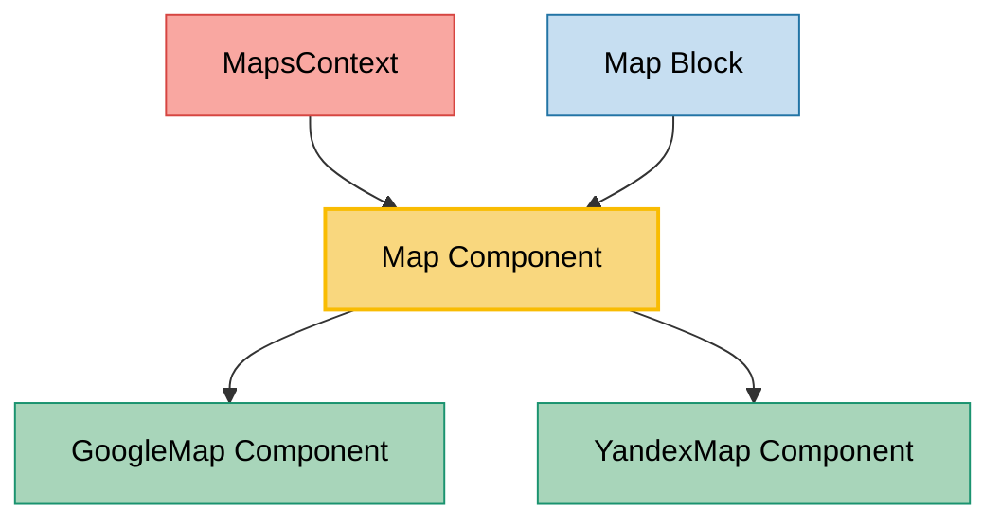

# Map Component Usage

This document outlines how the Map component is used across blocks, sub-blocks, and components in the page-constructor project.

## Overview

The Map component is a utility component that provides map functionality using either Google Maps or Yandex Maps. It acts as a wrapper that switches between different map providers based on the MapsContext configuration. The component supports both address-based (Google Maps) and coordinate-based (Yandex Maps) implementations with customizable markers and zoom levels.

## Usage Graph



## Component Details

### Map Component

- **File**: `src/components/Map/Map.tsx`
- **Description**: A wrapper component that renders either Google Maps or Yandex Maps based on the MapsContext configuration.
- **Props**: `MapProps` (union of `GMapProps` and `YMapProps`)
- **Context Dependencies**: Uses `MapsContext` to determine which map provider to render

### MapProps Types

#### GMapProps (Google Maps)

- **Description**: Props for Google Maps implementation
- **Properties**:
  - `address`: String address to display on the map (required)
  - `zoom`: Optional zoom level (inherited from MapBaseProps)
  - `className`: Optional CSS class name (inherited from MapBaseProps)
  - `forceAspectRatio`: Optional boolean to force aspect ratio (16:9 for Desktop, 4:3 for Mobile), `true` by default (inherited from MapBaseProps)

#### YMapProps (Yandex Maps)

- **Description**: Props for Yandex Maps implementation
- **File**: `src/components/Map/YMap/YMap.tsx`
- **Properties**:
  - `markers`: Array of YMapMarker objects to display on the map (required)
  - `id`: Unique identifier for the map instance (required)
  - `zoom`: Optional zoom level (inherited from MapBaseProps)
  - `className`: Optional CSS class name (inherited from MapBaseProps)
  - `forceAspectRatio`: Optional boolean to force aspect ratio (16:9 for Desktop, 4:3 for Mobile), `true` by default (inherited from MapBaseProps)
  - `disableControls`: Optional boolean to hide map controls (Yandex Maps only), `false` by default
  - `disableBalloons`: Optional boolean to disable info balloons (Yandex Maps only), `false` by default
  - `areaMargin:`: Optional offset (in pixels) for the marked area of the map relative to the map's container (`30` by default)
  - `copyrightPosition`: Optional position of the copyright text (in pixels)

#### MapBaseProps (Common Props)

- **Description**: Common props available for both Google Maps and Yandex Maps
- **Properties**:
  - `zoom`: Optional zoom level for the map
  - `className`: Optional CSS class name for styling
  - `forceAspectRatio`: Optional boolean to force aspect ratio (16:9 for Desktop, 4:3 for Mobile), `true` by default

### YMapMarker Interface

- **Description**: Defines marker data for Yandex Maps
- **Properties**:
  - `address`: Optional string address for the marker
  - `coordinate`: Optional coordinate array [longitude, latitude]
  - `label`: Optional YMapMarkerLabel object for marker customization

### YMapMarkerLabel Interface

- **Description**: Defines marker label customization for Yandex Maps
- **Properties**:
  - `iconCaption`: Optional caption text for the marker
  - `iconContent`: Optional content text for the marker
  - `iconColor`: Optional color for the marker icon
  - `iconImageHref`: Optional URL of geo object's custom icon image file
  - `iconImageSize`: Optional dimensions of custom icon image [width, height]
  - `iconImageOffset`: Optional custom icon image's offset relative to it's anchor point [x, y]
  - `iconImageClipRect`: Optional coordinates of custom icon image's displayed rectangular area [[x1, y1], [x2, y2]]
  - `iconLayout`: Optional layout for icon (e.g., 'default#image' for custom icons)
  - `iconShape`: Optional icon's active area shape
  - `preset`: Optional preset style for the marker

### MapsContext

- **File**: `src/context/mapsContext/mapsContext.tsx`
- **Description**: React context that provides map provider configuration
- **Properties**:
  - `type`: MapType enum value (Yandex or Google)

## MapBlockProps Interface

Map blocks use the same enhanced title support as Media blocks through MediaContentProps:

- **Description**: Map blocks extend MediaBaseBlockProps, which includes MediaContentProps with enhanced title support.
- **File**: `src/models/constructor-items/blocks.ts`
- **Key Properties**:
  - `title`: TitleItemBaseProps | string - Enhanced title support with object or string format
  - `description`: string - Optional description text with YFM support
  - `map`: MapProps - Map configuration (required)
  - Inherits all MediaContentProps properties: `additionalInfo`, `links`, `buttons`, `size`, `list`, `controlPosition`

### Enhanced Title Support for Maps

Map blocks support the same enhanced title functionality as Media blocks:

**Usage Examples**:

```typescript
// Map with custom title size
{
  type: 'map-block',
  title: {
    text: 'Our Location',
    textSize: 'l'
  },
  map: { /* map config */ }
}

// Map with clickable title
{
  type: 'map-block',
  title: {
    text: 'View on Google Maps',
    url: 'https://maps.google.com/...',
    urlTitle: 'Open in Google Maps'
  },
  map: { /* map config */ }
}

// Map with custom content
{
  type: 'map-block',
  title: {
    text: 'Office Location',
    custom: '📍',
    textSize: 'm'
  },
  map: { /* map config */ }
}
```

## Usage Patterns

> **Note**: In the code examples below, `b()` is a utility function used throughout the page-constructor project for BEM (Block Element Modifier) class naming. It generates CSS class names following the BEM methodology, making the code more maintainable and consistent.

### In Blocks

#### Map Block

- **File**: `src/blocks/Map/Map.tsx`
- **Usage**: Wraps the Map component with MediaBase layout and border styling.
- **Implementation**:

  ```tsx
  export const MapBlock = ({map, border, disableShadow, ...props}: MapBlockProps) => {
    const borderSelected = getMediaBorder({
      border,
      disableShadow,
    });

    return (
      <MediaBase {...props}>
        <MediaBase.Card>
          <Map {...map} className={b({border: borderSelected})} />
        </MediaBase.Card>
      </MediaBase>
    );
  };
  ```

## Integration with Maps System

The Map component is a key part of the page-constructor maps system:

1. **Provider Switching**: The component automatically switches between Google Maps and Yandex Maps based on the MapsContext configuration.

2. **API Key Management**: Map providers are configured through MapProvider with appropriate API keys and script sources.

3. **Responsive Design**: Maps are rendered responsively within their container elements.

4. **Error Handling**: Each map implementation includes error handling for API loading failures.

## Map Provider Configuration

### Google Maps Configuration

```tsx
<MapProvider
  scriptSrc={scriptsSrc[MapType.Google]}
  type={MapType.Google}
  apiKey={GOOGLE_MAPS_API_KEY}
>
  <Map address="123 Main St, City, Country" zoom={15} />
</MapProvider>
```

### Yandex Maps Configuration

```tsx
<MapProvider
  scriptSrc={scriptsSrc[MapType.Yandex]}
  apiKey={YANDEX_MAPS_API_KEY}
  type={MapType.Yandex}
>
  <Map
    id="unique-map-id"
    markers={[
      {
        coordinate: [37.6173, 55.7558],
        label: {
          iconCaption: 'Moscow',
          iconColor: 'blue',
        },
      },
    ]}
    zoom={10}
  />
</MapProvider>
```

## Best Practices

1. **Provider Selection**: Choose the appropriate map provider based on your target audience and regional requirements.

2. **API Key Security**: Store API keys securely and avoid exposing them in client-side code in production.

3. **Performance Considerations**: Maps can be resource-intensive, so consider lazy loading for pages with multiple maps.

4. **Accessibility**: Ensure maps have appropriate ARIA labels and keyboard navigation support.

5. **Responsive Design**: Test maps on different screen sizes to ensure proper display and interaction.

6. **Error Handling**: Always provide fallback content or error messages when map APIs fail to load.

## Example Usage

### Basic Google Map

```tsx
// In a block or component
<Map address="1600 Amphitheatre Parkway, Mountain View, CA" zoom={15} className="my-map" />
```

### Yandex Map with Multiple Markers

```tsx
// In a block or component
<Map
  id="office-locations"
  markers={[
    {
      coordinate: [37.6173, 55.7558],
      label: {
        iconCaption: 'Moscow Office',
        iconContent: 'HQ',
        iconColor: 'red',
        preset: 'islands#redIcon',
      },
    },
    {
      coordinate: [30.3141, 59.9386],
      label: {
        iconCaption: 'St. Petersburg Office',
        iconContent: 'Branch',
        iconColor: 'blue',
      },
    },
  ]}
  zoom={5}
/>
```

### In Map Block Context

```tsx
// Block usage with MediaBase wrapper
<MapBlock
  map={{
    address: 'Central Park, New York, NY',
    zoom: 14,
  }}
  title="Visit Our Location"
  description="Find us in the heart of the city"
  border="shadow"
/>
```

## Storybook Documentation

The Map component includes Storybook stories demonstrating:

- Google Maps integration with address-based display
- Yandex Maps integration with coordinate-based markers
- Different zoom levels and configurations
- API key input for development/testing
- Enhanced title support

Stories are located in `src/components/Map/__stories__/Map.stories.tsx` with example data in `data.json`.

## Testing

The Map component includes comprehensive tests covering:

- Provider switching based on context
- Props passing to underlying map implementations
- Error handling for missing API keys
- Responsive behavior

Test files are located in `src/components/Map/__tests__/` directory.

## Context Integration

The Map component integrates with several contexts:

1. **MapsContext**: Determines which map provider to use
2. **MobileContext**: Provides mobile-specific optimizations
3. **LocaleContext**: Handles localization for map interfaces

This integration ensures consistent behavior across the application and proper adaptation to different environments and user preferences.
