# Media Component Usage

This document outlines how the Media component is used across blocks, sub-blocks, and components in the page-constructor project.

## Overview

The Media component is a versatile multimedia component that handles various types of media content including images, videos, YouTube videos, DataLens charts, and iframes. It supports advanced features like parallax effects, fullscreen display, background mode, video controls, and analytics integration. The component serves as a unified interface for all media rendering needs in the page constructor system.

## Usage Graph

```mermaid
graph TD
    %% Main Component
    Media[Media Component]

    %% Sub-blocks that use Media directly
    MediaCard[MediaCard Sub-block]
    LayoutItem[LayoutItem Sub-block]

    %% Blocks that use Media directly
    MediaBlock[Media Block]
    PromoFeaturesBlock[PromoFeaturesBlock]
    TabContent[TabContent - Tabs Block]
    Header[Header Block]

    %% Components that use Media
    BackgroundMedia[BackgroundMedia Component]

    %% Usage relationships
    MediaCard --> Media
    LayoutItem --> Media
    MediaBlock --> Media
    PromoFeaturesBlock --> Media
    TabContent --> Media
    Header --> Media
    BackgroundMedia --> Media

    %% Style classes
    style Media fill:#f9d77e,stroke:#f9bc02,stroke-width:2px,color:#000

    %% Sub-block styles
    style MediaCard fill:#a8d5ba,stroke:#1a936f,stroke-width:1px,color:#000
    style LayoutItem fill:#a8d5ba,stroke:#1a936f,stroke-width:1px,color:#000

    %% Block styles
    style MediaBlock fill:#c6def1,stroke:#2274a5,stroke-width:1px,color:#000
    style PromoFeaturesBlock fill:#c6def1,stroke:#2274a5,stroke-width:1px,color:#000
    style TabContent fill:#c6def1,stroke:#2274a5,stroke-width:1px,color:#000
    style Header fill:#c6def1,stroke:#2274a5,stroke-width:1px,color:#000

    %% Component styles
    style BackgroundMedia fill:#e8f4fd,stroke:#1976d2,stroke-width:1px,color:#000
```



## Component Details

### Media Component

- **File**: `src/components/Media/Media.tsx`
- **Description**: Unified multimedia component that handles images, videos, YouTube videos, DataLens charts, and iframes with advanced features.
- **Props**:
  - `image`: ImageProps | ImageProps[] | ImageDeviceProps - image data
    - `ImageProps = string | ImageObjectProps | ImageDeviceProps`
    - `ImageObjectProps`: `{src: string, alt?: string, disableCompress?: boolean, hide?: boolean | Partial<Record<'desktop' | 'mobile' | 'tablet', boolean>>, fetchPriority?: 'high' | 'low' | 'auto', loading?: 'eager' | 'lazy', 'aria-describedby'?: string}`
    - `ImageDeviceProps`: `{desktop: string, mobile: string, tablet?: string, alt?: string, disableCompress?: boolean, hide?: boolean | Partial<Record<'desktop' | 'mobile' | 'tablet', boolean>>, fetchPriority?: 'high' | 'low' | 'auto', loading?: 'eager' | 'lazy', 'aria-describedby'?: string}`
  - `video`: MediaVideoProps - video configuration
    - `{src: string[], type?: 'default' | 'player', loop?: boolean | {start: number, end?: number}, muted?: boolean, autoplay?: boolean, elapsedTime?: number, playButton?: PlayButtonProps, controls?: 'default' | 'custom', customControlsOptions?: CustomControlsOptions, ariaLabel?: string, contain?: boolean, onVideoEnd?: () => void, ref?: React.Ref<HTMLVideoElement | null>}`
    - `PlayButtonProps`: `{type?: 'default' | 'text', theme?: 'blue' | 'grey', text?: string, className?: string}`
    - `CustomControlsOptions`: `{type?: 'with-mute-button' | 'with-play-pause-button', muteButtonShown?: boolean, positioning?: 'left' | 'right' | 'center'}`
  - `youtube`: string - YouTube video ID
  - `videoIframe`: string - video iframe URL
  - `dataLens`: DataLensProps - DataLens chart configuration
    - `DataLensProps = string | {id: string, theme: 'dark' | 'light'}`
  - `iframe`: IframeProps - iframe configuration
    - `{src: string, width?: number, height?: number, title?: string, name?: string}`
  - `color`: string - background color
  - `height`: number - fixed height for media
  - `previewImg`: string - preview image for videos
  - `parallax`: boolean - enables parallax scrolling effect
  - `fullscreen`: boolean - enables fullscreen functionality
  - `analyticsEvents`: AnalyticsEventsProp - analytics configuration
  - `className`: string - CSS class for the container
  - `imageClassName`: string - CSS class for images
  - `videoClassName`: string - CSS class for videos
  - `youtubeClassName`: string - CSS class for YouTube videos
  - `disableImageSliderForArrayInput`: boolean - disables slider for image arrays
  - `playVideo`: boolean - controls video playback (defaults to true)
  - `isBackground`: boolean - renders as background media
  - `playButton`: PlayButtonProps - custom play button configuration
  - `customBarControlsClassName`: string - CSS class for custom video controls
  - `qa`: string - QA attribute for testing
  - `ratio`: number | 'auto' - aspect ratio for videos
  - `autoplay`: boolean - enables video autoplay
  - `onImageLoad`: () => void - callback when image loads
  - `margins`: boolean - controls iframe margins
  - `videoMicrodata`: object - structured data for videos
    - `{name?: string, description?: string, duration?: string, uploadDate?: string, contentUrl?: string, thumbnailUrl?: string}`

### MediaProps Interface

- **Description**: Defines the structure of media data for the Media component.
- **Properties**:
  - Extends `Animatable` for animation support
  - Includes partial interfaces for all media types (image, video, YouTube, DataLens, iframe)
  - Supports `color` for background color
  - Includes `videoMicrodata` for SEO structured data

### MediaContentProps Interface

- **Description**: Defines the content properties for Media and Map blocks, extending ContentBlockProps with media-specific properties.
- **File**: `src/models/constructor-items/blocks.ts`
- **Key Properties**:
  - `title`: TitleItemBaseProps | string - Enhanced title support with object or string format
  - `description`: string - Optional description text with YFM support
  - `button`: ButtonProps - Deprecated, use buttons array from ContentBlockProps instead
  - Inherits from ContentBlockProps: `additionalInfo`, `links`, `buttons`, `size`, `list`, `controlPosition`

#### Enhanced Title Support

The `title` property in MediaContentProps now supports both simple strings and rich title objects:

**String Format (Legacy)**:

```typescript
title: 'Simple Title Text';
```

**Object Format (Enhanced)**:

```typescript
title: {
  text: "Title Text",           // Required: The title text
  textSize?: TextSize,          // Optional: 'xs' | 's' | 'sm' | 'm' | 'l'
  url?: string,                 // Optional: Makes title clickable
  urlTitle?: string,            // Optional: Link title attribute
  custom?: string | ReactNode,  // Optional: Custom content (e.g., emoji)
  onClick?: () => void,         // Optional: Click handler
}
```

**Usage Examples**:

```typescript
// Title with custom size
title: {
  text: 'Large Title',
  textSize: 'l'
}

// Clickable title
title: {
  text: 'Visit Our Site',
  url: 'https://example.com',
  urlTitle: 'Open example.com'
}

// Interactive title
title: {
  text: 'Click Me',
  onClick: () => alert('Title clicked!')
}

// Title with custom content
title: {
  text: 'Featured Content',
  custom: '⭐',
  textSize: 'm'
}
```

### Media Sub-components

The Media component internally uses specialized sub-components:

- **Image**: Handles image rendering with parallax, fullscreen, and slider features
- **Video**: Manages video playback with custom controls
- **FullscreenVideo**: Provides fullscreen video functionality
- **IframeVideoBlock**: Handles YouTube and iframe videos
- **DataLens**: Renders DataLens charts
- **Iframe**: Displays generic iframes

## Usage Patterns

> **Note**: In the code examples below, `b()` is a utility function used throughout the page-constructor project for BEM (Block Element Modifier) class naming. It generates CSS class names following the BEM methodology, making the code more maintainable and consistent.

### In Sub-blocks

#### MediaCard Sub-block

- **File**: `src/sub-blocks/MediaCard/MediaCard.tsx`
- **Usage**: Wraps Media component in a card layout with border and analytics support.
- **Implementation**:

  ```tsx
  const MediaCard = ({border, analyticsEvents, ...mediaProps}: MediaCardProps) => (
    <CardBase
      className={b()}
      bodyClassName={b('body')}
      border={border}
      analyticsEvents={analyticsEvents}
    >
      <CardBase.Content>
        <Media {...mediaProps} />
      </CardBase.Content>
    </CardBase>
  );
  ```

#### LayoutItem Sub-block

- **File**: `src/sub-blocks/LayoutItem/LayoutItem.tsx`
- **Usage**: Uses Media component with fullscreen support and theme integration for layout items.
- **Implementation**:

  ```tsx
  const renderMedia = () => {
    if (!media) {
      return null;
    }
    const themedMedia = getThemedValue(media, theme);
    const mediaWithMicrodata = mergeVideoMicrodata(themedMedia, {
      name: typeof title === 'string' ? title : title?.text,
      description: content.text,
    });

    return fullscreen && hasFullscreen(themedMedia) ? (
      <FullscreenMedia showFullscreenIcon={showFullscreenIcon(themedMedia)}>
        {({className: mediaClassName, fullscreen: _fullscreen, ...fullscreenMediaProps} = {}) => (
          <Media
            {...mediaWithMicrodata}
            {...fullscreenMediaProps}
            className={b('media', {border}, mediaClassName)}
            analyticsEvents={analyticsEvents}
          />
        )}
      </FullscreenMedia>
    ) : (
      <Media {...themedMedia} className={b('media', {border})} analyticsEvents={analyticsEvents} />
    );
  };
  ```

### In Blocks

#### Media Block

- **File**: `src/blocks/Media/Media.tsx`
- **Usage**: Primary block for displaying media content with theme support and video microdata.
- **Implementation**:

  ```tsx
  export const MediaBlock = (props: MediaBlockProps) => {
    const {media, border, disableShadow, title, description} = props;
    const borderSelected = getMediaBorder({border, disableShadow});
    const [play, setPlay] = React.useState<boolean>(false);
    const theme = useTheme();
    const mediaThemed = getThemedValue(media, theme);
    const mediaWithMicrodata = mergeVideoMicrodata(mediaThemed, {
      name: title,
      description,
    });

    return (
      <MediaBase {...props} onScroll={() => setPlay(true)}>
        <MediaBase.Card>
          <Media
            imageClassName={b('image')}
            {...mediaWithMicrodata}
            playVideo={play}
            className={b({border: borderSelected})}
          />
        </MediaBase.Card>
      </MediaBase>
    );
  };
  ```

#### PromoFeaturesBlock

- **File**: `src/blocks/PromoFeaturesBlock/PromoFeaturesBlock.tsx`
- **Usage**: Uses Media component for feature cards with theme support and video microdata.
- **Implementation**:

  ```tsx
  {
    items.map(({title: cardTitle, text, media, theme: cardTheme}, index) => {
      const themedMedia = getThemedValue(media, globalTheme);
      const allProps = mergeVideoMicrodata(themedMedia, {
        name: cardTitle,
        description: text,
      });

      return (
        <div key={index} className={b('card', {'no-media': !media, [themeMod]: Boolean(themeMod)})}>
          <div className={b('card-info')}>
            <h3 className={b('card-title')}>{cardTitle}</h3>
            <div className={b('card-text')}>
              <YFMWrapper content={text} modifiers={{constructor: true}} />
            </div>
          </div>
          {media && <Media className={b('card-media')} {...allProps} />}
        </div>
      );
    });
  }
  ```

#### TabContent (Tabs Block)

- **File**: `src/blocks/Tabs/TabContent/TabContent.tsx`
- **Usage**: Uses Media component in tab content with video playback control and microdata.
- **Implementation**:

  ```tsx
  {
    tabData.media && (
      <div style={{minHeight: mediaVideoHeight || minImageHeight}}>
        <div ref={mediaContainerRef}>
          <Media
            {...mergeVideoMicrodata(getThemedValue(tabData.media, theme), {
              name: tabData.tabName,
              description: tabData.caption ? tabData.caption : undefined,
            })}
            key={tabName}
            className={b('media', {border})}
            playVideo={play}
            height={mediaVideoHeight || undefined}
            onImageLoad={handleImageHeight}
          />
        </div>
      </div>
    );
  }
  ```

#### Header Block

- **File**: `src/blocks/Header/Header.tsx`
- **Usage**: Uses Media component for header background media with theme support.

### In Components

#### BackgroundMedia Component

- **File**: `src/components/BackgroundMedia/BackgroundMedia.tsx`
- **Usage**: Uses Media component for background media rendering with animation support.

## Media Types Support

The Media component supports multiple media types through a unified interface:

### Image Media

```tsx
// Single image
<Media image="/path/to/image.jpg" />

// Image array (creates slider)
<Media image={['/path/to/image1.jpg', '/path/to/image2.jpg']} />

// Device-specific images
<Media image={{
  desktop: "/path/to/desktop.jpg",
  mobile: "/path/to/mobile.jpg"
}} />

// Background image with parallax
<Media
  image="/path/to/background.jpg"
  isBackground={true}
  parallax={true}
  height={500}
/>
```

### Video Media

```tsx
// Basic video
<Media video={{
  src: ['/path/to/video.mp4'],
  type: 'default'
}} />

// Video with custom controls
<Media video={{
  src: ['/path/to/video.mp4'],
  controls: 'custom',
  customControlsOptions: {
    type: 'with-play-pause-button',
    positioning: 'center'
  }
}} />

// Video with preview image
<Media
  video={{src: ['/path/to/video.mp4']}}
  previewImg="/path/to/preview.jpg"
/>
```

### YouTube Videos

```tsx
// YouTube video
<Media youtube="dQw4w9WgXcQ" />

// YouTube with preview and fullscreen
<Media
  youtube="dQw4w9WgXcQ"
  previewImg="/path/to/preview.jpg"
  fullscreen={true}
/>
```

### DataLens Charts

```tsx
// DataLens chart
<Media dataLens={{
  id: "chart-id",
  theme: "light"
}} />

// DataLens with string ID
<Media dataLens="chart-id" />
```

### Iframe Content

```tsx
// Basic iframe
<Media iframe={{
  src: "https://example.com",
  width: 800,
  height: 600,
  title: "Example Content"
}} />

// Iframe with margins
<Media
  iframe={{src: "https://example.com"}}
  margins={true}
/>
```

## Advanced Features

### Parallax Effects

The Media component supports parallax scrolling effects for images:

```tsx
<Media image="/path/to/background.jpg" parallax={true} height={400} isBackground={true} />
```

### Fullscreen Support

Fullscreen functionality is available for images and videos:

```tsx
<Media
  image="/path/to/image.jpg"
  fullscreen={true}
/>

<Media
  video={{src: ['/path/to/video.mp4']}}
  fullscreen={true}
/>
```

### Analytics Integration

The component supports comprehensive analytics tracking:

```tsx
<Media
  image="/path/to/image.jpg"
  analyticsEvents={{
    name: 'media-view',
    type: 'default-event',
    counters: {include: ['gtm']},
    context: 'hero-section',
  }}
/>
```

### Video Microdata

SEO-friendly structured data for videos:

```tsx
<Media
  video={{src: ['/path/to/video.mp4']}}
  videoMicrodata={{
    name: 'Video Title',
    description: 'Video description',
    duration: 'PT2M30S',
    uploadDate: '2023-01-01',
  }}
/>
```

## Integration with Theme System

The Media component integrates seamlessly with the page-constructor theme system:

1. **Theme Processing**: Uses `getThemedValue()` utility to resolve themed media
2. **Image Processing**: Uses `getMediaImage()` utility to normalize image props
3. **Component Integration**: Works with other themed components
4. **Responsive Media**: Supports device-specific media variants

## Best Practices

1. **Media Type Selection**: Choose the appropriate media type based on content requirements:

   - Use `image` for static images and image galleries
   - Use `video` for self-hosted videos with custom controls
   - Use `youtube` for YouTube videos
   - Use `dataLens` for interactive charts
   - Use `iframe` for embedded content

2. **Performance Optimization**:

   - Use appropriate image formats and sizes
   - Implement lazy loading for images
   - Use preview images for videos
   - Consider using `disableImageSliderForArrayInput` for large image arrays

3. **Accessibility**:

   - Provide alt text for images
   - Use `ariaLabel` for videos
   - Ensure proper heading structure
   - Test with screen readers

4. **Responsive Design**:

   - Use device-specific media variants
   - Test on different screen sizes
   - Consider mobile-first approach

5. **Analytics**:

   - Implement consistent analytics tracking
   - Use meaningful event names and contexts
   - Test analytics implementation

6. **Theme Support**:

   - Always use `getThemedValue()` for themed media
   - Test both light and dark themes
   - Ensure consistent styling

7. **Video Optimization**:
   - Use appropriate video formats
   - Implement preview images
   - Consider autoplay policies
   - Test video controls

## Example Usage

### Basic Image Display

```tsx
<Media image="/path/to/image.jpg" />
```

### Image Gallery with Fullscreen

```tsx
<Media
  image={['/path/to/image1.jpg', '/path/to/image2.jpg', '/path/to/image3.jpg']}
  fullscreen={true}
/>
```

### Video with Custom Controls

```tsx
<Media
  video={{
    src: ['/path/to/video.mp4'],
    controls: 'custom',
    customControlsOptions: {
      type: 'with-play-pause-button',
      positioning: 'center',
    },
  }}
  previewImg="/path/to/preview.jpg"
  height={400}
/>
```

### Video with Ref for Programmatic Control

```tsx
const videoRef = React.useRef<HTMLVideoElement>(null);

const handlePlay = () => {
  if (videoRef.current) {
    videoRef.current.play();
  }
};

const handlePause = () => {
  if (videoRef.current) {
    videoRef.current.pause();
  }
};

const handleSeek = () => {
  if (videoRef.current) {
    videoRef.current.currentTime = 10; // Seek to 10 seconds
  }
};

<Media
  video={{
    src: ['/path/to/video.mp4'],
    controls: MediaVideoControlsType.Default,
    ref: videoRef,
  }}
  height={400}
/>;
```

### Background Media with Parallax

```tsx
<Media
  image="/path/to/background.jpg"
  isBackground={true}
  parallax={true}
  height={500}
  color="#f0f0f0"
/>
```

### YouTube Video with Analytics

```tsx
<Media
  youtube="dQw4w9WgXcQ"
  previewImg="/path/to/preview.jpg"
  fullscreen={true}
  analyticsEvents={{
    name: 'youtube-video-play',
    type: 'play',
    context: 'hero-section',
  }}
/>
```

### Mixed Media with Theme Support

```tsx
const themedMedia = getThemedValue(media, theme);
const mediaWithMicrodata = mergeVideoMicrodata(themedMedia, {
  name: title,
  description: description,
});

<Media {...mediaWithMicrodata} className="custom-media" analyticsEvents={analyticsEvents} />;
```

## Storybook Documentation

The Media component includes comprehensive Storybook stories demonstrating:

- Different media types (image, video, YouTube, DataLens, iframe)
- Advanced features (parallax, fullscreen, custom controls)
- Theme variations
- Analytics integration
- Responsive behavior
- Enhanced title support

Stories are located in `src/components/Media/__stories__/Media.stories.tsx` with example data in `data.json`.

## Testing

The Media component includes comprehensive tests covering:

- Different media type rendering
- Fullscreen functionality
- Video controls and playback
- Analytics event firing
- Theme integration
- Accessibility features

Test files are located in `src/components/Media/__tests__/Media.test.tsx`.

## CSS Classes

The component uses BEM methodology for CSS classes:

- `.Media` - Main container
- `.Media_border_{border}` - Border modifier
- `.media-component-image` - Image container
- `.media-component-video` - Video container
- `.media-component-youtube` - YouTube container

## Architecture Notes

The Media component follows a modular architecture:

1. **Main Component**: Unified interface for all media types
2. **Sub-components**: Specialized components for each media type
3. **Utility Functions**: Helper functions for media processing
4. **Theme Integration**: Seamless theme support
5. **Analytics Layer**: Comprehensive tracking capabilities

This architecture ensures that the Media component can handle diverse media requirements while maintaining consistency and performance across the page constructor system.
