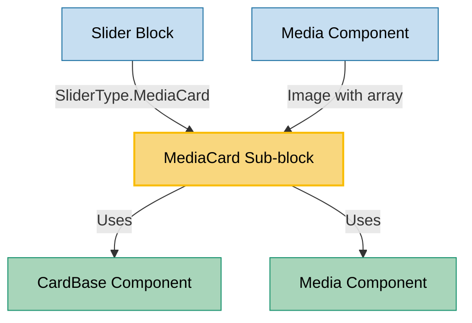

# MediaCard Sub-block Usage

This document outlines how the MediaCard sub-block is used across blocks, sub-blocks, and components in the page-constructor project.

## Overview

The MediaCard sub-block is a versatile component that displays various types of media content (images, videos, YouTube videos, DataLens visualizations) within a card container. It provides a simple way to present media content with an optional border. The component leverages the CardBase component for structure and the Media component for rendering different media types.

## Usage Graph



## Component Details

### MediaCard Sub-block

- **File**: `src/sub-blocks/MediaCard/MediaCard.tsx`
- **Description**: Displays media content (images, videos, YouTube videos, DataLens visualizations) within a card container.
- **Props**:
  - `border`: Border style for the card - 'shadow', 'line', or 'none'
  - `analyticsEvents`: Analytics events to track interactions with the card
  - `...mediaProps`: All props from MediaProps interface, including:
    - `image`: Image or array of images to display
    - `video`: Video configuration
    - `youtube`: YouTube video URL
    - `dataLens`: DataLens visualization ID or configuration
    - `videoIframe`: Video iframe URL
    - `iframe`: Iframe configuration
    - `color`: Background color
    - `height`: Fixed height for the media content
    - `previewImg`: Preview image for video content
    - `parallax`: Enable parallax effect for images
    - `fullscreen`: Enable fullscreen mode for media
    - `videoMicrodata`: Metadata for video content

## Usage Patterns

### In Components

#### Media Component (Image with Array)

- **File**: `src/components/Media/Image/Image.tsx`
- **Usage**: When an array of images is provided to the Media component, it creates a slider using SliderBlock with SliderType.MediaCard.
- **Implementation**:

  ```tsx
  const imageSlider = (imageArray: ImageProps[]) => {
    const fullscreenItem = fullscreen === undefined || fullscreen;

    return (
      <SliderBlock slidesToShow={1} type={SliderType.MediaCard}>
        {imageArray.map((item, index) => (
          <React.Fragment key={index}>
            {fullscreenItem
              ? renderFullscreenImage(item, {items: imageArray, initialIndex: index})
              : imageOnly(item)}
          </React.Fragment>
        ))}
      </SliderBlock>
    );
  };
  ```

## Component Structure

The MediaCard component has a simple structure:

1. **CardBase Container**: Provides the card structure with optional border
2. **CardBase.Content**: Contains the media content
3. **Media Component**: Renders the appropriate media type based on provided props

### Internal Structure

```tsx
const MediaCard = ({border, analyticsEvents, ...mediaProps}: MediaCardProps) => (
  <CardBase
    className={b()}
    bodyClassName={b('body')}
    border={border}
    analyticsEvents={analyticsEvents}
  >
    <CardBase.Content>
      <Media {...mediaProps} />
    </CardBase.Content>
  </CardBase>
);
```

## Media Types Support

The MediaCard component supports various media types through the Media component:

### Image

```tsx
<MediaCard
  image={{
    src: '/path/to/image.jpg',
    alt: 'Image description',
    disableCompress: true,
  }}
/>
```

### Image Slider

```tsx
<MediaCard image={['/path/to/image1.jpg', '/path/to/image2.jpg', '/path/to/image3.jpg']} />
```

### Video

```tsx
<MediaCard
  video={{
    src: ['/path/to/video.webm', '/path/to/video.mp4', '/path/to/fallback.png'],
    loop: {
      start: 0,
    },
  }}
/>
```

### YouTube Video

```tsx
<MediaCard youtube="https://youtu.be/videoId" previewImg="/path/to/preview.png" />
```

### DataLens Visualization

```tsx
<MediaCard dataLens="dataLensId" />
```

## Border Styles

The component supports different border styles:

- `shadow`: Card has a shadow effect
- `line`: Card has a line border
- `none`: Card has no border

## Integration with Analytics

The MediaCard component supports analytics tracking through the `analyticsEvents` prop:

```tsx
<MediaCard
  image="/path/to/image.jpg"
  analyticsEvents={{
    name: 'media-card-click',
    type: 'default-event',
  }}
/>
```

## Best Practices

1. **Media Selection**:

   - Choose appropriate media type for the content you want to display
   - Provide fallback images for videos when possible
   - Use appropriate image formats and sizes for optimal performance

2. **Border Usage**:

   - Use `shadow` border for elevated appearance
   - Use `line` border for subtle separation
   - Use `none` border for seamless integration

3. **Accessibility**:
   - Provide alt text for images
   - Include appropriate ARIA attributes for interactive media
   - Ensure videos have proper controls and captions when needed

## Example Usage

### Basic Image MediaCard

```tsx
<MediaCard
  image={{
    src: '/path/to/image.jpg',
    alt: 'Image description',
  }}
/>
```

### Video MediaCard

```tsx
<MediaCard
  video={{
    src: ['/path/to/video.webm', '/path/to/video.mp4'],
    loop: true,
    muted: true,
    autoplay: true,
  }}
/>
```

### YouTube MediaCard

```tsx
<MediaCard youtube="https://youtu.be/videoId" previewImg="/path/to/preview.png" />
```

### DataLens MediaCard

```tsx
<MediaCard dataLens="dataLensId" />
```

### MediaCard with Border

```tsx
<MediaCard image="/path/to/image.jpg" border="shadow" />
```

### MediaCard with Analytics

```tsx
<MediaCard
  image="/path/to/image.jpg"
  analyticsEvents={[
    {
      name: 'media-card-view',
      type: 'default-event',
    },
    {
      name: 'media-card-click',
      type: 'default-event',
    },
  ]}
/>
```

## Storybook Documentation

The MediaCard component includes Storybook stories demonstrating:

- Image display
- Image slider
- Video playback
- YouTube video embedding
- DataLens visualization

Stories are located in `src/sub-blocks/MediaCard/__stories__/MediaCard.stories.tsx` with example data in `data.json`.
