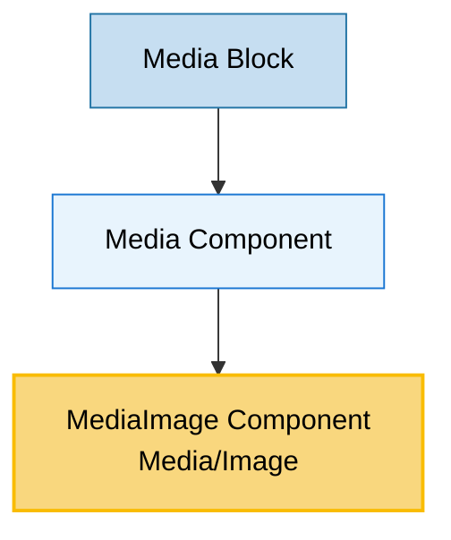

# MediaImage Component Usage

This document outlines how the MediaImage component (from Media/Image) is used in the page-constructor project.

## Overview

The MediaImage component is an internal specialized media component that handles image rendering with advanced features like parallax effects, fullscreen display, background mode, and slider functionality for image arrays. It serves as a wrapper around other image components (FullscreenImage, BackgroundImage, ImageView) and is used exclusively within the Media component to provide unified image handling.

## Usage Graph



## Component Details

### MediaImage Component (Media/Image)

- **File**: `src/components/Media/Image/Image.tsx`
- **Description**: Advanced image component with parallax, fullscreen, background, and slider capabilities. Used internally by the Media component.
- **Props**:
  - `image`: ImageProps or ImageProps[] - image data (required)
  - `parallax`: boolean - enables parallax scrolling effect
  - `height`: number - fixed height for the image
  - `imageClassName`: string - CSS class for the image element
  - `isBackground`: boolean - renders as background image
  - `fullscreen`: boolean - enables fullscreen functionality
  - `disableImageSliderForArrayInput`: boolean - disables slider for image arrays
  - `video`: VideoProps - associated video data
  - `hasVideoFallback`: boolean - indicates video fallback availability
  - `onLoad`: () => void - callback when image loads
  - `qa`: string - QA attribute for testing

### getMediaImage Utility

- **File**: `src/components/Media/Image/utils.ts`
- **Description**: Utility function that normalizes image props from string or object format.
- **Usage**: `getMediaImage(image: ImageProps)` - converts string URLs to image objects

## Usage Patterns

> **Note**: The MediaImage component is used exclusively within the Media component and is not directly imported or used by other components in the system.

### In Media Component

#### Media Component

- **File**: `src/components/Media/Media.tsx`
- **Usage**: Primary and only direct user of the MediaImage component, handling media display with video integration.
- **Implementation**:

  ```tsx
  if (image) {
    result.push(
      <Image
        key="image"
        parallax={parallax}
        image={image}
        disableImageSliderForArrayInput={disableImageSliderForArrayInput}
        height={height}
        imageClassName={imageClassName}
        isBackground={isBackground}
        video={video}
        hasVideoFallback={hasVideoFallback}
        fullscreen={fullscreen}
        qa={qaAttributes.image}
        onLoad={onImageLoad}
      />,
    );
  }
  ```

### Indirect Usage Through Media Component

The MediaImage component is used indirectly through the Media component in:

#### Media Block

- **File**: `src/blocks/Media/Media.tsx`
- **Usage**: Uses Media component which internally uses MediaImage for image rendering.

## Image Rendering Modes

The MediaImage component supports multiple rendering modes based on props:

### Standard Image Mode (Default)

- Uses `ImageView` component internally
- Standard image display with optional height
- Supports onLoad callback

```tsx
// Used internally by Media component
<Image image="/path/to/image.jpg" onLoad={handleLoad} />
```

### Background Image Mode

- Uses `BackgroundImage` component internally
- Renders as CSS background image
- Supports parallax effects

```tsx
// Used internally by Media component
<Image image="/path/to/image.jpg" isBackground={true} parallax={true} height={400} />
```

### Fullscreen Image Mode

- Uses `FullscreenImage` component internally
- Enables fullscreen viewing functionality
- Includes zoom and navigation controls

```tsx
// Used internally by Media component
<Image image="/path/to/image.jpg" fullscreen={true} />
```

### Image Slider Mode

- Uses `SliderBlock` component internally
- Automatically activated for image arrays
- Can be disabled with `disableImageSliderForArrayInput`

```tsx
// Used internally by Media component
<Image image={['/path/to/image1.jpg', '/path/to/image2.jpg', '/path/to/image3.jpg']} />
```

## Parallax Effects

The MediaImage component supports parallax scrolling effects:

### Parallax Configuration

- Enabled with `parallax={true}` prop
- Uses React Spring for smooth animations
- Automatically calculates scroll-based transforms
- Requires `height` prop for proper effect

### Implementation Details

```tsx
// Parallax effect calculation
const parallaxLevel = 2;
springSetScrollY.start({
  springScrollY: height && scrollY > height ? height : scrollY,
});
parallaxInterpolate = springScrollY.to(
  (value) => `translateY(-${Number(value) / parallaxLevel}px)`,
);
```

## Integration with Theme System

The MediaImage component integrates with the page-constructor theme system:

1. **Theme Processing**: Uses `getThemedValue()` utility to resolve themed images
2. **Image Processing**: Uses `getMediaImage()` utility to normalize image props
3. **Component Integration**: Works seamlessly with other themed components
4. **Responsive Images**: Supports device-specific image variants

## Image Props Support

The component supports flexible image input formats:

### String URL

```tsx
image: '/path/to/image.jpg';
```

### Image Object

```tsx
image: {
  src: "/path/to/image.jpg",
  alt: "Image description",
  width: 800,
  height: 600
}
```

### Device-specific Images

```tsx
image: {
  desktop: "/path/to/desktop-image.jpg",
  mobile: "/path/to/mobile-image.jpg"
}
```

### Themed Images

```tsx
image: {
  light: "/path/to/light-image.jpg",
  dark: "/path/to/dark-image.jpg"
}
```

### Image Arrays (Slider)

```tsx
image: [
  '/path/to/image1.jpg',
  '/path/to/image2.jpg',
  {
    src: '/path/to/image3.jpg',
    alt: 'Third image',
  },
];
```

## Best Practices

1. **Internal Usage**: MediaImage is designed for internal use within the Media component only.

2. **Image Processing**: The Media component handles `getMediaImage()` utility usage automatically.

3. **Theme Support**: Theme resolution is handled by the Media component before passing to MediaImage.

4. **Performance**: Consider using appropriate image formats and sizes for different use cases.

5. **Accessibility**: Alt text and accessibility features are handled by the underlying image components.

6. **Responsive Design**: Device-specific images are supported through the image props structure.

7. **Parallax Usage**: Parallax effects should be used sparingly and only when they enhance the user experience.

8. **Fullscreen Mode**: Fullscreen functionality is automatically available when enabled through Media component props.

9. **Array Handling**: Image arrays automatically trigger slider functionality unless explicitly disabled.

## Example Usage Through Media Component

### Basic Image Display

```tsx
<Media image="/path/to/image.jpg" />
```

### Background Image with Parallax

```tsx
<Media image="/path/to/background.jpg" isBackground={true} parallax={true} height={500} />
```

### Fullscreen Image Gallery

```tsx
<Media
  image={['/path/to/image1.jpg', '/path/to/image2.jpg', '/path/to/image3.jpg']}
  fullscreen={true}
/>
```

### Mixed Media with Video

```tsx
<Media
  image="/path/to/preview.jpg"
  video={{
    src: ['/path/to/video.mp4'],
    type: 'video/mp4',
  }}
  height={400}
/>
```

## Storybook Documentation

The MediaImage component is documented through the Media component stories, which demonstrate:

- Different image rendering modes
- Parallax effects
- Fullscreen functionality
- Image slider behavior
- Integration with video content

Stories are located in `src/components/Media/__stories__/Media.stories.tsx` with example data in `data.json`.

## Testing

The MediaImage component includes comprehensive tests covering:

- Different rendering modes (standard, background, fullscreen)
- Parallax effect functionality
- Image array handling and slider behavior
- Theme integration
- Accessibility features

Test files are located in the respective `__tests__` directories of the Media component.

## CSS Classes

The component uses BEM methodology for CSS classes:

- `.media-component-image` - Main container
- `.media-component-image__item` - Individual image item
- `.media-component-image__item_with-video` - Item with video modifier
- Animation and parallax-related classes are handled by child components

## Architecture Notes

The MediaImage component is part of a layered architecture:

1. **Media Component**: Public API for media rendering
2. **MediaImage Component**: Internal image handling with advanced features
3. **Base Image Components**: FullscreenImage, BackgroundImage, ImageView
4. **ImageBase Component**: Core image rendering functionality

This architecture ensures that advanced image features are encapsulated within the Media system while maintaining clean separation of concerns.
