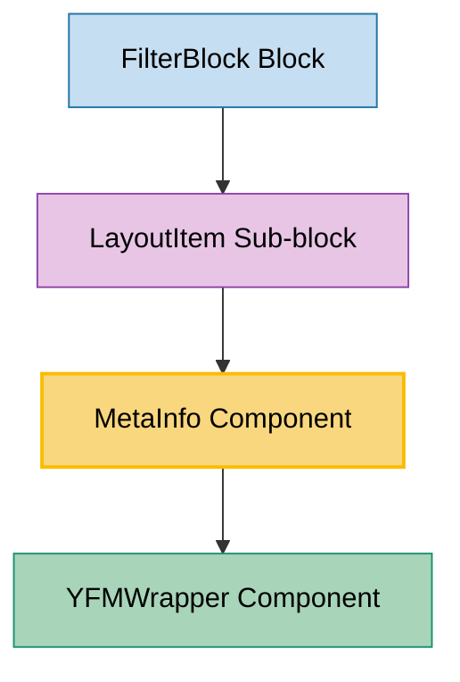

# MetaInfo Component Usage

This document outlines how the MetaInfo component is used across blocks, sub-blocks, and components in the page-constructor project.

## Overview

The MetaInfo component is a utility component that displays metadata information as a list of items. It renders each item using YFMWrapper to support Yandex Flavored Markdown formatting. The component is designed to show additional contextual information in various layouts throughout the page constructor system.

## Usage Graph



## Component Details

### MetaInfo Component

- **File**: `src/components/MetaInfo/MetaInfo.tsx`
- **Description**: Displays a list of metadata items with YFM support for rich text formatting.
- **Props**:
  - `items`: Array of strings containing metadata items (required)
  - `className`: Optional CSS class name for the container

### MetaInfpoProps Interface

- **Description**: Defines the props structure for the MetaInfo component.
- **Properties**:
  - `items: string[]`: Array of metadata items to display (required)
  - `className?: string`: Optional CSS class name extending ClassNameProps

## Usage Patterns

> **Note**: In the code examples below, `b()` is a utility function used throughout the page-constructor project for BEM (Block Element Modifier) class naming. It generates CSS class names following the BEM methodology, making the code more maintainable and consistent.

### In Sub-blocks

#### LayoutItem Sub-block

- **File**: `src/sub-blocks/LayoutItem/LayoutItem.tsx`
- **Usage**: Displays metadata information above the main content area when metaInfo prop is provided.
- **Implementation**:

  ```tsx
  const LayoutItem = ({
    content: {links, ...content},
    contentMargin = 'm',
    metaInfo,
    media,
    border,
    fullscreen,
    icon,
    className,
    analyticsEvents,
    controlPosition = 'content',
  }: LayoutItemProps) => {
    // ... other logic

    return (
      <div className={b(null, className)}>
        {renderMedia()}
        {metaInfo && <MetaInfo items={metaInfo} className={b('meta-info')} />}
        <div className={b('content', {'no-media': !media, margin: contentMargin})}>
          <IconWrapper icon={themedIcon} className={b('wrapper')}>
            <Content {...contentProps} titleId={titleId} />
          </IconWrapper>
        </div>
      </div>
    );
  };
  ```

## Integration with YFM System

The MetaInfo component integrates with the page-constructor YFM (Yandex Flavored Markdown) system:

1. **YFMWrapper Integration**: Each metadata item is rendered through YFMWrapper component for rich text support
2. **Constructor Modifiers**: Uses specific modifiers (`constructor: true, constructorMetaInfo: true`) for proper styling
3. **Markdown Support**: Supports all YFM features including links, formatting, and other markdown elements

## Layout and Styling

### HTML Structure

The component renders as an `h4` element containing multiple YFMWrapper components:

```html
<h4 class="meta-info">
  <div class="meta-info__item"><!-- First item --></div>
  <div class="meta-info__item"><!-- Second item --></div>
  <!-- ... more items -->
</h4>
```

### CSS Classes Applied

- `.meta-info`: Main container class
- `.meta-info__item`: Individual metadata item class (applied by YFMWrapper)

## Usage in Block Hierarchy

### FilterBlock Block

- **File**: `src/blocks/FilterBlock/FilterBlock.tsx`
- **Usage**: Uses CardLayoutBlock which can contain LayoutItem sub-blocks that may include MetaInfo
- **Implementation**: MetaInfo appears in filtered card items when metaInfo data is provided

## Data Processing

### YFM Transformation

In Storybook stories and data processing, metadata items often go through YFM transformation:

```tsx
// Example from LayoutItem stories
MetaInfo.args = {
  metaInfo: data.metaInfo.content.metaInfo.map((item) => yfmTransform(item)),
} as LayoutItemProps;
```

This ensures that markdown content in metadata items is properly processed before rendering.

## Best Practices

1. **Content Structure**: Keep metadata items concise and relevant to the content they describe.

2. **YFM Usage**: Leverage YFM features for rich formatting when needed, but avoid overly complex markup in metadata.

3. **Semantic HTML**: The component uses `h4` element, making it semantically appropriate for metadata headings.

4. **Conditional Rendering**: Always check if metaInfo exists before rendering the component to avoid empty containers.

5. **Styling Consistency**: Use the provided BEM class structure for consistent styling across the application.

## Example Usage

### Basic MetaInfo Display

```tsx
<MetaInfo
  items={['Category: Technology', 'Date: 2023-12-01', 'Author: John Doe']}
  className="custom-meta-info"
/>
```

### With YFM Formatting

```tsx
const metaItems = [
  '**Category:** Technology',
  '*Published:* December 1, 2023',
  '[Author Profile](https://example.com/author)',
];

<MetaInfo items={metaItems} />;
```

### In LayoutItem Context

```tsx
<LayoutItem
  content={{
    title: 'Article Title',
    text: 'Article content...',
  }}
  metaInfo={['Technology', '5 min read', 'Published: Dec 1, 2023']}
  media={articleImage}
/>
```

## Storybook Documentation

The MetaInfo component includes Storybook stories demonstrating:

- Default rendering with simple text items
- Various metadata formats
- Integration with other components

Stories are located in `src/components/MetaInfo/__stories__/MetaInfo.stories.tsx` with example data in `data.json`.

## Testing

The MetaInfo component can be tested for:

- Proper rendering of all provided items
- YFMWrapper integration and markdown processing
- CSS class application
- Conditional rendering behavior

Test files would be located in `src/components/MetaInfo/__tests__/MetaInfo.test.tsx`.

## Accessibility Considerations

1. **Semantic Structure**: Uses `h4` element for proper heading hierarchy
2. **Screen Reader Support**: Each metadata item is properly structured for screen readers
3. **Keyboard Navigation**: Inherits keyboard navigation from YFMWrapper for interactive elements
4. **ARIA Support**: Benefits from YFMWrapper's ARIA implementations for complex content
