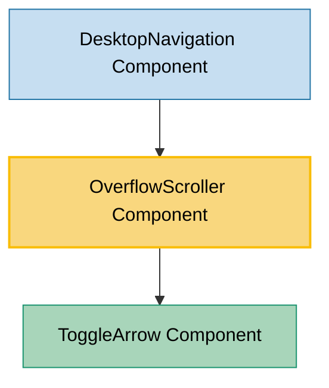

# OverflowScroller Component Usage

This document outlines how the OverflowScroller component is used across blocks, sub-blocks, and components in the page-constructor project.

## Overview

The OverflowScroller component is a utility component that creates scrollable containers for overflowing content. It automatically detects when content overflows its container and provides navigation arrows to scroll through the content horizontally. The component is particularly useful for navigation menus, lists, and other horizontal content that may not fit within the available space.

## Usage Graph



## Component Details

### OverflowScroller Component

- **File**: `src/components/OverflowScroller/OverflowScroller.tsx`
- **Description**: Creates scrollable containers with navigation arrows for horizontally overflowing content.
- **Props**:
  - `className`: Optional CSS class name for the main container
  - `onScrollStart`: Optional callback function triggered when scrolling starts
  - `onScrollEnd`: Optional callback function triggered when scrolling ends (after transition)
  - `arrowSize`: Size of the navigation arrows in pixels (defaults to 18)
  - `arrowClassName`: Optional CSS class name for the arrow buttons
  - `children`: React children to be rendered inside the scrollable container

### Component State

- **arrows**: Array of visible arrow directions (`'left'` | `'right'`)
- **scrollValue**: Current horizontal scroll position in pixels

### Key Features

1. **Automatic Overflow Detection**: Detects when content overflows and shows/hides arrows accordingly
2. **Smooth Scrolling**: Provides smooth horizontal scrolling with CSS transitions
3. **Responsive**: Automatically adjusts to window resize events
4. **Accessibility**: Includes proper ARIA labels for navigation arrows
5. **Internationalization**: Supports multiple languages for arrow labels

## Usage Patterns

> **Note**: In the code examples below, `b()` is a utility function used throughout the page-constructor project for BEM (Block Element Modifier) class naming. It generates CSS class names following the BEM methodology, making the code more maintainable and consistent.

### In Navigation Components

#### DesktopNavigation Component

- **File**: `src/navigation/components/DesktopNavigation/DesktopNavigation.tsx`
- **Usage**: Provides horizontal scrolling for navigation menus when they overflow the available space.
- **Implementation**:

  ```tsx
  // Main navigation links
  <div className={b('navigation-container')}>
    <OverflowScroller className={b('navigation')} onScrollStart={onActiveItemChange}>
      <NavigationList
        items={leftItemsWithIconSize}
        onActiveItemChange={onActiveItemChange}
        className={b('links')}
        itemClassName={b('item')}
        column={ItemColumnName.Left}
        activeItemId={activeItemId}
        menuLayout={NavigationLayout.Desktop}
      />
    </OverflowScroller>
  </div>

  // Mobile navigation items
  <div className={b('mobile-navigation-container')}>
    <OverflowScroller
      className={b('mobile-navigation')}
      onScrollStart={onActiveItemChange}
      arrowSize={18}
    >
      <NavigationList
        items={customMobileHeaderItems}
        onActiveItemChange={onActiveItemChange}
        className={b('mobile-buttons')}
        itemClassName={b('item')}
        column={ItemColumnName.Left}
        activeItemId={activeItemId}
        menuLayout={NavigationLayout.Dropdown}
      />
    </OverflowScroller>
  </div>
  ```

## Technical Implementation

### Overflow Detection

The component uses a debounced resize listener and ref measurements to detect overflow:

```tsx
private checkOverflow = debounce(() => {
  if (this.containerRef.current && this.wrapperRef.current) {
    const containerWidth = this.containerRef.current.offsetWidth;
    const wrapperWidth = this.wrapperRef.current.offsetWidth;
    const arrows: Arrow[] = wrapperWidth < containerWidth ? [] : ['right'];

    this.setState({scrollValue: 0, arrows});
  }
}, 100);
```

### Scroll Calculation

The component calculates scroll distances based on container and content dimensions:

- **Container Width**: Available space for content
- **Wrapper Width**: Total width of all content
- **Hidden Width**: Amount of content that's currently hidden
- **Delta**: Amount to scroll per arrow click
- **Padding**: Additional spacing when both arrows are visible

### Arrow State Management

The component manages arrow visibility based on scroll position:

- **Right Arrow Only**: When content overflows but not scrolled
- **Both Arrows**: When partially scrolled
- **Left Arrow Only**: When scrolled to the end

## Integration with Theme System

The OverflowScroller component integrates with the page-constructor theme system:

1. **ToggleArrow Integration**: Uses the ToggleArrow component for consistent arrow styling
2. **CSS Classes**: Applies BEM-style classes for theming support
3. **Internationalization**: Uses the i18n system for arrow labels

## Accessibility Features

1. **ARIA Labels**: Navigation arrows include proper `aria-label` attributes
2. **Keyboard Navigation**: Buttons are focusable and keyboard accessible
3. **Screen Reader Support**: Arrow labels are translated and meaningful
4. **Event Handling**: Proper event propagation control

## Performance Considerations

1. **Debounced Resize**: Resize events are debounced to prevent excessive calculations
2. **Transition Timing**: Scroll end callbacks are timed to match CSS transitions
3. **Event Cleanup**: Proper cleanup of event listeners on unmount
4. **Ref Usage**: Direct DOM measurements for accurate calculations

## Best Practices

1. **Container Sizing**: Ensure the parent container has a defined width for proper overflow detection

2. **Content Structure**: Wrap scrollable content in a flex container for horizontal layout:

   ```tsx
   <OverflowScroller>
     <div style={{display: 'flex'}}>{/* Scrollable items */}</div>
   </OverflowScroller>
   ```

3. **Callback Usage**: Use `onScrollStart` and `onScrollEnd` for coordinating with other UI updates

4. **Arrow Sizing**: Adjust `arrowSize` prop to match your design system

5. **Responsive Design**: The component automatically handles responsive behavior, but ensure your content is also responsive

## CSS Structure

The component generates the following CSS class structure:

```scss
.overflow-scroller {
  // Main container styles

  &__container {
    // Scrollable area container

    &_padding-left {
      // Left padding when left arrow is visible
    }

    &_padding-right {
      // Right padding when right arrow is visible
    }
  }

  &__wrapper {
    // Content wrapper with transform for scrolling
  }

  &__arrow {
    // Arrow button styles

    &_type_left {
      // Left arrow positioning
    }

    &_type_right {
      // Right arrow positioning
    }
  }
}
```

## Example Usage

### Basic Horizontal Scrolling

```tsx
<OverflowScroller>
  <div style={{display: 'flex'}}>
    <div>Item 1</div>
    <div>Item 2</div>
    <div>Item 3</div>
    {/* More items... */}
  </div>
</OverflowScroller>
```

### With Callbacks and Custom Arrow Size

```tsx
<OverflowScroller
  onScrollStart={() => console.log('Scrolling started')}
  onScrollEnd={() => console.log('Scrolling ended')}
  arrowSize={24}
  className="custom-scroller"
>
  <NavigationList items={navigationItems} />
</OverflowScroller>
```

### Navigation Menu Implementation

```tsx
<div className="navigation-container">
  <OverflowScroller className="navigation-scroller" onScrollStart={handleActiveItemChange}>
    <ul className="navigation-list">
      {menuItems.map((item) => (
        <li key={item.id} className="navigation-item">
          <a href={item.url}>{item.title}</a>
        </li>
      ))}
    </ul>
  </OverflowScroller>
</div>
```

## Internationalization

The component supports internationalization for arrow labels:

- **English**: "Previous" / "Next"
- **Russian**: "Предыдущий" / "Следующий"

Labels are automatically applied to arrow buttons for screen reader accessibility.

## Storybook Documentation

The OverflowScroller component includes Storybook stories demonstrating:

- Basic horizontal scrolling functionality
- Overflow detection and arrow visibility
- Responsive behavior
- Integration with various content types

Stories are located in `src/components/OverflowScroller/__stories__/OverflowScroller.stories.tsx`.

## Testing

The component should be tested for:

- Overflow detection accuracy
- Scroll calculation correctness
- Arrow state management
- Responsive behavior
- Accessibility compliance
- Event handling and cleanup

## Common Use Cases

1. **Navigation Menus**: Horizontal navigation that may overflow on smaller screens
2. **Tab Lists**: Tabbed interfaces with many tabs
3. **Button Groups**: Collections of buttons that need horizontal scrolling
4. **Image Galleries**: Horizontal image carousels
5. **Tag Lists**: Lists of tags or chips that may overflow
6. **Breadcrumbs**: Long breadcrumb trails that need scrolling
