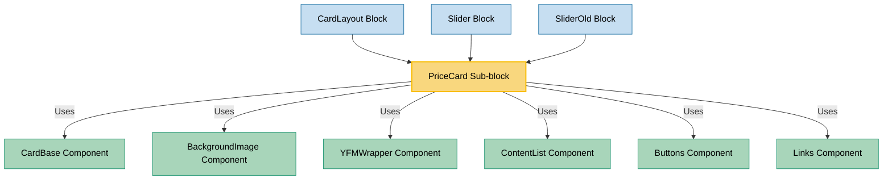

# PriceCard Sub-block Usage

This document outlines how the PriceCard sub-block is used across blocks, sub-blocks, and components in the page-constructor project.

## Overview

The PriceCard sub-block is a specialized component designed for displaying pricing information in a structured card format. It presents pricing details including a title, price value, optional price period, description, feature list, and call-to-action elements like buttons and links. The component supports different themes (default, light, dark) and can be customized with background colors to create visually distinct pricing cards.

## Usage Graph



## Component Details

### PriceCard Sub-block

- **File**: `src/sub-blocks/PriceCard/PriceCard.tsx`
- **Description**: Displays pricing information in a card format with title, price, optional period, description, feature list, and call-to-action elements.
- **Props**:
  - `title`: Card title with YFM support (required)
  - `price`: Price value as a string (required)
  - `pricePeriod`: Optional period for the price (e.g., "month", "year")
  - `priceDetails`: Optional additional details about the price
  - `theme`: Visual theme - default, 'light', or 'dark'
  - `description`: Optional description text
  - `list`: Optional array of feature items with Check icon
  - `buttons`: Optional array of button objects
  - `links`: Optional array of link objects
  - `backgroundColor`: Optional background color (useful with light/dark themes)
  - `border`: Border style - 'line', 'shadow', or 'none' (inherited from CardBase)

## Usage Patterns

> **Note**: In the code examples below, `b()` is a utility function used throughout the page-constructor project for BEM (Block Element Modifier) class naming. It generates CSS class names following the BEM methodology, making the code more maintainable and consistent.

### In Blocks

#### CardLayout Block

- **File**: `src/blocks/CardLayout/CardLayout.tsx`
- **Usage**: Used as a child component within the CardLayout block to display pricing cards in a grid.
- **Implementation**:
  ```tsx
  <CardLayout title="Pricing options" description="Choose the plan that works best for you">
    <PriceCard
      title="Basic"
      price="$9.99"
      pricePeriod="month"
      priceDetails="Billed annually"
      description="Perfect for individuals"
      list={['Feature 1', 'Feature 2', 'Feature 3']}
      buttons={[
        {
          text: 'Get Started',
          url: 'https://example.com/basic',
          theme: 'action',
          width: 'max',
        },
      ]}
    />
    <PriceCard
      title="Professional"
      price="$19.99"
      pricePeriod="month"
      priceDetails="Billed annually"
      description="Great for small teams"
      theme="light"
      backgroundColor="#CCDAFF"
      list={['All Basic features', 'Feature 4', 'Feature 5']}
      buttons={[
        {
          text: 'Get Started',
          url: 'https://example.com/pro',
          theme: 'monochrome',
          width: 'max',
        },
      ]}
    />
    <PriceCard
      title="Enterprise"
      price="$49.99"
      pricePeriod="month"
      priceDetails="Billed annually"
      description="For large organizations"
      theme="dark"
      backgroundColor="#262626"
      list={['All Professional features', 'Feature 6', 'Feature 7']}
      buttons={[
        {
          text: 'Contact Sales',
          url: 'https://example.com/enterprise',
          theme: 'normal-contrast',
          width: 'max',
        },
      ]}
    />
  </CardLayout>
  ```

#### Slider Block

- **File**: `src/blocks/Slider/Slider.tsx`
- **Usage**: Used as a child component within the Slider block to display pricing cards in a carousel.
- **Implementation**:
  ```tsx
  <Slider
    title="Pricing options"
    description="Choose the plan that works best for you"
    arrows={true}
    dots={true}
  >
    <PriceCard
      title="Basic"
      price="$9.99"
      pricePeriod="month"
      priceDetails="Billed annually"
      description="Perfect for individuals"
      list={['Feature 1', 'Feature 2', 'Feature 3']}
      buttons={[
        {
          text: 'Get Started',
          url: 'https://example.com/basic',
          theme: 'action',
          width: 'max',
        },
      ]}
    />
    <PriceCard
      title="Professional"
      price="$19.99"
      pricePeriod="month"
      priceDetails="Billed annually"
      description="Great for small teams"
      theme="light"
      backgroundColor="#CCDAFF"
      list={['All Basic features', 'Feature 4', 'Feature 5']}
      buttons={[
        {
          text: 'Get Started',
          url: 'https://example.com/pro',
          theme: 'monochrome',
          width: 'max',
        },
      ]}
    />
    <PriceCard
      title="Enterprise"
      price="$49.99"
      pricePeriod="month"
      priceDetails="Billed annually"
      description="For large organizations"
      theme="dark"
      backgroundColor="#262626"
      list={['All Professional features', 'Feature 6', 'Feature 7']}
      buttons={[
        {
          text: 'Contact Sales',
          url: 'https://example.com/enterprise',
          theme: 'normal-contrast',
          width: 'max',
        },
      ]}
    />
  </Slider>
  ```

#### SliderOld Block (Deprecated)

- **File**: `src/blocks/SliderOld/SliderOld.tsx`
- **Usage**: Used as a child component within the SliderOld block to display pricing cards in a carousel.
- **Implementation**:
  ```tsx
  <SliderOld
    title="Pricing options"
    description="Choose the plan that works best for you"
    arrows={true}
    dots={true}
  >
    <PriceCard
      title="Basic"
      price="$9.99"
      pricePeriod="month"
      description="Perfect for individuals"
      list={['Feature 1', 'Feature 2', 'Feature 3']}
      buttons={[
        {
          text: 'Get Started',
          url: 'https://example.com/basic',
          theme: 'action',
          width: 'max',
        },
      ]}
    />
    {/* Other pricing cards */}
  </SliderOld>
  ```

## Component Structure

The PriceCard component is composed of several key parts:

1. **CardBase**: Provides the base card functionality including border styles
2. **BackgroundImage**: Renders the background color when specified
3. **Content Area**: Contains the pricing information, description, feature list, and call-to-action elements

### Internal Structure

```tsx
<CardBase className={b({theme})} border={border}>
  <CardBase.Content key="content">
    <BackgroundImage className={b('background')} style={{backgroundColor}} />
    <div className={b('content', {theme})}>
      <div className={b('info')}>
        <YFMWrapper
          content={title}
          contentClassName={b('title')}
          onlyContent
          modifiers={{constructor: true}}
        />
        <div className={b('price')}>
          <div>
            <span className={b('price-value')}>{price}</span>
            {pricePeriod && <span className={b('price-period')}>/ {pricePeriod}</span>}
          </div>
          {priceDetails && <div className={b('price-details')}>{priceDetails}</div>}
        </div>
        {description && <div className={b('description')}>{description}</div>}
        {list?.length ? (
          <div className={b('list')}>
            <ContentList
              list={list.map((item) => ({
                icon: Check,
                text: item,
              }))}
              size="s"
            />
          </div>
        ) : null}
      </div>
      <Buttons className={b('buttons')} buttons={buttons} size="s" />
      <Links className={b('links')} links={links} size="s" />
    </div>
  </CardBase.Content>
</CardBase>
```

## Theme Support

The PriceCard component supports three themes:

1. **Default**: Standard styling
2. **Light**: Light-colored styling, often paired with a light background color
3. **Dark**: Dark-colored styling, often paired with a dark background color

The theme affects text colors and link styling:

```scss
&__content {
  &_theme {
    &_dark {
      color: var(--g-color-text-light-primary);
      --g-color-line-focus: var(--pc-color-line-focus-dark);

      #{$block}__info .yfm,
      #{$block}__info .yfm * {
        color: var(--g-color-text-light-primary);
      }

      #{$block}__info a {
        text-decoration: underline;

        &:hover {
          color: var(--g-color-text-light-secondary);
        }
      }
    }

    &_light {
      color: var(--g-color-text-dark-primary);

      #{$block}__info .yfm,
      #{$block}__info .yfm * {
        color: var(--g-color-text-dark-primary);
      }

      #{$block}__info a {
        text-decoration: underline;

        &:hover {
          color: var(--g-color-text-dark-secondary);
        }
      }
    }
  }
}
```

## Feature List

The PriceCard component uses the ContentList component to display a list of features with a Check icon:

```tsx
<ContentList
  list={list.map((item) => ({
    icon: Check,
    text: item,
  }))}
  size="s"
/>
```

## Call-to-Action Elements

The PriceCard component supports two types of call-to-action elements:

1. **Buttons**: Primary call-to-action elements
2. **Links**: Secondary call-to-action elements

These elements are rendered at the bottom of the card:

```tsx
<Buttons className={b('buttons')} buttons={buttons} size="s" />
<Links className={b('links')} links={links} size="s" />
```

## Best Practices

1. **Content Structure**:

   - Provide clear and concise pricing information
   - Use the feature list to highlight key benefits
   - Include a primary call-to-action button for the main conversion action

2. **Theme Usage**:

   - Use the default theme for standard pricing cards
   - Use the light theme with a light background color for highlighted or featured pricing tiers
   - Use the dark theme with a dark background color for premium or enterprise pricing tiers

3. **Visual Hierarchy**:

   - Place the most important pricing tier in the middle or with a distinct theme
   - Use consistent pricing formats across all cards
   - Ensure feature lists have parallel structure

4. **Responsive Considerations**:
   - When used in CardLayout, the cards will automatically adjust to the grid layout
   - When used in Slider, the cards will be displayed in a carousel on smaller screens

## Example Usage

### Basic PriceCard

```tsx
<PriceCard
  title="Basic Plan"
  price="$9.99"
  pricePeriod="month"
  description="Perfect for individuals"
  list={['Feature 1', 'Feature 2', 'Feature 3']}
  buttons={[
    {
      text: 'Get Started',
      url: 'https://example.com/basic',
      theme: 'action',
      width: 'max',
    },
  ]}
/>
```

### PriceCard with Light Theme

```tsx
<PriceCard
  title="Professional Plan"
  price="$19.99"
  pricePeriod="month"
  priceDetails="Billed annually"
  description="Great for small teams"
  theme="light"
  backgroundColor="#CCDAFF"
  list={['All Basic features', 'Feature 4', 'Feature 5']}
  buttons={[
    {
      text: 'Get Started',
      url: 'https://example.com/pro',
      theme: 'monochrome',
      width: 'max',
    },
  ]}
/>
```

### PriceCard with Dark Theme

```tsx
<PriceCard
  title="Enterprise Plan"
  price="$49.99"
  pricePeriod="month"
  priceDetails="Billed annually"
  description="For large organizations"
  theme="dark"
  backgroundColor="#262626"
  list={['All Professional features', 'Feature 6', 'Feature 7']}
  buttons={[
    {
      text: 'Contact Sales',
      url: 'https://example.com/enterprise',
      theme: 'normal-contrast',
      width: 'max',
    },
  ]}
/>
```

### PriceCard with Links Instead of Buttons

```tsx
<PriceCard
  title="Free Plan"
  price="$0"
  pricePeriod="month"
  description="Try it out"
  list={['Limited Feature 1', 'Limited Feature 2']}
  links={[
    {
      text: 'Sign Up',
      url: 'https://example.com/signup',
      theme: 'normal',
      arrow: true,
    },
  ]}
/>
```

## Storybook Documentation

The PriceCard component includes Storybook stories demonstrating:

- Default card display
- Various content configurations (with buttons, with links)
- Different themes (default, light, dark)
- Background color customization

Stories are located in `src/sub-blocks/PriceCard/__stories__/PriceCard.stories.tsx` with example data in `data.json`.
