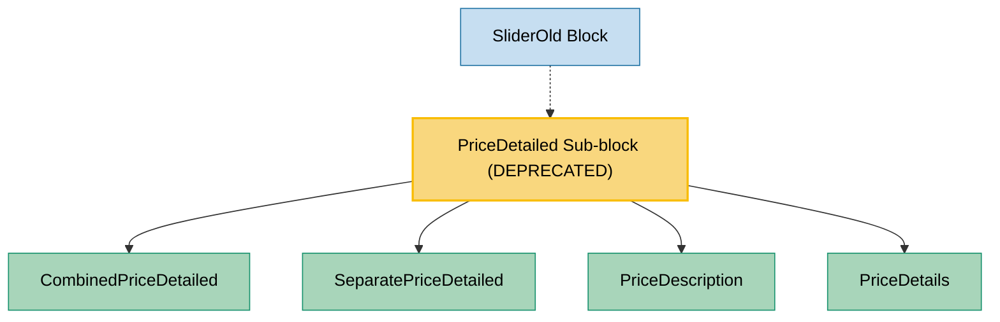

# PriceDetailed Component Usage (DEPRECATED)

This document outlines how the PriceDetailed component is used across blocks, sub-blocks, and components in the page-constructor project.

## Overview

> **IMPORTANT**: The PriceDetailed component is officially deprecated and should not be used for new implementations. Consider using alternative components instead.

The PriceDetailed component is a sub-block that displays detailed pricing information with various configuration options. It supports two main display modes (combined and separate) and two types of price details (settings and marked list). The component is designed to present pricing information in a structured and visually appealing way, with support for labels, titles, descriptions, and detailed feature lists.

## Usage Graph



## Component Details

### PriceDetailed Component (DEPRECATED)

- **File**: `src/sub-blocks/PriceDetailed/PriceDetailed.tsx`
- **Description**: Main component that displays detailed pricing information with various configuration options.
- **Props**:
  - `items`: Array of PriceItemProps objects containing pricing information (required)
  - `priceType`: Type of price details - `PriceDetailsType.SETTINGS` (default) or `PriceDetailsType.MARKED_LIST`
  - `numberGroupItems`: Number of items to group together (1, 3, 4, or 5)
  - `description`: Configuration for description display
  - `details`: Configuration for details display
  - `foldable`: Configuration for foldable details
  - `labelsDefaultText`: Default text for labels by color
  - `isCombined`: Boolean to determine if the display is combined (default: false)
  - `useMixedView`: Boolean to use mixed view (default: false)
  - `border`: Border style for the component

### Internal Components

#### CombinedPriceDetailed Component

- **File**: `src/sub-blocks/PriceDetailed/CombinedPriceDetailed/CombinedPriceDetailed.tsx`
- **Description**: Displays pricing information in a combined layout where multiple price items are grouped together.
- **Props**:
  - `items`: Array of PriceItemProps objects
  - `numberGroupItems`: Number of items to group together
  - `border`: Border style
  - `useMixedView`: Boolean to use mixed view
  - `getDescriptionComponent`: Function to get the description component
  - `getDetailsComponent`: Function to get the details component

#### SeparatePriceDetailed Component

- **File**: `src/sub-blocks/PriceDetailed/SeparatePriceDetailed/SeparatePriceDetailed.tsx`
- **Description**: Displays pricing information in a separate layout where each price item is displayed individually.
- **Props**:
  - `items`: Array of PriceItemProps objects
  - `border`: Border style
  - `getDescriptionComponent`: Function to get the description component
  - `getDetailsComponent`: Function to get the details component

#### PriceDescription Component

- **File**: `src/sub-blocks/PriceDetailed/PriceDescription/PriceDescription.tsx`
- **Description**: Displays the description part of a price item, including title, detailed title, description, and label.
- **Props**:
  - `title`: Title text
  - `detailedTitle`: Detailed title text
  - `description`: Description text
  - `label`: Label configuration
  - `titleSize`: Size of the title
  - `descriptionSize`: Size of the description
  - `colorTitle`: Color of the title
  - `labelsDefaultText`: Default text for labels

#### PriceDetails Component

- **File**: `src/sub-blocks/PriceDetailed/PriceDetails/PriceDetails.tsx`
- **Description**: Displays the details part of a price item, either as a settings list or a marked list.
- **Props**:
  - `items`: Array of price details items
  - `type`: Type of price details
  - `foldable`: Configuration for foldable details
  - `titleSize`: Size of the title
  - `descriptionSize`: Size of the description
  - `useMixedView`: Boolean to use mixed view

## Data Models

### PriceItemProps Interface

- **Description**: Defines the structure of individual price items.
- **Properties**:
  - `title`: Title text (required)
  - `detailedTitle`: Detailed title text (optional)
  - `description`: Description text (required)
  - `label`: Label configuration (optional)
  - `items`: Array of price details items (optional)
  - `analyticsEvents`: Analytics events configuration (optional)

### PriceDetailsType Enum

- **Description**: Defines available types for price details.
- **Values**:
  - `MARKED_LIST`: Displays details as a marked list with bullet points
  - `SETTINGS`: Displays details as a settings list with title and description

### PriceLabelColor Enum

- **Description**: Defines available colors for price labels.
- **Values**:
  - `BLUE`: Blue label color
  - `GREEN`: Green label color
  - `YELLOW`: Yellow label color
  - `PURPLE`: Purple label color
  - `RED`: Red label color

## Usage Patterns

### Display Modes

#### Combined Mode

The combined mode (`isCombined: true`) displays multiple price items grouped together, useful for comparing different pricing tiers side by side.

```tsx
<PriceDetailed
  items={pricingTiers}
  isCombined={true}
  numberGroupItems={3}
  priceType={PriceDetailsType.SETTINGS}
/>
```

#### Separate Mode

The separate mode (`isCombined: false`, default) displays each price item individually, useful for showcasing detailed information about each pricing tier.

```tsx
<PriceDetailed items={pricingTiers} isCombined={false} priceType={PriceDetailsType.MARKED_LIST} />
```

### Price Details Types

#### Settings Type

The settings type (`priceType: PriceDetailsType.SETTINGS`, default) displays details as a list of settings with title and description.

```tsx
<PriceDetailed
  items={[
    {
      title: 'Basic Plan',
      description: 'For individuals and small teams',
      items: [
        {
          title: 'Up to 5 users',
          description: 'Limited to 5 user accounts',
        },
        {
          title: 'Basic support',
          description: 'Email support during business hours',
        },
      ],
    },
  ]}
  priceType={PriceDetailsType.SETTINGS}
/>
```

#### Marked List Type

The marked list type (`priceType: PriceDetailsType.MARKED_LIST`) displays details as a bullet point list.

```tsx
<PriceDetailed
  items={[
    {
      title: 'Basic Plan',
      description: 'For individuals and small teams',
      items: [
        {
          text: 'Up to 5 users',
        },
        {
          text: 'Basic support',
        },
      ],
    },
  ]}
  priceType={PriceDetailsType.MARKED_LIST}
/>
```

### Foldable Details

The component supports foldable details that can be expanded or collapsed.

```tsx
<PriceDetailed
  items={pricingTiers}
  foldable={{
    title: 'Show details',
    size: 's',
  }}
  priceType={PriceDetailsType.MARKED_LIST}
/>
```

### Labels

Price items can include colored labels to highlight special offers or categories.

```tsx
<PriceDetailed
  items={[
    {
      title: "Free",
      description: "For use by individuals and small teams",
      label: {
        color: PriceLabelColor.BLUE,
        text: "Free",
        size: "s"
      },
      items: [...]
    },
    {
      title: "Pro",
      description: "For professional use",
      label: {
        color: PriceLabelColor.GREEN,
        text: "Most Popular",
        size: "s"
      },
      items: [...]
    }
  ]}
  labelsDefaultText={{
    blue: "Default Blue Label",
    green: "Default Green Label",
    yellow: "Default Yellow Label",
    purple: "Default Purple Label",
    red: "Default Red Label"
  }}
/>
```

## Integration with Other Components

### SliderOld Block

The SliderOld block has a TODO comment mentioning PriceDetailed, indicating a planned refactoring:

```tsx
// TODO remove this and rework PriceDetailed CLOUDFRONT-12230
function discloseAllNestedChildren(
  children: React.ReactElement[],
  sliderId: string,
): React.ReactElement[] {
  // ...
}
```

This suggests that PriceDetailed may have been used within SliderOld in the past or is planned to be integrated differently in the future.

## Styling

The PriceDetailed component uses SCSS files for styling:

- `src/sub-blocks/PriceDetailed/CombinedPriceDetailed/CombinedPriceDetailed.scss`
- `src/sub-blocks/PriceDetailed/SeparatePriceDetailed/SeparatePriceDetailed.scss`
- `src/sub-blocks/PriceDetailed/PriceDescription/PriceDescription.scss`
- `src/sub-blocks/PriceDetailed/PriceDetails/PriceDetails.scss`
- `src/sub-blocks/PriceDetailed/PriceDetails/Details/List.scss`
- `src/sub-blocks/PriceDetailed/PriceDetails/Details/Settings.scss`

These files define the visual appearance of the component and its various parts.

## Example Usage

### Basic Usage

```tsx
<PriceDetailed
  items={[
    {
      title: 'Free',
      detailedTitle: '',
      description: '<p>For use by individuals and small teams</p>',
      label: {
        color: 'blue',
        text: 'Free',
        size: 's',
      },
      items: [
        {
          title: 'up to 5 users',
          description: '<p>up to 5 users</p>',
        },
      ],
    },
    {
      title: '100$',
      detailedTitle: '/ month*',
      description: '<p>The rate applies to the first 100 users.</p>',
      label: {
        color: 'green',
        text: 'Small companies',
        size: 's',
      },
      items: [
        {
          title: 'up to 5 users',
          description: '<p>up to 5 users</p>',
        },
      ],
    },
  ]}
/>
```

### With Marked List

```tsx
<PriceDetailed
  priceType="marked-list"
  foldable={{
    title: 'Open',
    size: 's',
  }}
  items={[
    {
      title: 'Free',
      detailedTitle: '',
      description: '<p>For use by individuals and small teams</p>',
      label: {
        color: 'blue',
        text: 'Free',
        size: 's',
      },
      items: [
        {
          text: '<p>up to 5 users</p>',
        },
      ],
    },
    {
      title: '100$',
      detailedTitle: '/ month*',
      description: '<p>The rate applies to the first 100 users.</p>',
      label: {
        color: 'green',
        text: 'Small companies',
        size: 's',
      },
      items: [
        {
          text: '<p>up to 100 users</p>',
        },
      ],
    },
  ]}
/>
```

### With Black Text

```tsx
<PriceDetailed
  priceType="marked-list"
  description={{
    titleSize: 'l',
    descriptionSize: 'm',
    titleColor: 'black',
  }}
  foldable={{
    title: 'Open',
    size: 's',
    titleColor: 'black',
  }}
  items={[
    {
      title: 'Free',
      detailedTitle: '',
      description: '<p>For use by individuals and small teams</p>',
      label: {
        color: 'blue',
        text: 'Free',
        size: 's',
      },
      items: [
        {
          text: '<p>up to 5 users</p>',
        },
      ],
    },
  ]}
/>
```

## Storybook Documentation

The PriceDetailed component includes Storybook stories demonstrating:

- Default settings display
- Marked list display
- Black text variation

Stories are located in `src/sub-blocks/PriceDetailed/__stories__/PriceDetailed.stories.tsx` with example data in `data.json`.

## Testing

The PriceDetailed component includes visual tests covering:

- Default rendering with various configurations
- Marked list display
- Settings display
- Black text variation

Test files are located in `src/sub-blocks/PriceDetailed/__tests__/PriceDetailed.visual.test.tsx`.

## Deprecation Notice

> **IMPORTANT**: The PriceDetailed component is officially deprecated and should not be used for new implementations. Consider using alternative components like PriceCard for pricing information display.
