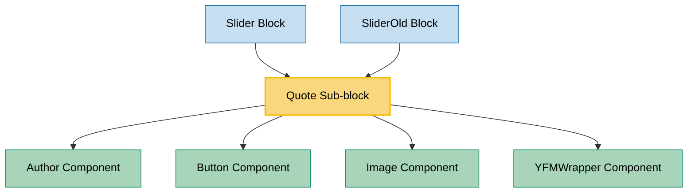

# Quote Sub-block Usage

This document outlines how the Quote sub-block is used across blocks and components in the page-constructor project.

## Overview

The Quote sub-block is a component designed to display testimonials or quotations with supporting elements such as author information, company logo, and an optional image. It supports different quote styles, theming options, and can include a call-to-action button.

## Usage Graph



## Component Details

### Quote Sub-block

- **File**: `src/sub-blocks/Quote/Quote.tsx`
- **Description**: Displays a quotation with author information, company logo, and optional image.
- **Props**:
  - `text`: Optional quote text (plain text)
  - `yfmText`: Optional quote text with YFM support (for backward compatibility, will become 'text' in major)
  - `image`: Themed image for the quote (required)
  - `logo`: Company logo image (required)
  - `color`: Optional background color
  - `border`: Border style - 'shadow' (default), 'line', or 'none'
  - `theme`: Text theme - 'light' (default) or 'dark'
  - `author`: Optional author information (AuthorItem)
  - `quoteType`: Quote style - QuoteType.Chevron (default) or QuoteType.EnglishDouble
  - `url`: Optional URL for the button (deprecated, use button prop instead)
  - `urlTitle`: Optional URL title for the button (deprecated, use button prop instead)
  - `buttonText`: Optional button text (deprecated, use button prop instead)
  - `button`: Optional button configuration (ButtonProps)

### QuoteType Enum

- **Description**: Defines available quote styles for the Quote component.
- **Values**:
  - `Chevron`: Uses chevron quotes (« »)
  - `EnglishDouble`: Uses English double quotes (" ")

## Usage Patterns

> **Note**: In the code examples below, `b()` is a utility function used throughout the page-constructor project for BEM (Block Element Modifier) class naming. It generates CSS class names following the BEM methodology, making the code more maintainable and consistent.

### In Blocks

#### Slider Block

- **File**: `src/blocks/Slider/__stories__/data.json`
- **Usage**: Displays quotes in a carousel/slider format.
- **Implementation**:

  ```json
  {
    "quoteCards": {
      "content": {
        "dots": true,
        "type": "slider-block",
        "title": {
          "text": "QuoteCards",
          "url": "https://example.com"
        },
        "slidesToShow": 1,
        "arrows": true,
        "children": [
          {
            "type": "quote",
            "text": "Lorem ipsum dolor sit amet, consectetur adipiscing elit, sed do eiusmod tempor incididunt ut labore et dolore magna aliqua.",
            "image": {
              "light": {
                "src": "/story-assets/img_6-12_light.png"
              },
              "dark": {
                "src": "/story-assets/img_8-12_dark.png"
              }
            },
            "url": "https://example.com",
            "author": {
              "firstName": "Lorem",
              "secondName": "ipsum",
              "description": "Lorem ipsum",
              "avatar": "/story-assets/img_6-12_light.png"
            },
            "logo": "/story-assets/img-mini_6-12_light.png"
          }
        ]
      }
    }
  }
  ```

#### SliderOld Block

- **File**: `src/blocks/SliderOld/__stories__/data.json`
- **Usage**: Similar to the Slider block, displays quotes in a carousel format.

## Component Implementation

The Quote component is implemented with several key sections:

### Author Section

The component processes the author information and renders it using the Author component:

```tsx
const themedAuthor = author
  ? ({
      ...author,
      avatar: getThemedValue(author.avatar, theme),
    } as AuthorItem)
  : author;

{
  themedAuthor && (
    <Author
      className={b('author', {theme: textTheme})}
      author={themedAuthor}
      type={AuthorType.Line}
      theme={textTheme}
    />
  );
}
```

### Button Section

The component supports both legacy button properties and the newer button prop:

```tsx
{
  url && buttonText && !button && (
    <Button
      theme="outlined"
      size="xl"
      url={url}
      className={b('link-button', {theme: textTheme})}
      onClick={handleButtonClick}
      urlTitle={urlTitle}
      text={buttonText}
    />
  );
}
{
  button && <Button size="xl" {...button} />;
}
```

### Quote Content

The component renders the quote text with YFM support:

```tsx
<div className={b('content', {'quote-type': quoteType})}>
  {textLocal && (
    <YFMWrapper
      tagName="span"
      contentClassName={b('text')}
      content={textLocal}
      modifiers={{constructor: true}}
    />
  )}
</div>
```

### Image and Logo

The component displays both the company logo and an image:

```tsx
<Image className={b('logo')} {...logoProps} />
// ...
<div className={b('image-wrapper')}>
    <Image {...imageData} className={b('image')} />
</div>
```

## Quote Styles

### Chevron Style (Default)

The Chevron style uses chevron quotes (« ») to visually indicate the quoted text. This is applied through CSS styling when `quoteType` is set to `QuoteType.Chevron`.

### English Double Style

The English Double style uses English double quotes (" ") to visually indicate the quoted text. This is applied through CSS styling when `quoteType` is set to `QuoteType.EnglishDouble`.

## Theming Support

The Quote component supports theming through several mechanisms:

1. **Text Theme**: Controls the color scheme of text elements via the `theme` prop
2. **Themed Images**: Both the main image and logo support theme-specific versions
3. **Author Theming**: The author component inherits the quote's theme
4. **Button Theming**: The button component is styled based on the quote's theme

## Border Styles

The Quote component supports three border styles:

1. **Shadow** (default): Applies a drop shadow effect
2. **Line**: Applies a simple line border
3. **None**: No border is applied

## Best Practices

1. **Content Length**: Keep quote text concise for better readability and visual appeal.

2. **Image Selection**: Choose high-quality images that complement the quote content.

3. **Author Information**: Always provide complete author information when available for credibility.

4. **Theme Consistency**: Ensure the quote's theme matches the surrounding content.

5. **Quote Type Selection**: Choose the appropriate quote style based on the content and design language:

   - Use Chevron style for more distinctive, European-style quotations
   - Use English Double style for a more traditional English language appearance

6. **Button Usage**: When including a call-to-action:

   - Use the `button` prop rather than the deprecated individual properties
   - Keep button text concise and action-oriented

7. **Accessibility**: Ensure images have appropriate alt text and the component maintains good contrast ratios.

## Example Usage

### Basic Quote

```tsx
<Quote
  text="Lorem ipsum dolor sit amet, consectetur adipiscing elit."
  image="/path/to/image.jpg"
  logo="/path/to/logo.svg"
  author={{
    firstName: 'John',
    secondName: 'Doe',
    description: 'CEO, Example Company',
    avatar: '/path/to/avatar.jpg',
  }}
/>
```

### Themed Quote with Button

```tsx
<Quote
  yfmText="Lorem ipsum **dolor sit amet**, consectetur adipiscing elit."
  image={{
    light: {src: '/path/to/light-image.jpg'},
    dark: {src: '/path/to/dark-image.jpg'},
  }}
  logo={{
    light: {src: '/path/to/light-logo.svg'},
    dark: {src: '/path/to/dark-logo.svg'},
  }}
  theme="dark"
  border="line"
  quoteType={QuoteType.EnglishDouble}
  button={{
    text: 'Learn More',
    url: 'https://example.com',
    theme: 'outlined-contrast',
  }}
  author={{
    firstName: 'Jane',
    secondName: 'Smith',
    description: 'Product Designer',
    avatar: {
      light: {src: '/path/to/light-avatar.jpg'},
      dark: {src: '/path/to/dark-avatar.jpg'},
    },
  }}
/>
```

### Quote with Custom Background Color

```tsx
<Quote
  text="Lorem ipsum dolor sit amet, consectetur adipiscing elit."
  image="/path/to/image.jpg"
  logo="/path/to/logo.svg"
  color="#f5f5f5"
/>
```

## CSS Classes

The component uses BEM methodology for CSS classes:

- `.quote` - Main container
- `.quote_theme_light` - Light theme modifier
- `.quote_theme_dark` - Dark theme modifier
- `.quote_border_shadow` - Shadow border modifier
- `.quote_border_line` - Line border modifier
- `.quote_border_none` - No border modifier
- `.quote__content-wrapper` - Content container
- `.quote__content` - Quote text container
- `.quote__content_quote-type_chevron` - Chevron quote style
- `.quote__content_quote-type_english-double` - English double quote style
- `.quote__text` - Quote text element
- `.quote__logo` - Logo container
- `.quote__author-wrapper` - Author section container
- `.quote__author` - Author component container
- `.quote__link-button` - Button container
- `.quote__image-wrapper` - Image container
- `.quote__image` - Image element
