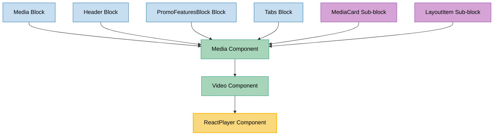

# ReactPlayer Component Usage

This document outlines how the ReactPlayer component is used across blocks, sub-blocks, and components in the page-constructor project.

## Overview

The ReactPlayer component is a wrapper around the react-player library that provides video playback functionality with custom controls, preview images, and analytics support. It supports various video sources including YouTube, Vimeo, and direct video files. The component offers customizable play buttons, mute controls, and progress tracking.

## Usage Graph



## Component Details

### ReactPlayer Component

- **File**: `src/components/ReactPlayer/ReactPlayer.tsx`
- **Description**: A comprehensive video player component that wraps react-player with custom controls and features.
- **Props**:
  - `src`: Video source URL or array of URLs (required)
  - `previewImgUrl`: Optional preview image URL
  - `loop`: Boolean to enable video looping (defaults to false)
  - `controls`: Video controls type - `MediaVideoControlsType.Default` or `MediaVideoControlsType.Custom`
  - `customControlsOptions`: Configuration for custom controls
  - `muted`: Boolean to start video muted (defaults to false)
  - `elapsedTime`: Time in seconds to start playback from
  - `playButton`: Configuration for the play button
  - `className`: Optional CSS class name
  - `customBarControlsClassName`: CSS class for custom control bar
  - `showPreview`: Boolean to show preview image
  - `onClickPreview`: Callback when preview is clicked
  - `analyticsEvents`: Analytics events configuration
  - `height`: Fixed height in pixels
  - `ratio`: Aspect ratio (number)
  - `autoRatio`: Boolean to automatically calculate ratio
  - `ariaLabel`: Accessibility label
  - `contain`: Boolean for object-fit contain behavior
  - `autoplay`: Boolean to enable autoplay (disabled on mobile)

### ReactPlayerBlockHandler Interface

- **Description**: Ref interface for controlling the player programmatically.
- **Methods**:
  - `play()`: Start video playback
  - `pause()`: Pause video playback
  - `addEventListener()`: Add event listeners to the video element

### CustomBarControls Component

- **File**: `src/components/ReactPlayer/CustomBarControls.tsx`
- **Description**: Custom control bar overlay for the video player.
- **Features**:
  - Mute/unmute button
  - Play/pause button
  - Progress bar
  - Configurable positioning

## Usage Patterns

> **Note**: In the code examples below, `b()` is a utility function used throughout the page-constructor project for BEM (Block Element Modifier) class naming. It generates CSS class names following the BEM methodology, making the code more maintainable and consistent.

### In Components

#### Video Component

- **File**: `src/components/Media/Video/Video.tsx`
- **Usage**: Uses ReactPlayer for `MediaVideoType.Player` video types with full configuration support.
- **Implementation**:

  ```tsx
  const reactPlayerBlock = React.useMemo(() => {
    const {
      src,
      loop,
      controls,
      muted,
      autoplay = true,
      elapsedTime,
      playButton,
      ariaLabel,
      customControlsOptions,
      contain,
    } = video;

    return (
      <ReactPlayerBlock
        ref={ref}
        className={b('react-player', videoClassName)}
        src={src}
        previewImgUrl={previewImg}
        loop={Boolean(loop)}
        controls={controls}
        muted={muted}
        autoplay={autoplay && playVideo}
        elapsedTime={elapsedTime}
        playButton={playButton || commonPlayButton}
        customBarControlsClassName={customBarControlsClassName}
        analyticsEvents={analyticsEvents}
        height={height}
        ariaLabel={ariaLabel}
        customControlsOptions={customControlsOptions}
        ratio={ratio === 'auto' ? undefined : ratio}
        autoRatio={ratio === 'auto'}
        contain={contain}
      />
    );
  }, [
    video,
    height,
    videoClassName,
    previewImg,
    playVideo,
    commonPlayButton,
    customBarControlsClassName,
    analyticsEvents,
    ratio,
  ]);
  ```

#### Media Component

- **File**: `src/components/Media/Media.tsx`
- **Usage**: Uses ReactPlayer indirectly through the Video component for video content.
- **Implementation**:

  ```tsx
  if (video) {
    const videoProps = {
      key: 'video',
      video,
      videoClassName,
      height,
      analyticsEvents,
      playVideo,
      previewImg,
      playButton,
      customBarControlsClassName,
      hasVideoFallback,
      setHasVideoFallback,
      ratio,
    };

    if (fullscreen) {
      result.push(<FullscreenVideo {...videoProps} qa={qaAttributes.video} />);
    } else {
      result.push(<Video {...videoProps} qa={qaAttributes.video} />);
    }
  }
  ```

### In Blocks

#### Media Block

- **File**: `src/blocks/Media/Media.tsx`
- **Usage**: Uses ReactPlayer through the Media component for video content in media blocks.
- **Implementation**:
  ```tsx
  <MediaBase {...props} onScroll={() => setPlay(true)}>
    <MediaBase.Card>
      <Media
        imageClassName={b('image')}
        videoClassName={b('video')}
        youtubeClassName={b('youtube')}
        {...themedMediaWithMicrodata}
        playVideo={play}
        border={borderSelected}
        analyticsEvents={analyticsEvents}
      />
    </MediaBase.Card>
  </MediaBase>
  ```

#### Header Block

- **File**: `src/blocks/Header/Header.tsx`
- **Usage**: Uses ReactPlayer through the Media component for background videos in headers.
- **Implementation**:

  ```tsx
  const Background = ({background, isMobile}: BackgroundProps) => {
    const {url, image, fullWidthMedia, video, color} = background;
    const imageObject = url ? getMediaImage(url) : image;
    const renderMedia = !isMobile || (typeof image === 'object' && 'mobile' in image);

    return (
      <div
        className={b('background', {media: true, 'full-width-media': fullWidthMedia})}
        style={{backgroundColor: color}}
      >
        {renderMedia && (
          <Media
            {...background}
            image={imageObject}
            isBackground
            className={b('background-media')}
          />
        )}
      </div>
    );
  };
  ```

#### PromoFeaturesBlock Block

- **File**: `src/blocks/PromoFeaturesBlock/PromoFeaturesBlock.tsx`
- **Usage**: Uses ReactPlayer through the Media component for feature card videos.
- **Implementation**:

  ```tsx
  const themedMedia = getThemedValue(media, globalTheme);
  const allProps = mergeVideoMicrodata(themedMedia, {
    name: cardTitle,
    description: cardText,
  });

  {
    media && <Media className={b('card-media')} {...allProps} />;
  }
  ```

#### Tabs Block

- **File**: `src/blocks/Tabs/TabContent/TabContent.tsx`
- **Usage**: Uses ReactPlayer through the Media component for tab content videos.
- **Implementation**:

  ```tsx
  const themedMedia = getThemedValue(tabData.media, theme);
  const mediaVideoHeight = hasNoImage && mediaWidth && getHeight(mediaWidth);

  <Media
    {...themedMedia}
    height={mediaVideoHeight}
    className={b('media')}
    playVideo={isActive}
    onImageLoad={onImageLoad}
  />;
  ```

### In Sub-blocks

#### MediaCard Sub-block

- **File**: `src/sub-blocks/MediaCard/MediaCard.tsx`
- **Usage**: Uses ReactPlayer through the Media component for card video content.
- **Implementation**:
  ```tsx
  const MediaCard = ({border, analyticsEvents, ...mediaProps}: MediaCardProps) => (
    <CardBase className={b({border})} analyticsEvents={analyticsEvents}>
      <CardBase.Content>
        <Media {...mediaProps} />
      </CardBase.Content>
    </CardBase>
  );
  ```

#### LayoutItem Sub-block

- **File**: `src/sub-blocks/LayoutItem/LayoutItem.tsx`
- **Usage**: Uses ReactPlayer through the Media component with fullscreen support.
- **Implementation**:

  ```tsx
  const renderMedia = () => {
    if (!media) {
      return null;
    }

    const themedMedia = getThemedValue(media, theme);
    const {title} = content;
    const mediaWithMicrodata = mergeVideoMicrodata(themedMedia, {
      name: typeof title === 'string' ? title : title?.text,
      description: content.text,
    });

    return fullscreen && hasFullscreen(themedMedia) ? (
      <FullscreenMedia showFullscreenIcon={showFullscreenIcon(themedMedia)}>
        {({fullscreen: _fullscreen, ...fullscreenMediaProps} = {}) => (
          <Media
            {...mediaWithMicrodata}
            {...fullscreenMediaProps}
            className={b('media', {border}, mediaClassName)}
          />
        )}
      </FullscreenMedia>
    ) : (
      <Media
        {...themedMedia}
        className={b('media', {border})}
        videoMicrodata={{
          name: typeof title === 'string' ? title : title?.text,
          description: content.text,
        }}
      />
    );
  };
  ```

## Video Controls Types

### Default Controls

- Uses native browser video controls
- Provided by the underlying react-player library
- Simple and consistent across browsers

### Custom Controls

The ReactPlayer component supports custom control overlays:

#### WithMuteButton Type

- Provides a mute/unmute toggle button
- Automatically seeks to beginning when muted
- Integrates with analytics events

#### WithPlayPauseButton Type

- Provides play/pause functionality
- Custom positioning options (center, bottom)
- Hover-based visibility

## Play Button Configuration

The component supports different play button types:

### Default Play Button

- Uses a play icon (PlayFill from @gravity-ui/icons)
- Circular button with theme support
- Standard size and positioning

### Text Play Button

- Uses custom text instead of icon
- Configurable text content
- Theme-aware styling

### Play Button Themes

- **Blue**: Default blue theme
- **Light**: Light theme for dark backgrounds
- **Dark**: Dark theme for light backgrounds

## Analytics Integration

The ReactPlayer component integrates with the page-constructor analytics system:

### Supported Events

- **Play Events**: Triggered when video starts playing
- **Stop Events**: Triggered when video is paused or muted
- **Custom Events**: Configurable analytics events

### Event Configuration

```tsx
analyticsEvents: [
  {
    type: PredefinedEventTypes.Play,
    name: 'video_play',
    data: {videoId: 'example-video'},
  },
  {
    type: PredefinedEventTypes.Stop,
    name: 'video_stop',
    data: {videoId: 'example-video'},
  },
];
```

## Mobile Optimizations

The ReactPlayer component includes several mobile-specific optimizations:

1. **Autoplay Disabled**: Autoplay is automatically disabled on mobile devices
2. **Picture-in-Picture**: Disabled on mobile to prevent conflicts
3. **Plays Inline**: Videos play inline on mobile devices
4. **Touch Controls**: Custom controls are touch-friendly

## Video Source Support

The component supports various video sources through react-player:

### Supported Formats

- **YouTube**: YouTube video URLs
- **Vimeo**: Vimeo video URLs
- **Direct Files**: MP4, WebM, OGV files
- **HLS Streams**: HTTP Live Streaming
- **DASH**: Dynamic Adaptive Streaming

### URL Processing

The component includes YouTube URL processing to ensure compatibility:

```tsx
const videoSrc = React.useMemo(() => checkYoutubeVideos(src), [src]);
```

## Best Practices

1. **Preview Images**: Always provide preview images for better user experience and performance.

2. **Accessibility**: Use appropriate `ariaLabel` props for screen readers.

3. **Analytics**: Configure analytics events to track video engagement.

4. **Mobile Considerations**: Test video playback on mobile devices and consider autoplay restrictions.

5. **Performance**: Use appropriate video formats and resolutions for your target audience.

6. **Responsive Design**: Use ratio props or autoRatio for responsive video sizing.

## Example Usage

### Basic Video Player

```tsx
<ReactPlayerBlock
  src="https://example.com/video.mp4"
  previewImgUrl="https://example.com/preview.jpg"
  controls={MediaVideoControlsType.Default}
  ariaLabel="Example video"
/>
```

### Custom Controls with Analytics

```tsx
<ReactPlayerBlock
  src="https://www.youtube.com/watch?v=dQw4w9WgXcQ"
  controls={MediaVideoControlsType.Custom}
  customControlsOptions={{
    type: CustomControlsType.WithMuteButton,
    positioning: CustomControlsButtonPositioning.Center,
  }}
  analyticsEvents={[
    {
      type: PredefinedEventTypes.Play,
      name: 'youtube_video_play',
    },
  ]}
  playButton={{
    type: PlayButtonType.Text,
    text: 'Watch Video',
    theme: PlayButtonThemes.Blue,
  }}
/>
```

### Auto-ratio Responsive Player

```tsx
<ReactPlayerBlock
  src={videoSources}
  autoRatio={true}
  contain={true}
  loop={true}
  muted={true}
  autoplay={true}
/>
```

## Storybook Documentation

The ReactPlayer component includes Storybook stories demonstrating:

- Default video player configuration
- Different video sources (YouTube, direct files)
- Custom controls variations
- Play button configurations

Stories are located in `src/components/ReactPlayer/__stories__/ReactPlayer.stories.tsx` with example data in `data.json`.

## Testing

The ReactPlayer component includes comprehensive tests covering:

- Video playback functionality
- Custom controls behavior
- Analytics event firing
- Mobile-specific features
- Accessibility compliance

## CSS Classes

The component uses BEM methodology for CSS classes:

- `.ReactPlayer` - Main container
- `.ReactPlayer_controls_default` - Default controls modifier
- `.ReactPlayer_controls_custom` - Custom controls modifier
- `.ReactPlayer_contain` - Object-fit contain modifier
- `.ReactPlayer__player` - react-player wrapper
- `.ReactPlayer__button` - Play button
- `.ReactPlayer__button_theme_{theme}` - Play button theme modifier
- `.ReactPlayer__icon` - Play button icon

## Integration with Context Systems

The ReactPlayer component integrates with several page-constructor context systems:

1. **MobileContext**: Detects mobile devices for optimizations
2. **VideoContext**: Manages multiple video instances and muting
3. **Analytics Context**: Handles event tracking
4. **Theme Context**: Supports theming for play buttons and controls
