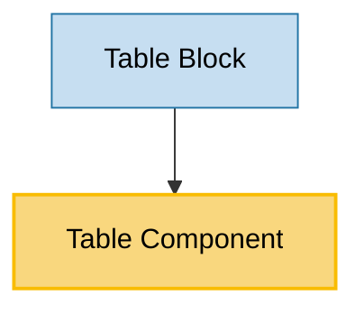

# Table Component Usage

This document outlines how the Table component is used across blocks, sub-blocks, and components in the page-constructor project.

## Overview

The Table component is a utility component that renders tabular data with support for legends, markers, and custom justification. It supports two marker types (disk and tick) and can display legends with corresponding markers. The component is designed to present structured data in a clear, accessible table format throughout the page constructor system.

## Usage Graph



## Component Details

### Table Component

- **File**: `src/components/Table/Table.tsx`
- **Description**: Renders tabular data with support for legends, markers, and custom cell justification.
- **Props**:
  - `content`: 2D string array representing table data (required)
  - `legend`: Optional array of legend items
  - `hideLegend`: Optional boolean to hide the legend even if provided
  - `marker`: Marker type - `'disk'` (default) or `'tick'`
  - `className`: Optional CSS class name for the container
  - `caption`: Optional caption for accessibility (used as aria-label)
  - `justify`: Optional array of justification values for each column

### TableProps Interface

- **Description**: Defines the structure of table component props.
- **Properties**:
  - `content: string[][]`: 2D array of table cell content (required)
  - `hideLegend?: boolean`: Whether to hide the legend
  - `justify?: Justify[]`: Array of column justification settings
  - `legend?: string[]`: Array of legend items
  - `marker?: LegendTableMarkerType`: Type of marker to use

### LegendTableMarkerType

- **Description**: Defines available marker types for table legends.
- **Values**:
  - `'disk'`: Circular disk markers (default)
  - `'tick'`: Check/minus icon markers

### Justify Type

- **Description**: Defines text alignment options for table cells.
- **Values**:
  - `'start'`: Left-aligned text
  - `'center'`: Center-aligned text (default)
  - `'end'`: Right-aligned text

## Usage Patterns

> **Note**: In the code examples below, `b()` is a utility function used throughout the page-constructor project for BEM (Block Element Modifier) class naming. It generates CSS class names following the BEM methodology, making the code more maintainable and consistent.

### In Blocks

#### Table Block

- **File**: `src/blocks/Table/Table.tsx`
- **Usage**: Displays tabular data within a grid layout with a title and responsive column structure.
- **Implementation**:

  ```tsx
  export const TableBlock = (props: TableBlockProps) => {
    const {title, table} = props;

    return (
      <div className={b()}>
        <Grid className={b('content')}>
          <Row className={b('row')}>
            <Col sizes={{[GridColumnSize.Md]: 4, [GridColumnSize.All]: 12}}>
              <h2 className={b('title')}>{title}</h2>
            </Col>
            <Col sizes={{[GridColumnSize.Md]: 8, [GridColumnSize.All]: 12}}>
              <Table className={b('table')} {...table} />
            </Col>
          </Row>
        </Grid>
      </div>
    );
  };
  ```

## Table Structure

### Content Format

The table content is provided as a 2D string array where:

- First dimension represents rows
- Second dimension represents columns within each row
- First row typically contains headers
- Subsequent rows contain data

**Example**:

```tsx
const content = [
  ['Header 1', 'Header 2', 'Header 3'],
  ['Row 1 Col 1', 'Row 1 Col 2', 'Row 1 Col 3'],
  ['Row 2 Col 1', 'Row 2 Col 2', 'Row 2 Col 3'],
];
```

### Legend Integration

When using legends with markers:

1. **Legend Array**: Provides text descriptions for each marker
2. **Marker Cells**: Non-header cells can contain numeric values corresponding to legend indices
3. **Marker Rendering**: The component automatically renders appropriate markers based on cell values

**Example with Legend**:

```tsx
const tableProps = {
  content: [
    ['Feature', 'Basic', 'Pro', 'Enterprise'],
    ['Feature 1', '0', '1', '1'],
    ['Feature 2', '1', '1', '1'],
  ],
  legend: ['Not included', 'Included'],
  marker: 'disk',
};
```

## Marker Types

### Disk Markers (Default)

- Circular markers with different colors/styles based on index
- Applied via CSS classes: `.table__marker_type_disk`
- Index-based styling: `.table__marker_index_0`, `.table__marker_index_1`, etc.

### Tick Markers

- Uses check (✓) and minus (−) icons from Gravity UI
- Check icon for value "1"
- Minus icon for other values
- Applied via CSS classes: `.table__marker_type_tick`
- Icon styling: `.table__marker_tick_check` for check icons

## Justification Support

The component supports column-wise text alignment:

### Default Behavior

- All columns default to center alignment if no justify prop is provided
- Applied via CSS classes: `.table__cell_justify_center`

### Custom Justification

```tsx
const justify = ['start', 'center', 'end', 'center'];
// First column: left-aligned
// Second column: center-aligned
// Third column: right-aligned
// Fourth column: center-aligned
```

**CSS Classes Applied**:

- `.table__cell_justify_start`
- `.table__cell_justify_center`
- `.table__cell_justify_end`

## Accessibility Features

The Table component includes comprehensive accessibility support:

### ARIA Attributes

- `role="table"` on the main container
- `role="rowgroup"` on the table content container
- `role="row"` on each table row
- `role="cell"` on each table cell
- `aria-label` using the caption prop for table description
- `aria-labelledby` linking markers to their legend descriptions

### Semantic Structure

- Proper heading hierarchy with legend items
- Descriptive IDs for legend items (`marker-0`, `marker-1`, etc.)
- Screen reader friendly marker descriptions

## Content Processing

### HTML Content Support

- Table cells support HTML content via the `HTML` component
- Allows for rich text formatting within cells
- Automatic HTML sanitization and processing

### YFM Integration

- Legend items support Yandex Flavored Markdown (YFM)
- Processed via `YFMWrapper` component with constructor modifiers
- Enables rich formatting in legend descriptions

## Integration with Grid System

When used in blocks, the Table component integrates with the page constructor grid system:

### Responsive Layout

- **Desktop (md+)**: Title takes 4 columns, table takes 8 columns
- **Mobile (all)**: Both title and table take full width (12 columns)
- Automatic responsive behavior via Grid, Row, and Col components

### Grid Classes

- Uses `GridColumnSize.Md` and `GridColumnSize.All` for responsive breakpoints
- Integrates with the project's grid system for consistent layouts

## Best Practices

1. **Content Structure**: Always provide headers in the first row for better accessibility and user experience.

2. **Legend Usage**:

   - Use legends when table cells contain coded values (0, 1, 2, etc.)
   - Ensure legend array indices match the numeric values in table cells
   - Consider hiding legends with `hideLegend` when markers are self-explanatory

3. **Marker Selection**:

   - Use `'disk'` markers for categorical data with multiple states
   - Use `'tick'` markers for binary yes/no or included/not-included scenarios

4. **Justification**:

   - Use `'start'` alignment for text-heavy columns
   - Use `'center'` alignment for short labels or status indicators
   - Use `'end'` alignment for numeric data

5. **Accessibility**: Always provide a meaningful `caption` prop for screen readers.

6. **Performance**: Keep table content reasonably sized as all data is rendered at once.

## Example Usage

### Basic Table

```tsx
<Table
  content={[
    ['Name', 'Age', 'City'],
    ['John Doe', '30', 'New York'],
    ['Jane Smith', '25', 'Los Angeles'],
  ]}
  caption="User information table"
/>
```

### Table with Legend and Disk Markers

```tsx
<Table
  content={[
    ['Feature', 'Basic', 'Pro'],
    ['Support', '0', '1'],
    ['Analytics', '1', '1'],
  ]}
  legend={['Not included', 'Included']}
  marker="disk"
  justify={['start', 'center', 'center']}
  caption="Feature comparison table"
/>
```

### Table with Tick Markers (Hidden Legend)

```tsx
<Table
  content={[
    ['Feature', 'Available'],
    ['Feature A', '1'],
    ['Feature B', '0'],
    ['Feature C', '1'],
  ]}
  marker="tick"
  hideLegend={true}
  justify={['start', 'center']}
  caption="Feature availability table"
/>
```

### In Table Block Context

```tsx
<TableBlock
  title="Pricing Comparison"
  table={{
    content: [
      ['Plan', 'Price', 'Users'],
      ['Basic', '$10', '5'],
      ['Pro', '$25', '25'],
    ],
    justify: ['start', 'end', 'center'],
    caption: 'Pricing plans comparison',
  }}
/>
```

## Storybook Documentation

The Table component includes Storybook stories demonstrating:

- Default table with legend and disk markers
- Tick marker variation with hidden legend
- Different content structures and justification options

Stories are located in `src/components/Table/__stories__/Table.stories.tsx` with example data in `data.json`.

## Testing

The Table component includes comprehensive tests covering:

- Basic table rendering with content
- Legend display and hiding functionality
- Marker type variations (disk and tick)
- Justification application
- Accessibility attributes
- Empty content handling

Test files are located in `src/components/Table/__tests__/Table.test.tsx`.
