# Title Component Usage

This document outlines how the Title component is used across blocks, sub-blocks, and components in the page-constructor project.

## Overview

The Title component is a fundamental utility component that renders titles and subtitles with flexible sizing, theming, and layout options. It supports both simple string titles and complex title objects with links, custom content, and navigation features. The component is widely used throughout the page constructor system to provide consistent heading styling and functionality.

## Usage Graph

```mermaid
graph TD
    %% Main Component
    Title[Title Component]
    TitleItem[TitleItem Component]

    %% Blocks that use Title
    CardLayout[CardLayout Block]
    Companies[Companies Block]
    ExtendedFeatures[ExtendedFeatures Block]
    FilterBlock[FilterBlock Block]
    Form[Form Block]
    Icons[Icons Block]
    PromoFeaturesBlock[PromoFeaturesBlock Block]
    Slider[Slider Block]
    SliderNew[SliderNew Block]
    Tabs[Tabs Block]

    %% Sub-blocks that use Title
    Content[Content Sub-block]

    %% Components that use Title
    MediaBase[MediaBase Component]

    %% Usage relationships
    CardLayout --> Title
    Companies --> Title
    ExtendedFeatures --> Title
    FilterBlock --> Title
    Form --> Title
    Icons --> Title
    PromoFeaturesBlock --> Title
    Slider --> Title
    SliderNew --> Title
    Tabs --> Title
    Content --> Title
    MediaBase --> Title
    Title --> TitleItem

    %% Style classes
    style Title fill:#f9d77e,stroke:#f9bc02,stroke-width:2px,color:#000
    style TitleItem fill:#f9d77e,stroke:#f9bc02,stroke-width:1px,color:#000
    style CardLayout fill:#c6def1,stroke:#2274a5,stroke-width:1px,color:#000
    style Companies fill:#c6def1,stroke:#2274a5,stroke-width:1px,color:#000
    style ExtendedFeatures fill:#c6def1,stroke:#2274a5,stroke-width:1px,color:#000
    style FilterBlock fill:#c6def1,stroke:#2274a5,stroke-width:1px,color:#000
    style Form fill:#c6def1,stroke:#2274a5,stroke-width:1px,color:#000
    style Icons fill:#c6def1,stroke:#2274a5,stroke-width:1px,color:#000
    style PromoFeaturesBlock fill:#c6def1,stroke:#2274a5,stroke-width:1px,color:#000
    style Slider fill:#c6def1,stroke:#2274a5,stroke-width:1px,color:#000
    style SliderNew fill:#c6def1,stroke:#2274a5,stroke-width:1px,color:#000
    style Tabs fill:#c6def1,stroke:#2274a5,stroke-width:1px,color:#000
    style Content fill:#d4edda,stroke:#28a745,stroke-width:1px,color:#000
    style MediaBase fill:#f9d77e,stroke:#f9bc02,stroke-width:1px,color:#000
```



## Component Details

### Title Component

- **File**: `src/components/Title/Title.tsx`
- **Description**: Main wrapper component that handles title and subtitle rendering with grid layout support.
- **Props**:
  - `title`: Title content (TitleItemProps object or string)
  - `subtitle`: Optional subtitle text (supports YFM markdown)
  - `className`: Optional CSS class name for the container
  - `colSizes`: Grid column sizes configuration (default: `{all: 12, sm: 8}`)
  - `id`: Optional HTML id attribute

### TitleItem Component

- **File**: `src/components/Title/TitleItem.tsx`
- **Description**: Core component that renders individual title elements with support for links, anchors, and custom content.
- **Props**:
  - `text`: Title text content (required)
  - `textSize`: Text size - `'xs'`, `'s'`, `'sm'`, `'m'`, `'l'` (default: `'m'`)
  - `anchor`: Optional anchor ID for navigation
  - `justify`: Text alignment - `'start'`, `'center'`, `'end'`
  - `url`: Optional URL to make title clickable
  - `urlTitle`: Optional title attribute for links
  - `onClick`: Optional click handler
  - `custom`: Optional custom content to append to title
  - `className`: Optional CSS class name
  - `qa`: Optional QA attribute for testing
  - `resetMargin`: Whether to reset default margins (default: true)

### TitleProps Interface

- **Description**: Defines the structure for title configuration.
- **Properties**:
  - `title`: TitleItemProps object or string
  - `subtitle`: Optional subtitle string (supports YFM)

### TitleItemProps Interface

- **Description**: Defines the structure for individual title items.
- **Properties**:
  - `text`: Title text (required)
  - `textSize`: Size configuration
  - `url`: Optional link URL
  - `urlTitle`: Optional link title
  - `custom`: Optional custom React content
  - `onClick`: Optional click handler
  - `anchor`: Optional anchor ID
  - `justify`: Text alignment
  - `navTitle`: Optional navigation title

## Usage Patterns

> **Note**: In the code examples below, `b()` is a utility function used throughout the page-constructor project for BEM (Block Element Modifier) class naming. It generates CSS class names following the BEM methodology, making the code more maintainable and consistent.

### In Blocks

#### CardLayout Block

- **File**: `src/blocks/CardLayout/CardLayout.tsx`
- **Usage**: Displays block title and description with optional custom styling.
- **Implementation**:

  ```tsx
  {
    (title || description) && (
      <Title title={title} subtitle={description} className={titleClassName} />
    );
  }
  ```

#### Companies Block

- **File**: `src/blocks/Companies/Companies.tsx`
- **Usage**: Shows company section title and description with full-width layout.
- **Implementation**:

  ```tsx
  <Title title={title} subtitle={description} colSizes={{all: 12, sm: 12}}></Title>
  ```

#### ExtendedFeatures Block

- **File**: `src/blocks/ExtendedFeatures/ExtendedFeatures.tsx`
- **Usage**: Renders feature section header with custom styling.
- **Implementation**:

  ```tsx
  <Title title={title} subtitle={description} className={b('header')} />
  ```

#### FilterBlock Block

- **File**: `src/blocks/FilterBlock/FilterBlock.tsx`
- **Usage**: Displays filter section title with optional centering.
- **Implementation**:

  ```tsx
  {
    title && (
      <Title className={b('title', {centered: centered})} title={title} subtitle={description} />
    );
  }
  ```

#### Form Block

- **File**: `src/blocks/Form/Form.tsx`
- **Usage**: Shows form title with specific text size configuration.
- **Implementation**:

  ```tsx
  {
    title && (
      <Title
        title={{
          text: title,
          textSize: 'l',
        }}
      />
    );
  }
  ```

#### Icons Block

- **File**: `src/blocks/Icons/Icons.tsx`
- **Usage**: Renders icon section header when title or description is present.
- **Implementation**:

  ```tsx
  {
    (title || description) && (
      <Title className={b('header')} title={title} subtitle={description} />
    );
  }
  ```

#### PromoFeaturesBlock Block

- **File**: `src/blocks/PromoFeaturesBlock/PromoFeaturesBlock.tsx`
- **Usage**: Displays promotional features section header.
- **Implementation**:

  ```tsx
  <Title title={title} subtitle={description} className={b('header')} />
  ```

#### Slider Block

- **File**: `src/blocks/Slider/Slider.tsx`
- **Usage**: Shows slider section title with anchor support.
- **Implementation**:

  ```tsx
  <Title title={title} subtitle={description} className={b('header')} />
  ```

#### SliderNew Block

- **File**: `src/blocks/SliderNew/Slider.tsx`
- **Usage**: Renders new slider implementation header.
- **Implementation**:

  ```tsx
  <Title title={title} subtitle={description} className={b('header')} />
  ```

#### Tabs Block

- **File**: `src/blocks/Tabs/Tabs.tsx`
- **Usage**: Displays tabbed content section header.
- **Implementation**:

  ```tsx
  <Title title={title} subtitle={description} className={b('header')} />
  ```

### In Sub-blocks

#### Content Sub-block

- **File**: `src/sub-blocks/Content/Content.tsx`
- **Usage**: Renders content section title within content blocks.
- **Implementation**:

  ```tsx
  {
    title && <Title className={b('title')} title={title} colSizes={titleColSizes} />;
  }
  ```

### In Components

#### MediaBase Component

- **File**: `src/components/MediaBase/MediaBase.tsx`
- **Usage**: Shows media component header when not in media-only mode.
- **Implementation**:

  ```tsx
  <Title className={b('header')} title={title} subtitle={description} />
  ```

## Text Size Mapping

The Title component uses semantic HTML heading tags based on text size:

- **`l`**: `<h1>` tag - Largest heading
- **`m`**: `<h2>` tag - Default size, main section headings
- **`sm`**: `<h3>` tag - Subsection headings
- **`s`**: `<h4>` tag - Minor headings
- **`xs`**: `<h5>` tag - Smallest heading

This mapping is handled by the `getHeaderTag()` utility function.

## Grid Layout Support

The Title component integrates with the page-constructor grid system:

### Default Column Sizes

```tsx
colSizes = {all: 12, sm: 8};
```

- **Desktop**: 8/12 columns (66.67% width)
- **Mobile**: Full width (12/12 columns)

### Custom Column Sizes

```tsx
// Full width on all devices
colSizes={{all: 12, sm: 12}}

// Custom responsive layout
colSizes={{all: 12, md: 10, lg: 8}}
```

## Link and Interaction Support

### Simple Link Title

```tsx
<Title
  title={{
    text: 'Click me',
    url: 'https://example.com',
    urlTitle: 'Opens in new window',
  }}
/>
```

### Title with Click Handler

```tsx
<Title
  title={{
    text: 'Interactive Title',
    onClick: handleClick,
    urlTitle: 'Click to perform action',
  }}
/>
```

### Title with Custom Content

```tsx
<Title
  title={{
    text: 'Title with badge',
    custom: <Badge>New</Badge>,
  }}
/>
```

## Anchor Navigation Support

The Title component supports anchor-based navigation:

```tsx
<Title
  title={{
    text: 'Section Title',
    anchor: 'section-1',
  }}
/>
```

This generates:

- An anchor element with the specified ID
- Proper heading structure for navigation
- Support for table of contents generation

## Subtitle Support

Subtitles support YFM (Yandex Flavored Markdown) formatting:

```tsx
<Title title="Main Title" subtitle="**Bold text** and [links](https://example.com) are supported" />
```

The subtitle is rendered using the `YFMWrapper` component with constructor-specific modifiers.

## Theming and Styling

### CSS Classes

The Title component uses BEM methodology for styling:

- `.title` - Main container
- `.title__description` - Subtitle container
- `.title__description_title-size_*` - Size-specific subtitle styling

### Theme Integration

The component integrates with the page-constructor theme system through:

- CSS custom properties for colors
- Responsive typography scaling
- Consistent spacing with other components

## Best Practices

1. **Size Selection**:

   - Use `'l'` for main page titles
   - Use `'m'` for section headings (most common)
   - Use `'sm'`, `'s'`, `'xs'` for subsections and minor headings

2. **Grid Layout**:

   - Use default column sizes for most cases
   - Override `colSizes` only when specific layout is needed
   - Consider mobile responsiveness when setting custom sizes

3. **Link Titles**:

   - Always provide `urlTitle` for accessibility
   - Use descriptive text that explains the link destination
   - Consider whether links should open in new windows

4. **Anchor Usage**:

   - Use meaningful anchor IDs for navigation
   - Follow kebab-case naming convention
   - Ensure anchors are unique within the page

5. **Subtitle Content**:
   - Keep subtitles concise and descriptive
   - Use YFM formatting sparingly for emphasis
   - Ensure subtitle complements the main title

## Example Usage

### Basic Title with Subtitle

```tsx
<Title
  title="Welcome to Our Platform"
  subtitle="Discover amazing features and **powerful tools** for your business"
/>
```

### Interactive Title with Custom Content

```tsx
<Title
  title={{
    text: 'Product Features',
    textSize: 'l',
    anchor: 'features',
    custom: <Badge variant="success">Updated</Badge>,
  }}
  subtitle="Learn about our latest improvements"
/>
```

### Linked Title with Custom Layout

```tsx
<Title
  title={{
    text: 'Read More',
    url: '/articles/getting-started',
    urlTitle: 'Read the complete getting started guide',
    textSize: 'm',
  }}
  colSizes={{all: 12, md: 10}}
/>
```

### Form Title with Large Size

```tsx
<Title
  title={{
    text: 'Contact Us',
    textSize: 'l',
  }}
  className="form-header"
/>
```

## Storybook Documentation

The Title component includes comprehensive Storybook stories demonstrating:

- Default title and subtitle combinations
- Different text sizes (xs, s, sm, m, l)
- Link functionality with arrows
- Custom content integration
- Various layout configurations

Stories are located in `src/components/Title/__stories__/Title.stories.tsx` with test data in `data.json`.

## Testing

The Title component includes comprehensive tests covering:

- Basic rendering with title and subtitle
- Text size variations and semantic HTML tags
- Link functionality and accessibility
- Anchor generation and navigation
- Grid layout integration
- Custom content rendering

Test files are located in `src/components/Title/__tests__/Title.test.tsx`.

## Accessibility Features

1. **Semantic HTML**: Uses proper heading tags (h1-h5) based on text size
2. **Link Accessibility**: Supports `urlTitle` for screen readers
3. **Anchor Navigation**: Generates proper anchor elements for page navigation
4. **Keyboard Support**: Interactive elements are keyboard accessible
5. **ARIA Support**: Integrates with QA attributes for testing and accessibility
