# ToggleArrow Component Usage

This document outlines how the ToggleArrow component is used across blocks, sub-blocks, and components in the page-constructor project.

## Overview

The ToggleArrow component is a utility component that renders an animated chevron arrow icon used for toggle functionality. It supports both horizontal and vertical orientations, different icon types, and various animation options. The component is commonly used in expandable/collapsible UI elements like dropdowns, accordions, and navigation menus.

## Usage Graph

```mermaid
graph TD
    %% Main Component
    ToggleArrow[ToggleArrow Component]

    %% Components
    OverflowScroller[OverflowScroller Component]
    Title[Title Component]

    %% Sub-blocks
    PriceDetailed[PriceDetailed Sub-block]

    %% Blocks
    Questions[Questions Block]
    FoldableList[FoldableList Block]
    Slider[Slider Block]
    SliderNew[SliderNew Block]

    %% Navigation
    NavigationDropdown[NavigationDropdown Component]

    %% Usage relationships
    OverflowScroller --> ToggleArrow
    Title --> ToggleArrow
    PriceDetailed --> ToggleArrow
    Questions --> ToggleArrow
    FoldableList --> ToggleArrow
    Slider --> ToggleArrow
    SliderNew --> ToggleArrow
    NavigationDropdown --> ToggleArrow

    %% Style classes
    style ToggleArrow fill:#f9d77e,stroke:#f9bc02,stroke-width:2px,color:#000

    %% Component styles
    style OverflowScroller fill:#a8d5ba,stroke:#1a936f,stroke-width:1px,color:#000
    style Title fill:#a8d5ba,stroke:#1a936f,stroke-width:1px,color:#000

    %% Sub-block styles
    style PriceDetailed fill:#e8c5e5,stroke:#8e44ad,stroke-width:1px,color:#000

    %% Block styles
    style Questions fill:#c6def1,stroke:#2274a5,stroke-width:1px,color:#000
    style FoldableList fill:#c6def1,stroke:#2274a5,stroke-width:1px,color:#000
    style Slider fill:#c6def1,stroke:#2274a5,stroke-width:1px,color:#000
    style SliderNew fill:#c6def1,stroke:#2274a5,stroke-width:1px,color:#000

    %% Navigation styles
    style NavigationDropdown fill:#ffd6cc,stroke:#ff6b35,stroke-width:1px,color:#000
```



## Component Details

### ToggleArrow Component

- **File**: `src/components/ToggleArrow/ToggleArrow.tsx`
- **Description**: Renders an animated chevron arrow icon for toggle functionality.
- **Props**:
  - `type`: Arrow orientation - `'horizontal'` (default) or `'vertical'`
  - `iconType`: Icon variant - `'default'` (default) or `'navigation'`
  - `open`: Boolean indicating if the toggle is in open state (default: false)
  - `size`: Icon size in pixels (default: 16)
  - `thin`: Boolean for thinner stroke width (default: false)
  - `slow`: Boolean for slower animation duration (default: false)
  - `className`: Optional CSS class name

### Icon Types

- **Default**: Uses the standard `Chevron` icon
- **Navigation**: Uses the `NavigationChevron` icon for navigation contexts

## Usage Patterns

> **Note**: In the code examples below, `b()` is a utility function used throughout the page-constructor project for BEM (Block Element Modifier) class naming. It generates CSS class names following the BEM methodology, making the code more maintainable and consistent.

### In Components

#### OverflowScroller Component

- **File**: `src/components/OverflowScroller/OverflowScroller.tsx`
- **Usage**: Navigation arrows for horizontal scrolling functionality.
- **Implementation**:
  ```tsx
  <button
    className={b('arrow', {left: true, disabled: !canScrollLeft})}
    onClick={scrollLeft}
    disabled={!canScrollLeft}
  >
    <ToggleArrow size={arrowSize} type={'horizontal'} iconType="navigation" />
  </button>
  ```

#### Title Component

- **File**: `src/components/Title/TitleItem.tsx`
- **Usage**: Toggle arrow for expandable title sections.
- **Implementation**:
  ```tsx
  <ToggleArrow className={b('arrow', {size: textSize})} open={isOpened} type="vertical" size={16} />
  ```

### In Sub-blocks

#### PriceDetailed Sub-block

- **File**: `src/sub-blocks/PriceDetailed/PriceDetails/PriceDetails.tsx`
- **Usage**: Toggle arrow for expandable price details.
- **Implementation**:
  ```tsx
  <button className={b('button')} onClick={() => setIsOpened(!isOpened)}>
    {foldableTitle}
    <ToggleArrow open={isOpened} size={14} type={'vertical'} className={b('arrow')} />
  </button>
  ```

### In Blocks

#### Questions Block

- **File**: `src/blocks/Questions/QuestionBlockItem/QuestionBlockItem.tsx`
- **Usage**: Toggle arrow for FAQ accordion items.
- **Implementation**:
  ```tsx
  <button className={b('button')} onClick={() => setIsOpened(!isOpened)}>
    <HTML itemProp={FaqMicrodataValues.QuestionNameProp}>{itemTitle}</HTML>
    <ToggleArrow open={isOpened} size={16} type={'vertical'} className={b('arrow')} />
  </button>
  ```

#### FoldableList Block

- **File**: `src/blocks/FoldableList/FoldableListBlockItem/FoldableListBlockItem.tsx`
- **Usage**: Toggle arrow for expandable list items.
- **Implementation**:
  ```tsx
  <button className={b('button')} onClick={() => setIsOpened(!isOpened)}>
    <HTML>{itemTitle}</HTML>
    <ToggleArrow open={isOpened} size={16} type={'vertical'} className={b('arrow')} />
  </button>
  ```

#### Slider and SliderNew Blocks

- **Files**:
  - `src/blocks/Slider/Arrow/Arrow.tsx`
  - `src/blocks/SliderNew/Arrow/Arrow.tsx`
- **Usage**: Navigation arrows for slider controls.
- **Implementation**:
  ```tsx
  <button className={b({direction, disabled})} onClick={onClick} disabled={disabled}>
    <span className={b('icon-wrapper')}>
      <ToggleArrow size={size} type={'horizontal'} iconType="navigation" className={b('icon')} />
    </span>
  </button>
  ```

### In Navigation

#### NavigationDropdown Component

- **File**: `src/navigation/components/NavigationItem/components/NavigationDropdown/NavigationDropdown.tsx`
- **Usage**: Toggle arrow for dropdown navigation menus.
- **Implementation**:
  ```tsx
  <button className={b('button')} onClick={() => setIsOpened(!isOpened)}>
    <span className={b('text')}>{text}</span>
    <ToggleArrow className={b('arrow')} open={isOpened} type="vertical" iconType="navigation" />
  </button>
  ```

## Animation Behavior

The ToggleArrow component provides smooth CSS transitions for state changes:

### Horizontal Type

- **Closed State**: Rotated -90 degrees (pointing left)
- **Open State**: Rotated 0 degrees (pointing down)
- **Animation**: Smooth rotation transition

### Vertical Type

- **Closed State**: Rotated 0 degrees (pointing down)
- **Open State**: Rotated 180 degrees (pointing up)
- **Animation**: Smooth rotation transition

### Animation Options

- **Default Speed**: 0.15s transition duration
- **Slow Animation**: 0.3s transition duration when `slow` prop is true
- **Stroke Width**: 2px default, 1px when `thin` prop is true

## CSS Classes Applied

The component uses BEM methodology for CSS classes:

- `.ToggleArrow`: Base class
- `.ToggleArrow_type_horizontal`: Horizontal orientation
- `.ToggleArrow_type_vertical`: Vertical orientation
- `.ToggleArrow_open`: Open state modifier
- `.ToggleArrow_thin`: Thin stroke modifier
- `.ToggleArrow_slow`: Slow animation modifier

## Best Practices

1. **Orientation Selection**:

   - Use `horizontal` type for left/right navigation (sliders, scrollers)
   - Use `vertical` type for up/down toggles (accordions, dropdowns)

2. **Icon Type Selection**:

   - Use `default` icon type for general toggle functionality
   - Use `navigation` icon type for navigation-specific contexts

3. **Size Considerations**:

   - Standard size (16px) for most use cases
   - Smaller sizes (14px) for compact interfaces
   - Larger sizes (30px) for prominent controls

4. **Animation Performance**:

   - Use `slow` animation for more prominent toggles
   - Keep default speed for frequent interactions

5. **Accessibility**:
   - Always pair with appropriate button elements
   - Ensure proper ARIA attributes on parent controls
   - Provide clear visual feedback for state changes

## Example Usage

### Basic Vertical Toggle

```tsx
<ToggleArrow type="vertical" open={isExpanded} size={16} />
```

### Horizontal Navigation Arrow

```tsx
<ToggleArrow type="horizontal" iconType="navigation" size={20} className="custom-arrow" />
```

### Slow Animation with Thin Stroke

```tsx
<ToggleArrow type="vertical" open={isOpen} slow={true} thin={true} size={14} />
```

## Storybook Documentation

The ToggleArrow component includes Storybook stories demonstrating:

- Horizontal orientation with navigation icon
- Vertical orientation with default icon
- Different sizes and states
- Animation variations

Stories are located in `src/components/ToggleArrow/__stories__/ToggleArrow.stories.tsx` with example data in `data.json`.

## Testing

The ToggleArrow component should be tested for:

- Proper icon rendering based on `iconType`
- Correct rotation based on `type` and `open` state
- CSS class application for all modifiers
- Animation timing with `slow` option
- Stroke width with `thin` option

Test files should be located in `src/components/ToggleArrow/__tests__/ToggleArrow.test.tsx`.
