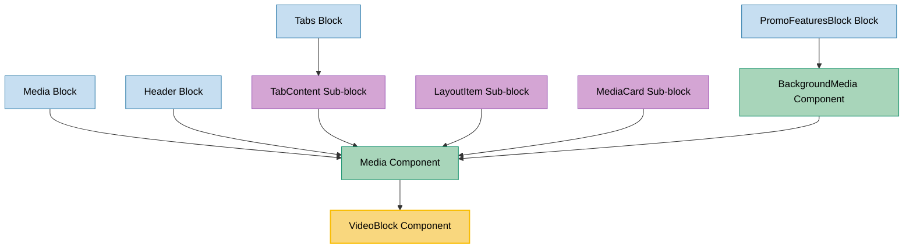

# VideoBlock Component Usage

This document outlines how the VideoBlock component is used across blocks, sub-blocks, and components in the page-constructor project.

## Overview

The VideoBlock component is a utility component that renders video content with support for YouTube videos, custom video iframes, and preview images. It provides a unified interface for displaying video content with play controls, autoplay functionality, and responsive sizing. The component supports both streaming and recorded YouTube videos, custom iframe sources, and includes analytics tracking capabilities.

## Usage Graph



## Component Details

### VideoBlock Component

- **File**: `src/components/VideoBlock/VideoBlock.tsx`
- **Description**: Renders video content with support for YouTube videos, custom iframes, and preview images.
- **Props**:
  - `id`: Optional unique identifier for the video element
  - `stream`: YouTube live stream ID (23-25 characters)
  - `record`: YouTube video ID (11 characters)
  - `videoIframe`: Custom iframe URL for video content
  - `attributes`: Additional URL parameters for the video (e.g., color, rel)
  - `className`: Optional CSS class name for the container
  - `previewImg`: Preview image URL shown before video plays
  - `playButton`: Custom play button component (optional)
  - `playButtonId`: ID for the play button element
  - `height`: Fixed height for the video container
  - `fullscreen`: Boolean to enable fullscreen mode
  - `autoplay`: Boolean to enable autoplay functionality
  - `analyticsEvents`: Analytics event configuration
  - `onImageLoad`: Callback function triggered when preview image loads

### Key Features

#### YouTube Video Support

- **Stream Videos**: Supports YouTube live streams using channel IDs
- **Recorded Videos**: Supports standard YouTube videos using video IDs
- **URL Processing**: Automatically extracts video IDs from URLs using regex patterns
- **Autoplay Control**: Configurable autoplay with mute for compliance

#### Custom Video Support

- **Iframe Integration**: Supports custom video iframe URLs
- **Attribute Passing**: Allows passing custom attributes to video URLs
- **Flexible Sources**: Works with any iframe-compatible video source

#### Preview and Controls

- **Preview Images**: Shows preview image before video starts playing
- **Custom Play Buttons**: Supports custom play button components
- **Default Controls**: Provides default play button with icon
- **Click-to-Play**: Enables video playback on preview click

#### Responsive Design

- **Aspect Ratio**: Maintains 16:9 aspect ratio by default
- **Dynamic Sizing**: Automatically adjusts height based on container width
- **Mobile Optimization**: Responsive behavior across devices

## Usage Patterns

> **Note**: In the code examples below, `b()` is a utility function used throughout the page-constructor project for BEM (Block Element Modifier) class naming. It generates CSS class names following the BEM methodology, making the code more maintainable and consistent.

### In Media Component

#### Primary Usage

- **File**: `src/components/Media/Media.tsx`
- **Usage**: VideoBlock is used as `IframeVideoBlock` for YouTube and custom iframe videos.
- **Implementation**:

  ```tsx
  import IframeVideoBlock from '../VideoBlock/VideoBlock';

  // In Media component render logic
  if (youtube || videoIframe) {
    result = (
      <IframeVideoBlock
        className={b('youtube', youtubeClassName)}
        record={youtube}
        videoIframe={videoIframe}
        attributes={{color: 'white', rel: '0'}}
        previewImg={previewImg}
        height={height}
        fullscreen={fullscreen}
        analyticsEvents={analyticsEvents}
        autoplay={autoplay}
        onImageLoad={onImageLoad}
      />
    );
  }
  ```

### Indirect Usage Through Media Component

#### Media Block

- **File**: `src/blocks/Media/Media.tsx`
- **Usage**: Uses Media component which can render VideoBlock for video content.
- **Implementation**:

  ```tsx
  <Media
    imageClassName={b('image')}
    {...mediaWithMicrodata}
    playVideo={play}
    className={b({border: borderSelected})}
  />
  ```

#### Header Block

- **File**: `src/blocks/Header/Header.tsx`
- **Usage**: Uses Media component for background and main media content, supporting video through VideoBlock.
- **Implementation**:

  ```tsx
  // Background media
  <Media
      {...background}
      className={b('background-media')}
      imageClassName={b('image')}
      videoClassName={b('video')}
      isBackground={true}
      parallax={false}
      video={isMobile ? undefined : video}
      image={imageObject}
  />

  // Main media content
  <Media
      className={b('media', {[curImageSize]: true})}
      videoClassName={b('video')}
      imageClassName={b('image')}
      {...mediaWithMicrodata}
  />
  ```

#### TabContent Sub-block

- **File**: `src/blocks/Tabs/TabContent/TabContent.tsx`
- **Usage**: Uses Media component for tab content, with video height calculation using VideoBlock utilities.
- **Implementation**:

  ```tsx
  import {getHeight} from '../../../components/VideoBlock/VideoBlock';

  const mediaVideoHeight = hasNoImage && mediaWidth && getHeight(mediaWidth);

  <Media
    {...mergeVideoMicrodata(getThemedValue(tabData.media, theme), {
      name: tabData.tabName,
      description: tabData.caption ? tabData.caption : undefined,
    })}
    key={tabName}
    className={b('media', {border})}
    playVideo={play}
    height={mediaVideoHeight || undefined}
    onImageLoad={handleImageHeight}
  />;
  ```

#### LayoutItem Sub-block

- **File**: `src/sub-blocks/LayoutItem/LayoutItem.tsx`
- **Usage**: Uses Media component for layout item media content, supporting video through VideoBlock.
- **Implementation**:

  ```tsx
  <Media
    {...mediaWithMicrodata}
    {...fullscreenMediaProps}
    className={b('media', {border}, mediaClassName)}
    analyticsEvents={analyticsEvents}
  />
  ```

#### MediaCard Sub-block

- **File**: `src/sub-blocks/MediaCard/MediaCard.tsx`
- **Usage**: Simple wrapper around Media component for card-based video display.
- **Implementation**:

  ```tsx
  <Media {...mediaProps} />
  ```

#### BackgroundMedia Component

- **File**: `src/components/BackgroundMedia/BackgroundMedia.tsx`
- **Usage**: Uses Media component for background video content with animation support.
- **Implementation**:

  ```tsx
  <Media
    className={b('media', {'full-width-media': fullWidthMedia}, mediaClassName)}
    imageClassName={b('image')}
    videoClassName={b('video')}
    isBackground={true}
    qa={qaAttributes.media}
    {...{
      height: 720,
      color,
      parallax,
      video: isMobile ? undefined : video,
      ...props,
    }}
  />
  ```

## Video Source Processing

### YouTube Videos

#### Stream Videos (Live)

```tsx
// Stream URL pattern
const STREAM_URL = 'https://www.youtube.com/embed/live_stream?channel=';
const STREAM_RE = /[0-9A-Za-z_-]{23,25}/;

// Usage
<VideoBlock stream="UCxxxxxxxxxxxxxxxxxxxxxx" />;
```

#### Recorded Videos

```tsx
// Record URL pattern
const RECORD_URL = 'https://www.youtube.com/embed/';
const RECORD_RE = /[0-9A-Za-z_-]{11}/;

// Usage
<VideoBlock record="dQw4w9WgXcQ" />;
```

### Custom Iframe Videos

```tsx
// Custom iframe URL
<VideoBlock videoIframe="https://player.vimeo.com/video/123456789" />
```

## Autoplay Configuration

### Autoplay Attributes

```tsx
// Autoplay enabled (with mute for compliance)
const AUTOPLAY_ATTRIBUTES = {
  autoplay: 1,
  mute: 1,
};

// Autoplay disabled
const NO_AUTOPLAY_ATTRIBUTES = {
  autoplay: 0,
};
```

### Usage with Preview

```tsx
<VideoBlock
  record="dQw4w9WgXcQ"
  previewImg="/path/to/preview.jpg"
  autoplay={true} // Will autoplay when preview is clicked
/>
```

## Responsive Sizing

### Aspect Ratio Calculation

```tsx
// 16:9 aspect ratio calculation
export function getHeight(width: number): number {
  return (width / 16) * 9;
}

// Usage in components
const mediaVideoHeight = hasNoImage && mediaWidth && getHeight(mediaWidth);
```

### Dynamic Height Updates

The component automatically updates its height based on container width changes:

```tsx
React.useEffect(() => {
  const updateSize = debounce(() => {
    setCurrentHeight(ref.current ? Math.round(getHeight(ref.current.offsetWidth)) : undefined);
  }, 100);

  updateSize();
  window.addEventListener('resize', updateSize, {passive: true});
  return () => {
    window.removeEventListener('resize', updateSize);
  };
}, [height]);
```

## Analytics Integration

### Event Tracking

```tsx
<VideoBlock
  record="dQw4w9WgXcQ"
  analyticsEvents={{
    name: 'video-preview-click',
    data: {
      videoId: 'dQw4w9WgXcQ',
      source: 'youtube',
    },
  }}
/>
```

### Analytics Hook Usage

```tsx
const handleAnalytics = useAnalytics(DefaultEventNames.VideoPreview);

const onPreviewClick = React.useCallback(() => {
  handleAnalytics(analyticsEvents);
  setIsPlaying(true);
  setTimeout(() => setHidePreview(true), AUTOPLAY_DELAY);
}, [handleAnalytics, analyticsEvents]);
```

## Accessibility Features

### Keyboard Support

- **Tab Navigation**: Preview overlay is focusable with tab key
- **Enter/Space Activation**: Supports keyboard activation of video playback
- **ARIA Labels**: Proper ARIA labeling for screen readers

### Implementation

```tsx
<div
    className={b('preview')}
    onClick={onPreviewClick}
    onKeyDown={onPreviewKeyDown}
    role="button"
    tabIndex={0}
    aria-labelledby={playButton ? playButtonId : buttonId}
>
```

## Best Practices

1. **Preview Images**: Always provide preview images for better user experience and performance.

2. **Autoplay Compliance**: Use autoplay with mute to comply with browser policies.

3. **Responsive Design**: Let the component handle responsive sizing automatically.

4. **Analytics Tracking**: Implement analytics tracking for video interactions.

5. **Accessibility**: Ensure proper keyboard navigation and screen reader support.

6. **Performance**: Use lazy loading for iframe content to improve page load times.

## Example Usage

### Basic YouTube Video

```tsx
<VideoBlock record="dQw4w9WgXcQ" previewImg="/path/to/preview.jpg" className="my-video" />
```

### Live Stream with Custom Attributes

```tsx
<VideoBlock
  stream="UCxxxxxxxxxxxxxxxxxxxxxx"
  attributes={{
    color: 'white',
    rel: '0',
    modestbranding: '1',
  }}
  autoplay={true}
/>
```

### Custom Iframe Video

```tsx
<VideoBlock
  videoIframe="https://player.vimeo.com/video/123456789"
  previewImg="/path/to/preview.jpg"
  height={400}
  analyticsEvents={{
    name: 'vimeo-video-play',
    data: {videoId: '123456789'},
  }}
/>
```

### With Custom Play Button

```tsx
<VideoBlock
  record="dQw4w9WgXcQ"
  previewImg="/path/to/preview.jpg"
  playButton={<CustomPlayButton />}
  playButtonId="custom-play-btn"
/>
```

## Integration with Theme System

The VideoBlock component integrates with the page-constructor theme system through the Media component:

1. **Theme Processing**: Media component handles theme processing before passing props to VideoBlock
2. **Microdata Support**: Supports video microdata for SEO optimization
3. **Context Integration**: Works with mobile context for responsive behavior

## Storybook Documentation

The VideoBlock component includes Storybook stories demonstrating:

- Basic YouTube video display
- Live stream functionality
- Custom iframe videos
- Preview image functionality
- Autoplay behavior

Stories are located in `src/components/VideoBlock/__stories__/VideoBlock.stories.tsx`.

## Testing

The VideoBlock component includes comprehensive tests covering:

- YouTube video URL processing
- Custom iframe handling
- Preview image functionality
- Autoplay behavior
- Responsive sizing
- Analytics integration

Test files are located in the respective `__tests__` directories of components and blocks that use VideoBlock.

## CSS Classes

The component uses BEM methodology for CSS classes:

- `.VideoBlock` - Main container
- `.VideoBlock__preview` - Preview overlay container
- `.VideoBlock__image` - Preview image
- `.VideoBlock__image-wrapper` - Preview image wrapper
- `.VideoBlock__button` - Default play button
- `.VideoBlock__icon` - Play button icon

## Performance Considerations

1. **Lazy Loading**: Iframe content is loaded lazily to improve initial page load
2. **Debounced Resize**: Resize events are debounced to prevent excessive recalculations
3. **Preview Images**: Preview images reduce initial video loading overhead
4. **Conditional Rendering**: Video iframe is only rendered when needed
