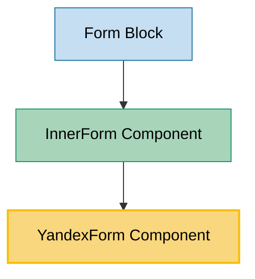

# YandexForm Component Usage

This document outlines how the YandexForm component is used across blocks, sub-blocks, and components in the page-constructor project.

## Overview

The YandexForm component is a utility component that embeds Yandex Forms into web pages using an iframe. It provides a seamless integration with Yandex Forms service, handling form loading, submission events, analytics tracking, and responsive behavior. The component supports theming, custom parameters, and mobile optimization.

## Usage Graph



## Component Details

### YandexForm Component

- **File**: `src/components/YandexForm/YandexForm.tsx`
- **Description**: Embeds Yandex Forms using iframe with automatic height adjustment, analytics tracking, and responsive behavior.
- **Props**:
  - `id`: Form ID from Yandex Forms (required) - can be number or string
  - `containerId`: Custom container ID for the iframe (defaults to 'pc-yandex-form-container')
  - `theme`: Form theme (defaults to 'cloud-www')
  - `className`: Optional CSS class name for the container
  - `headerHeight`: Height offset for scroll positioning (defaults to HEADER_HEIGHT constant)
  - `customFormOrigin`: Custom form origin URL (defaults to 'https://forms.yandex.ru')
  - `customFormSection`: Custom form section (defaults to 'surveys')
  - `params`: Additional query parameters to pass to the form
  - `onSubmit`: Callback function triggered when form is submitted
  - `onLoad`: Callback function triggered when form is loaded
  - `analyticsEvents`: Analytics events configuration

### YandexFormProps Interface

- **Description**: Defines the structure of YandexForm component props.
- **Extends**: `AnalyticsEventsBase` for analytics tracking support
- **Properties**: All the props listed above in the component details

## Usage Patterns

> **Note**: In the code examples below, `b()` is a utility function used throughout the page-constructor project for BEM (Block Element Modifier) class naming. It generates CSS class names following the BEM methodology, making the code more maintainable and consistent.

### In Components

#### InnerForm Component

- **File**: `src/components/InnerForm/InnerForm.tsx`
- **Usage**: Renders YandexForm when form data is of Yandex type, with theme support and configuration from FormsContext.
- **Implementation**:

  ```tsx
  if (isYandexDataForm(formData)) {
    const {onLoad, ...rest} = getThemedValue(formData.yandex, theme);

    return (
      <div className={className}>
        <YandexForm
          {...(formsConfig.yandex as YandexFormsContextProps | undefined)}
          {...rest}
          onLoad={() => {
            onContentLoad();
            onLoad?.();
          }}
        />
      </div>
    );
  }
  ```

### In Blocks

#### Form Block

- **File**: `src/blocks/Form/Form.tsx`
- **Usage**: Uses YandexForm indirectly through InnerForm component for rendering form blocks with Yandex Forms integration.
- **Implementation**:

  ```tsx
  <InnerForm className={b('form')} formData={formData} onContentLoad={onContentLoad} />
  ```

## Integration with Context System

The YandexForm component integrates with multiple React contexts:

### LocaleContext Integration

- **Purpose**: Provides localization support for the form
- **Usage**: Automatically adds language parameter to form URL
- **Implementation**:

  ```tsx
  const locale = React.useContext(LocaleContext);

  if (locale?.lang) {
    queryParams.set('lang', locale.lang);
  }
  ```

### MobileContext Integration

- **Purpose**: Provides mobile-specific behavior and styling
- **Usage**: Adds mobile media type parameter for responsive forms
- **Implementation**:

  ```tsx
  const isMobile = React.useContext(MobileContext);

  if (isMobile) {
    queryParams.set('media-type', 'mobile');
  }
  ```

### FormsContext Integration

- **Purpose**: Provides global form configuration through InnerForm
- **Usage**: Merges global Yandex form settings with component-specific props
- **Implementation**:
  ```tsx
  <YandexForm {...(formsConfig.yandex as YandexFormsContextProps | undefined)} {...rest} />
  ```

## Form Loading and Height Management

The component implements sophisticated iframe management:

### Dynamic Height Adjustment

- **Mechanism**: Listens to postMessage events from the iframe
- **Behavior**: Automatically adjusts iframe height based on form content
- **Implementation**:

  ```tsx
  const handleMessage = React.useCallback(
    ({origin, data}: MessageEvent) => {
      if (origin !== yaFormOrigin) return;

      const parsed = JSON.parse(data);
      const height = parsed['iframe-height'];

      if (iframeRef.current && height && !message) {
        iframeRef.current.height = `${height}px`;
        onLoad?.();
      }
    },
    [yaFormOrigin, id, onLoad, handleSubmit],
  );
  ```

### Form Submission Handling

- **Detection**: Monitors for 'sent' message or redirectUrl from form
- **Actions**: Triggers analytics, scrolls to form, calls onSubmit callback
- **Scroll Behavior**: Automatically scrolls to form position with header offset

## URL Construction and Parameters

The component builds comprehensive form URLs:

### Base URL Structure

```
{customFormOrigin || 'https://forms.yandex.ru'}/{customFormSection || 'surveys'}/{id}/
```

### Automatic Parameters

- `url`: Current page URL
- `iframe`: Set to '1' for iframe mode
- `lang`: Current locale language
- `theme`: Form theme (defaults to 'cloud-www')
- `media-type`: Set to 'mobile' on mobile devices

### Custom Parameters

Additional parameters can be passed via the `params` prop and are automatically added to the form URL.

## Analytics Integration

The component provides comprehensive analytics support:

### Built-in Analytics

- **Event**: `DefaultEventNames.YandexFormSubmit`
- **Trigger**: Automatically fired on form submission
- **Hook**: Uses `useAnalytics` hook for consistent tracking

### Custom Analytics Events

- **Configuration**: Via `analyticsEvents` prop
- **Integration**: Passed to analytics handler on form submission

## Theme Support

The component supports theming through multiple mechanisms:

### Theme Parameter

- **Default**: 'cloud-www'
- **Customization**: Via `theme` prop
- **Application**: Added as URL parameter to form

### Themed Form Data

- **Processing**: Uses `getThemedValue()` utility in InnerForm
- **Support**: Allows different form configurations per theme

## Mobile Optimization

The component includes several mobile-specific optimizations:

### Mobile Detection

- **Context**: Uses MobileContext for mobile state
- **Parameter**: Adds 'media-type=mobile' to form URL
- **Behavior**: Ensures mobile-optimized form rendering

### Loading Optimization

- **Chrome Lite Mode**: Special handling for mobile Chrome in lite mode
- **Timeout**: 1-second timeout for onLoad callback as fallback
- **Lazy Loading**: iframe uses 'loading="lazy"' attribute

## Best Practices

1. **Form ID Management**: Use consistent form ID format (string or number).

2. **Theme Consistency**: Ensure form theme matches page theme for cohesive experience.

3. **Analytics Setup**: Always configure analytics events for form tracking.

4. **Mobile Testing**: Test forms on mobile devices to ensure proper responsive behavior.

5. **Loading States**: Handle loading states appropriately while form initializes.

6. **Error Handling**: Implement proper error handling for form loading failures.

7. **Accessibility**: Ensure forms meet accessibility standards through Yandex Forms configuration.

## Example Usage

### Basic YandexForm

```tsx
<YandexForm
  id="61a4e639d4d24e0dbba36f5c"
  theme="cloud-www"
  onLoad={() => console.log('Form loaded')}
  onSubmit={() => console.log('Form submitted')}
/>
```

### With Custom Parameters

```tsx
<YandexForm
  id="form-id"
  params={{
    source: 'website',
    campaign: 'summer-2024',
  }}
  customFormSection="cloud"
  analyticsEvents={{
    name: 'custom-form-submit',
    data: {formType: 'contact'},
  }}
/>
```

### Through InnerForm (Recommended)

```tsx
const formData = {
  yandex: {
    id: '61a4e639d4d24e0dbba36f5c',
    customFormSection: 'cloud',
    theme: 'cloud-www',
  },
};

<InnerForm formData={formData} onContentLoad={() => setLoaded(true)} className="my-form" />;
```

### With Theme Support

```tsx
const themedFormData = {
  yandex: {
    light: {
      id: 'light-form-id',
      theme: 'light-theme',
    },
    dark: {
      id: 'dark-form-id',
      theme: 'dark-theme',
    },
  },
};

<InnerForm formData={themedFormData} />;
```

## Storybook Documentation

The YandexForm component includes Storybook stories demonstrating:

- Default form embedding
- Custom form sections
- Different form IDs
- Basic configuration options

Stories are located in `src/components/YandexForm/__stories__/YandexForm.stories.tsx` with example data in `data.json`.

## Testing

The YandexForm component should be tested for:

- Iframe creation and URL construction
- Message handling from form iframe
- Height adjustment functionality
- Analytics event firing
- Mobile responsive behavior
- Theme parameter application
- Custom parameter handling

## Security Considerations

1. **Origin Validation**: Component validates message origin before processing
2. **Form ID Validation**: Ensure form IDs are from trusted sources
3. **Custom Origins**: Use custom origins only for trusted form providers
4. **Parameter Sanitization**: Validate custom parameters to prevent injection

## Performance Considerations

1. **Lazy Loading**: iframe uses lazy loading for better page performance
2. **Event Listeners**: Properly removes event listeners on unmount
3. **Message Filtering**: Efficiently filters irrelevant postMessage events
4. **Timeout Handling**: Uses timeout for mobile Chrome lite mode optimization

## Constants

- `YANDEX_FORM_ORIGIN`: 'https://forms.yandex.ru'
- `YANDEX_FORM_SECTION`: 'surveys'
- `CONTAINER_ID`: 'pc-yandex-form-container'
- `HEADER_HEIGHT`: Imported from components constants
