# YFMWrapper Component Usage

This document outlines how the YFMWrapper component is used across blocks, sub-blocks, and components in the page-constructor project.

## Overview

The YFMWrapper component is a utility component that renders Yandex Flavored Markdown (YFM) content as HTML. It wraps the HTML component and provides additional functionality for handling modifiers, styling, and semantic markup. The component is designed to display rich text content throughout the page constructor system while maintaining consistent styling and accessibility.

## Usage Graph

```mermaid
graph TD
    %% Main Component
    YFMWrapper[YFMWrapper Component]

    %% Components that use YFMWrapper
    MetaInfo[MetaInfo Component]
    ContentList[ContentList Component]
    Table[Table Component]
    Title[Title Component]

    %% Sub-blocks that use YFMWrapper
    PriceDetailed[PriceDetailed Sub-block]
    PriceDescription[PriceDescription Sub-block]
    PriceDetailsList[PriceDetails List Sub-block]
    PriceDetailsSettings[PriceDetails Settings Sub-block]
    Content[Content Sub-block]
    BannerCard[BannerCard Sub-block]
    Quote[Quote Sub-block]

    %% Blocks that use YFMWrapper
    Questions[Questions Block]
    Header[Header Block]
    PromoFeaturesBlock[PromoFeaturesBlock Block]
    FoldableList[FoldableList Block]
    Tabs[Tabs Block]

    %% Custom Components (Storybook examples)
    CustomHeader[CustomHeader Component]
    CustomCard[CustomCard Component]
    CustomDecorator[CustomDecorator Component]
    CustomBlock[CustomBlock Component]
    CustomNavigationItem[CustomNavigationItem Component]

    %% Usage relationships
    MetaInfo --> YFMWrapper
    ContentList --> YFMWrapper
    Table --> YFMWrapper
    Title --> YFMWrapper
    PriceDetailed --> YFMWrapper
    PriceDescription --> YFMWrapper
    PriceDetailsList --> YFMWrapper
    PriceDetailsSettings --> YFMWrapper
    Content --> YFMWrapper
    BannerCard --> YFMWrapper
    Quote --> YFMWrapper
    Questions --> YFMWrapper
    Header --> YFMWrapper
    PromoFeaturesBlock --> YFMWrapper
    FoldableList --> YFMWrapper
    Tabs --> YFMWrapper
    CustomHeader --> YFMWrapper
    CustomCard --> YFMWrapper
    CustomDecorator --> YFMWrapper
    CustomBlock --> YFMWrapper
    CustomNavigationItem --> YFMWrapper

    %% Style classes
    style YFMWrapper fill:#f9d77e,stroke:#f9bc02,stroke-width:2px,color:#000
    style MetaInfo fill:#c6def1,stroke:#2274a5,stroke-width:1px,color:#000
    style ContentList fill:#c6def1,stroke:#2274a5,stroke-width:1px,color:#000
    style Table fill:#c6def1,stroke:#2274a5,stroke-width:1px,color:#000
    style Title fill:#c6def1,stroke:#2274a5,stroke-width:1px,color:#000
    style PriceDetailed fill:#d4e6f1,stroke:#5dade2,stroke-width:1px,color:#000
    style PriceDescription fill:#d4e6f1,stroke:#5dade2,stroke-width:1px,color:#000
    style PriceDetailsList fill:#d4e6f1,stroke:#5dade2,stroke-width:1px,color:#000
    style PriceDetailsSettings fill:#d4e6f1,stroke:#5dade2,stroke-width:1px,color:#000
    style Content fill:#d4e6f1,stroke:#5dade2,stroke-width:1px,color:#000
    style BannerCard fill:#d4e6f1,stroke:#5dade2,stroke-width:1px,color:#000
    style Quote fill:#d4e6f1,stroke:#5dade2,stroke-width:1px,color:#000
    style Questions fill:#e8f5e8,stroke:#52c41a,stroke-width:1px,color:#000
    style Header fill:#e8f5e8,stroke:#52c41a,stroke-width:1px,color:#000
    style PromoFeaturesBlock fill:#e8f5e8,stroke:#52c41a,stroke-width:1px,color:#000
    style FoldableList fill:#e8f5e8,stroke:#52c41a,stroke-width:1px,color:#000
    style Tabs fill:#e8f5e8,stroke:#52c41a,stroke-width:1px,color:#000
    style CustomHeader fill:#fff2e6,stroke:#fa8c16,stroke-width:1px,color:#000
    style CustomCard fill:#fff2e6,stroke:#fa8c16,stroke-width:1px,color:#000
    style CustomDecorator fill:#fff2e6,stroke:#fa8c16,stroke-width:1px,color:#000
    style CustomBlock fill:#fff2e6,stroke:#fa8c16,stroke-width:1px,color:#000
    style CustomNavigationItem fill:#fff2e6,stroke:#fa8c16,stroke-width:1px,color:#000
```



## Component Details

### YFMWrapper Component

- **File**: `src/components/YFMWrapper/YFMWrapper.tsx`
- **Description**: Renders Yandex Flavored Markdown content as HTML with optional modifiers and styling.
- **Props**:
  - `content`: HTML string content to render (required)
  - `modifiers`: Optional modifiers object for BEM-style class generation
  - `className`: Optional CSS class name for additional styling
  - `itemProp`: Optional microdata itemProp attribute
  - `id`: Optional HTML id attribute
  - `qa`: Optional QA attribute for testing

### Key Features

- **HTML Rendering**: Uses the HTML component internally for safe HTML rendering
- **BEM Styling**: Supports BEM-style modifiers through the `modifiers` prop
- **Snake Case Conversion**: Automatically converts modifiers to snake_case for CSS classes
- **YFM Class Prefix**: Uses 'yfm' class prefix instead of 'pc' to allow custom YFM styling
- **Semantic Markup**: Supports microdata through `itemProp` attribute
- **Accessibility**: Inherits accessibility features from the HTML component

## Usage Patterns

> **Note**: In the code examples below, `b()` is a utility function used throughout the page-constructor project for BEM (Block Element Modifier) class naming. It generates CSS class names following the BEM methodology, making the code more maintainable and consistent.

### In Components

#### MetaInfo Component

- **File**: `src/components/MetaInfo/MetaInfo.tsx`
- **Usage**: Renders metadata items as formatted HTML content.
- **Implementation**:

  ```tsx
  {
    items.map((metaInfoItem) => (
      <YFMWrapper content={metaInfoItem} className={b('item')} qa={qaAttributes.metaInfoItem} />
    ));
  }
  ```

#### ContentList Component

- **File**: `src/components/ContentList/ContentList.tsx`
- **Usage**: Renders list item titles and text content with constructor modifiers.
- **Implementation**:

  ```tsx
  // For titles
  <YFMWrapper content={title} modifiers={{constructor: true}} />

  // For text content
  <YFMWrapper
      className={b('text')}
      content={text}
      modifiers={{constructor: true}}
  />
  ```

#### Table Component

- **File**: `src/components/Table/Table.tsx`
- **Usage**: Renders legend item text in table components.
- **Implementation**:

  ```tsx
  <YFMWrapper className={b('legent-item-text')} content={text} modifiers={{constructor: true}} />
  ```

#### Title Component

- **File**: `src/components/Title/Title.tsx`
- **Usage**: Renders subtitle content with constructor modifiers.
- **Implementation**:

  ```tsx
  <YFMWrapper content={subtitle} modifiers={{constructor: true}} />
  ```

### In Sub-blocks

#### Content Sub-block

- **File**: `src/sub-blocks/Content/Content.tsx`
- **Usage**: Renders main text content and additional information.
- **Implementation**:

  ```tsx
  // Main text content
  <YFMWrapper
      content={text}
      modifiers={{constructor: true}}
      className={b('text-content')}
  />

  // Additional information
  <YFMWrapper
      content={additionalInfo}
      modifiers={{constructor: true}}
      className={b('additional-info')}
  />
  ```

#### Quote Sub-block

- **File**: `src/sub-blocks/Quote/Quote.tsx`
- **Usage**: Renders quote text content with theme-aware styling.
- **Implementation**:

  ```tsx
  <YFMWrapper className={b('text')} content={yfmText} modifiers={{constructor: true}} />
  ```

#### BannerCard Sub-block

- **File**: `src/sub-blocks/BannerCard/BannerCard.tsx`
- **Usage**: Renders banner subtitle content.
- **Implementation**:

  ```tsx
  <YFMWrapper className={b('subtitle')} content={subtitle} modifiers={{constructor: true}} />
  ```

#### PriceDetailed Sub-blocks

- **Files**: Various PriceDetailed sub-components
- **Usage**: Renders pricing descriptions and details.
- **Implementation**:

  ```tsx
  // In PriceDescription
  <YFMWrapper content={description} modifiers={{constructor: true}} />

  // In PriceDetails List
  <YFMWrapper content={item.text} modifiers={{constructor: true}} />

  // In PriceDetails Settings
  <YFMWrapper content={item.description} modifiers={{constructor: true}} />
  ```

### In Blocks

#### Header Block

- **File**: `src/blocks/Header/Header.tsx`
- **Usage**: Renders header description and additional information.
- **Implementation**:

  ```tsx
  // Description
  <YFMWrapper
      content={description}
      modifiers={{constructor: true}}
  />

  // Additional info
  <YFMWrapper
      content={additionalInfo}
      modifiers={{constructor: true}}
  />
  ```

#### Questions Block

- **File**: `src/blocks/Questions/QuestionBlockItem/QuestionBlockItem.tsx`
- **Usage**: Renders question item text content.
- **Implementation**:

  ```tsx
  <YFMWrapper content={itemText} modifiers={{constructor: true}} />
  ```

#### PromoFeaturesBlock Block

- **File**: `src/blocks/PromoFeaturesBlock/PromoFeaturesBlock.tsx`
- **Usage**: Renders feature card text content.
- **Implementation**:

  ```tsx
  <YFMWrapper content={text} modifiers={{constructor: true}} />
  ```

#### FoldableList Block

- **File**: `src/blocks/FoldableList/FoldableListBlockItem/FoldableListBlockItem.tsx`
- **Usage**: Renders foldable list item text content.
- **Implementation**:

  ```tsx
  <YFMWrapper content={itemText} modifiers={{constructor: true}} />
  ```

#### Tabs Block

- **File**: `src/blocks/Tabs/TabContent/TabContent.tsx`
- **Usage**: Renders tab caption content with microdata support.
- **Implementation**:

  ```tsx
  <YFMWrapper content={tabData.caption} modifiers={{constructor: true}} itemProp="description" />
  ```

### In Custom Components (Storybook Examples)

#### CustomHeader Component

- **File**: `src/containers/PageConstructor/__stories__/components/CustomHeader/CustomHeader.tsx`
- **Usage**: Renders code examples in custom header components.
- **Implementation**:

  ```tsx
  <YFMWrapper className={b('code-yfm')} content={`<code>${CUSTOM_HEADER_CODE}</code>`} />
  ```

#### CustomCard Component

- **File**: `src/containers/PageConstructor/__stories__/components/CustomCard/CustomCard.tsx`
- **Usage**: Renders card descriptions and code examples.
- **Implementation**:

  ```tsx
  // Card description
  <YFMWrapper
      className={b('card-body-description')}
      content={yfmTransform(description)}
  />

  // Code example
  <YFMWrapper
      className={b('card-body-link-code')}
      content={`<code>${CUSTOM_CARD_CODE}</code>`}
  />
  ```

## Modifier Patterns

### Constructor Modifier

The most common modifier used with YFMWrapper is `{constructor: true}`, which:

- Applies constructor-specific styling to the rendered content
- Ensures consistent formatting across the page constructor system
- Converts to `yfm_constructor` CSS class

```tsx
<YFMWrapper content={content} modifiers={{constructor: true}} />
```

### Custom Modifiers

Components can pass custom modifiers for specific styling needs:

```tsx
<YFMWrapper
  content={content}
  modifiers={{
    constructor: true,
    theme: 'dark',
    size: 'large',
  }}
/>
```

This generates CSS classes: `yfm yfm_constructor yfm_theme_dark yfm_size_large`

## Styling Integration

### YFM Class Prefix

The component uses 'yfm' as the class prefix instead of the standard 'pc' prefix used elsewhere in the project. This design decision allows:

- Custom YFM styling to be defined globally via the 'yfm' class
- Integration with existing YFM stylesheets
- Separation of concerns between page constructor and YFM styling

### CSS Class Generation

The component automatically generates BEM-style CSS classes:

1. Base class: `yfm`
2. Modifier classes: `yfm_modifier_name` or `yfm_modifier_name_value`
3. Additional classes: Any classes passed via `className` prop

### Snake Case Conversion

Modifiers are automatically converted from camelCase to snake_case:

```tsx
// Input
modifiers={{
    constructor: true,
    textSize: 'large',
    hasBackground: true
}}

// Generated classes
// yfm_constructor yfm_text_size_large yfm_has_background
```

## Content Processing

### HTML Content

The component expects HTML content as input, typically processed from Markdown:

```tsx
// Raw HTML
<YFMWrapper content="<p><strong>Bold text</strong> with <a href='#'>link</a></p>" />

// Processed from Markdown
<YFMWrapper content={yfmTransform(markdownContent)} />
```

### Safety Considerations

The component relies on the HTML component for safe rendering, which:

- Sanitizes dangerous HTML content
- Prevents XSS attacks
- Maintains semantic structure

## Microdata Support

The component supports microdata through the `itemProp` attribute:

```tsx
<YFMWrapper content={description} itemProp="description" modifiers={{constructor: true}} />
```

This is particularly useful for:

- SEO optimization
- Structured data markup
- Accessibility improvements

## Best Practices

1. **Always Use Constructor Modifier**: For consistency across the page constructor system, always include `{constructor: true}` in modifiers.

2. **Content Processing**: Ensure content is properly processed and sanitized before passing to YFMWrapper.

3. **Theme Consistency**: When using in themed components, ensure the YFMWrapper styling matches the parent theme.

4. **Accessibility**: Use `itemProp` for semantic markup when appropriate.

5. **Class Naming**: Use descriptive class names when passing additional classes via `className`.

6. **Modifier Naming**: Use camelCase for modifier names - they will be automatically converted to snake_case.

## Example Usage

### Basic Usage

```tsx
<YFMWrapper content="<p>Simple HTML content</p>" modifiers={{constructor: true}} />
```

### With Custom Styling

```tsx
<YFMWrapper
  content={htmlContent}
  className={b('custom-text')}
  modifiers={{
    constructor: true,
    theme: 'dark',
  }}
/>
```

### With Microdata

```tsx
<YFMWrapper
  content={description}
  modifiers={{constructor: true}}
  itemProp="description"
  id="content-description"
/>
```

### In Themed Context

```tsx
const themedContent = getThemedValue(content, theme);

<YFMWrapper
  content={themedContent}
  className={b('text', {theme: textTheme})}
  modifiers={{constructor: true}}
/>;
```

## Storybook Documentation

The YFMWrapper component includes Storybook stories demonstrating:

- Basic HTML content rendering
- Modifier usage
- Custom styling options
- Integration examples

Stories are located in `src/components/YFMWrapper/__stories__/YFMWrapper.stories.tsx` with example data in `data.json`.

## Testing

The YFMWrapper component should be tested for:

- Correct HTML rendering
- Modifier class generation
- Snake case conversion
- Microdata attribute handling
- Custom class application

Test files should be located in `src/components/YFMWrapper/__tests__/YFMWrapper.test.tsx`.
